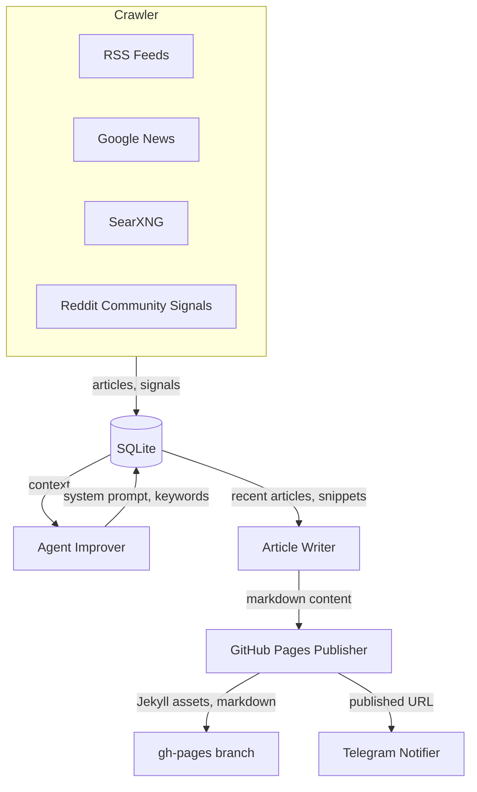

# evo-agent

[](https://www.typescriptlang.org/)
[](https://nodejs.org/)
[](https://biomejs.dev/)

Self-improving AI publishing agent. Crawls AI/developer sources, learns from trends, and generates pt-BR technical articles published to GitHub Pages.

---

## Architecture



## Features

- **Multi-source crawling**: RSS/HTML sources, Google News keyword search, SearXNG for Reddit/X.com, Hacker News, TabNews, GitHub Trending, and Reddit community signal analysis
- **Self-improvement loop**: System prompt and search keywords evolve from ingested content
- **Reliable orchestration**: Overlapping cycles are skipped and every run is recorded in SQLite
- **Editorial scoring**: Recency, engagement, source authority, diversity, and cross-source evidence shape selection
- **Evidence provenance**: Every selected highlight preserves source URL, title, and supporting excerpt
- **Guarded self-improvement**: Prompt candidates are scored, versioned, promoted only without regression, and rollback-capable
- **Article generation**: richer daily articles and weekly/periodic reports in pt-BR via LLM, with expanded Reddit/community evidence when available
- **Living ebook**: weekly/refinable AI-assisted development handbook published to GitHub Pages
- **Atomic GitHub Pages publishing**: Article, layouts, and indexes land in one Git commit
- **Telegram outbox**: Failed delivery retries with exponential backoff and dead-letter isolation
- **Operational health**: Structured logs, persistent metrics, primary-source alerts, and a machine-readable health command
- **Playwright stealth fallback**: Automatic browser-based fetch when RSS sources return 403/429

## Quick Start

```bash
git clone git@github.com:juninmd/evo-agent.git
cd evo-agent
cp .env.example .env
# Edit .env with your credentials
npm install
npm run build
```

## Environment Variables

| Variable | Required | Default | Description |
|---|---|---|---|
| `LITELLM_API_BASE` | No | `http://localhost:4000/v1` | LiteLLM base URL |
| `LITELLM_API_KEY` | No | `no-key` | LiteLLM API key |
| `LITELLM_MODEL` | No | `cloud/llama-70b` | Primary model name |
| `LITELLM_FALLBACK_MODELS` | No | `cloud/maverick,cloud/llama-8b` | Comma-separated fallback models tried if the primary fails/times out/returns empty |
| `LITELLM_MAX_OUTPUT_TOKENS` | No | `12000` | Max output tokens per request |
| `LITELLM_TIMEOUT_MS` | No | `300000` | LiteLLM request timeout in milliseconds |
| `TELEGRAM_BOT_TOKEN` | Yes | — | Telegram Bot API token |
| `TELEGRAM_CHAT_ID` | Yes | — | Target Telegram chat/group ID |
| `GITHUB_TOKEN` | Yes | — | GitHub PAT with repo write access |
| `GITHUB_OWNER` | Yes | — | GitHub username or org |
| `GITHUB_REPO` | Yes | — | Repository name for Pages |
| `GITHUB_BRANCH` | No | `gh-pages` | Target branch for published content |
| `CRAWL_INTERVAL_MINUTES` | No | `40` | Learn cycle frequency in daemon mode |
| `ARTICLE_CRON` | No | `0 8 * * *` | Daily article cron expression |
| `SEARXNG_URL` | No | `http://searxng.searxng.svc.cluster.local` | SearXNG instance URL |
| `LOG_LEVEL` | No | `info` | Logging verbosity (`debug`, `info`, `warn`, `error`) |
| `LOG_FORMAT` | No | `json` | Structured `json` logs or local `text` output |
| `DB_PATH` | No | `data/knowledge.db` | SQLite database path |

## Run Modes

Set `RUN_MODE` env var to control execution:

| Mode | Behavior |
|---|---|
| `DAEMON` (default) | Runs learn cycle immediately, then schedules crawling + daily article + weekly report via cron |
| `CRAWL` | Single crawl + improve cycle, then exits |
| `DAILY` | Generates and publishes one daily article, then exits |
| `WEEKLY` | Generates and publishes one weekly article, then exits |
| `BIWEEKLY` | Generates and publishes one biweekly report, then exits |
| `MONTHLY` | Generates and publishes one monthly report, then exits |
| `BIMONTHLY` | Generates and publishes one bimonthly report, then exits |
| `SEMESTER` | Generates and publishes one semester report, then exits |
| `EBOOK` | Refines and publishes the living AI-assisted development handbook, then exits |

## Commands

```bash
npm run build                  # TypeScript compilation
npm run lint                   # Biome static analysis
npm run lint:fix               # Auto-fix lint issues
npm run smoke:reddit-comments  # Test Reddit signal crawler with isolated DB
npm run benchmark:editorial    # Run deterministic editorial regression corpus
npm run test:coverage          # Enforce repository coverage floors
npm run health                 # Emit operational health JSON
npm run prompt:rollback        # Restore the previous promoted system prompt
npm run backfill:articles -- 2026-06-01 2026-06-11 # Publish historical editions without Telegram spam
npm run dev                    # Watch mode with tsx
npm start                      # Run compiled output
```

## Project Structure

```
src/
  index.ts              # Entry point, cron scheduling, run modes
  config.ts             # Env loading, validation, frozen config
  crawler/
    index.ts            # RSS, Google News, SearXNG, Reddit signal crawlers
    reddit-smoke.ts     # Standalone Reddit community signal smoke test
  knowledge/
    store.ts            # SQLite persistence (articles, snippets, state, publish log)
  agent/
    improver.ts         # Self-improvement: updates prompt and keywords from recent sources
    writer.ts           # LLM-powered article and weekly report generation
    ebook.ts            # Living handbook refinement
    editorial-renderer.ts # Deterministic article rendering and citations
    prompt-policy.ts    # Prompt promotion and rollback policy
  publisher/
    github.ts           # Atomic GitHub API transaction and publication
    site-renderer.ts    # Jekyll scaffold, layouts, CSS, and index rendering
  notifier/
    telegram.ts         # Telegram Bot API notifications
    outbox.ts           # Retry and dead-letter policy
  observability/
    health.ts           # Operational health evaluation
  utils/
    ai.ts               # LiteLLM client wrapper for AI text generation
    logger.ts           # Timestamped log levels via console
```

## Published Site

Articles are available at `https://<GITHUB_OWNER>.github.io/<GITHUB_REPO>/` with:

- Light and dark theme toggle (persisted in `localStorage`)
- Article archive grouped by year and month
- Weekly reports section
- Markdown download button per article
- Responsive typography (Source Serif 4 body, IBM Plex Mono code, IBM Plex Sans UI)

## Deployment

Docker image published at `ghcr.io/juninmd/evo-agent:latest`. Kubernetes manifests live in a separate `app-charts/evo-agent/` repository. Secrets are injected via environment — never commit `.env` or credentials to this repository.

## Security

- `.env` excluded from version control
- Tokens never logged or exposed
- Browser sandbox enabled (no `--disable-web-security`)
- Signal handlers close SQLite database gracefully on shutdown
- Article content wrapped with `` to prevent Jekyll Liquid injection

Operational details and SLO-style checks are documented in
[`docs/OPERATIONS.md`](docs/OPERATIONS.md).
