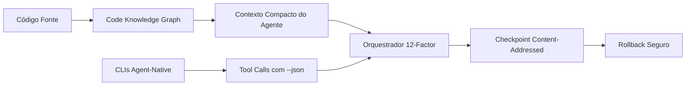


## O Problema: Agentes de IA Estão Morrendo de Fome de Contexto

Se você já usou Claude Code, Cursor, Codex ou Gemini CLI em um repositório de médio porte, conhece o drama: o agente gasta 80% do seu orçamento de contexto apenas descobrindo onde as coisas estão. O resultado? Respostas rasas, loops infinitos de `grep` + `read`, e aquela sensação de que o assistente "esqueceu" o que estava fazendo.

Dados recentes do **codegraph** (colbymchenry, 28k+ estrelas) mostram que agentes sem pré-indexação consomem de **3 a 10x mais tokens** para navegar em codebases complexos. O **Understand-Anything** (Lum1104, 36k+ estrelas) reforça: "Graphs that teach > graphs that impress" — um grafo bem construído substitui dezenas de chamadas de ferramentas.

---

## Code Knowledge Graphs: O Sistema Nervoso do Seu Agente

Um **code knowledge graph** não é um mero índice de arquivos. É um grafo dirigido onde:

- **Nós** representam símbolos: funções, classes, interfaces, tipos, variáveis, módulos
- **Arestas** representam relações: importa, chama, estende, implementa, define
- **Atributos** incluem hash de conteúdo, assinatura, e 5 linhas iniciais/finais do corpo

### Por que isso funciona?

Um agente que recebe o grafo como prefixo do prompt substitui múltiplas rodadas de descoberta por **navegação guiada por arestas**. Em vez de:

```bash
# Abordagem ingênua: 12 chamadas de ferramentas
grep -r "class.*Service" src/  # 1
read src/services/user.ts       # 2
grep -r "UserService" src/     # 3
read src/controllers/user.ts   # 4
...
```

O agente consulta o grafo uma vez e segue as arestas:

```typescript
// Adjacency list compacta (~5-15% do tamanho total)
{
  "nodes": [
    {
      "id": "UserService",
      "type": "class",
      "file": "src/services/user.ts:12",
      "hash": "sha256-a1b2c3...",
      "edges": [
        { "type": "imports", "target": "Database" },
        { "type": "imports", "target": "Logger" },
        { "type": "called_by", "target": "UserController.createUser" }
      ]
    }
  ]
}
```

**Benchmark**: codegraph + Understand-Anything reduzem em **40-60%** as chamadas de ferramentas em repositórios complexos.

---

## CLI-Anything: Ferramentas Agent-Native Como Padrão

De que adianta um agente inteligente se as ferramentas que ele usa falam uma linguagem que ele não entende? O projeto **CLI-Anything** (HKUDS, 40k+ estrelas) propõe um padrão simples: **toda CLI deve ser agent-native**.

### O Padrão: `--json` + Idempotência + Schemas

```python
# ❌ Antes: text parsing frágil
$ git status
On branch main
Your branch is up to date with 'origin/main'.
nothing to commit, working tree clean

# ✅ Depois: agent-native
$ git status --json
{"branch": "main", "ahead": 0, "behind": 0, "staged": [], "unstaged": [], "untracked": []}
```

CLIs agent-native eliminam **60%+ dos ciclos de parse-and-retry** que consomem tokens e frustram agentes.

### Wrapping Como Estratégia Imediata

Se uma ferramenta não suporta `--json`, envolva-a:

```python
# cli_wrapper.py — transforma qualquer CLI em agent-native
import subprocess, json, sys

def wrap(command: list[str], parser: callable) -> str:
    result = subprocess.run(command, capture_output=True, text=True)
    return json.dumps({
        "exit_code": result.returncode,
        "stdout": parser(result.stdout),
        "stderr": result.stderr,
        "command": " ".join(command)
    })

# Uso: python cli_wrapper.py -- pnpm audit --audit-level=high
if __name__ == "__main__":
    cmd = sys.argv[sys.argv.index("--") + 1:]
    print(wrap(cmd, lambda x: {"vulnerabilities": x.count("high")}))
```

---

## 12-Factor Agents: A Camada de Produção

O manifesto **12-Factor Agents** (humanlayer, 22k+ estrelas) adapta os 12 fatores da Heroku para software LLM-powered. Três princípios são especialmente relevantes aqui:

### 1. Dependências Explícitas e Isoladas

Prompts, ferramentas e servidores MCP devem ser declarados como dependências:

```jsonc
// agent.jsonc
{
  "prompts": {
    "system": "prompts/system.md",
    "plan": "prompts/plan.md"
  },
  "tools": [
    { "name": "read_file", "schema": "tools/read_file.json" }
  ],
  "mcp_servers": [
    { "name": "filesystem", "url": "http://localhost:3100/mcp" }
  ]
}
```

### 2. Build, Release, Run

Separe a compilação do prompt (build), o empacotamento do agente (release), e a execução (run). Isso permite testar versões de prompt como artefatos imutáveis.

### 3. Processos Stateless com Checkpoint Imutável

O estado (memória, contexto, snapshots de dependências) vive fora do processo. Use **checkpoints content-addressed** para rollback seguro:

```typescript
interface Checkpoint {
  hash: string;  // SHA256(context + tool_history + env + token_budget)
  parentHash: string;
  dependencySnapshot: string;
  tokenBudgetRemaining: number;
  irreversibleCalls: string[];  // hashes de tool calls confirmadas
  timestamp: string;
}
```

### Replay-or-Fork Enforcement

No restore, cada tool call é verificada contra o histórico de chamadas irreversíveis:

```typescript
function restore(checkpoint: Checkpoint, pendingCall: ToolCall): 'replay' | 'fork' | 'block' {
  if (checkpoint.irreversibleCalls.includes(hash(pendingCall))) {
    return 'replay';  // hash match -> skip
  }
  if (paramsDrifted(pendingCall, checkpoint)) {
    return 'block';   // params diferentes -> segurança
  }
  return 'fork';      // nova chamada validada
}
```

---

## Juntando Tudo: Um Pipeline Agent-Native



### Exemplo Prático: PR Review Automatizado

1. **Pré-indexação**: `codegraph build src/` gera `.codegraph/graph.json`
2. **CLI wrapper**: `git diff --json` + `eslint --json` alimentam o agente
3. **Contexto mínimo**: grafo + diff + lint entram no prompt (5% do tamanho original)
4. **Execução**: agente navega o grafo por arestas, sem grep
5. **Checkpoint**: cada revisão gera checkpoint imutável com hash da cadeia

---

## Conclusão

A engenharia de software assistida por IA está em um ponto de inflexão. O modelo "jogue tudo no contexto" não escala. Code knowledge graphs, CLIs agent-native e princípios 12-factor formam o tripé da próxima geração de ferramentas de desenvolvimento.

Os números são claros:
- **3-10x** menos tokens com pré-indexação
- **40-60%** menos chamadas de ferramentas
- **60%** menos ciclos de parse-and-retry com CLIs agent-native

Não se trata de ter o modelo mais inteligente. Trata-se de dar a ele o contexto certo, no formato certo, com a resiliência de produção que engenharia de verdade exige.

---

*Este artigo foi inspirado pelos projetos codegraph, Understand-Anything, CLI-Anything, e 12-Factor Agents — todos open source e disponíveis no GitHub.*


---
*Gerado por evo-agent - agente auto-aprimorante em 2026-05-27.*
