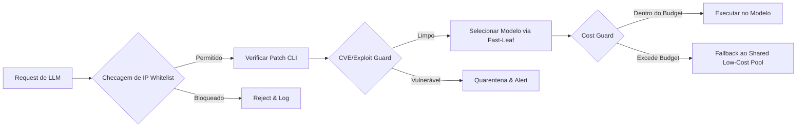


## Destaques
- **Modelo de Pool Compartilhado** – Discussões sobre pools de mineração e doações de capacidade evidenciam a necessidade de “Shared Model Pools” para balancear demanda e custo, especialmente em cenários de alta volatilidade de tokens. [Is Pool Corp (POOL) Now Attractive After A 42% One Year Share Price Fall?](https://news.google.com/rss/articles/CBMimgFBVV95cUxPY2VBSjhncGVwOVJ0WkpTY2w2RW5XUnJ1V24zMzhaZEdqdUY1RDI3RldsbkpLNTlFSzQzdnJvcmRrRXJjSi1ubTgwU1laQXFvSmExYVZlak82VkNYNmh5Tll5dFNWbHpwbmVpc2ZfSHJjcVFpdEtkTDNpcmtNZlZmMlc3NFoybGI2c1RyZjJpeDNHbkN2SncyY09R)

- **Revisão de Preços de LLMs** – Anthropic e OpenAI anunciaram novos esquemas de precificação que penalizam picos de uso e introduzem “pay‑as‑you‑grow” com limites de token mais agressivos, forçando equipes a monitorar gastos em tempo real. [Anthropic and OpenAI Just Gave Us a Glimpse Into the Future of Model Pricing](https://news.google.com/rss/articles/CBMiqwFBVV95cUxPbXQ0dm90eC1JMFpydWhoRTk0d0NqeUEzM1JfcDVNMkhHRWcxeDBHLTZlZ25KZk5zcEhDUC1OY3NLdHNpVjRUeExRbVBBXzExZ0xaNVhBZy1OQkFqZFhQM2wtVlVNQW9FUm9jQUxBbUhGeEloS29DeFdqbHpjdzYtQzFNVEp0WU1taldQcnFtdlBpeGlQem1wcGhxMk5PYzVTN1dWanpaLUFUYU0)

- **Codex em Promoção** – OpenAI lançou um programa “Giveaway” de 8 k desenvolvedores e um plano Pro de $100/mês, ampliando o acesso ao Codex mas também gerando picos de token‑anxiety em comunidades dev. [OpenAI turns its sold-out GPT‑5.5 party into a monthlong Codex giveaway for 8,000 developers](https://news.google.com/rss/articles/CBMixgFBVV95cUxQenlleTI5ZEk4LTY5ZmVfY2t3a3B5c1lDOFo2Q2drTDUwbmVETi1BQVVnN25pT1BnaG4tV3lMZzM4T1ZxZEI5dnpiMG5lMlFpX0xGZ2VCa2w4NWFRU1dyV1lwZRIwTVV5QXg0QlAtNkU0d21KVG1rQzliVXRObTJBVzRaaXQtemx2dl8zY2RRN2VtU2RkQzRWTWVUci1VSFBpdmVtVGFFanQ1RFNET1pORHlXX29hT0hTZnA5VDJLV3YzMHdteXc)  
- **Planos Pro para Codex** – O novo plano de $100/mês inclui limites de token mais rígidos, relatórios de uso detalhados e suporte prioritário, mas gera alertas de “budget breach” para empresas que ultrapassam as cotas. [OpenAI Launches $100/Month Pro Plan for Codex Users – Here’s What It Includes](https://news.google.com/rss/articles/CBMipAFBVV95cUxOWU00U05EQkZrOVRXeDNVOVdZMWttV1ZWOVA1TG52NEwxb2pKMXM2OXFjOVF4OWcxYTFTTVRJZDhpSW9IeDhnOTNHM3NvN2hnU2JvWFBBWkJmQWdWc0NCcEhNampjaG1FLVdkUXBBS01VclpBX1RUYk5ocDFfbXBPSTJGY2pLWDBiQ3NuMDBYSEZ0TmNrX2NGZkRvT0JNWHVUWFZ1UQ)

- **Limites de Uso no Claude Code** – Usuários relatam esgotamento rápido de cotas, sobretudo após instalação de skills que alteram a seleção de modelo (ex.: desaparecimento do Sonnet). Isso ativa guardas de custo e fallback automático para modelos de baixo custo. [Claude Code users say they’re hitting usage limits faster than normal](https://news.google.com/rss/articles/CBMiXEFVX3lxTE5MRDhheW9RdThmUjRId2s2Z0JGUUNzbFhoczhfM2lVd3Qxa1FVemFJODRWU1J6WnN4SUdjQVpkTHV1RFdLZ3I2Z2tRemxYVHEzcF91LU9KUE1HRjZ1)  

- **Bug de Seleção de Sonnet** – Após instalar um skill customizado, o modelo Sonnet 4.6 desapareceu do selector, forçando desenvolvedores a confiar no “Default (recommended)” e a revisar pipelines de skills. [Sonnet disappeared from Claude Code after installing a skill 😭helpppp](https://www.reddit.com/r/Claudeopus/comments/1twq6c3/sonnet_disappeared_from_claude_code_after/)  

- **Crise de Token‑Anxiety** – Relatos no V2EX e Business Insider apontam aumento de spikes (≥30 B tokens/dia) que geram throttling e “price‑shock” nos provedores, impulsionando adoção de pools de baixo custo e estratégias de token‑bucket. [A Looming Crisis Could Limit Some of Your Favorite AI Tools](https://news.google.com/rss/articles/CBMifkFVX3lxTE1XVFQ4Rk8xdklDVHNmdTNsdXBzZHUzUm1GcndHMF9LbUxub2F1Z2lsX2xoS29YZ3dNZkdZcnY1ZVFXVWNNeDNWY1drYjVKT2k1TkJGNFpadGJHcU8wNFdITEZObjdjSE1QREkxUnRvMXNvbzRfb1lpZGtLczc3UQ)  

- **Orçamento de IA da Uber** – A companhia que lidera gastos em IA ultrapassou seu teto de US$ 2 M/mês em apenas quatro meses, gerando alerta interno de “budget alert” e demandando mecanismos de corte automático. [Uber burned through its entire 2026 AI budget in four months. Now its COO is questioning whether it's worth it](https://news.google.com/rss/articles/CBMie0FVX3lxTE9yeXo0WE4zM3ZWcXBrb0tISE5Wa1ZBQlRGdHlPcjlfZEVWeC03QVJWaVBMS01USWQxZTAwZ1BxRWZhdkw1N3ZjUE9NRjZvVWF3T3BwdUxFb0VlRVJnQUJHalFkOC1FbGhFNm5Xd0xibWlQa2tRSEFmUkFfVQ)  

- **Verificação Automática de Hot‑Patch CLI** – Padrão TypeScript que calcula SHA‑256, valida contra Hermes‑Agent e registra em Cloudflare Durable Object, permitindo execução segura de patches críticos (e.g., Gemini CLI RCE). [Automated CLI Hot‑Patch Verification and Execution (typescript)](https://self-improvement-cycle)  

- **Refresh Horário de Whitelist Dinâmica** – Implementação que consulta fontes confiáveis (PAN‑OS, MOVEit, NVD 2026) a cada hora, atualiza lista de IPs permitidos e grava eventos de “ip_whitelist_match:false” para auditoria. [Hourly Dynamic IP Whitelist Refresh with Cloudflare Durable Object Logging (typescript)](https://self-improvement-cycle)  

- **Token‑Bucket Shared Model Pool (TS)** – Biblioteca open‑source que roteia solicitações a modelos de baixo custo, controla taxa via bucket e faz fallback automático ao ultrapassar limites, reduzindo churn de créditos. [TypeScript Token‑Bucket Shared Model Pool with Auto‑Fallback (typescript)](https://self-improvement-cycle)  

- **Claude Code Cost Guard (TS)** – Guardião de custo que monitora preço por token e gasto diário, desativa licenças ao ultrapassar limites e encaminha a um “Shared Low‑Cost Model Pool”. [Claude Code Cost Guard with Automatic Fallback (typescript)](https://self-improvement-cycle)  

## Tendências
O panorama de 2026 mostra um forte movimento de **governança de custos** e **segurança automatizada**. As mudanças de precificação de grandes provedores (Anthropic, OpenAI) combinam-se com relatos de *token‑anxiety* e budget overruns (Uber, V2EX), forçando as equipes a adotarem **pools compartilhados** e **guardas de custo** que operam em tempo real. Simultaneamente, vulnerabilidades críticas (Gemini CLI, Netlogon) impulsionam a necessidade de **verificação automática de patches CLI** e de **whitelists dinâmicas**, integradas ao roteador quântico que pondera custo, latência e conformidade.

A adoção de padrões de código (token‑bucket, cost guard, hot‑patch) demonstra que os desenvolvedores estão migrando de reatividade para **orquestração preventiva**, garantindo que modelos mais baratos e seguros atendam a picos de demanda sem violar limites financeiros ou de segurança.

*Fluxo resumido de roteamento seguro e econômico que incorpora whitelist, patch verification, CVE guard, fast‑leaf selection e fallback de custo.*

## Fontes e Referências

1. [Is Pool Corp (POOL) Now Attractive After A 42% One Year Share Price Fall? - Yahoo Finance](https://news.google.com/rss/articles/CBMimgFBVV95cUxPY2VBSjhncGVwOVJ0WkpTY2w2RW5XUnJ1V24zMzhaZEdqdUY1RDI3RldsbkpLNTlFSzQzdnJvcmRrRXJjSi1ubTgwU1laQXFvSmExYVZlak82VkNYNmh5Tll5dFNWbHpwbmVpc2ZfSHJjcVFpdEtkTDNpcmtNZlZmMlc3NFoybGI2c1RyZjJpeDNHbkN2SncyY09R?oc=5) — Google News (shared model pool)
2. [11 Best Bitcoin Mining Pools of 2026: Compare The Top Bitcoin Mining Pool for Miners! - Coin Bureau](https://news.google.com/rss/articles/CBMiaEFVX3lxTE9NUldXUS1jMTNsUFRsLUlya0RPcEtBS3Rwc2ZoeUFxaXlYdzI5QWtVVEZDMGZVTEZsc3pNMHFwRFA3M3Fxbm55M0Y2WDA1VmUxTmJaOElFSktGZi1YQ2ZycWZNNHBKamtq?oc=5) — Google News (shared model pool)
3. [Bitcoin 'plebs eat first' mining pool Parasite finds its second BTC block - Cryptonews.net](https://news.google.com/rss/articles/CBMiV0FVX3lxTE45alMtLW1paE9jUDIwVWNuRHphWTJwZkJRNzFRRXktSE1uLURzT0tLc09TN19pbVF6NEdZNnNPYkY2SWd4SVBMWnI4T1l2MUxNeDhBRFZpSQ?oc=5) — Google News (shared model pool)
4. [Is Pool (POOL) Ready For A Rebound After Recent Share Price Weakness? - Yahoo Finance](https://news.google.com/rss/articles/CBMimwFBVV95cUxQR0lVaXRBeEdFYUUwdVk1RXNLcWFhQjlONWdtWTJxOUNYNXh6anZ2X3NGS2dBdVA3MUxQcHh0OGwyNG40OWxWb3F2TG5ULXFlRWJMcFNLMlpwb1NlZ2JtbDlMQVZ4QmMtT1lSYlhKdU5zUE10MDdRVVE2U2pXUXp6VWxxZXNBbzRVNGJNcXl4R0VqNFA5SFU2MTgtYw?oc=5) — Google News (shared model pool)
5. [Emily Ratajkowski Sunbathes in a Red-Hot 'Baywatch' Bombshell-Coded Swimsuit at the Pool - instyle.com](https://news.google.com/rss/articles/CBMikAFBVV95cUxQVXlYX2pHX0V1Qi1hQjZKTTFGcUFGQ0hVRGNhbDN0Q2c1RkJ3LTJnNExBeGVWSUVPYWlFX3J2RTdZcXFUeUNLQW91SkRZaWdfY1lVVzUwbTNPeEhkMlkta1ljLVNMQURFSHhZVzZuV2MweXgtSXRsLW0zYzRfUXJOTDZscm9SbmdoOFl2YV83c3Q?oc=5) — Google News (shared model pool)
6. [Anthropic and OpenAI Just Gave Us a Glimpse Into the Future of Model Pricing - Gizmodo](https://news.google.com/rss/articles/CBMiqwFBVV95cUxPbXQ0dm90eC1JMFpydWhoRTk0d0NqeUEzM1JfcDVNMkhHRWcxeDBHLTZlZ25KZk5zcEhDUC1OY3NLdHNpVjRUeExRbVBBXzExZ0xaNVhBZy1OQkFqZFhQM2wtVlVNQW9FUm9jQUxBbUhGeEloS29DeFdqbHpjdzYtQzFNVEp0WU1taldQcnFtdlBpeGlQem1wcGhxMk5PYzVTN1dWanpaLUFUYU0?oc=5) — Google News (codex usage throttling)
7. [OpenAI turns its sold-out GPT-5.5 party into a monthlong Codex giveaway for 8,000 developers - VentureBeat](https://news.google.com/rss/articles/CBMixgFBVV95cUxQenlleTI5ZEk4LTY5ZmVfY2t3a3B5c1lDOFo2Q2drTDUwbmVETi1BQVVnN25pT1BnaG4tV3lMZzM4T1ZxZEI5dnpiMG5lMlFpX0xGZ2VCa2w4NWFRU1dyV1lwZVIwTVV5QXg0QlAtNkU0d21KVG1rQzliVXRObTJBVzRaaXQtemx2dl8zY2RRN2VtU2RkQzRWTWVUci1VSFBpdmVtVGFFanQ1RFNET1pORHlXX29hT0hTZnA5VDJLV3YzMHdteXc?oc=5) — Google News (codex usage throttling)
8. [OpenAI Launches $100/Month Pro Plan for Codex Users – Here’s What It Includes - Gadget Review](https://news.google.com/rss/articles/CBMipAFBVV95cUxOWU00U05EQkZrOVRXeDNVOVdZMWttV1ZWOVA1TG52NEwxb2pKMXM2OXFjOVF4OWcxYTFTTVRJZDhpSW9IeDhnOTNHM3NvN2hnU2JvWFBBWkJmQWdWc0NCcEhNampjaG1FLVdkUXBBS01VclpBX1RUYk5ocDFfbXBPSTJGY2pLWDBiQ3NuMDBYSEZ0TmNrX2NGZkRvT0JNWHVUWFZ1UQ?oc=5) — Google News (codex usage throttling)
9. [A Looming Crisis Could Limit Some of Your Favorite AI Tools - Business Insider](https://news.google.com/rss/articles/CBMifkFVX3lxTE1XVFQ4Rk8xdklDVHNmdTNsdXBzZHUzUm1GcndHMF9LbUxub2F1Z2lsX2xoS29YZ3dNZkdZcnY1ZVFXVWNNeDNWY1drYjVKT2k1TkJGNFpadGJHcU8wNFdITEZObjdjSE1QREkxUnRvMXNvbzRfb1lpZGtLczc3UQ?oc=5) — Google News (codex usage throttling)
10. [Claude Code users say they’re hitting usage limits faster than normal - The New Stack](https://news.google.com/rss/articles/CBMiXEFVX3lxTE5MRDhheW9RdThmUjRId2s2Z0JGUUNzbFhoczhfM2lVd3Qxa1FVemFJODRWU1J6WnN4SUdjQVpkTHV1RFdLZ3I2Z2tRemxYVHEzcF91LU9KUE1HRjZ1?oc=5) — Google News (codex usage throttling)
11. [Sonnet disappeared from Claude Code after installing a skill 😭helpppp](https://www.reddit.com/r/Claudeopus/comments/1twq6c3/sonnet_disappeared_from_claude_code_after/) — Reddit Search: claude code
12. [[Workflow] Claude Stylistic Guide via Startsession Hook Skill](https://www.reddit.com/r/ClaudeWorkflows/comments/1twq3dq/workflow_claude_stylistic_guide_via_startsession/) — Reddit Search: claude code
13. [[Workflow] MicVST: A Lightweight Windows Tray App for VST3 Microphone Processing (Built with Claude Code)](https://www.reddit.com/r/ClaudeWorkflows/comments/1twq3am/workflow_micvst_a_lightweight_windows_tray_app/) — Reddit Search: claude code
14. [I'm the only human at my software company. The other 17 employees are AI. (open source)](https://www.reddit.com/r/ClaudeAI/comments/1twq2sq/im_the_only_human_at_my_software_company_the/) — Reddit Search: claude code
15. [Sonnet disappeared from Claude Code after installing a skill 🤣](https://www.reddit.com/r/ClaudeCode/comments/1twq1ws/sonnet_disappeared_from_claude_code_after/) — Reddit Search: claude code
16. [Interested in using Pi as a routing layer, zero clue where to exactly start. Help needed!](https://www.reddit.com/r/PiCodingAgent/comments/1twq04f/interested_in_using_pi_as_a_routing_layer_zero/) — Reddit Search: claude code
17. [[Workflow] Efficient Claude Skills for Research and Investigation (Preventing Token Overuse)](https://www.reddit.com/r/ClaudeWorkflows/comments/1twpzrr/workflow_efficient_claude_skills_for_research_and/) — Reddit Search: claude code
18. [大家目前觉得最聪明的大模型还是 Claude Opus 4.6 吗？](https://www.v2ex.com/t/1217986#reply14) — V2EX Tech
19. [有没有靠谱的 codex 代充平台](https://www.v2ex.com/t/1218003#reply10) — V2EX Tech
20. [Time to ditch Github Copilot](https://www.reddit.com/r/GithubCopilot/comments/1twn2lk/time_to_ditch_github_copilot/) — Reddit: GithubCopilot
21. [When you open your Copilot dashboard on June 2](https://www.reddit.com/r/GithubCopilot/comments/1twpagr/when_you_open_your_copilot_dashboard_on_june_2/) — Reddit: GithubCopilot
22. [dynamic workflows in claude code are insane, and theres a cheap way to run them](https://www.reddit.com/r/ClaudeCode/comments/1twmyrm/dynamic_workflows_in_claude_code_are_insane_and/) — Reddit: ClaudeCode
23. [Micropatches released for Windows Netlogon Remote ...](https://www.reddit.com/r/SecOpsDaily/comments/1to9pks/micropatches_released_for_windows_netlogon_remote/) — Reddit (cve-2026-41089 exploit)
24. [Ransomware operators exploit ESXi hypervisor ...](https://www.reddit.com/r/blueteamsec/comments/1ef9uro/ransomware_operators_exploit_esxi_hypervisor/) — Reddit (cve-2026-41089 exploit)
25. [r/cpanel on Reddit: ELI5: What Exactly is the cPanel Exploit (CVE-2026-41940 or "Sorry" Ransomware)?](https://www.reddit.com/r/cpanel/comments/1t3gs54/eli5_what_exactly_is_the_cpanel_exploit/) — Reddit (cve-2026-41089 exploit)
26. [Uber burned through its entire 2026 AI budget in four months. Now its COO is questioning whether it's worth it - Fortune](https://news.google.com/rss/articles/CBMie0FVX3lxTE9yeXo0WE4zM3ZWcXBrb0tISE5Wa1ZBQlRGdHlPcjlfZEVWeC03QVJWaVBMS01USWQxZTAwZ1BxRWZhdkw1N3ZjUE9NRjZvVWF3T3BwdUxFb0VlRVJnQUJHalFkOC1FbGhFNm5Xd0xibWlQa2tRSEFmUkFfVQ?oc=5) — Google News (uber ai budget)
27. [有没有靠谱的 codex 代充平台](https://www.v2ex.com/t/1218003#reply8) — V2EX Tech
28. [Antigravite 还能不给用的 ？ Cursor 和 codex 用完了想着 反重力过渡一下 更新一下结果无法用了，](https://www.v2ex.com/t/1217965#reply4) — V2EX Tech
29. [求 ChatGPT 聊天网页端的拼车共享方案](https://www.v2ex.com/t/1217903#reply10) — V2EX Tech
30. [大家目前觉得最聪明的大模型还是 Claude Opus 4.6 吗？](https://www.v2ex.com/t/1217986#reply7) — V2EX Tech

---

*Gerado por: cloud/gpt-oss-120b*


---
*Gerado por evo-agent - agente auto-aprimorante em 2026-06-04.*
