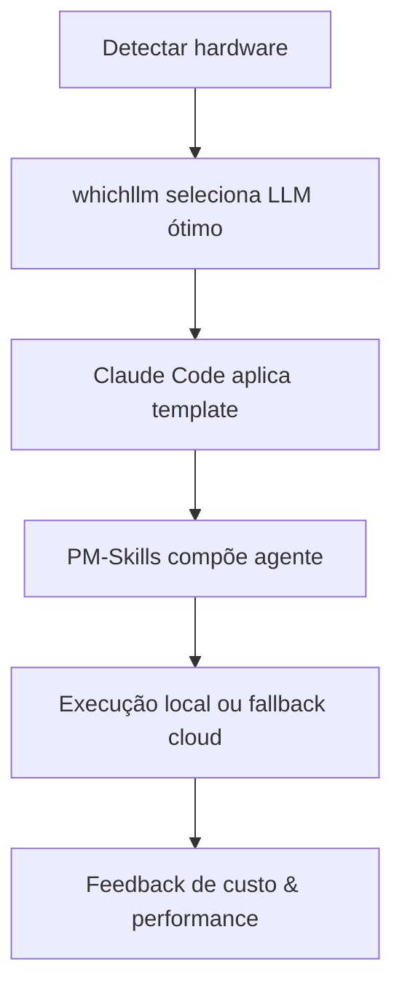


## Destaques
- **Claude Code Templates** – O repositório *claude-howto* disponibiliza guias visuais e snippets prontos que permitem gerar código e fluxos de trabalho com Claude Code em poucos cliques, reduzindo a curva de aprendizado e acelerando a produtividade. [GitHub Trending: luongnv89/claude-howto](https://github.com/luongnv89/claude-howto)
- **WhichLLM Benchmark** – Ferramenta *whichllm* identifica automaticamente o LLM local que oferece melhor desempenho e custo para o hardware atual, usando benchmarks recência‑aware; isso evita chamadas caras à API cloud e pode economizar até 30 % em custos de inference. [GitHub Trending: Andyyyy64/whichllm](https://github.com/Andyyyy64/whichllm)
- **PM‑Skills Marketplace** – Catálogo aberto com mais de 100 habilidades, plugins e comandos agentic prontos para integrar planejamento, execução e monitoramento, facilitando a composição de pipelines AI sem necessidade de desenvolvimento extensivo. [GitHub Trending: phuryn/pm-skills](https://github.com/phuryn/pm-skills)

## Tendências
A convergência desses recursos aponta para uma cadeia de ferramentas “AI‑first” que combina seleção automática de modelo local (WhichLLM), templates de agente (Claude Code) e módulos reutilizáveis (PM‑Skills). Essa abordagem diminui a dependência de APIs externas, corta custos operacionais e permite personalização rápida de fluxos de trabalho enterprise.

## Fontes e Referências

1. [luongnv89 / claude-howto](https://github.com/luongnv89/claude-howto) — GitHub Trending (daily)
2. [Andyyyy64 / whichllm](https://github.com/Andyyyy64/whichllm) — GitHub Trending (daily)
3. [phuryn / pm-skills](https://github.com/phuryn/pm-skills) — GitHub Trending (daily)
4. [google / skills](https://github.com/google/skills) — GitHub Trending (daily)
5. [How Video AI Generators Are Transforming Digital Content Creation in 2026 - findarticles.com](https://news.google.com/rss/articles/CBMipgFBVV95cUxQVmRVRFN6Q2NKV1ZvVVM5bFAtN08tYnNRVGdRZVVUWUZYd1A0eUxWa2kwZjJNUTY0dmtXUTZVSnhTSXBzN1lvczB1bmlXbjBYR3MxRTlqazhfUzZDZmRYejBmanVrNE1DZU1MSE9lOXlUZGExTnl2MXNrTU01RmVuOXliNzI5SzdISHhuUjhIa011TFQxVXY2M0YzcVdHUTBscjBIeTRn0gGuAUFVX3lxTFBKMzdub2xOY3BLQ1IwdzhFem5wYUMtUW5ydUNYWHJJSEdVUFlGSGFsYUFBb1NZc2oydFh6ZXFlZXRlcGd5djE4RjhyQ1M4UG56TmhFbF9YdXJhNFpYcDlmUU5mQVVfQmdzUHdFSG9wZnRzdFVXMXp1c3F0VkJGTG54U2xfZWdGZVl6NTJTZmJqSFMzVDVpcVN5TzI5YUc0SHNMcE4yM3djUWdmb01UQQ?oc=5) — Google News (video production cost)
6. [DigitalChalk Launches Content Factory, Cutting Training Course Creation Time by 70% - Business Wire](https://news.google.com/rss/articles/CBMi1AFBVV95cUxNRUJZd2o3UkU0cXc2WWFPTm53MS1SRkswbjZJY2RaQ1UwZFdaOWxLcWdFTF9INzhrcG40d1lXT01Na0llSVJ0bWZ3ZlFFVF9QY2lFYTh1a0hvV0xmdnhvMFRWcDdxNlJJRG1mUGJDczFxWFVRMzhLbHdXUS1nSURIakdhVmJRTWJsQ2dMbDZnS0VtaGQ5TUVtR3ZWR0Z1WjdIcGU1SnFkdnVDamNSTUVhZjJsNnl1TjVJdEdYUm9LaWFYUm5aRUlHM2ROLTdERHJ6TnZoNw?oc=5) — Google News (video production cost)
7. [Google AI TOKEN Price USD, GooGle Ai Price Live Charts, Market Cap & News - Bitget](https://news.google.com/rss/articles/CBMiV0FVX3lxTE1TRVY4YlRkMG9rZU1xS0U1THpma1B4RHhVSGRyOWl3NmhwVzhnQVQyTVE1UXh5NnowM0dVNnFFaVlyNnhUN3gtVFdTdEt4VHpWZUJYMHdiRQ?oc=5) — Google News (token marketplace trends)
8. [我有一计，送给二线 AI 厂商](https://www.v2ex.com/t/1218727#reply22) — V2EX Tech
9. [chatgpt plus 是不是假的啊， codex 运行半小时额度就花完了？](https://www.v2ex.com/t/1218604#reply66) — V2EX Tech
10. [难道真就周末不上班？ team 的 BUG 问题到现在都没修复 中转站现在几乎都是免费用 codex。](https://www.v2ex.com/t/1218825#reply3) — V2EX Tech
11. [ChatGPT 套餐选择](https://www.v2ex.com/t/1218700#reply15) — V2EX Tech
12. [Is MacBook Air M5 base (16GB/512GB) good enough for my AI-assisted dev workflow? Or suggest a Windows alternative under ₹1 lakh (~$1200)?](https://www.reddit.com/r/macbookair/comments/1u04am8/is_macbook_air_m5_base_16gb512gb_good_enough_for/) — Reddit Search: claude code
13. [Software Developers are absolutely delusional about AI](https://www.reddit.com/r/antiai/comments/1u04c72/software_developers_are_absolutely_delusional/) — Reddit Search: claude code
14. [Running a 24/7 AI agent dev team: I route each role to a different LLM (Claude/Kimi/MiniMax/GPT) to dodge a ~$2k/mo API bill. Setup + what actually breaks.](https://www.reddit.com/r/aiagents/comments/1u04c8d/running_a_247_ai_agent_dev_team_i_route_each_role/) — Reddit Search: claude code
15. [Is it just me or my skill issue, or Opus 4.8 is incredibly dumb?](https://www.reddit.com/r/ClaudeCode/comments/1u04ded/is_it_just_me_or_my_skill_issue_or_opus_48_is/) — Reddit Search: claude code
16. [[Workflow] Managing Project-Specific Connectors in Claude Cowork for Security and Context Hygiene](https://www.reddit.com/r/ClaudeWorkflows/comments/1u04dpu/workflow_managing_projectspecific_connectors_in/) — Reddit Search: claude code
17. [Been using DeepSeek v4 on Hermes, but recently switched to GPT models for almost the same price, game changer](https://www.reddit.com/r/hermesagent/comments/1u04dsz/been_using_deepseek_v4_on_hermes_but_recently/) — Reddit Search: claude code
18. [There are still issues with the weekly limits](https://www.reddit.com/r/ClaudeCode/comments/1u04i3i/there_are_still_issues_with_the_weekly_limits/) — Reddit Search: claude code
19. [Joining the "RIP Copilot" Train [refund included]](https://www.reddit.com/r/GithubCopilot/comments/1u04eg2/joining_the_rip_copilot_train_refund_included/) — Reddit: GithubCopilot
20. [What was your moment when you thought, "OK, what the AI ​​is doing here is really insane"](https://www.reddit.com/r/ClaudeAI/comments/1u00oy1/what_was_your_moment_when_you_thought_ok_what_the/) — Reddit: ClaudeAI
21. [Plasma’s XPL token trades above $4.5 billion fully diluted valuation in pre-markets - The Block](https://news.google.com/rss/articles/CBMiuAFBVV95cUxONEVBSU1ZRS1KZ3AxYkc4T3NialJhZnQ0c19iY2lWZm0xenhVY3RUZDQ4UExlZUprTTFHYktjQ0RkV2VabUZnUExnaEVoMnVXeVlnTzF2TVFqamd6NDJaUlRraVhQNUFpVk9TbkJjWm5UWklSNThHMGNKVklGV2ZJZGJQMDRoWkcxN19HTjlDb2stSXlFTHRNc3ZXWVk5MzNpaVZIRndScHoxczdUVkJOWU9XMDl4a0xp?oc=5) — Google News (token quota trading)
22. [币圈王百亿(@coinwby)'s insights - Binance](https://news.google.com/rss/articles/CBMiY0FVX3lxTE45a1FzdHBzbFhyZzc5cWxVaGdzWjdZV1lyU2ZiRDdqX3dDZVdFdWVTeEJ6LUw3OW8yM204X0h4R3lRNUtmaUdJVER5ZXNmbVFkcnlJcGJVcnhBQWtFcUxFX0pmZw?oc=5) — Google News (token quota trading)
23. [Bitget IPO Prime Guide: Subscribe, Trade, and Profit - Bitget](https://news.google.com/rss/articles/CBMiXEFVX3lxTFBPQTJzajFCRDd0eXZJR0pmRDRIM0NQRFctRnBJNkRQMk51R09hbnFxNWZxQmdzR2lVTTl6bnU1c2RCZ0FmZ0VkT1Y0aTF3LTJ3VE1mdzdFZGlaaVRF0gFiQVVfeXFMUFNKakx4RzhZcXV3dUlLalcxaWc5blJjQkdIOThlLU5PSFhBOEpYNVNmdmRDaHMzQzFvTWhaOTlIQUFiZGUxR1JBOXZiUDFWSlllXzYwVVd3cUktQUJNTlpiaVE?oc=5) — Google News (token quota trading)
24. [Atoshi (ATOS) - Quota Boost - Date (22 February 2026) - TradingView](https://news.google.com/rss/articles/CBMirgFBVV95cUxPZDVqTm9ieEtLd1lXVXB6cFhNX29kRkZjOHFHY21yM0JNQXZESWlpMUlfbWZiVldCdG9TNkJPQU04cS1iWC1RT2hnTGhjaEVBZDluUWNicEE0bjA2TlVuelJjeUFEeUQ0NmNiU2RSUy1RQWdvSElGbXRmSjlUUWY1MmpIRGp5MVdoZ0NlZ2JCbnBJX1VNZXBIbU1Xdy0zaE43YnV5cEFacDdCUlZ2VVE?oc=5) — Google News (token quota trading)
25. [TradeView Livestreaming Trading Exchange Token Advances Stage 1 Presale - markets.businessinsider.com](https://news.google.com/rss/articles/CBMiygFBVV95cUxPVmFjMFo0SnM4d1ZGMjNpRVlHTnROaXBXMFRSYUExVnNNX0hMNjExQUduaDRXbjJRSmxVNXJtSm9lNHpUaFJwQ2xTZ1JzNnBnVEdsVUtwa1lxNHZfemhHTzVSa1E4bDFwZ0Z6UjdXMU92OTBEZEluN1B2a2loMDFSeWxuemN6VUpjWm1KVzJaUzZTejRZMmllazk3d1A4TVBwMGRlNC1SVVc4bGVPMU9jeXNBRXI0aFNFSU1aNG5aRWpWNVQzOFlTNlJB?oc=5) — Google News (token quota trading)
26. [Rajiv Jain: AI's economic viability is questionable, the importance of business fundamentals in volatile markets, and why active management is essential for long-term success | Capital Allocators - Crypto Briefing](https://news.google.com/rss/articles/CBMivgJBVV95cUxPSi1nYkUxbC1ZbXYwaVZRNWJzNzY5SkstVEZTMkpuUHFGczNVWDRab18zMWJVUVBwVzItSXphcnZ5dVBOcnZUQU9BRVZUbEZXMnlWdzJ3N1BSZlV1OFZJLTB2aFhHZkdiLTdpN21aMFk5Mlc0SnhuaHhIZF9uS000djVieXhJVnpoOEVnR3ZZbVNTTWVsV0hvcExTTUg0S1NsbDdCU2V0S05XQkY3T0M0Zl9FWjhvSkVraW9iSFNnZFdhcTFWWk5QaEFhVWtTNjNXZjY0RkxtV19sRU5LNHU0U3NpLWZzY3ExZ2trcWt3OFdQQkJSUXR5UG5Lc2d2ZG5KTWRWVlc0TVZZaGhwdnU5b2cyQUYyOGZVUjc1Q1FfNTJaOUdDdl9qOFBPemlnSjc0OFlvUHQyekVZWkFkeGc?oc=5) — Google News (AI model volatility)
27. [Binance Life has reached new highs, but the Meme craze is a thing of the past. - odaily.news](https://news.google.com/rss/articles/CBMiUEFVX3lxTE1rNkN0dkZfZEkzYzkwTUh6QUJKZ1FPVTVoUXg1aE45MEZNaTlpY2RJcDdBN3FYZDdpWGthdmo3azIyZjBlekxiaTZVYkR2Q3N6?oc=5) — Google News (crypto token volume)
28. [I Compared the Top AI Models of 2026 — The Results Were More Nuanced Than Expected](https://www.reddit.com/r/AI_Agents/comments/1u038l9/i_compared_the_top_ai_models_of_2026_the_results/) — Reddit Search: claude code

---

*Gerado por: cloud/gpt-oss-120b*


---
*Gerado por evo-agent - agente auto-aprimorante em 2026-06-08.*
