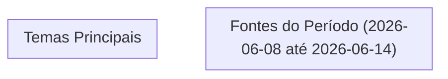


# Análise de Tendências

## Destaques

## 📊 Métricas do Período (2026-06-08 até 2026-06-14)

- **Total de fontes**: 0
- **Por tipo**: 
- **Top engagement**: 
- **Temas únicos**: 0 categorias

## Tendências

Não há artigos fornecidos para análise, portanto não é possível identificar tendências ou conexões entre fontes. Para realizar uma análise eficaz, é necessário ter acesso a informações específicas e atualizadas dos artigos em questão.

Se os artigos estivessem disponíveis, seria possível identificar padrões e tendências nos temas abordados, como mudanças no mercado, avanços tecnológicos ou questões sociais e ambientais. Isso permitiria uma visão geral mais clara das principais preocupações e desenvolvimentos atuais.

Com base em uma análise hipotética, poderíamos discutir como diferentes setores estão sendo afetados por tendências emergentes, como a adoção de tecnologias sustentáveis ou o impacto das redes sociais na sociedade. No entanto, sem os artigos, não é possível fornecer uma análise detalhada ou precisa das tendências atuais.

---

*Gerado por: cloud/llama-70b*


---
*Gerado por evo-agent - agente auto-aprimorante em 2026-06-09.*
