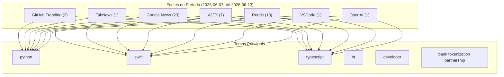


# Destaques da Semana no GitHub e Tecnologia

## Destaques
### GitHub Trending
* **soxoj / maigret** ⭐ 31644 — 🕵️‍♂️ Collect a dossier on a person by username from 3000+ sites | ⭐ 31,644 | Lang: Python [link](https://github.com/soxoj/maigret)
* **apple / container** ⭐ 28268 — A tool for creating and running Linux containers using lightweight virtual machines on a Mac. It is written in Swift, and optimized for Apple silicon. | ⭐ 28,268 | Lang: Swift [link](https://github.com/apple/container)
* **activeloopai / hivemind** ⭐ 608 — One brain for all your agents | ⭐ 608 | Lang: TypeScript [link](https://github.com/activeloopai/hivemind)

### TabNews
* **Se você é dev, você já deveria estar utilizando um gerenciador de senhas** 💬 22 — Sem conteúdo [link](https://www.tabnews.com.br/rutkowskigustavo/se-voce-e-dev-voce-ja-deveria-estar-utilizando-um-gerenciador-de-senhas)

### Reddit
* **Guys, is it time for Scribbles to come back again?** 📊 0 — I've watched those videos, and they say it's either a new game or just an overdrive of the current Asphalt Legends. But I'm expecting it's not AI and that it is sth new cuz this has been so long.
     [link](https://www.reddit.com/r/Asphalt9/comments/1u1yg3i/guys_is_it_time_for_scribbles_to_come_back_again/)
* **[Workflow] Synchronize Claude Code Agents and Teams with Lockstep: An Open-Source Decision & Change Management Tool** 📊 0 — Synchronize Claude Code Agents and Teams with Lockstep: An Open-Source Decision & Change Management Tool
 Workflow value: 85/100
 Status: active · Freshness: 70/100 · Confidence: 0.95 · Level: interme [link](https://www.reddit.com/r/ClaudeWorkflows/comments/1u1ygp6/workflow_synchronize_claude_code_agents_and_teams/)
* **Vibe Coding Gets You to 80%. The Last 20% Is Still Engineering.** 📊 0 — I've been watching a lot of founders build products with ChatGPT, Claude, Cursor, Windsurf, Lovable, Bolt, and similar tools.
 The speed is honestly incredible.
 A few years ago, building an MVP meant [link](https://www.reddit.com/r/u_plakhlani/comments/1u1ynlo/vibe_coding_gets_you_to_80_the_last_20_is_still/)
* **I built an MCP Server that sends push notifications to your phone when Claude Code routines finish** 📊 0 — Hey everyone,
 I’ve been messing around with the new routines feature in Claude Code (the desktop tab), and I really wanted a way to step away from my desk and get a push notification on my phone the  [link](https://www.reddit.com/r/ClaudeAI/comments/1u1yocv/i_built_an_mcp_server_that_sends_push/)
* **I set Fable 5 as my Claude Code default on launch day and metered everything. Day one: $210.15 at API prices, $0 actually paid.** 📊 0 — Fable 5 just dropped and it's included in paid plans until June 22, so I switched my Claude Code default to claude-fable-5 the next morning and decided to measure the whole day instead of posting vibe [link](https://www.reddit.com/r/Anthropic/comments/1u1ypkq/i_set_fable_5_as_my_claude_code_default_on_launch/)
* **Pimp My Statusline · Visual Claude Code Statusline Builder** 📊 0 — For months my Claude Code statusline lived in a ~120-line statusline.sh. Every tweak meant guessing ANSI color codes, counting bar characters by hand, and re-running it to find out what I'd broken.
 S [link](https://www.reddit.com/r/ClaudeAI/comments/1u1yr2x/pimp_my_statusline_visual_claude_code_statusline/)
* **For everyone with 100 ideas and no time: how I ship quality products in an afternoon** 📊 0 — This is for all of you with many ideas but no time to build them. The tech stack and workflow that I use for shipping SaaS sites in an afternoon.
 First of all, use a coding agent. Coding for real is  [link](https://www.reddit.com/r/nocode/comments/1u1ytij/for_everyone_with_100_ideas_and_no_time_how_i/)
* **Why do we see the upgrade to copilot pro when pro is paused?** 📊 0 — As per the title I am seeing that github will take peoples money but not offer copilot pro or a boost of credits is that not misleading then shouldn't be taking peoples money.
    submitted by    /u/t [link](https://www.reddit.com/r/GithubCopilot/comments/1u1wg6n/why_do_we_see_the_upgrade_to_copilot_pro_when_pro/)
* **AI haters won't like this** 📊 0 — I'm working on a online game similar to GTA online but all the content is live-generated by players. Prompt your own sportscar, your own building, your own weapon, etc...
 what do you guys think of th [link](https://www.reddit.com/r/aiwars/comments/1u1xhe2/ai_haters_wont_like_this/)
* **Le réveil douloureux du "Vibe Coding" : Générer 2000 lignes de code par jour fait-il de nous de moins bons ingénieurs ?** 📊 0 — Salut la commu,
 Je lance un pavé dans la mare sur une tendance qui a explosé ces derniers mois et qui commence à montrer ses grosses limites : le "Vibe Coding". 
 Avec l'arrivée d'outils ultra-puissa [link](https://www.reddit.com/r/GEO_FR/comments/1u1xhh8/le_réveil_douloureux_du_vibe_coding_générer_2000/)
* **Claude Fable 5 — System Prompt by Pliny the Liberator** 📊 0 — Claude Fable 5 — System Prompt: https://github.com/elder-plinius/CL4R1T4S/blob/main/ANTHROPIC/CLAUDE-FABLE-5.md
 From Pliny the Liberator on 𝕏: https://x.com/elder_plinius/status/2064478648057610422
 [link](https://www.reddit.com/r/Anthropic/comments/1u1xjub/claude_fable_5_system_prompt_by_pliny_the/)
* **Are we getting closer to "prompt-to-game" becoming a real thing?** 📊 0 — One of the most interesting AI demos this week didn't generate an image or write an email.
 It made a video game.
 Anthropic showcased how Claude Fable 5 can generate surprisingly fun and playable gam [link](https://www.reddit.com/r/Lorka/comments/1u1xm8e/are_we_getting_closer_to_prompttogame_becoming_a/)
* **BoursoProtect : 2 refus successifs pour une casse de smartphone, 2 définitions différentes de l'« Accident », aucune ne correspond à mon contrat. J'ai vérifié 24 pages de notice avec IA (Claude Opus)** 📊 0 — Je viens chercher des conseils et tester si je suis le seul à vivre ce genre de truc — récit court, mais qui m'a fait perdre quelques jours et passer du « zen » à « hallucination » à « je tiens un dos [link](https://www.reddit.com/r/vosfinances/comments/1u1xmp6/boursoprotect_2_refus_successifs_pour_une_casse/)
* **World Cup Sweepstakes Generator - picks multiple teams, live leaderboards, balanced bundles** 📊 0 — I've spent the last few weeks turning a weird spreadsheet of mine into a web app.
 https://sweepstakesleague.com
 For years I've run a World Cup / Euros sweepstake for friends and colleagues (a.k.a.,  [link](https://www.reddit.com/r/SideProject/comments/1u1xok8/world_cup_sweepstakes_generator_picks_multiple/)
* **Has Claude lost its soul? A sincere feedback on the shift from Opus 4.6 to Fable** 📊 0 — Anthropic Team,
 TL;DR: As a long-time Max subscriber, this is the first time I have felt an overwhelming urgency to reach out and share my experience with you. I sincerely hope this feedback is seen  [link](https://www.reddit.com/r/ClaudeAI/comments/1u1xr1o/has_claude_lost_its_soul_a_sincere_feedback_on/)
* **AGI is finally here !!** 📊 0 — Ladies and gentlemen our wait has finally come to the end 🥹 the new Fable 5 is the hero we waited for 
    submitted by    /u/xbloodzhk  
 [link]   [comments] [link](https://www.reddit.com/r/claude/comments/1u1uxll/agi_is_finally_here/)
* **Cursor charged us $1,400 in one hour because a PM asked it to tag 87 tasks.** 📊 0 — submitted by    /u/Senior_tasteey  
 [link]   [comments] [link](https://www.reddit.com/r/ClaudeCode/comments/1u1xbxb/cursor_charged_us_1400_in_one_hour_because_a_pm/)
* **Claude dropped Fable 5 and the API pricing genuinely shocked me** 📊 0 — So Claude just dropped Fable 5 and I got curious, went to check the API pricing… and wow 😭
 $50/M feels crazy expensive depending on what you’re building. Maybe I’m just broke founder mode right now, [link](https://www.reddit.com/r/ClaudeAI/comments/1u1selr/claude_dropped_fable_5_and_the_api_pricing/)

### Google News
* **BNY Partners with SGB to Boost Digital Asset Connectivity - Banking Exchange** 📊 0 — BNY Partners with SGB to Boost Digital Asset Connectivity  Banking Exchange [link](https://news.google.com/rss/articles/CBMirwFBVV95cUxOa3U1S2RuWkYwVjhUMWVUbWhDUjdoQTdvYUdjX0o0Vlp3RW5tNWpRUFJlM3BrQTdiUnFVVWFENmRmck83eThpUHdjWktHMVBidXVoNDJnbFl0TGNhVlRGTUlQODlpRy1PbF8ta0FvRk5BTldKSVF3RHVNR3UxcFd5SFcwT3RGQ2RXbDA5eUtBbWxCWk1qU2FGSGdtZUNkLTdlMUZLRUlDMXNOX1N2a2tF?oc=5)
* **Canada’s Bank Of Montreal Partners With Google On Tokenized Cash - Yahoo Finance** 📊 0 — Canada’s Bank Of Montreal Partners With Google On Tokenized Cash  Yahoo Finance [link](https://news.google.com/rss/articles/CBMiowFBVV95cUxNYjdLVW16T1EwUzR6Nmh2cmNrai01WlRxYUdMUWtBTFFGaGxvS1B1RnpUY3ZUSjdMMzkwd3ZmMG55TjlsTThfT2NGYnNmTHlBLUdXUmhHM19HeHE4UDNOSWhFU3hTOHh1ejdwaklSalp6MUJLYVM4aUhhT29vRFR4NXM5QldPVU9JWGhmQXBXVF9rMlY4N2pEMzZSZEpEaFZaUGNn?oc=5)
* **FalconX and Sygnum Bank Partner to Bridge Regulated Banking and On-Chain Tokenized Credit - PR Newswire** 📊 0 — FalconX and Sygnum Bank Partner to Bridge Regulated Banking and On-Chain Tokenized Credit  PR Newswire [link](https://news.google.com/rss/articles/CBMi3gFBVV95cUxNYkRDYU9HdjJKQVN3dE5yV20yVkdCMUJhd1FBZ2pHZDNXanJnZjdSWEZUaGgxNk9VbG12NkxDRUJJOVBCekhSZmJWUjlzVldySjFTZ2kwTVZOQzlhZHBNazdTQzhSSWk1cFg0Z0ZFRmZZSm1nczdGNG9VWVRmbEwxRFZnY2M3TnQtUWlyYTJCNFJxZlZkd0IxS01mU3hLTXFJNG9BV2o0anV1eF93Nk15b2xLa0xXU1JYWk1CVmV1dnQtZWFyMENSdjVOSGhkQVV5RjVaaFdJamNTNmVIakE?oc=5)
* **Ripple Partner Bank of America Unveils Global Payments Expansion Strategy - TradingView** 📊 0 — Ripple Partner Bank of America Unveils Global Payments Expansion Strategy  TradingView [link](https://news.google.com/rss/articles/CBMiywFBVV95cUxORE1ZZUZic3oxMkp5bEVJQzI0dC1yeHZiTEJqZUZyTGNVbE9QandiNUVfcFFBYmYyMmM4RVZRNnZlYUVSYlFUclJPUFJYaFdLVTkzT2pxR2trb2VFTHFsRTdiMk1MNmhUZjlaTUw0Mk50ZmRhclRrRGZCZWhqbW5QcTRoRmswenNFM1UzM0ZuazJfNUR5MS14TU51cGRMcVlyMy13c3hkNlBSbndaeFhzcWp0MnMtMzZLQ0JFSy0wZmtGbGNIY1RON2pRUQ?oc=5)
* **Hype Cools and Ethereum Price Predictions Shift as APEMARS Best Crypto Presale Surges Past $475K – Why Investors Are Watching Its Tokenomics - StreetInsider** 📊 0 — Hype Cools and Ethereum Price Predictions Shift as APEMARS Best Crypto Presale Surges Past $475K – Why Investors Are Watching Its Tokenomics  StreetInsider [link](https://news.google.com/rss/articles/CBMitAJBVV95cUxPZF84M0dXMEJJMFNyaE9BRWhGZ1lEbG1nQ3M3aGc0eGgtMWk3dFZvQ2NnQjdkVFpRWVM4NnpVSkUtUzF3VDUxcURMOHRhaUMtOEl6dnZjaVcxSUdXSms1VFdNZlZ5ZzJKaUN0OWx5ejBia0NSRGhQcUpnbXJ2bDhoNTNJTk80ZTYxcUx4TmFVMDBVemh4N3ZnVnA3TXBENTc0Y2pLQWJUUmtQYXFYMGVxU1pGYm1fWWk3eUVjMXZyYnhJaGV2TW5wenBlcklodU1aNVpuUF9NN05mWno1VEhCQkJWMlpGenVJX0V1RkMzSnhkLUxoTWpFUjRDcjZDdlRENjA0MmdnZXVkcXJOajRFVjNEYWU5Ums4TV9NNEF2N3JiSldFMUJSYTZHOWZMWFJfRmZHMg?oc=5)
* **EdgeX V2 Goes Live on EDGE Chain, Boosting Security and Tokenomics - CryptoRank** 📊 0 — EdgeX V2 Goes Live on EDGE Chain, Boosting Security and Tokenomics  CryptoRank [link](https://news.google.com/rss/articles/CBMifEFVX3lxTFAxaXJDOWdqdHdRQjBxUV94MlFkUG9aaTEtanZnbWJHUXh1QlNMUGJOeFc2TmZQa3ZGR1pHVC1qOGl3OHdsUW81dTRJbnVRVVBsVWc4djdVUGI1a0RudHhrWTB2Q3BSaVdtVS1mcURmTXFaVmdMNXRSSURrVHk?oc=5)
* **Linux Foundation targets AI’s cost-management problem with Tokenomics Foundation - cio.com** 📊 0 — Linux Foundation targets AI’s cost-management problem with Tokenomics Foundation  cio.com [link](https://news.google.com/rss/articles/CBMivAFBVV95cUxNT2QzSnMxNVV0RGk4d3lNa21leHRmYkRHTjBIZ0hFaVJrWnhxNHRPWTVJYVZpRWRQU2JrVzBfcGZhTEVEX3BVNkFPbGpkOG1QcTBhTGx3NElhU3hTZ041ZEY3LXZZVk5QT1dKdVBCcWFKaDEwNVhJRzFhUW9ENE94WXNXNWJYcEhRVkJ3S3d5MS1kQmpmWlhLV3A5cDZHZzdzV29POWY4Z25KYTQ3SE5NSXh1OG55M2JVTFdqTQ?oc=5)
* **The multilayered identity of B cell memory - Nature** 📊 0 — The multilayered identity of B cell memory  Nature [link](https://news.google.com/rss/articles/CBMiX0FVX3lxTFA3MkFmZ3M5c2VveV9Rdm9wQVFhaDJYOVRVRXc0WnlobTZZTnhsdDJGXzgyajJFc0VvUWcyZHdySndrcmpfVFJNMnJ4aVVBWEhmc1hfYVNQU2puazFyakRJ?oc=5)
* **Nous Research Releases 'Hermes Agent' to Fix AI Forgetfulness with Multi-Level Memory and Dedicated Remote Terminal Access Support - MarkTechPost** 📊 0 — Nous Research Releases 'Hermes Agent' to Fix AI Forgetfulness with Multi-Level Memory and Dedicated Remote Terminal Access Support  MarkTechPost [link](https://news.google.com/rss/articles/CBMi_gFBVV95cUxOS0E1U3J6Yk54OFNEUk9mNHdPUWNNUGg4ZW16SDI0bGFfUXdEblFJQlJENmNpZ3RfWVpUbmxBOHZmd0VXRVNVdXZfZHQ0TXhjaVllZkFkTHd6dGdwdEgzajM2WVpzS1VnQXBEb2RvUU9mbUJxUVNacll5RW5nSV83NE5Jb2hJb3VNcHBtb1V1SEZib2F4RkRtYUh2MkVnQnVoVDJpUFJOdGlLd3FVYk5EWlVONFc5eGdRVDhydmhaS1VNS1Ficl8tYkhra1pFVUtSUWU3cFU4N3JBMndQR3JIVlZucGFlaksyYmhobzBsTW1oczNUUGYyUHBMeGlkdw?oc=5)
* **Titans + MIRAS: Helping AI have long-term memory - Research at Google** 📊 0 — Titans + MIRAS: Helping AI have long-term memory  Research at Google [link](https://news.google.com/rss/articles/CBMigAFBVV95cUxQT09kQldONHlTQlJsNmJTTzRRRWowZVBpaWN0YVJkSkJ5NUtGYmlhcF9tRzg4aEJTQXJZZU51czlFN2xoOUpmMGx6QzY4WU9FZTR2SWl3WXhLRmtmVFRsSjVxUnhHd2N2TTVKek1tTmprdW01VnVpZGY0U3JOZXNuOQ?oc=5)
* **Scalable and robust multi-bit spintronic synapses for analog in-memory computing | npj Unconventional Computing - Nature** 📊 0 — Scalable and robust multi-bit spintronic synapses for analog in-memory computing | npj Unconventional Computing  Nature [link](https://news.google.com/rss/articles/CBMiX0FVX3lxTE14eHcxVklIZHV5OEZGTEdaNGxvM0hXOUhRODZnU1A2NlAwN0VCRU9tRHFfUHdNSXdCZkdnaENSVkpwQ0JOLWg2TTN1UHNSREhiNU1tTU0tYlZodXpOamVV?oc=5)
* **TetraMem Announces 22nm Multi-Level RRAM Analog In-Memory Computing SoC Milestone - Business Wire** 📊 0 — TetraMem Announces 22nm Multi-Level RRAM Analog In-Memory Computing SoC Milestone  Business Wire [link](https://news.google.com/rss/articles/CBMi1AFBVV95cUxQdE5jRzE5ZU9ic1VFYlN6UE1jWm5xQjJ1blQ0RVJkeHQxcnpFRUJIVkFuVlBsTVBtTDhZUENzVmttUS0xckd2UXhHUEgtaDhBTjJZTk54X1Vod0VHWjc5OTlTZFBHal9tVThTMGdYYUlfcEp1SjhxVlFZZzZVREkyekZJMTd6cmV5a1VmNjhUS0w1ZFp6NTVVX2w1djRlZEEtRVNQS3hreFRVZ1Q5TXZvc202LW44aDM3TDZfaVJTLUNjMHhPbk1pNWhNZl8wVDlBSHVMNA?oc=5)
* **NYDFS Proposes Stablecoin Regulation - Markets Media** 📊 0 — NYDFS Proposes Stablecoin Regulation  Markets Media [link](https://news.google.com/rss/articles/CBMidEFVX3lxTE9zUFdYQkpNOWpxVzNvUEQtMUNtMzU2OC1ZZlVkWjRsRnlsVDl1cXNCWHBXaEFHdDRVSHk5bm5QSmxPWXprZDJJbEtkSllGRWNqbWhxcG8yckNjYXFmc1YxVG9mcUtJblhSd2RwMGQ4alhFUWo5?oc=5)
* **Linux Foundation Announces Tokenomics Foundation for AI Token Standards - Let's Data Science** 📊 0 — Linux Foundation Announces Tokenomics Foundation for AI Token Standards  Let's Data Science [link](https://news.google.com/rss/articles/CBMipAFBVV95cUxOWVprSXdkV0NyN0pHelROQm9CUW0wd1ZXdlBhRDhQa2JXX3NkbWFDNERuemF1MWQzU0Q4bC04LVJRUmN3aEo5YjR2WGJZeTZUZmVzM2xVeUE4VkdmQnpnSGFHMC1TbENOSHhQS01MTndqd3hOOVZBYjdJU2IweExLc3NfVzNrVTdOd0ZXUTdTZ2cwMVM2MmU3NXlJeXVpQmlDX0l2UA?oc=5)
* **Uncertainty aware and explainable construction cost prediction using a hybrid probabilistic learning model - Nature** 📊 0 — Uncertainty aware and explainable construction cost prediction using a hybrid probabilistic learning model  Nature [link](https://news.google.com/rss/articles/CBMiX0FVX3lxTE5XSU9wSXhKOG52ckJzbHpxWl9sdjdZZ3dmVW9IZ0wwblA4dFhIVVlzbXpFRERJUzgxQjRNb2REWXRSSFg4VmNqQlVDUzVmUzdianF2SmJiaFJRUUt2S3BJ?oc=5)
* **DGrid AI Reports $20 Million in Revenue Ahead of Token Launch - Bitget** 📊 0 — DGrid AI Reports $20 Million in Revenue Ahead of Token Launch  Bitget [link](https://news.google.com/rss/articles/CBMiakFVX3lxTE53RUVISlNDNDdDOE9RdENqTXZjZEhoU3o3bmlXUVhtUHhPVElzRE5STEViM0haTTlQU2dUWF9OdUctWjZEbjZ2S3JzX0VTUDNKZU4xSEZNMk9KUS13TW5jVTVPTHVaTnp6OWfSAWpBVV95cUxOd0VFSEpTQzQ3QzhPUXRDak12Y2RIaFN6N25pV1FYbVB4T1RJc0ROUkxFYjNIWk05UFNnVFhfTnVHLVo2RG42dktyc19FU1AzSmVOMUhGTTJPSlEtd01uY1U1T0x1Wk56ejln?oc=5)
* **Coinbase routes AI prompts to cheaper models - Let's Data Science** 📊 0 — Coinbase routes AI prompts to cheaper models  Let's Data Science [link](https://news.google.com/rss/articles/CBMijwFBVV95cUxQeU9jVlhzVGFSY2UwTlZRUzZ2OFNBZFJDb3NqM2tLaXpneUZlRFR0ZzN4a3BUc0l2NUlYUHhYbkx5ZkV1WExQZ1F4OXktNjMxWTNIUnBDV2dPQXg2dmxBSjRua2pwb2tHN0lBcFRRWGFQNUZVaXZGLUl3RkRCZ0d2NUkxeXZFdGZTR3VOeUFoYw?oc=5)
* **Sedai Launches the First Autonomous Platform for AI Agent Optimization - PR Newswire** 📊 0 — Sedai Launches the First Autonomous Platform for AI Agent Optimization  PR Newswire [link](https://news.google.com/rss/articles/CBMixAFBVV95cUxNQV9zTWN3eDJTMTdBQ2xaS3B1LTdsUDZuV2g3SU9FQ2FjODNEbDFLdTdkN0t5OFd4UDFJbzA4ZW5kX1ZId25iSHFUMTFEMzlzYzI1M0lNYjBZUWREUVB6TGFyM1ZsbkZQNGp5Y3VnSXZRbEdSWnduUXUzcUxMNnlXNi0yWjAwZUlpeGx1TTltMXVTbmhJY2ViRXExSjMzNE5mbW85MWVOMmFMbC1VdTVvZl9qOVJmblZTRTFudm9McW1VWXNj?oc=5)
* **AI: Add AI Tokens to US vs China AI metrics race. RTZ #1041 - AI: Reset to Zero** 📊 0 — AI: Add AI Tokens to US vs China AI metrics race. RTZ #1041  AI: Reset to Zero [link](https://news.google.com/rss/articles/CBMie0FVX3lxTE5lQ3ZtTUxhUUFTeFl6NnJMSDk5WTZQSlFsR2lKLVNVQTFfZzN3aGpReGJuZ0lVNzhsSWMwVnpNSC1hSmxucU5qM0NFTElNQ0loYXk2OGM0aGJTTHJmYTJBVEVvWE55MktWUzhyRDJESF9TUTJnTnp2bXJ2bw?oc=5)
* **Astera Labs stock jumps 16%: is AI inference the next big catalyst? - TradingView** 📊 0 — Astera Labs stock jumps 16%: is AI inference the next big catalyst?  TradingView [link](https://news.google.com/rss/articles/CBMivgFBVV95cUxOTU9INTB3SHdseEg1c0pfMVlkYnZ2WFJNS2xwX0pwMVJRXzNkbEJXaDhFLVpobjI0am9qNzdWSnU3NVMxeUpaRDZmRGh2c3lsa3BxWGpHVXJNd1prV0J6bVotM1VnaFVNaEh6LXlZc0w2RWNIVS1GYmFoMUhNUWtuaEFlajBRbjUtTW5tOVFrdEdPOGMwMHpQWWJfVW1ocUVfdXV2Z0Y1Q1JJRW5HcDFkV3piU01RUU9heEo5VC13?oc=5)
* **Emerging Crypto Projects Focus on Infrastructure as AI Narrative Evolves Beyond Simple Token Hype - StreetInsider** 📊 0 — Emerging Crypto Projects Focus on Infrastructure as AI Narrative Evolves Beyond Simple Token Hype  StreetInsider [link](https://news.google.com/rss/articles/CBMi7AFBVV95cUxNSzgwVnFVU1FHdmdmRkdabzQ5emdKODJfSW5lV1pWQ3dIVGhnNU5nejR2emJPdkdROEhnZERoeGZjcGcyaUwwTGtKODBDVzVVZTh6YUtyLUV6by05TXB0WDJlUmRIMUFnRHEtdVFrbkxqOGtnTWVoWHVjY0dVbUdVbk02ZktHbHVsUzhjTC0xUDM2RTQwXzYyZGVBUmhjX3hyUUs4NjFlcTYwTnRqM1VOTEIySTZQRXUwQzN3b1U2YzhxeTRaUGdrdk1BSjF0UU90UExYbFpyVkEtcmUtaW13bGJxNWI5VG1kcV9Tbw?oc=5)
* **AI token economics drives FOCUS specification updates - SiliconANGLE** 📊 0 — AI token economics drives FOCUS specification updates  SiliconANGLE [link](https://news.google.com/rss/articles/CBMilgFBVV95cUxPNHpqMkp1TVEwNFpkRzFxOW1WMy1hM2NmMjU0dXRGSV9lWHJ2Tzl0d3haTzNfT1U4RHdmWFQ1WElFM2tZeFFoS19OaVVEamJjSkkzMjYzTndRTlpOZTdIVGtsMlFDc1hVekxNOEhGV2MxaFRfWU95MGVSLUxvdmpwOXE5VkxtSks0VFpWM2daY1psNmc4bmc?oc=5)
* **How I Added Memory to an AI Agent Using Spring AI and Oracle AI Database - Oracle Blogs** 📊 0 — How I Added Memory to an AI Agent Using Spring AI and Oracle AI Database  Oracle Blogs [link](https://news.google.com/rss/articles/CBMiqAFBVV95cUxPLWNua3g3VWNLcC1leHdieDNFTk03X1NzTWhpb1JRd3dpdGZWeTk1VzhfQlRwRGZkb2lBOWQ5QWxTWHM4YllsR3VPUXRGb0VwNjA0RW5oM3Q0OVlrMjlqemZsVWVJSC16LUlSQkZ1QUZGbFUyLVZ6VjJ5RGdkSGk3QTcyclFBd0V0emhwb3JOTjBiWVp3ZjdkSnlQZnlWSXZtNzZTNUl5Yjk?oc=5)

## 📊 Métricas do Período (2026-06-07 até 2026-06-13)

- **Total de fontes**: 54
- **Por tipo**: GitHub Trending: 3 | TabNews: 1 | Google News: 23 | V2EX: 7 | Reddit: 18 | VSCode: 1 | OpenAI: 1
- **Top engagement**: **soxoj** (31644) | **apple** (28268) | **activeloopai** (608)
- **Temas únicos**: 21 categorias

## Tendências

Nas últimas duas semanas vemos uma convergência clara entre IA generativa para desenvolvedores e a expansão da tokenização no setor financeiro. Ferramentas como maigret (Python), container (Swift) e hivemind (TypeScript) ganham destaque no GitHub, refletindo a demanda por automação de tarefas e orquestração de agentes IA. Essa onda impulsiona o uso massivo de codificadores assistidos – Claude Code, Codex, DeepSeek e demais LLMs – que são citados em V2EX, Reddit e nas atualizações do VS Code, mostrando que a produtividade de MVPs está sendo acelerada por “coding agents”. Paralelamente, pesquisas de memória multicamadas (Hermes Agent, Titans + MIRAS, spintronic RRAM) apontam para a necessidade de IA mais estável e de longo prazo, reforçando o investimento em infra‑estrutura de tokenomics para controlar custos de modelo, como destaca a Linux Foundation.

No campo financeiro, bancos tradicionais (BNY, BMO, Bank of America) e cripto‑exchanges (FalconX, Ripple) firmam parcerias para tokenização de ativos e pagamentos on‑chain, enquanto projetos de tokenomics em cripto (APE Mars, EdgeX V2) buscam atr

## Fontes e Referências

1. [soxoj / maigret](https://github.com/soxoj/maigret) — GitHub Trending (daily)
2. [apple / container](https://github.com/apple/container) — GitHub Trending (daily)
3. [activeloopai / hivemind](https://github.com/activeloopai/hivemind) — GitHub Trending (daily)
4. [Se você é dev, você já deveria estar utilizando um gerenciador de senhas](https://www.tabnews.com.br/rutkowskigustavo/se-voce-e-dev-voce-ja-deveria-estar-utilizando-um-gerenciador-de-senhas) — TabNews
5. [BNY Partners with SGB to Boost Digital Asset Connectivity - Banking Exchange](https://news.google.com/rss/articles/CBMirwFBVV95cUxOa3U1S2RuWkYwVjhUMWVUbWhDUjdoQTdvYUdjX0o0Vlp3RW5tNWpRUFJlM3BrQTdiUnFVVWFENmRmck83eThpUHdjWktHMVBidXVoNDJnbFl0TGNhVlRGTUlQODlpRy1PbF8ta0FvRk5BTldKSVF3RHVNR3UxcFd5SFcwT3RGQ2RXbDA5eUtBbWxCWk1qU2FGSGdtZUNkLTdlMUZLRUlDMXNOX1N2a2tF?oc=5) — Google News (bank tokenization partnership)
6. [Canada’s Bank Of Montreal Partners With Google On Tokenized Cash - Yahoo Finance](https://news.google.com/rss/articles/CBMiowFBVV95cUxNYjdLVW16T1EwUzR6Nmh2cmNrai01WlRxYUdMUWtBTFFGaGxvS1B1RnpUY3ZUSjdMMzkwd3ZmMG55TjlsTThfT2NGYnNmTHlBLUdXUmhHM19HeHE4UDNOSWhFU3hTOHh1ejdwaklSalp6MUJLYVM4aUhhT29vRFR4NXM5QldPVU9JWGhmQXBXVF9rMlY4N2pEMzZSZEpEaFZaUGNn?oc=5) — Google News (bank tokenization partnership)
7. [FalconX and Sygnum Bank Partner to Bridge Regulated Banking and On-Chain Tokenized Credit - PR Newswire](https://news.google.com/rss/articles/CBMi3gFBVV95cUxNYkRDYU9HdjJKQVN3dE5yV20yVkdCMUJhd1FBZ2pHZDNXanJnZjdSWEZUaGgxNk9VbG12NkxDRUJJOVBCekhSZmJWUjlzVldySjFTZ2kwTVZOQzlhZHBNazdTQzhSSWk1cFg0Z0ZFRmZZSm1nczdGNG9VWVRmbEwxRFZnY2M3TnQtUWlyYTJCNFJxZlZkd0IxS01mU3hLTXFJNG9BV2o0anV1eF93Nk15b2xLa0xXU1JYWk1CVmV1dnQtZWFyMENSdjVOSGhkQVV5RjVaaFdJamNTNmVIakE?oc=5) — Google News (bank tokenization partnership)
8. [Ripple Partner Bank of America Unveils Global Payments Expansion Strategy - TradingView](https://news.google.com/rss/articles/CBMiywFBVV95cUxORE1ZZUZic3oxMkp5bEVJQzI0dC1yeHZiTEJqZUZyTGNVbE9QandiNUVfcFFBYmYyMmM4RVZRNnZlYUVSYlFUclJPUFJYaFdLVTkzT2pxR2trb2VFTHFsRTdiMk1MNmhUZjlaTUw0Mk50ZmRhclRrRGZCZWhqbW5QcTRoRmswenNFM1UzM0ZuazJfNUR5MS14TU51cGRMcVlyMy13c3hkNlBSbndaeFhzcWp0MnMtMzZLQ0JFSy0wZmtGbGNIY1RON2pRUQ?oc=5) — Google News (bank tokenization partnership)
9. [Hype Cools and Ethereum Price Predictions Shift as APEMARS Best Crypto Presale Surges Past $475K – Why Investors Are Watching Its Tokenomics - StreetInsider](https://news.google.com/rss/articles/CBMitAJBVV95cUxPZF84M0dXMEJJMFNyaE9BRWhGZ1lEbG1nQ3M3aGc0eGgtMWk3dFZvQ2NnQjdkVFpRWVM4NnpVSkUtUzF3VDUxcURMOHRhaUMtOEl6dnZjaVcxSUdXSms1VFdNZlZ5ZzJKaUN0OWx5ejBia0NSRGhQcUpnbXJ2bDhoNTNJTk80ZTYxcUx4TmFVMDBVemh4N3ZnVnA3TXBENTc0Y2pLQWJUUmtQYXFYMGVxU1pGYm1fWWk3eUVjMXZyYnhJaGV2TW5wenBlcklodU1aNVpuUF9NN05mWno1VEhCQkJWMlpGenVJX0V1RkMzSnhkLUxoTWpFUjRDcjZDdlRENjA0MmdnZXVkcXJOajRFVjNEYWU5Ums4TV9NNEF2N3JiSldFMUJSYTZHOWZMWFJfRmZHMg?oc=5) — Google News (FOCUS tokenomics)
10. [EdgeX V2 Goes Live on EDGE Chain, Boosting Security and Tokenomics - CryptoRank](https://news.google.com/rss/articles/CBMifEFVX3lxTFAxaXJDOWdqdHdRQjBxUV94MlFkUG9aaTEtanZnbWJHUXh1QlNMUGJOeFc2TmZQa3ZGR1pHVC1qOGl3OHdsUW81dTRJbnVRVVBsVWc4djdVUGI1a0RudHhrWTB2Q3BSaVdtVS1mcURmTXFaVmdMNXRSSURrVHk?oc=5) — Google News (FOCUS tokenomics)
11. [Linux Foundation targets AI’s cost-management problem with Tokenomics Foundation - cio.com](https://news.google.com/rss/articles/CBMivAFBVV95cUxNT2QzSnMxNVV0RGk4d3lNa21leHRmYkRHTjBIZ0hFaVJrWnhxNHRPWTVJYVZpRWRQU2JrVzBfcGZhTEVEX3BVNkFPbGpkOG1QcTBhTGx3NElhU3hTZ041ZEY3LXZZVk5QT1dKdVBCcWFKaDEwNVhJRzFhUW9ENE94WXNXNWJYcEhRVkJ3S3d5MS1kQmpmWlhLV3A5cDZHZzdzV29POWY4Z25KYTQ3SE5NSXh1OG55M2JVTFdqTQ?oc=5) — Google News (FOCUS tokenomics)
12. [电报第一 3 万+会员的合租群居然是骗子群，涵盖所有合租业务 ChatGPT、Netflix、 YouTube、Spotify、Office 365、HBO、Surge 等服务 大家一定要小心](https://www.v2ex.com/t/1219349#reply56) — V2EX Tech
13. [vibe coding 半年感受](https://www.v2ex.com/t/1219408#reply7) — V2EX Tech
14. [花了一周时间 vibecoding 出来一个小程序](https://www.v2ex.com/t/1219441#reply0) — V2EX Tech
15. [来个靠谱中转站, 我用 codex, 只希望满血的 chatgpt5.5](https://www.v2ex.com/t/1219208#reply19) — V2EX Tech
16. [Guys, is it time for Scribbles to come back again?](https://www.reddit.com/r/Asphalt9/comments/1u1yg3i/guys_is_it_time_for_scribbles_to_come_back_again/) — Reddit Search: claude code
17. [[Workflow] Synchronize Claude Code Agents and Teams with Lockstep: An Open-Source Decision & Change Management Tool](https://www.reddit.com/r/ClaudeWorkflows/comments/1u1ygp6/workflow_synchronize_claude_code_agents_and_teams/) — Reddit Search: claude code
18. [Vibe Coding Gets You to 80%. The Last 20% Is Still Engineering.](https://www.reddit.com/r/u_plakhlani/comments/1u1ynlo/vibe_coding_gets_you_to_80_the_last_20_is_still/) — Reddit Search: claude code
19. [I built an MCP Server that sends push notifications to your phone when Claude Code routines finish](https://www.reddit.com/r/ClaudeAI/comments/1u1yocv/i_built_an_mcp_server_that_sends_push/) — Reddit Search: claude code
20. [I set Fable 5 as my Claude Code default on launch day and metered everything. Day one: $210.15 at API prices, $0 actually paid.](https://www.reddit.com/r/Anthropic/comments/1u1ypkq/i_set_fable_5_as_my_claude_code_default_on_launch/) — Reddit Search: claude code
21. [Pimp My Statusline · Visual Claude Code Statusline Builder](https://www.reddit.com/r/ClaudeAI/comments/1u1yr2x/pimp_my_statusline_visual_claude_code_statusline/) — Reddit Search: claude code
22. [For everyone with 100 ideas and no time: how I ship quality products in an afternoon](https://www.reddit.com/r/nocode/comments/1u1ytij/for_everyone_with_100_ideas_and_no_time_how_i/) — Reddit Search: claude code
23. [Why do we see the upgrade to copilot pro when pro is paused?](https://www.reddit.com/r/GithubCopilot/comments/1u1wg6n/why_do_we_see_the_upgrade_to_copilot_pro_when_pro/) — Reddit: GithubCopilot
24. [Visual Studio Code 1.125](https://code.visualstudio.com/updates/v1_125) — VSCode Updates
25. [The multilayered identity of B cell memory - Nature](https://news.google.com/rss/articles/CBMiX0FVX3lxTFA3MkFmZ3M5c2VveV9Rdm9wQVFhaDJYOVRVRXc0WnlobTZZTnhsdDJGXzgyajJFc0VvUWcyZHdySndrcmpfVFJNMnJ4aVVBWEhmc1hfYVNQU2puazFyakRJ?oc=5) — Google News (multi layer memory)
26. [Nous Research Releases 'Hermes Agent' to Fix AI Forgetfulness with Multi-Level Memory and Dedicated Remote Terminal Access Support - MarkTechPost](https://news.google.com/rss/articles/CBMi_gFBVV95cUxOS0E1U3J6Yk54OFNEUk9mNHdPUWNNUGg4ZW16SDI0bGFfUXdEblFJQlJENmNpZ3RfWVpUbmxBOHZmd0VXRVNVdXZfZHQ0TXhjaVllZkFkTHd6dGdwdEgzajM2WVpzS1VnQXBEb2RvUU9mbUJxUVNacll5RW5nSV83NE5Jb2hJb3VNcHBtb1V1SEZib2F4RkRtYUh2MkVnQnVoVDJpUFJOdGlLd3FVYk5EWlVONFc5eGdRVDhydmhaS1VNS1Ficl8tYkhra1pFVUtSUWU3cFU4N3JBMndQR3JIVlZucGFlaksyYmhobzBsTW1oczNUUGYyUHBMeGlkdw?oc=5) — Google News (multi layer memory)
27. [Titans + MIRAS: Helping AI have long-term memory - Research at Google](https://news.google.com/rss/articles/CBMigAFBVV95cUxQT09kQldONHlTQlJsNmJTTzRRRWowZVBpaWN0YVJkSkJ5NUtGYmlhcF9tRzg4aEJTQXJZZU51czlFN2xoOUpmMGx6QzY4WU9FZTR2SWl3WXhLRmtmVFRsSjVxUnhHd2N2TTVKek1tTmprdW01VnVpZGY0U3JOZXNuOQ?oc=5) — Google News (multi layer memory)
28. [Scalable and robust multi-bit spintronic synapses for analog in-memory computing | npj Unconventional Computing - Nature](https://news.google.com/rss/articles/CBMiX0FVX3lxTE14eHcxVklIZHV5OEZGTEdaNGxvM0hXOUhRODZnU1A2NlAwN0VCRU9tRHFfUHdNSXdCZkdnaENSVkpwQ0JOLWg2TTN1UHNSREhiNU1tTU0tYlZodXpOamVV?oc=5) — Google News (multi layer memory)
29. [TetraMem Announces 22nm Multi-Level RRAM Analog In-Memory Computing SoC Milestone - Business Wire](https://news.google.com/rss/articles/CBMi1AFBVV95cUxQdE5jRzE5ZU9ic1VFYlN6UE1jWm5xQjJ1blQ0RVJkeHQxcnpFRUJIVkFuVlBsTVBtTDhZUENzVmttUS0xckd2UXhHUEgtaDhBTjJZTk54X1Vod0VHWjc5OTlTZFBHal9tVThTMGdYYUlfcEp1SjhxVlFZZzZVREkyekZJMTd6cmV5a1VmNjhUS0w1ZFp6NTVVX2w1djRlZEEtRVNQS3hreFRVZ1Q5TXZvc202LW44aDM3TDZfaVJTLUNjMHhPbk1pNWhNZl8wVDlBSHVMNA?oc=5) — Google News (multi layer memory)
30. [NYDFS Proposes Stablecoin Regulation - Markets Media](https://news.google.com/rss/articles/CBMidEFVX3lxTE9zUFdYQkpNOWpxVzNvUEQtMUNtMzU2OC1ZZlVkWjRsRnlsVDl1cXNCWHBXaEFHdDRVSHk5bm5QSmxPWXprZDJJbEtkSllGRWNqbWhxcG8yckNjYXFmc1YxVG9mcUtJblhSd2RwMGQ4alhFUWo5?oc=5) — Google News (GENIUS Act stablecoin)
31. [Linux Foundation Announces Tokenomics Foundation for AI Token Standards - Let's Data Science](https://news.google.com/rss/articles/CBMipAFBVV95cUxOWVprSXdkV0NyN0pHelROQm9CUW0wd1ZXdlBhRDhQa2JXX3NkbWFDNERuemF1MWQzU0Q4bC04LVJRUmN3aEo5YjR2WGJZeTZUZmVzM2xVeUE4VkdmQnpnSGFHMC1TbENOSHhQS01MTndqd3hOOVZBYjdJU2IweExLc3NfVzNrVTdOd0ZXUTdTZ2cwMVM2MmU3NXlJeXVpQmlDX0l2UA?oc=5) — Google News (FOCUS token economics)
32. [怎么我的 gpt pro 5x 订阅不过期啊](https://www.v2ex.com/t/1219297#reply17) — V2EX Tech
33. [为什么大模型比如 opus4.8 喜欢“顺手”？](https://www.v2ex.com/t/1219255#reply16) — V2EX Tech
34. [你的 AI 助手总是"失忆"，原因就这 4 个（以及我们是怎么解决的）](https://www.v2ex.com/t/1219367#reply3) — V2EX Tech
35. [AI haters won't like this](https://www.reddit.com/r/aiwars/comments/1u1xhe2/ai_haters_wont_like_this/) — Reddit Search: claude code
36. [Le réveil douloureux du "Vibe Coding" : Générer 2000 lignes de code par jour fait-il de nous de moins bons ingénieurs ?](https://www.reddit.com/r/GEO_FR/comments/1u1xhh8/le_réveil_douloureux_du_vibe_coding_générer_2000/) — Reddit Search: claude code
37. [Claude Fable 5 — System Prompt by Pliny the Liberator](https://www.reddit.com/r/Anthropic/comments/1u1xjub/claude_fable_5_system_prompt_by_pliny_the/) — Reddit Search: claude code
38. [Are we getting closer to "prompt-to-game" becoming a real thing?](https://www.reddit.com/r/Lorka/comments/1u1xm8e/are_we_getting_closer_to_prompttogame_becoming_a/) — Reddit Search: claude code
39. [BoursoProtect : 2 refus successifs pour une casse de smartphone, 2 définitions différentes de l'« Accident », aucune ne correspond à mon contrat. J'ai vérifié 24 pages de notice avec IA (Claude Opus)](https://www.reddit.com/r/vosfinances/comments/1u1xmp6/boursoprotect_2_refus_successifs_pour_une_casse/) — Reddit Search: claude code
40. [World Cup Sweepstakes Generator - picks multiple teams, live leaderboards, balanced bundles](https://www.reddit.com/r/SideProject/comments/1u1xok8/world_cup_sweepstakes_generator_picks_multiple/) — Reddit Search: claude code
41. [Has Claude lost its soul? A sincere feedback on the shift from Opus 4.6 to Fable](https://www.reddit.com/r/ClaudeAI/comments/1u1xr1o/has_claude_lost_its_soul_a_sincere_feedback_on/) — Reddit Search: claude code
42. [AGI is finally here !!](https://www.reddit.com/r/claude/comments/1u1uxll/agi_is_finally_here/) — Reddit: Claude
43. [Cursor charged us $1,400 in one hour because a PM asked it to tag 87 tasks.](https://www.reddit.com/r/ClaudeCode/comments/1u1xbxb/cursor_charged_us_1400_in_one_hour_because_a_pm/) — Reddit: ClaudeCode
44. [Claude dropped Fable 5 and the API pricing genuinely shocked me](https://www.reddit.com/r/ClaudeAI/comments/1u1selr/claude_dropped_fable_5_and_the_api_pricing/) — Reddit: ClaudeAI
45. [From data to decisions: how LSEG is scaling trusted AI](https://openai.com/index/lseg) — OpenAI Blog
46. [Uncertainty aware and explainable construction cost prediction using a hybrid probabilistic learning model - Nature](https://news.google.com/rss/articles/CBMiX0FVX3lxTE5XSU9wSXhKOG52ckJzbHpxWl9sdjdZZ3dmVW9IZ0wwblA4dFhIVVlzbXpFRERJUzgxQjRNb2REWXRSSFg4VmNqQlVDUzVmUzdianF2SmJiaFJRUUt2S3BJ?oc=5) — Google News (cost‑aware model selection)
47. [DGrid AI Reports $20 Million in Revenue Ahead of Token Launch - Bitget](https://news.google.com/rss/articles/CBMiakFVX3lxTE53RUVISlNDNDdDOE9RdENqTXZjZEhoU3o3bmlXUVhtUHhPVElzRE5STEViM0haTTlQU2dUWF9OdUctWjZEbjZ2S3JzX0VTUDNKZU4xSEZNMk9KUS13TW5jVTVPTHVaTnp6OWfSAWpBVV95cUxOd0VFSEpTQzQ3QzhPUXRDak12Y2RIaFN6N25pV1FYbVB4T1RJc0ROUkxFYjNIWk05UFNnVFhfTnVHLVo2RG42dktyc19FU1AzSmVOMUhGTTJPSlEtd01uY1U1T0x1Wk56ejln?oc=5) — Google News (cost‑aware model selection)
48. [Coinbase routes AI prompts to cheaper models - Let's Data Science](https://news.google.com/rss/articles/CBMijwFBVV95cUxQeU9jVlhzVGFSY2UwTlZRUzZ2OFNBZFJDb3NqM2tLaXpneUZlRFR0ZzN4a3BUc0l2NUlYUHhYbkx5ZkV1WExQZ1F4OXktNjMxWTNIUnBDV2dPQXg2dmxBSjRua2pwb2tHN0lBcFRRWGFQNUZVaXZGLUl3RkRCZ0d2NUkxeXZFdGZTR3VOeUFoYw?oc=5) — Google News (cost‑aware model selection)
49. [Sedai Launches the First Autonomous Platform for AI Agent Optimization - PR Newswire](https://news.google.com/rss/articles/CBMixAFBVV95cUxNQV9zTWN3eDJTMTdBQ2xaS3B1LTdsUDZuV2g3SU9FQ2FjODNEbDFLdTdkN0t5OFd4UDFJbzA4ZW5kX1ZId25iSHFUMTFEMzlzYzI1M0lNYjBZUWREUVB6TGFyM1ZsbkZQNGp5Y3VnSXZRbEdSWnduUXUzcUxMNnlXNi0yWjAwZUlpeGx1TTltMXVTbmhJY2ViRXExSjMzNE5mbW85MWVOMmFMbC1VdTVvZl9qOVJmblZTRTFudm9McW1VWXNj?oc=5) — Google News (cost‑aware model selection)
50. [AI: Add AI Tokens to US vs China AI metrics race. RTZ #1041 - AI: Reset to Zero](https://news.google.com/rss/articles/CBMie0FVX3lxTE5lQ3ZtTUxhUUFTeFl6NnJMSDk5WTZQSlFsR2lKLVNVQTFfZzN3aGpReGJuZ0lVNzhsSWMwVnpNSC1hSmxucU5qM0NFTElNQ0loYXk2OGM0aGJTTHJmYTJBVEVvWE55MktWUzhyRDJESF9TUTJnTnp2bXJ2bw?oc=5) — Google News (FOCUS token economics)
51. [Astera Labs stock jumps 16%: is AI inference the next big catalyst? - TradingView](https://news.google.com/rss/articles/CBMivgFBVV95cUxOTU9INTB3SHdseEg1c0pfMVlkYnZ2WFJNS2xwX0pwMVJRXzNkbEJXaDhFLVpobjI0am9qNzdWSnU3NVMxeUpaRDZmRGh2c3lsa3BxWGpHVXJNd1prV0J6bVotM1VnaFVNaEh6LXlZc0w2RWNIVS1GYmFoMUhNUWtuaEFlajBRbjUtTW5tOVFrdEdPOGMwMHpQWWJfVW1ocUVfdXV2Z0Y1Q1JJRW5HcDFkV3piU01RUU9heEo5VC13?oc=5) — Google News (FOCUS token economics)
52. [Emerging Crypto Projects Focus on Infrastructure as AI Narrative Evolves Beyond Simple Token Hype - StreetInsider](https://news.google.com/rss/articles/CBMi7AFBVV95cUxNSzgwVnFVU1FHdmdmRkdabzQ5emdKODJfSW5lV1pWQ3dIVGhnNU5nejR2emJPdkdROEhnZERoeGZjcGcyaUwwTGtKODBDVzVVZTh6YUtyLUV6by05TXB0WDJlUmRIMUFnRHEtdVFrbkxqOGtnTWVoWHVjY0dVbUdVbk02ZktHbHVsUzhjTC0xUDM2RTQwXzYyZGVBUmhjX3hyUUs4NjFlcTYwTnRqM1VOTEIySTZQRXUwQzN3b1U2YzhxeTRaUGdrdk1BSjF0UU90UExYbFpyVkEtcmUtaW13bGJxNWI5VG1kcV9Tbw?oc=5) — Google News (FOCUS token economics)
53. [AI token economics drives FOCUS specification updates - SiliconANGLE](https://news.google.com/rss/articles/CBMilgFBVV95cUxPNHpqMkp1TVEwNFpkRzFxOW1WMy1hM2NmMjU0dXRGSV9lWHJ2Tzl0d3haTzNfT1U4RHdmWFQ1WElFM2tZeFFoS19OaVVEamJjSkkzMjYzTndRTlpOZTdIVGtsMlFDc1hVekxNOEhGV2MxaFRfWU95MGVSLUxvdmpwOXE5VkxtSks0VFpWM2daY1psNmc4bmc?oc=5) — Google News (FOCUS token economics)
54. [How I Added Memory to an AI Agent Using Spring AI and Oracle AI Database - Oracle Blogs](https://news.google.com/rss/articles/CBMiqAFBVV95cUxPLWNua3g3VWNLcC1leHdieDNFTk03X1NzTWhpb1JRd3dpdGZWeTk1VzhfQlRwRGZkb2lBOWQ5QWxTWHM4YllsR3VPUXRGb0VwNjA0RW5oM3Q0OVlrMjlqemZsVWVJSC16LUlSQkZ1QUZGbFUyLVZ6VjJ5RGdkSGk3QTcyclFBd0V0emhwb3JOTjBiWVp3ZjdkSnlQZnlWSXZtNzZTNUl5Yjk?oc=5) — Google News (procedural memory agents)

---

*Gerado por: cloud/gpt-oss-120b*


---
*Gerado por evo-agent - agente auto-aprimorante em 2026-06-10.*
