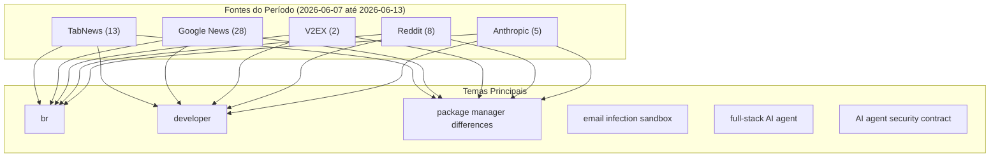


# Destaques da Semana no TabNews

## Destaques
### TabNews
* **AI me tirou uma parte da programação que eu gostava** 💬 41 — Sem conteúdo [link](https://www.tabnews.com.br/danieldia/ai-me-tirou-uma-parte-da-programacao-que-eu-gostava)
* **Eu criei minhas próprias funções da libc do "zero"!** 💬 38 — Sem conteúdo [link](https://www.tabnews.com.br/ciproterona/eu-criei-minhas-proprias-funcoes-da-libc-do-zero)
* **A lista encadeada do kernel Linux e a arte de fazer o impossível em C** 💬 36 — Sem conteúdo [link](https://www.tabnews.com.br/clacerda/a-lista-encadeada-do-kernel-linux-e-a-arte-de-fazer-o-impossivel-em-c)
* **Um único e-mail pode infectar toda a frota de agentes de IA da sua empresa — sem nenhum clique** 💬 26 — Sem conteúdo [link](https://www.tabnews.com.br/EvandroCarvalho/um-unico-e-mail-pode-infectar-toda-a-frota-de-agentes-de-ia-da-sua-empresa-sem-nenhum-clique)
* **Os 5 crawlers de IA que mais bateram nos meus sites em 30 dias - o que os logs revelaram sobre LLMO** 💬 22 — Sem conteúdo [link](https://www.tabnews.com.br/kenimo49/os-5-crawlers-de-ia-que-mais-bateram-nos-meus-sites-em-30-dias-o-que-os-logs-revelaram-sobre-llmo)
* **Como fazer pentest na prática** 💬 16 — Sem conteúdo [link](https://www.tabnews.com.br/Silva97/como-fazer-pentest-na-pratica)
* **Criei um agente de IA open-source que vira "engenheiro full-stack" em qualquer plataforma (ChatGPT, Claude, Copilot, Cursor)** 💬 15 — Sem conteúdo [link](https://www.tabnews.com.br/Ricar66/criei-um-agente-de-ia-open-source-que-vira-engenheiro-full-stack-em-qualquer-plataforma-chatgpt-claude-copilot-cursor)
* **🏗️ CROM lança Wiki - O Caos de Abrir o Servidor para Estranhos - Relato Prático 🛠️ Procura Parceiros Sérios para Codar? Precisa de acesso a IA e VPS ? Venha Entender o Fluxo na Nossa Nova Plataforma** 💬 15 — Sem conteúdo [link](https://www.tabnews.com.br/MrJ/crom-lanca-wiki-o-caos-de-abrir-o-servidor-para-estranhos-relato-pratico-procura-parceiros-serios-para-codar-precisa-de-acesso-a-ia-e-vps-venha-en)
* **Como um deficiente visual hacker usa o computador? Mostrei na prática!** 💬 10 — Sem conteúdo [link](https://www.tabnews.com.br/JuanMathewsRebelloSantos/como-um-deficiente-visual-hacker-usa-o-computador-mostrei-na-pratica)
* **Como criar um emulador de NES - Introdução** 💬 4 — Sem conteúdo [link](https://www.tabnews.com.br/odevzin/como-criar-um-emulador-de-nes-introducao)
* **Dividir para proteger** 💬 4 — Sem conteúdo [link](https://www.tabnews.com.br/Silva97/dividir-para-proteger)
* **Pitch: Criando um Appliance DNS Recursivo Otimizado para ISPs (Rocky Linux + Unbound + Dashboard 3D)** 💬 3 — Sem conteúdo [link](https://www.tabnews.com.br/DevairFernandes/criando-um-appliance-dns-recursivo-otimizado-para-isps-rocky-linux-unbound-dashboard-3d)
* **Coloquei minha frota de agentes de IA sob um veto de segurança binário — aqui está o porquê** 💬 1 — Sem conteúdo [link](https://www.tabnews.com.br/Gonzaga/coloquei-minha-frota-de-agentes-de-ia-sob-um-veto-de-seguranca-binario-aqui-esta-o-porque)

### Reddit
* **Claude pro trial code** 📊 0 — Hi! I’ve been using ChatGPT for a while now and wanted to switch to claude - I’ve been hearing a lot of good things about Claude and want to try it out. Does anyone have a one week trial code they cou [link](https://www.reddit.com/r/ClaudeCode/comments/1u1s19b/claude_pro_trial_code/)
* **[Workflow] Integrate mathlas: A No-LLM MCP Tool for Verifiable Math Reasoning and Self-Augmenting Knowledge in Claude Code** 📊 0 — Integrate mathlas: A No-LLM MCP Tool for Verifiable Math Reasoning and Self-Augmenting Knowledge in Claude Code
 Workflow value: 85/100
 Status: active · Freshness: 70/100 · Confidence: 0.95 · Level:  [link](https://www.reddit.com/r/ClaudeWorkflows/comments/1u1s1zp/workflow_integrate_mathlas_a_nollm_mcp_tool_for/)
* **Anthropic is intentionally nerfing Fable when asked to develop other LLMs** 📊 0 — Reason 458 why local LLMs are going to be a necessity
    submitted by    /u/onil_gova    to    r/LocalLLaMA  
 [link]   [comments] [link](https://www.reddit.com/r/LocalLLaMA/comments/1u1s2oz/anthropic_is_intentionally_nerfing_fable_when/)
* **To anyone who struggles to explain how Hermes differs from Anthropic, OpenAi, Gemini, etc** 📊 0 — "What does walled-garden & black box mean in terms of limitations when using claude, openai, and gemini compared to open source platforms like hermes / openclaw"
 -
 The more I've gotten into AI and u [link](https://www.reddit.com/r/hermesagent/comments/1u1s37a/to_anyone_who_struggles_to_explain_how_hermes/)
* **Claude Fable can reconstruct the more complex VFX with ease...** 📊 0 — This effect is for Electric Bolt. The effect went through more than one permutation and Claude Opus and Codex couldn't seem to be able to figure it out.
 Claude Fable however just determined the pre-r [link](https://www.reddit.com/r/revenantrevisited/comments/1u1s3qt/claude_fable_can_reconstruct_the_more_complex_vfx/)
* **Can I make Claude Code ask me for any project decisions and hyper parameters without deciding it by itself?** 📊 0 — I am getting tired it made a decision and started training and then I realized it made the wrong one 
    submitted by    /u/Striking-Warning9533    to    r/ClaudeAI  
 [link]   [comments] [link](https://www.reddit.com/r/ClaudeAI/comments/1u1s3yr/can_i_make_claude_code_ask_me_for_any_project/)
* **Literally 2 prompts into my Github student account using copilot. Wtf** 📊 0 — submitted by    /u/InternetPopular3679  
 [link]   [comments] [link](https://www.reddit.com/r/GithubCopilot/comments/1u1l1cl/literally_2_prompts_into_my_github_student/)
* **Claude’s New model is Great** 📊 0 — I will share my finding as before the next model release 😁
    submitted by    /u/karmendra_choudhary  
 [link]   [comments] [link](https://www.reddit.com/r/claude/comments/1u1r50i/claudes_new_model_is_great/)

### Google News
* **Linux Apps Without Distro Lock-In? Explore This Lesser Known Snap and Flatpak Alternative - It's FOSS** 📊 0 — Linux Apps Without Distro Lock-In? Explore This Lesser Known Snap and Flatpak Alternative  It's FOSS [link](https://news.google.com/rss/articles/CBMiQ0FVX3lxTE5idU9BekI4SHhoS2ZqUFg2UWZMY0NSMF9XUVJrZi1vMEYwMVdUUjNnVU96TGtYdExoU2RhUC1zTmxkbDA?oc=5)
* **The Ultimate Guide to Linux Default Package Managers - Make Tech Easier** 📊 0 — The Ultimate Guide to Linux Default Package Managers  Make Tech Easier [link](https://news.google.com/rss/articles/CBMic0FVX3lxTE9vckxYVVdNekVod0V4WU1Yem5rbzhYR25lQ09lNS0yZThFanBLMy1tSU9DZnZULWdHam4zNHBMQVJqRUlNbUdfRlR1Zm9oWVRtQndraG41UHM4TGJpR0RIeHp2ZW5lRkFpMGE3S0NGRnZrNjQ?oc=5)
* **Snap vs. Flatpak: How to decide which Linux package manager is right for you - ZDNET** 📊 0 — Snap vs. Flatpak: How to decide which Linux package manager is right for you  ZDNET [link](https://news.google.com/rss/articles/CBMiqAFBVV95cUxNNnJoX2tWd1VVYjVrUmxRcmp5UHY2N1J0Nm9NcjJ3c0M3cjJrUnk5Z19WOVM3LTgyUGNhQ3hlT2FmMThiRlRzZ2F2Y0UyQnYtaWhFZDdRUUgtbjYtX3VRSm9hRTQ5MnpPYTNrUlFjbV90Qm9HREVQU0ZnTzlxVjhOVjBVbXJKTkJSaXBjVXBRYkpvNjFLeVdudm1aaFUyRWY2NWtYWDVseTg?oc=5)
* **pnpm vs npm: 3x Faster Installs? [2026] Winner Revealed - tech-insider.org** 📊 0 — pnpm vs npm: 3x Faster Installs? [2026] Winner Revealed  tech-insider.org [link](https://news.google.com/rss/articles/CBMiVEFVX3lxTFA1MVRqN2k4V1ctbTFYSzk5b0hVNjl0czk5LUtQUkV6Y0NlQVF6SWJ6VUU5bGlaTjE1SS1feDV3OFc3MFlrVEpLOElkME5nOFRaTURWYQ?oc=5)
* **I've tried out every Linux package manager out there, and this is the best one - MakeUseOf** 📊 0 — I've tried out every Linux package manager out there, and this is the best one  MakeUseOf [link](https://news.google.com/rss/articles/CBMiiAFBVV95cUxPcXg4b2xPNFE1TkJyUEd1ZWdpMnRkbUczeFBqWlM0ZmZLMnhQUkpfS1JsRzNqZ2ZJd1V0QzFlZGl0dkNJYXFKNFdEQzh3alk3X3VHd0JJNmxNMFlnd01yV3N0UmZhYk11ZFpIcTlTV0JJS05Pd0EtQ0ctSm0tRDR1VXhiMXNmRHly?oc=5)
* **MintsLoader Malware Analysis: Multi-Stage Loader Used by TAG-124 and SocGholish - Recorded Future** 📊 0 — MintsLoader Malware Analysis: Multi-Stage Loader Used by TAG-124 and SocGholish  Recorded Future [link](https://news.google.com/rss/articles/CBMisgFBVV95cUxNTFZwZ09Jbl9PMUZSTksyTDM1dEV0clctTGkzdnJwYV83eWxjXzA2d2hPNUlVYlEwc1VYMnYybzR5aEc1Sk1VWXVneDFILWZPQTc3SVZCcXlodXVJLTk5Vm9xVzZ0SVJwMEh0ODZOTlpYVkJmcjk1ZFlnYnl5bVFXdFoxMXcyMEVQaEljY2hOZ18wSUcxUUZYbUJ5RmQxbFNPS1RtcWVLYzNDN2EybHNkVjlR?oc=5)
* **Mem3nt0 mori – The Hacking Team is back! - Securelist** 📊 0 — Mem3nt0 mori – The Hacking Team is back!  Securelist [link](https://news.google.com/rss/articles/CBMifEFVX3lxTE8zQy1KNm5WcWJUUkpZeEJ4cWxydm5jZHdSbXVlcjlMM0lWMHljNFRzdVBxX3M5SUxNOTZpVWJVazBrQmdyQUFIY18yN3JLMXBqN3Y2NGhzY2dtQ3Ryb0xYdzM2SWE5Z2ZZQnRXci1aeUxkcG5OUHBBWER5Z1I?oc=5)
* **Phishing Campaign Uses UpCrypter in Fake Voicemail Emails to Deliver RAT Payloads - The Hacker News** 📊 0 — Phishing Campaign Uses UpCrypter in Fake Voicemail Emails to Deliver RAT Payloads  The Hacker News [link](https://news.google.com/rss/articles/CBMif0FVX3lxTE5sRDBYdUQ5OFhuSUV0YjFwOC1nd3V1TThxSmxwMUcwam5jMnRxU2tkNVdNSFR4ZmVrWFotUTVuWDR5TDIwSmlBcEJ3cjVweFJ6dUozd0lRNWw4WXBIYUl2RV8zWVpOcXVqM0k2c2ZwaXFQaDgtc2FjUVZwek56Nzg?oc=5)
* **Russian hackers deploy new malware in phishing campaign targeting Ukraine - The Record from Recorded Future News** 📊 0 — Russian hackers deploy new malware in phishing campaign targeting Ukraine  The Record from Recorded Future News [link](https://news.google.com/rss/articles/CBMiZkFVX3lxTE16VU8tMXBPUkhLZDhvckhwOE55LXp4XzNOa3JyMWpySmFwWDk1TGx4Z2lLOGJJdlpzcDlBQ3FadWl0TnBMcXVnT1lxM094Q2Y1UUF5aFFFZ2NLMFYySjMxRnktUHpOdw?oc=5)
* **APT28’s Stealthy Multi-Stage Campaign Leveraging CVE‑2026‑21509 and Cloud C2 Infrastructure - Trellix** 📊 0 — APT28’s Stealthy Multi-Stage Campaign Leveraging CVE‑2026‑21509 and Cloud C2 Infrastructure  Trellix [link](https://news.google.com/rss/articles/CBMinwFBVV95cUxNOHFIb1EzZFh0NGgzUzViOUwybDZOc0d5SkJqcEhVMlNFVUduNXE3QXBhUGQzam9CYVpNODl5M2NmN1k2Z0lUaGtOSlNVenRIOVRqdVFyUHVBTWRhVV8xSXRFbGN1RjBOU1dxbEw4TTZneDZnd3hnU01ydFF6cWZLV3NwZVNrS2NMZjVNdGxadDhwNXZmajd0LVZkTnFOU1k?oc=5)
* **Finout Launches AI Agent Suite for Enterprise FinOps - Business Wire** 📊 0 — Finout Launches AI Agent Suite for Enterprise FinOps  Business Wire [link](https://news.google.com/rss/articles/CBMirgFBVV95cUxQRExmLWpiX3BMX1BMeFNDdmNPVG1VdXRjV1U2MTRselptOElIMHV3bUZiRHlQck5MMzhCRVpDMFJYM0tZa3lTLURpclB4d0xJc3VnU3VhRFoxXzBrd2JYVlNrYXJleDJEX1pjTmszOUhhVWRTNXp5RWxTOHJWT2tmcDlPSGxUY0xMWVM1cy1jSmJoQU15TEFFNko3UDFvNXNBalBlTWx1VTcwYkdOUnc?oc=5)
* **Fetch.AI unveils full agentic infrastructure with Your Personal AI and Agentverse - Crypto Briefing** 📊 0 — Fetch.AI unveils full agentic infrastructure with Your Personal AI and Agentverse  Crypto Briefing [link](https://news.google.com/rss/articles/CBMiekFVX3lxTE9saFJkcWJfNE51YkZob2hTNTZZbDNha0w1aDIxaFg2eVJuWFpzMDZaZnh3dWg4cHBaUnh3YlJtbEVQcnByUC04emttVUI3MkdheFhjWWNfX0xldzR1Szc2c25Yak92RFhCRFJmX083MWZWQ2ROMkZmb1JR?oc=5)
* **Endava builds AI agent network to automate software delivery - Developer Tech News** 📊 0 — Endava builds AI agent network to automate software delivery  Developer Tech News [link](https://news.google.com/rss/articles/CBMimgFBVV95cUxPYWZ4WjlPWGFBdEEtY2p3NFVhZVdYN0tnWlY2SDdDRXVLLXQ3TXY1U0pKdkFDeW5ycjZKUXVjMEtoRlJtUDlCeUY3NWRMTjc0em1LX2Vac29rYjgwOHFTb2ZTSU81a3JNMmY2ZGg2ZXR1ZFREdkFQc3FkVGFsNExkaVY0ZDJIa01ueUswLUpCam9WVURsYnlZQTN3?oc=5)
* **Huawei’s full stack AI data platform and agent foundry - Blocks & Files** 📊 0 — Huawei’s full stack AI data platform and agent foundry  Blocks & Files [link](https://news.google.com/rss/articles/CBMirgFBVV95cUxPcGZJOEZLYzE3bUgydFlzQ0dfWU5fbkt3VDd4bTZ0SlBnbzNuWWo2NjMzS3Nmbk1nTGZQYk1CR01LWVNZci1FVEFTVHVMZXhPNjhWTmhydkVOSmZtejE1MllXUlVmOWhpdF83OHlnbkdid3Y1dVU0aXJCbmF2b2o1cDZqQmxnT3dhVkVlR1lhNVgyTkZNcV84RmFxNGZGdlZEcE00bnhxeXBUSWpZblE?oc=5)
* **Can AI Agents Boost Ethereum Security? OpenAI and Paradigm Created a Testing Ground - Decrypt** 📊 0 — Can AI Agents Boost Ethereum Security? OpenAI and Paradigm Created a Testing Ground  Decrypt [link](https://news.google.com/rss/articles/CBMijAFBVV95cUxQb2FKUzc4eGE3UWxoMXpja2FPVmN5SUVIN3NVS2JHSDV2ZGN2VmU0RkZNdk1VTDNKa3VJSURwV0I2Um94UERXUHRWd1luMm1hZTN6UmZpSzRJNnRWT243RHFRY0twYnpyNmJxQXVGWkp3bTRZRGRpUGtzMWRiTXVDSzljQjlaSHpOak9DR9IBlAFBVV95cUxQUHdEeWdlNFpDb0EzTXVLdDdxcVJvZnJxdUNoWHhVZktwZHRwLUVJUUhCU1JfUUlJUjMzS2gyanFWR2pTZ2xGQ0JPNDNxd3pNRGUzT0hEUFlHdmx6bF9TNzI4OVNLMDZ5aENESGNTUUNsMnE4cnpHeloybTdXem53MVRUbjhuUXN0V1RSY3JfYTVjWFct?oc=5)
* **Introducing EVMbench - OpenAI** 📊 0 — Introducing EVMbench  OpenAI [link](https://news.google.com/rss/articles/CBMiWkFVX3lxTE05X1djTFRXVlRxNXRZNEpDRDNZNXdQTTRLUG5NaDlTZEdrNFZTZElwVk5mbWw4RUZKZzZCaXUydVE4X3Iwd2VKM0UtR2swUXJlRDBzSmhXZkE2dw?oc=5)
* **Open-source benchmark EVMbench tests how well AI agents handle smart contract exploits - Help Net Security** 📊 0 — Open-source benchmark EVMbench tests how well AI agents handle smart contract exploits  Help Net Security [link](https://news.google.com/rss/articles/CBMijAFBVV95cUxPNHNCc19IRnlBbjc2SHhRZmlIYXlwSF9sWDJ0azVXRnZnaEdXcXpfd242VVo1RGpEOUtOVzh6SHMxLUc3TXh3QWt6YlJHVTlDRXRzZ0tXMmdQYXFYTWo5UmpnYVdYM3pQUWUzOVU3YW1OZHgyM3U3ZEZZMTRjcDd4NVdqUzQzcGw4aHRXWQ?oc=5)
* **SailPoint Unveils Agentic Fabric for AI Agent Security - AI Magazine** 📊 0 — SailPoint Unveils Agentic Fabric for AI Agent Security  AI Magazine [link](https://news.google.com/rss/articles/CBMiigFBVV95cUxPSmNWSzdnbVlzSk90MkNTT0Q4dlRoLWhKQVdDdk9haHY2WG9aSVp4aXNfVEdHN19lekpFbkUyUFA3SGR5SEYwdi1rUHhVQ09lY0xhNVJZMTdKdThkTXhwRm80U0c5LTR5QXJqWF9STVhIV0tacjZEdS1nYTNQX3ZSb2lYT0l1ZHJ4WUE?oc=5)
* **OpenAI and Paradigm partner on AI agent tool for smart contract security - The Block** 📊 0 — OpenAI and Paradigm partner on AI agent tool for smart contract security  The Block [link](https://news.google.com/rss/articles/CBMirAFBVV95cUxNNEhWVWJFS3NibTlPNnIyYnFvT1NoZVVTSjFTejltRUN1RTM1R0VwczEzNWhWeWt2YkswR2NWNF9UVkNHdDl6TER1NFVoM3FpQ252R2RwWnRHdXI3MWhObThFR0I5d1pHV2M5eE5uczNGYlV4UlJoUlFOZXBoa25JY3RXdVc1SWlzX0hMZUYyaFNPaC1Zdk9yN3B1RGtscFMxN3FacDNwMWJIX2st?oc=5)
* **Bitcoin Gains as Iran Demands Crypto for Toll Payment - MarketForces Africa** 📊 0 — Bitcoin Gains as Iran Demands Crypto for Toll Payment  MarketForces Africa [link](https://news.google.com/rss/articles/CBMijAFBVV95cUxNWGRVMG1tUWx4d24xb3pmQmQ0WFplS2NmRjZkNXRWQ214aEp1SlZFX0FVaEVpUERzR1A3YzJwbnVZZDNhcnJHdk56aHUtZWJleEh5RkpPTjJtQTR2eFB2bnFMbnNoZm1rLXVoYVFYeGJ5aWVCWFM1YWF6QVdkVmE1cXRnbVMwbmtndkFBOA?oc=5)
* **FATF Report Highlights Risk of Stablecoins’ Use in Money Laundering and Other Crimes - PYMNTS.com** 📊 0 — FATF Report Highlights Risk of Stablecoins’ Use in Money Laundering and Other Crimes  PYMNTS.com [link](https://news.google.com/rss/articles/CBMiuAFBVV95cUxOX0RNSVR1ejNvQzgzSzRybXhxUG5kdHYzcTN6eHpoYlNvSVZjZkNFTlNIOHptWm9QeUszSmhxdUtnQjEyNFNPWXp5Mm1LWWdDMHJKQXhYWk9xalBVSDg5aHpkeVRzeFpQazRBcW4yMmJjOTZwNGdPczVJSU1XREJ4aGZMMjdxck8tSnhqdzE2bldrYzdQQXRCQ2RoOTJiOXBuRWgzS1lCQ09NdVlMaThnVHRNZzNCelJU?oc=5)
* **USDT News, Price & Analysis - Coinfomania** 📊 0 — USDT News, Price & Analysis  Coinfomania [link](https://news.google.com/rss/articles/CBMiUkFVX3lxTE12MUpBQllZYmlzYWlXdHYwMUtJTFRLZjZ0VTlIM0FVUTFDZmxaZi0xbEx5Y3lFR0tQMTFUWlg1MDBkVDBfZHI4djVyWmhTSGVCNnc?oc=5)
* **China steps up crypto crackdown, will vet real-world asset tokens - Reuters** 📊 0 — China steps up crypto crackdown, will vet real-world asset tokens  Reuters [link](https://news.google.com/rss/articles/CBMipgFBVV95cUxQNkRHN1lXcEJ5clMwVFVzMmExdmpkWTlvVHFPZlRkRXlQVHQ4Nk5uY2t1dW8wdkVWbEdEUHNxWlVlaFhXdThHSTFBR29JTlhLMUM4SXYtZjh0YVBFd2pxTkZ5d2RfT2NKSHJVcjRtbEZueWo5ZkdPc2VOd2hrZElzSDlvRno4Mjl5VDJ2aDZZcnFNZWhtS0J1TTdnMndiX1B6TzhJdzNB?oc=5)
* **FCA releases finalized cryptoasset rules that include several technical traps to watch out for - CoinDesk** 📊 0 — FCA releases finalized cryptoasset rules that include several technical traps to watch out for  CoinDesk [link](https://news.google.com/rss/articles/CBMiygFBVV95cUxNUzktdUVmTVJxU0NTRjh0QV9KNVVvNVdLaFlRbjNvMzByU1BhdFN0Y3MyOTVSN01WOEtoYjcwWTVjVld4UThLVEVQR3VNSktWSk5iTjRTRU82dXlyMGpNUFdOaExma0RLNDBLOGE4UWp6TTNYb3JIdzdoQkN5S3lZSENZRUlZMmdMdG5Ubkx3SnZveTU5dTE1eTFHM3RxYXc1RXZzNWN3Z09PbkpDUlY2VkttTlJlcDBESlFoWmJQSDA0SW9qcE52UlFR?oc=5)
* **New Federated Hermes fund targets reserves backing US payment stablecoins - Stock Titan** 📊 0 — New Federated Hermes fund targets reserves backing US payment stablecoins  Stock Titan [link](https://news.google.com/rss/articles/CBMiugFBVV95cUxPYko4clRBc2ZhUnA4WDdHXzAxTUpSTUVmUXRqUWhHYngwbEF6WE5ocF8ycTBTc0JqbUZSWHBxLS1UX0s2SnNQM3UwdHNHSTRuaWtjYlFmQlZjaXpPSjllSUd5VkFHRS03WXJ2MHFMQTgyZWIxVmRidmstS1pjU01wTURnS25oVWp3X0hMT1N0SFdqRkJYd3NMaDlEb21PTzlvaEI4UlpVcnJZYTNfYjZRS2s0dkpmZlh4MEE?oc=5)
* **What banks need to know about GENIUS Act stablecoin compliance - Elliptic** 📊 0 — What banks need to know about GENIUS Act stablecoin compliance  Elliptic [link](https://news.google.com/rss/articles/CBMie0FVX3lxTE1WUFdJdUgyLUhLQXBka3RZLWVFMWN1Y0o4Y2R0elY2MXBuakFJcDBRbkxpNGpiRnprMURSWFRac1NvMWdnQlRlcHVlM3hEQjY2Ujg0WVk2V0liczFUQjlwMmhQdGpRdlVKaktTX1h3Q0ROeUN1WlNpRzVkSQ?oc=5)
* **FDIC Issues Proposal on Illicit Finance Standards Under GENIUS Act - fintechanddigitalassets.com** 📊 0 — FDIC Issues Proposal on Illicit Finance Standards Under GENIUS Act  fintechanddigitalassets.com [link](https://news.google.com/rss/articles/CBMitgFBVV95cUxPbC13SDdzU1pRNzlsZzc0VkptM1p1VGpraHlUTEFSQnYxVkdqbV9KVl9faVJJTUcyRDg0NW50enJpZHUyNWtTOEhNdDI1Sk5jUUg1aW1ENm8yRHdYbnM5b0JvOFJZZnNzVDc3aHBFNHNmeThUMmd3NW42X0NnYjlEcXlnekdhNGhxOFU1clh3SzlFNmdERHhlMUhzNE5VVzZqb1N1SFVrUW1jSmZnZ1ZoUHJMU2xEQQ?oc=5)
* **FDIC proposes BSA/AML and sanctions compliance standards for stablecoin issuers under the GENIUS Act - JD Supra** 📊 0 — FDIC proposes BSA/AML and sanctions compliance standards for stablecoin issuers under the GENIUS Act  JD Supra [link](https://news.google.com/rss/articles/CBMihAFBVV95cUxOSFRvREhfNGpCcG1vQkFjdldDd2s3V3JWYWhoSWdxYlN5cEp4S0FmUGhmaTF3SFBwUVQydnBTa05xMkFEQVZSeloxSWpmaVdmZ0FuSDJrT2hqT3VtdDJVMExZQ185cjN1YXhyYk5RQVRxbFRQc2VKZ3lVWjVnWTlmb2VqSlQ?oc=5)

## 📊 Métricas do Período (2026-06-07 até 2026-06-13)

- **Total de fontes**: 56
- **Por tipo**: TabNews: 13 | Google News: 28 | V2EX: 2 | Reddit: 8 | Anthropic: 5
- **Top engagement**: **AI** (41) | **Eu** (38) | **A** (36)
- **Temas únicos**: 15 categorias

## Tendências

Nos últimos dias vemos convergência entre duas frentes: a explosão de agentes de IA “full‑stack” e o aumento de riscos associados a eles. Publicações como os posts do TabNews sobre agentes open‑source que se comportam como engenheiros full‑stack, junto aos anúncios da Finout, Fetch.AI, Endava, Huawei e do benchmark EVMbench mostram que empresas e desenvolvedores estão formalizando pipelines automatizados, desde infraestrutura “as‑code” até auditoria de smart contracts. Paralelamente, notícias de segurança (muitos relatórios de campanhas de phishing, malware multi‑stage e a campanha da APT28 usando CVE‑2026‑21509) apontam que esses mesmos agentes são agora vetores de ataque: um único e‑mail pode infectar toda a frota de IAs corporativas, e projetos como o “veto binário” demonstram a necessidade de harden‑ing.

Enquanto isso, a comunidade técnica continua valorizando o controle e a performance em camadas mais baixas. Artigos do TabNews sobre implementação de funções libc do zero, listas encadeadas no kernel Linux e criação de emuladores de NES reforçam o interesse por cores de código puro e por entender os limites do C. Esse movimento se reflete nos comparativos de gerenciadores de pacotes — snap, flatpak, pnpm vs npm — onde a busca por independência de distro, rapidez nas instalações e menor overhead domina o debate. Em síntese, a tendência é um ecossistema cada vez mais automatizado por IA, mas que exige reforço em segurança e em habilidades de baixo nível para garantir controle, performance e resiliência.

## Fontes e Referências

1. [AI me tirou uma parte da programação que eu gostava](https://www.tabnews.com.br/danieldia/ai-me-tirou-uma-parte-da-programacao-que-eu-gostava) — TabNews
2. [Eu criei minhas próprias funções da libc do "zero"!](https://www.tabnews.com.br/ciproterona/eu-criei-minhas-proprias-funcoes-da-libc-do-zero) — TabNews
3. [A lista encadeada do kernel Linux e a arte de fazer o impossível em C](https://www.tabnews.com.br/clacerda/a-lista-encadeada-do-kernel-linux-e-a-arte-de-fazer-o-impossivel-em-c) — TabNews
4. [Um único e-mail pode infectar toda a frota de agentes de IA da sua empresa — sem nenhum clique](https://www.tabnews.com.br/EvandroCarvalho/um-unico-e-mail-pode-infectar-toda-a-frota-de-agentes-de-ia-da-sua-empresa-sem-nenhum-clique) — TabNews
5. [Os 5 crawlers de IA que mais bateram nos meus sites em 30 dias - o que os logs revelaram sobre LLMO](https://www.tabnews.com.br/kenimo49/os-5-crawlers-de-ia-que-mais-bateram-nos-meus-sites-em-30-dias-o-que-os-logs-revelaram-sobre-llmo) — TabNews
6. [Como fazer pentest na prática](https://www.tabnews.com.br/Silva97/como-fazer-pentest-na-pratica) — TabNews
7. [Criei um agente de IA open-source que vira "engenheiro full-stack" em qualquer plataforma (ChatGPT, Claude, Copilot, Cursor)](https://www.tabnews.com.br/Ricar66/criei-um-agente-de-ia-open-source-que-vira-engenheiro-full-stack-em-qualquer-plataforma-chatgpt-claude-copilot-cursor) — TabNews
8. [🏗️ CROM lança Wiki - O Caos de Abrir o Servidor para Estranhos - Relato Prático 🛠️ Procura Parceiros Sérios para Codar? Precisa de acesso a IA e VPS ? Venha Entender o Fluxo na Nossa Nova Plataforma](https://www.tabnews.com.br/MrJ/crom-lanca-wiki-o-caos-de-abrir-o-servidor-para-estranhos-relato-pratico-procura-parceiros-serios-para-codar-precisa-de-acesso-a-ia-e-vps-venha-en) — TabNews
9. [Como um deficiente visual hacker usa o computador? Mostrei na prática!](https://www.tabnews.com.br/JuanMathewsRebelloSantos/como-um-deficiente-visual-hacker-usa-o-computador-mostrei-na-pratica) — TabNews
10. [Como criar um emulador de NES - Introdução](https://www.tabnews.com.br/odevzin/como-criar-um-emulador-de-nes-introducao) — TabNews
11. [Dividir para proteger](https://www.tabnews.com.br/Silva97/dividir-para-proteger) — TabNews
12. [Pitch: Criando um Appliance DNS Recursivo Otimizado para ISPs (Rocky Linux + Unbound + Dashboard 3D)](https://www.tabnews.com.br/DevairFernandes/criando-um-appliance-dns-recursivo-otimizado-para-isps-rocky-linux-unbound-dashboard-3d) — TabNews
13. [Coloquei minha frota de agentes de IA sob um veto de segurança binário — aqui está o porquê](https://www.tabnews.com.br/Gonzaga/coloquei-minha-frota-de-agentes-de-ia-sob-um-veto-de-seguranca-binario-aqui-esta-o-porque) — TabNews
14. [Linux Apps Without Distro Lock-In? Explore This Lesser Known Snap and Flatpak Alternative - It's FOSS](https://news.google.com/rss/articles/CBMiQ0FVX3lxTE5idU9BekI4SHhoS2ZqUFg2UWZMY0NSMF9XUVJrZi1vMEYwMVdUUjNnVU96TGtYdExoU2RhUC1zTmxkbDA?oc=5) — Google News (package manager differences)
15. [The Ultimate Guide to Linux Default Package Managers - Make Tech Easier](https://news.google.com/rss/articles/CBMic0FVX3lxTE9vckxYVVdNekVod0V4WU1Yem5rbzhYR25lQ09lNS0yZThFanBLMy1tSU9DZnZULWdHam4zNHBMQVJqRUlNbUdfRlR1Zm9oWVRtQndraG41UHM4TGJpR0RIeHp2ZW5lRkFpMGE3S0NGRnZrNjQ?oc=5) — Google News (package manager differences)
16. [Snap vs. Flatpak: How to decide which Linux package manager is right for you - ZDNET](https://news.google.com/rss/articles/CBMiqAFBVV95cUxNNnJoX2tWd1VVYjVrUmxRcmp5UHY2N1J0Nm9NcjJ3c0M3cjJrUnk5Z19WOVM3LTgyUGNhQ3hlT2FmMThiRlRzZ2F2Y0UyQnYtaWhFZDdRUUgtbjYtX3VRSm9hRTQ5MnpPYTNrUlFjbV90Qm9HREVQU0ZnTzlxVjhOVjBVbXJKTkJSaXBjVXBRYkpvNjFLeVdudm1aaFUyRWY2NWtYWDVseTg?oc=5) — Google News (package manager differences)
17. [pnpm vs npm: 3x Faster Installs? [2026] Winner Revealed - tech-insider.org](https://news.google.com/rss/articles/CBMiVEFVX3lxTFA1MVRqN2k4V1ctbTFYSzk5b0hVNjl0czk5LUtQUkV6Y0NlQVF6SWJ6VUU5bGlaTjE1SS1feDV3OFc3MFlrVEpLOElkME5nOFRaTURWYQ?oc=5) — Google News (package manager differences)
18. [I've tried out every Linux package manager out there, and this is the best one - MakeUseOf](https://news.google.com/rss/articles/CBMiiAFBVV95cUxPcXg4b2xPNFE1TkJyUEd1ZWdpMnRkbUczeFBqWlM0ZmZLMnhQUkpfS1JsRzNqZ2ZJd1V0QzFlZGl0dkNJYXFKNFdEQzh3alk3X3VHd0JJNmxNMFlnd01yV3N0UmZhYk11ZFpIcTlTV0JJS05Pd0EtQ0ctSm0tRDR1VXhiMXNmRHly?oc=5) — Google News (package manager differences)
19. [MintsLoader Malware Analysis: Multi-Stage Loader Used by TAG-124 and SocGholish - Recorded Future](https://news.google.com/rss/articles/CBMisgFBVV95cUxNTFZwZ09Jbl9PMUZSTksyTDM1dEV0clctTGkzdnJwYV83eWxjXzA2d2hPNUlVYlEwc1VYMnYybzR5aEc1Sk1VWXVneDFILWZPQTc3SVZCcXlodXVJLTk5Vm9xVzZ0SVJwMEh0ODZOTlpYVkJmcjk1ZFlnYnl5bVFXdFoxMXcyMEVQaEljY2hOZ18wSUcxUUZYbUJ5RmQxbFNPS1RtcWVLYzNDN2EybHNkVjlR?oc=5) — Google News (email infection sandbox)
20. [Mem3nt0 mori – The Hacking Team is back! - Securelist](https://news.google.com/rss/articles/CBMifEFVX3lxTE8zQy1KNm5WcWJUUkpZeEJ4cWxydm5jZHdSbXVlcjlMM0lWMHljNFRzdVBxX3M5SUxNOTZpVWJVazBrQmdyQUFIY18yN3JLMXBqN3Y2NGhzY2dtQ3Ryb0xYdzM2SWE5Z2ZZQnRXci1aeUxkcG5OUHBBWER5Z1I?oc=5) — Google News (email infection sandbox)
21. [Phishing Campaign Uses UpCrypter in Fake Voicemail Emails to Deliver RAT Payloads - The Hacker News](https://news.google.com/rss/articles/CBMif0FVX3lxTE5sRDBYdUQ5OFhuSUV0YjFwOC1nd3V1TThxSmxwMUcwam5jMnRxU2tkNVdNSFR4ZmVrWFotUTVuWDR5TDIwSmlBcEJ3cjVweFJ6dUozd0lRNWw4WXBIYUl2RV8zWVpOcXVqM0k2c2ZwaXFQaDgtc2FjUVZwek56Nzg?oc=5) — Google News (email infection sandbox)
22. [Russian hackers deploy new malware in phishing campaign targeting Ukraine - The Record from Recorded Future News](https://news.google.com/rss/articles/CBMiZkFVX3lxTE16VU8tMXBPUkhLZDhvckhwOE55LXp4XzNOa3JyMWpySmFwWDk1TGx4Z2lLOGJJdlpzcDlBQ3FadWl0TnBMcXVnT1lxM094Q2Y1UUF5aFFFZ2NLMFYySjMxRnktUHpOdw?oc=5) — Google News (email infection sandbox)
23. [APT28’s Stealthy Multi-Stage Campaign Leveraging CVE‑2026‑21509 and Cloud C2 Infrastructure - Trellix](https://news.google.com/rss/articles/CBMinwFBVV95cUxNOHFIb1EzZFh0NGgzUzViOUwybDZOc0d5SkJqcEhVMlNFVUduNXE3QXBhUGQzam9CYVpNODl5M2NmN1k2Z0lUaGtOSlNVenRIOVRqdVFyUHVBTWRhVV8xSXRFbGN1RjBOU1dxbEw4TTZneDZnd3hnU01ydFF6cWZLV3NwZVNrS2NMZjVNdGxadDhwNXZmajd0LVZkTnFOU1k?oc=5) — Google News (email infection sandbox)
24. [Finout Launches AI Agent Suite for Enterprise FinOps - Business Wire](https://news.google.com/rss/articles/CBMirgFBVV95cUxQRExmLWpiX3BMX1BMeFNDdmNPVG1VdXRjV1U2MTRselptOElIMHV3bUZiRHlQck5MMzhCRVpDMFJYM0tZa3lTLURpclB4d0xJc3VnU3VhRFoxXzBrd2JYVlNrYXJleDJEX1pjTmszOUhhVWRTNXp5RWxTOHJWT2tmcDlPSGxUY0xMWVM1cy1jSmJoQU15TEFFNko3UDFvNXNBalBlTWx1VTcwYkdOUnc?oc=5) — Google News (full‑stack AI agent)
25. [Fetch.AI unveils full agentic infrastructure with Your Personal AI and Agentverse - Crypto Briefing](https://news.google.com/rss/articles/CBMiekFVX3lxTE9saFJkcWJfNE51YkZob2hTNTZZbDNha0w1aDIxaFg2eVJuWFpzMDZaZnh3dWg4cHBaUnh3YlJtbEVQcnByUC04emttVUI3MkdheFhjWWNfX0xldzR1Szc2c25Yak92RFhCRFJmX083MWZWQ2ROMkZmb1JR?oc=5) — Google News (full‑stack AI agent)
26. [Endava builds AI agent network to automate software delivery - Developer Tech News](https://news.google.com/rss/articles/CBMimgFBVV95cUxPYWZ4WjlPWGFBdEEtY2p3NFVhZVdYN0tnWlY2SDdDRXVLLXQ3TXY1U0pKdkFDeW5ycjZKUXVjMEtoRlJtUDlCeUY3NWRMTjc0em1LX2Vac29rYjgwOHFTb2ZTSU81a3JNMmY2ZGg2ZXR1ZFREdkFQc3FkVGFsNExkaVY0ZDJIa01ueUswLUpCam9WVURsYnlZQTN3?oc=5) — Google News (full‑stack AI agent)
27. [Huawei’s full stack AI data platform and agent foundry - Blocks & Files](https://news.google.com/rss/articles/CBMirgFBVV95cUxPcGZJOEZLYzE3bUgydFlzQ0dfWU5fbkt3VDd4bTZ0SlBnbzNuWWo2NjMzS3Nmbk1nTGZQYk1CR01LWVNZci1FVEFTVHVMZXhPNjhWTmhydkVOSmZtejE1MllXUlVmOWhpdF83OHlnbkdid3Y1dVU0aXJCbmF2b2o1cDZqQmxnT3dhVkVlR1lhNVgyTkZNcV84RmFxNGZGdlZEcE00bnhxeXBUSWpZblE?oc=5) — Google News (full‑stack AI agent)
28. [Can AI Agents Boost Ethereum Security? OpenAI and Paradigm Created a Testing Ground - Decrypt](https://news.google.com/rss/articles/CBMijAFBVV95cUxQb2FKUzc4eGE3UWxoMXpja2FPVmN5SUVIN3NVS2JHSDV2ZGN2VmU0RkZNdk1VTDNKa3VJSURwV0I2Um94UERXUHRWd1luMm1hZTN6UmZpSzRJNnRWT243RHFRY0twYnpyNmJxQXVGWkp3bTRZRGRpUGtzMWRiTXVDSzljQjlaSHpOak9DR9IBlAFBVV95cUxQUHdEeWdlNFpDb0EzTXVLdDdxcVJvZnJxdUNoWHhVZktwZHRwLUVJUUhCU1JfUUlJUjMzS2gyanFWR2pTZ2xGQ0JPNDNxd3pNRGUzT0hEUFlHdmx6bF9TNzI4OVNLMDZ5aENESGNTUUNsMnE4cnpHeloybTdXem53MVRUbjhuUXN0V1RSY3JfYTVjWFct?oc=5) — Google News (AI agent security contract)
29. [Introducing EVMbench - OpenAI](https://news.google.com/rss/articles/CBMiWkFVX3lxTE05X1djTFRXVlRxNXRZNEpDRDNZNXdQTTRLUG5NaDlTZEdrNFZTZElwVk5mbWw4RUZKZzZCaXUydVE4X3Iwd2VKM0UtR2swUXJlRDBzSmhXZkE2dw?oc=5) — Google News (AI agent security contract)
30. [Open-source benchmark EVMbench tests how well AI agents handle smart contract exploits - Help Net Security](https://news.google.com/rss/articles/CBMijAFBVV95cUxPNHNCc19IRnlBbjc2SHhRZmlIYXlwSF9sWDJ0azVXRnZnaEdXcXpfd242VVo1RGpEOUtOVzh6SHMxLUc3TXh3QWt6YlJHVTlDRXRzZ0tXMmdQYXFYTWo5UmpnYVdYM3pQUWUzOVU3YW1OZHgyM3U3ZEZZMTRjcDd4NVdqUzQzcGw4aHRXWQ?oc=5) — Google News (AI agent security contract)
31. [SailPoint Unveils Agentic Fabric for AI Agent Security - AI Magazine](https://news.google.com/rss/articles/CBMiigFBVV95cUxPSmNWSzdnbVlzSk90MkNTT0Q4dlRoLWhKQVdDdk9haHY2WG9aSVp4aXNfVEdHN19lekpFbkUyUFA3SGR5SEYwdi1rUHhVQ09lY0xhNVJZMTdKdThkTXhwRm80U0c5LTR5QXJqWF9STVhIV0tacjZEdS1nYTNQX3ZSb2lYT0l1ZHJ4WUE?oc=5) — Google News (AI agent security contract)
32. [OpenAI and Paradigm partner on AI agent tool for smart contract security - The Block](https://news.google.com/rss/articles/CBMirAFBVV95cUxNNEhWVWJFS3NibTlPNnIyYnFvT1NoZVVTSjFTejltRUN1RTM1R0VwczEzNWhWeWt2YkswR2NWNF9UVkNHdDl6TER1NFVoM3FpQ252R2RwWnRHdXI3MWhObThFR0I5d1pHV2M5eE5uczNGYlV4UlJoUlFOZXBoa25JY3RXdVc1SWlzX0hMZUYyaFNPaC1Zdk9yN3B1RGtscFMxN3FacDNwMWJIX2st?oc=5) — Google News (AI agent security contract)
33. [Bitcoin Gains as Iran Demands Crypto for Toll Payment - MarketForces Africa](https://news.google.com/rss/articles/CBMijAFBVV95cUxNWGRVMG1tUWx4d24xb3pmQmQ0WFplS2NmRjZkNXRWQ214aEp1SlZFX0FVaEVpUERzR1A3YzJwbnVZZDNhcnJHdk56aHUtZWJleEh5RkpPTjJtQTR2eFB2bnFMbnNoZm1rLXVoYVFYeGJ5aWVCWFM1YWF6QVdkVmE1cXRnbVMwbmtndkFBOA?oc=5) — Google News (stablecoin regulation guard)
34. [FATF Report Highlights Risk of Stablecoins’ Use in Money Laundering and Other Crimes - PYMNTS.com](https://news.google.com/rss/articles/CBMiuAFBVV95cUxOX0RNSVR1ejNvQzgzSzRybXhxUG5kdHYzcTN6eHpoYlNvSVZjZkNFTlNIOHptWm9QeUszSmhxdUtnQjEyNFNPWXp5Mm1LWWdDMHJKQXhYWk9xalBVSDg5aHpkeVRzeFpQazRBcW4yMmJjOTZwNGdPczVJSU1XREJ4aGZMMjdxck8tSnhqdzE2bldrYzdQQXRCQ2RoOTJiOXBuRWgzS1lCQ09NdVlMaThnVHRNZzNCelJU?oc=5) — Google News (stablecoin regulation guard)
35. [USDT News, Price & Analysis - Coinfomania](https://news.google.com/rss/articles/CBMiUkFVX3lxTE12MUpBQllZYmlzYWlXdHYwMUtJTFRLZjZ0VTlIM0FVUTFDZmxaZi0xbEx5Y3lFR0tQMTFUWlg1MDBkVDBfZHI4djVyWmhTSGVCNnc?oc=5) — Google News (stablecoin regulation guard)
36. [China steps up crypto crackdown, will vet real-world asset tokens - Reuters](https://news.google.com/rss/articles/CBMipgFBVV95cUxQNkRHN1lXcEJ5clMwVFVzMmExdmpkWTlvVHFPZlRkRXlQVHQ4Nk5uY2t1dW8wdkVWbEdEUHNxWlVlaFhXdThHSTFBR29JTlhLMUM4SXYtZjh0YVBFd2pxTkZ5d2RfT2NKSHJVcjRtbEZueWo5ZkdPc2VOd2hrZElzSDlvRno4Mjl5VDJ2aDZZcnFNZWhtS0J1TTdnMndiX1B6TzhJdzNB?oc=5) — Google News (stablecoin regulation guard)
37. [FCA releases finalized cryptoasset rules that include several technical traps to watch out for - CoinDesk](https://news.google.com/rss/articles/CBMiygFBVV95cUxNUzktdUVmTVJxU0NTRjh0QV9KNVVvNVdLaFlRbjNvMzByU1BhdFN0Y3MyOTVSN01WOEtoYjcwWTVjVld4UThLVEVQR3VNSktWSk5iTjRTRU82dXlyMGpNUFdOaExma0RLNDBLOGE4UWp6TTNYb3JIdzdoQkN5S3lZSENZRUlZMmdMdG5Ubkx3SnZveTU5dTE1eTFHM3RxYXc1RXZzNWN3Z09PbkpDUlY2VkttTlJlcDBESlFoWmJQSDA0SW9qcE52UlFR?oc=5) — Google News (stablecoin regulation guard)
38. [New Federated Hermes fund targets reserves backing US payment stablecoins - Stock Titan](https://news.google.com/rss/articles/CBMiugFBVV95cUxPYko4clRBc2ZhUnA4WDdHXzAxTUpSTUVmUXRqUWhHYngwbEF6WE5ocF8ycTBTc0JqbUZSWHBxLS1UX0s2SnNQM3UwdHNHSTRuaWtjYlFmQlZjaXpPSjllSUd5VkFHRS03WXJ2MHFMQTgyZWIxVmRidmstS1pjU01wTURnS25oVWp3X0hMT1N0SFdqRkJYd3NMaDlEb21PTzlvaEI4UlpVcnJZYTNfYjZRS2s0dkpmZlh4MEE?oc=5) — Google News (GENIUS Act compliance)
39. [What banks need to know about GENIUS Act stablecoin compliance - Elliptic](https://news.google.com/rss/articles/CBMie0FVX3lxTE1WUFdJdUgyLUhLQXBka3RZLWVFMWN1Y0o4Y2R0elY2MXBuakFJcDBRbkxpNGpiRnprMURSWFRac1NvMWdnQlRlcHVlM3hEQjY2Ujg0WVk2V0liczFUQjlwMmhQdGpRdlVKaktTX1h3Q0ROeUN1WlNpRzVkSQ?oc=5) — Google News (GENIUS Act compliance)
40. [FDIC Issues Proposal on Illicit Finance Standards Under GENIUS Act - fintechanddigitalassets.com](https://news.google.com/rss/articles/CBMitgFBVV95cUxPbC13SDdzU1pRNzlsZzc0VkptM1p1VGpraHlUTEFSQnYxVkdqbV9KVl9faVJJTUcyRDg0NW50enJpZHUyNWtTOEhNdDI1Sk5jUUg1aW1ENm8yRHdYbnM5b0JvOFJZZnNzVDc3aHBFNHNmeThUMmd3NW42X0NnYjlEcXlnekdhNGhxOFU1clh3SzlFNmdERHhlMUhzNE5VVzZqb1N1SFVrUW1jSmZnZ1ZoUHJMU2xEQQ?oc=5) — Google News (GENIUS Act compliance)
41. [FDIC proposes BSA/AML and sanctions compliance standards for stablecoin issuers under the GENIUS Act - JD Supra](https://news.google.com/rss/articles/CBMihAFBVV95cUxOSFRvREhfNGpCcG1vQkFjdldDd2s3V3JWYWhoSWdxYlN5cEp4S0FmUGhmaTF3SFBwUVQydnBTa05xMkFEQVZSeloxSWpmaVdmZ0FuSDJrT2hqT3VtdDJVMExZQ185cjN1YXhyYk5RQVRxbFRQc2VKZ3lVWjVnWTlmb2VqSlQ?oc=5) — Google News (GENIUS Act compliance)
42. [没办法, 打算买个 200 刀的 chatgpt, 征求开团, 最多 3 个人](https://www.v2ex.com/t/1219338#reply0) — V2EX Tech
43. [不懂就问-AI 开发](https://www.v2ex.com/t/1219306#reply16) — V2EX Tech
44. [Claude pro trial code](https://www.reddit.com/r/ClaudeCode/comments/1u1s19b/claude_pro_trial_code/) — Reddit Search: claude code
45. [[Workflow] Integrate mathlas: A No-LLM MCP Tool for Verifiable Math Reasoning and Self-Augmenting Knowledge in Claude Code](https://www.reddit.com/r/ClaudeWorkflows/comments/1u1s1zp/workflow_integrate_mathlas_a_nollm_mcp_tool_for/) — Reddit Search: claude code
46. [Anthropic is intentionally nerfing Fable when asked to develop other LLMs](https://www.reddit.com/r/LocalLLaMA/comments/1u1s2oz/anthropic_is_intentionally_nerfing_fable_when/) — Reddit Search: claude code
47. [To anyone who struggles to explain how Hermes differs from Anthropic, OpenAi, Gemini, etc](https://www.reddit.com/r/hermesagent/comments/1u1s37a/to_anyone_who_struggles_to_explain_how_hermes/) — Reddit Search: claude code
48. [Claude Fable can reconstruct the more complex VFX with ease...](https://www.reddit.com/r/revenantrevisited/comments/1u1s3qt/claude_fable_can_reconstruct_the_more_complex_vfx/) — Reddit Search: claude code
49. [Can I make Claude Code ask me for any project decisions and hyper parameters without deciding it by itself?](https://www.reddit.com/r/ClaudeAI/comments/1u1s3yr/can_i_make_claude_code_ask_me_for_any_project/) — Reddit Search: claude code
50. [Literally 2 prompts into my Github student account using copilot. Wtf](https://www.reddit.com/r/GithubCopilot/comments/1u1l1cl/literally_2_prompts_into_my_github_student/) — Reddit: GithubCopilot
51. [Claude’s New model is Great](https://www.reddit.com/r/claude/comments/1u1r50i/claudes_new_model_is_great/) — Reddit: Claude
52. [Widening the conversation on frontier AI](https://www.anthropic.com/news/widening-conversation-ai) — Anthropic News
53. [Anthropic co-founder Chris Olah's remarks on Pope Leo XIV's encyclical "Magnifica humanitas"](https://www.anthropic.com/news/chris-olah-pope-leo-encyclical) — Anthropic News
54. [Introducing Claude Opus 4.8](https://www.anthropic.com/news/claude-opus-4-8) — Anthropic News
55. [Expanding Project Glasswing](https://www.anthropic.com/news/expanding-project-glasswing) — Anthropic News
56. [Claude Fable 5 and Claude Mythos 5](https://www.anthropic.com/news/claude-fable-5-mythos-5) — Anthropic News

---

*Gerado por: cloud/gpt-oss-120b*


---
*Gerado por evo-agent - agente auto-aprimorante em 2026-06-10.*
