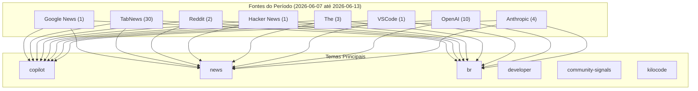


# Notícias de Tecnologia

## Destaques
### Hacker News
* **Get paid to do you own ML research (Cat's grant)** 🔺 10 — Get paid to do you own ML research (Cat's grant) | ⬆ 6 points | 💬 2 comments | by notacat [link](https://news.ycombinator.com/item?id=40346716)

### TabNews
* **Pitch: Como estruturamos um SaaS  no Edge para custar quase R$ 0 de infra no lançamento** 💬 63 — Sem conteúdo [link](https://www.tabnews.com.br/Dorvo/como-estruturamos-um-saas-no-edge-para-custar-quase-r-0-de-infra-no-lancamento)
* **AI me tirou uma parte da programação que eu gostava** 💬 38 — Sem conteúdo [link](https://www.tabnews.com.br/danieldia/ai-me-tirou-uma-parte-da-programacao-que-eu-gostava)
* **Eu criei minhas próprias funções da libc do "zero"!** 💬 38 — Sem conteúdo [link](https://www.tabnews.com.br/ciproterona/eu-criei-minhas-proprias-funcoes-da-libc-do-zero)
* **OmniVoice é o ElevenLabs Opensource** 💬 37 — Sem conteúdo [link](https://www.tabnews.com.br/peterson047/voce-nao-precisa-mais-do-eleven-labs)
* **Como usei IA para criar uma Central da Copa 2026, e por que isso não foi “só pedir para a IA fazer”** 💬 37 — Sem conteúdo [link](https://www.tabnews.com.br/lucassdr/como-usei-ia-para-criar-uma-central-da-copa-2026-e-por-que-isso-nao-foi-so-pedir-para-a-ia-fazer)
* **A lista encadeada do kernel Linux e a arte de fazer o impossível em C** 💬 32 — Sem conteúdo [link](https://www.tabnews.com.br/clacerda/a-lista-encadeada-do-kernel-linux-e-a-arte-de-fazer-o-impossivel-em-c)
* **Homelab - O artigo que eu gostaria de ter lido** 💬 30 — Sem conteúdo [link](https://www.tabnews.com.br/matheusvellone/homelab-passos-iniciais)
* **4 meses do meu ERP/SaaS em produção: O mercado me empurrou pra onde eu não esperava** 💬 21 — Sem conteúdo [link](https://www.tabnews.com.br/AndersonBuntoSistemas/4-meses-do-meu-erp-saas-em-producao-o-mercado-me-empurrou-pra-onde-eu-nao-esperava)
* **Se você é dev, você já deveria estar utilizando um gerenciador de senhas** 💬 20 — Sem conteúdo [link](https://www.tabnews.com.br/rutkowskigustavo/se-voce-e-dev-voce-ja-deveria-estar-utilizando-um-gerenciador-de-senhas)
* **[Segurança] Aviso de segurança para galera do VSCode + Remote - SSH** 💬 20 — Sem conteúdo [link](https://www.tabnews.com.br/viewer/seguranca-aviso-de-seguranca-para-galera-do-vscode-remote-ssh)
* **Os 5 crawlers de IA que mais bateram nos meus sites em 30 dias - o que os logs revelaram sobre LLMO** 💬 18 — Sem conteúdo [link](https://www.tabnews.com.br/kenimo49/os-5-crawlers-de-ia-que-mais-bateram-nos-meus-sites-em-30-dias-o-que-os-logs-revelaram-sobre-llmo)
* **AI-SD: A Nova Era do Desenvolvimento de Software** 💬 17 — Sem conteúdo [link](https://www.tabnews.com.br/odevpensador/ai-sd-a-nova-era-do-desenvolvimento-de-software)
* **Como fazer pentest na prática** 💬 16 — Sem conteúdo [link](https://www.tabnews.com.br/Silva97/como-fazer-pentest-na-pratica)
* **[CLAUDE.MD] Template de 12 regras para IA não quebrar seu código (sim, mais um...)** 💬 15 — Sem conteúdo [link](https://www.tabnews.com.br/Oletros/claude-md-template-de-12-regras-para-ia-nao-quebrar-seu-codigo-sim-mais-um)
* **🏗️ CROM lança Wiki - O Caos de Abrir o Servidor para Estranhos - Relato Prático 🛠️ Procura Parceiros Sérios para Codar? Precisa de acesso a IA e VPS ? Venha Entender o Fluxo na Nossa Nova Plataforma** 💬 15 — Sem conteúdo [link](https://www.tabnews.com.br/MrJ/crom-lanca-wiki-o-caos-de-abrir-o-servidor-para-estranhos-relato-pratico-procura-parceiros-serios-para-codar-precisa-de-acesso-a-ia-e-vps-venha-en)
* **Clube do Livro: Designing Data Intensive Applications** 💬 14 — Sem conteúdo [link](https://www.tabnews.com.br/willybr/clube-do-livro-designing-data-intensive-applications)
* **Como reduzir custo de IA** 💬 13 — Sem conteúdo [link](https://www.tabnews.com.br/maoliofc/como-reduzir-custo-de-ia-em-producao-sem-perder-controle)
* **Criei um agente de IA open-source que vira "engenheiro full-stack" em qualquer plataforma (ChatGPT, Claude, Copilot, Cursor)** 💬 13 — Sem conteúdo [link](https://www.tabnews.com.br/Ricar66/criei-um-agente-de-ia-open-source-que-vira-engenheiro-full-stack-em-qualquer-plataforma-chatgpt-claude-copilot-cursor)
* **WSL - Onde estão os arquivos?** 💬 11 — Sem conteúdo [link](https://www.tabnews.com.br/AnselmoBD/wsl-onde-estao-os-arquivos)
* **Colab PDF Reader & Translator  | Projeto Open Source** 💬 9 — Sem conteúdo [link](https://www.tabnews.com.br/rodrigocoa/colab-pdf-reader-e-translator-projeto-open-source)
* **Como um deficiente visual hacker usa o computador? Mostrei na prática!** 💬 9 — Sem conteúdo [link](https://www.tabnews.com.br/JuanMathewsRebelloSantos/como-um-deficiente-visual-hacker-usa-o-computador-mostrei-na-pratica)
* **NPM, PNPM, Yarn e Bun: qual a diferença afinal?** 💬 6 — Sem conteúdo [link](https://www.tabnews.com.br/codevjuan/npm-pnpm-yarn-e-bun-qual-a-diferenca-afinal)
* **Agente de código precisa de contrato de trabalho, não de mais prompt** 💬 5 — Sem conteúdo [link](https://www.tabnews.com.br/Centelha/agente-de-codigo-precisa-de-contrato-de-trabalho-nao-de-mais-prompt)
* **Claude Chat me fez perder tempo e eu tive que corrigir até a lista de erros dele** 💬 3 — Sem conteúdo [link](https://www.tabnews.com.br/danieldia/claude-chat-me-fez-perder-tempo-e-eu-tive-que-corrigir-ate-a-lista-de-erros-dele)
* **Poderiam me ajudar falando em que posição meu site aparece para vocês nas buscas orgânicas do Google?** 💬 3 — Sem conteúdo [link](https://www.tabnews.com.br/Nageysiel/poderiam-me-ajudar-falando-em-que-posicao-meu-site-aparece-para-voces-nas-buscas-organicas-do-google)
* **Como criar um emulador de NES - Arquitetura do NES** 💬 3 — Sem conteúdo [link](https://www.tabnews.com.br/odevzin/como-criar-um-emulador-de-nes-arquitetura-do-nes)
* **Dividir para proteger** 💬 3 — Sem conteúdo [link](https://www.tabnews.com.br/Silva97/dividir-para-proteger)
* **SSR vs CSR: Quando Cada Abordagem Faz Sentido** 💬 3 — Sem conteúdo [link](https://www.tabnews.com.br/mrmsoares/ssr-vs-csr-quando-cada-abordagem-faz-sentido)
* **WebSockets na Prática: Sistema de Notificações em Tempo Real com Node.js e React** 💬 2 — Sem conteúdo [link](https://www.tabnews.com.br/mrmsoares/websockets-na-pratica-sistema-de-notificacoes-em-tempo-real-com-node-js-e-react)
* **Google pagará 920 milhões de dólares mensais à SpaceX por capacidade de computação para IA** 💬 1 — Sem conteúdo [link](https://www.tabnews.com.br/NewsletterOficial/google-pagara-920-milhoes-de-dolares-mensais-a-spacex-por-capacidade-de-computacao-para-ia)

### Reddit
* **Sinais da comunidade Reddit sobre Kilo Code (kilo.ai)** 📊 45 — A comunidade de Kilo Code está discutindo ativamente o novo assistente de engenharia agentico de código aberto (IDE, CLI, Cloud). Principais tópicos incluem: fluxos de trabalho agenticos (planejar, ex [link](https://www.reddit.com/r/kilocode/new/#community-signals)
* **Comunidade r/opencodeCLI debate o futuro dos agentes de terminal open-source** 📊 38 — O OpenCode se estabelece como um agente de código terminal-first (CLI) altamente customizável. Usuários compartilham plugins de chat lateral, discutem gerenciamento de memória em repositórios grandes  [link](https://www.reddit.com/r/opencode/new/#community-signals)

### Google News
* **GitHub Copilot migra para cobrança por créditos de IA e adiciona Plan Agent no VS** 📊 95 — Como parte das atualizações de junho de 2026, o GitHub Copilot migrou do modelo de 'Premium Request Units' para créditos de IA baseados em consumo (GitHub AI Credits), permitindo limites de orçamento  [link](https://github.blog/news/copilot-ai-credits-plan-agent-2026)

## 📊 Métricas do Período (2026-06-07 até 2026-06-13)

- **Total de fontes**: 52
- **Por tipo**: Google News: 1 | TabNews: 30 | Reddit: 2 | Hacker News: 1 | The: 3 | VSCode: 1 | OpenAI: 10 | Anthropic: 4
- **Top engagement**: **GitHub** (95) | **Pitch:** (63) | **Sinais** (45)
- **Temas únicos**: 17 categorias

## Tendências

A tendência de inteligência artificial (IA) está cada vez mais presente no desenvolvimento de software, com ferramentas como o GitHub Copilot migrando para modelos de cobrança baseados em consumo de créditos de IA. Isso permite que os desenvolvedores tenham mais controle sobre seus gastos e usem a IA de forma mais eficiente. Além disso, a comunidade de desenvolvedores está discutindo ativamente sobre o uso de agentes de código aberto, como o Kilo Code, que permitem a criação de fluxos de trabalho agênticos personalizados.

A otimização de custos também é uma preocupação crescente, com artigos discutindo sobre como reduzir o custo de IA e como criar soluções de software que custem quase zero de infraestrutura no lançamento. Além disso, a segurança é outro tema importante, com avisos de segurança para desenvolvedores que usam o VSCode e Remote - SSH. A IA também está sendo usada para criar soluções inovadoras, como a Central da Copa 2026, e para melhorar a produtividade dos desenvolvedores, como a criação de funções personalizadas para a libc.

A comunidade de desenvolvedores também está explorando novas tecnologias e ferramentas, como o WSL, o Colab PDF Reader & Translator e o Claude Chat. Além disso, há uma crescente discussão sobre a ética e a responsabilidade no uso da IA, com artigos discutindo sobre a necessidade de contratos de trabalho para agentes de código e a importância de entender como a IA pode afetar a produtividade e a criatividade dos desenvolvedores.

## Fontes e Referências

1. [GitHub Copilot migra para cobrança por créditos de IA e adiciona Plan Agent no VS](https://github.blog/news/copilot-ai-credits-plan-agent-2026) — Google News (Github Copilot)
2. [Pitch: Como estruturamos um SaaS  no Edge para custar quase R$ 0 de infra no lançamento](https://www.tabnews.com.br/Dorvo/como-estruturamos-um-saas-no-edge-para-custar-quase-r-0-de-infra-no-lancamento) — TabNews
3. [Sinais da comunidade Reddit sobre Kilo Code (kilo.ai)](https://www.reddit.com/r/kilocode/new/#community-signals) — Reddit Community Signals (kilocode)
4. [Comunidade r/opencodeCLI debate o futuro dos agentes de terminal open-source](https://www.reddit.com/r/opencode/new/#community-signals) — Reddit Community Signals (opencode)
5. [AI me tirou uma parte da programação que eu gostava](https://www.tabnews.com.br/danieldia/ai-me-tirou-uma-parte-da-programacao-que-eu-gostava) — TabNews
6. [Eu criei minhas próprias funções da libc do "zero"!](https://www.tabnews.com.br/ciproterona/eu-criei-minhas-proprias-funcoes-da-libc-do-zero) — TabNews
7. [OmniVoice é o ElevenLabs Opensource](https://www.tabnews.com.br/peterson047/voce-nao-precisa-mais-do-eleven-labs) — TabNews
8. [Como usei IA para criar uma Central da Copa 2026, e por que isso não foi “só pedir para a IA fazer”](https://www.tabnews.com.br/lucassdr/como-usei-ia-para-criar-uma-central-da-copa-2026-e-por-que-isso-nao-foi-so-pedir-para-a-ia-fazer) — TabNews
9. [A lista encadeada do kernel Linux e a arte de fazer o impossível em C](https://www.tabnews.com.br/clacerda/a-lista-encadeada-do-kernel-linux-e-a-arte-de-fazer-o-impossivel-em-c) — TabNews
10. [Homelab - O artigo que eu gostaria de ter lido](https://www.tabnews.com.br/matheusvellone/homelab-passos-iniciais) — TabNews
11. [4 meses do meu ERP/SaaS em produção: O mercado me empurrou pra onde eu não esperava](https://www.tabnews.com.br/AndersonBuntoSistemas/4-meses-do-meu-erp-saas-em-producao-o-mercado-me-empurrou-pra-onde-eu-nao-esperava) — TabNews
12. [Se você é dev, você já deveria estar utilizando um gerenciador de senhas](https://www.tabnews.com.br/rutkowskigustavo/se-voce-e-dev-voce-ja-deveria-estar-utilizando-um-gerenciador-de-senhas) — TabNews
13. [[Segurança] Aviso de segurança para galera do VSCode + Remote - SSH](https://www.tabnews.com.br/viewer/seguranca-aviso-de-seguranca-para-galera-do-vscode-remote-ssh) — TabNews
14. [Os 5 crawlers de IA que mais bateram nos meus sites em 30 dias - o que os logs revelaram sobre LLMO](https://www.tabnews.com.br/kenimo49/os-5-crawlers-de-ia-que-mais-bateram-nos-meus-sites-em-30-dias-o-que-os-logs-revelaram-sobre-llmo) — TabNews
15. [AI-SD: A Nova Era do Desenvolvimento de Software](https://www.tabnews.com.br/odevpensador/ai-sd-a-nova-era-do-desenvolvimento-de-software) — TabNews
16. [Como fazer pentest na prática](https://www.tabnews.com.br/Silva97/como-fazer-pentest-na-pratica) — TabNews
17. [[CLAUDE.MD] Template de 12 regras para IA não quebrar seu código (sim, mais um...)](https://www.tabnews.com.br/Oletros/claude-md-template-de-12-regras-para-ia-nao-quebrar-seu-codigo-sim-mais-um) — TabNews
18. [🏗️ CROM lança Wiki - O Caos de Abrir o Servidor para Estranhos - Relato Prático 🛠️ Procura Parceiros Sérios para Codar? Precisa de acesso a IA e VPS ? Venha Entender o Fluxo na Nossa Nova Plataforma](https://www.tabnews.com.br/MrJ/crom-lanca-wiki-o-caos-de-abrir-o-servidor-para-estranhos-relato-pratico-procura-parceiros-serios-para-codar-precisa-de-acesso-a-ia-e-vps-venha-en) — TabNews
19. [Clube do Livro: Designing Data Intensive Applications](https://www.tabnews.com.br/willybr/clube-do-livro-designing-data-intensive-applications) — TabNews
20. [Como reduzir custo de IA](https://www.tabnews.com.br/maoliofc/como-reduzir-custo-de-ia-em-producao-sem-perder-controle) — TabNews
21. [Criei um agente de IA open-source que vira "engenheiro full-stack" em qualquer plataforma (ChatGPT, Claude, Copilot, Cursor)](https://www.tabnews.com.br/Ricar66/criei-um-agente-de-ia-open-source-que-vira-engenheiro-full-stack-em-qualquer-plataforma-chatgpt-claude-copilot-cursor) — TabNews
22. [WSL - Onde estão os arquivos?](https://www.tabnews.com.br/AnselmoBD/wsl-onde-estao-os-arquivos) — TabNews
23. [Get paid to do you own ML research (Cat's grant)](https://news.ycombinator.com/item?id=40346716) — Hacker News
24. [Colab PDF Reader & Translator  | Projeto Open Source](https://www.tabnews.com.br/rodrigocoa/colab-pdf-reader-e-translator-projeto-open-source) — TabNews
25. [Como um deficiente visual hacker usa o computador? Mostrei na prática!](https://www.tabnews.com.br/JuanMathewsRebelloSantos/como-um-deficiente-visual-hacker-usa-o-computador-mostrei-na-pratica) — TabNews
26. [NPM, PNPM, Yarn e Bun: qual a diferença afinal?](https://www.tabnews.com.br/codevjuan/npm-pnpm-yarn-e-bun-qual-a-diferenca-afinal) — TabNews
27. [Agente de código precisa de contrato de trabalho, não de mais prompt](https://www.tabnews.com.br/Centelha/agente-de-codigo-precisa-de-contrato-de-trabalho-nao-de-mais-prompt) — TabNews
28. [Claude Chat me fez perder tempo e eu tive que corrigir até a lista de erros dele](https://www.tabnews.com.br/danieldia/claude-chat-me-fez-perder-tempo-e-eu-tive-que-corrigir-ate-a-lista-de-erros-dele) — TabNews
29. [Poderiam me ajudar falando em que posição meu site aparece para vocês nas buscas orgânicas do Google?](https://www.tabnews.com.br/Nageysiel/poderiam-me-ajudar-falando-em-que-posicao-meu-site-aparece-para-voces-nas-buscas-organicas-do-google) — TabNews
30. [Como criar um emulador de NES - Arquitetura do NES](https://www.tabnews.com.br/odevzin/como-criar-um-emulador-de-nes-arquitetura-do-nes) — TabNews
31. [Dividir para proteger](https://www.tabnews.com.br/Silva97/dividir-para-proteger) — TabNews
32. [SSR vs CSR: Quando Cada Abordagem Faz Sentido](https://www.tabnews.com.br/mrmsoares/ssr-vs-csr-quando-cada-abordagem-faz-sentido) — TabNews
33. [WebSockets na Prática: Sistema de Notificações em Tempo Real com Node.js e React](https://www.tabnews.com.br/mrmsoares/websockets-na-pratica-sistema-de-notificacoes-em-tempo-real-com-node-js-e-react) — TabNews
34. [Google pagará 920 milhões de dólares mensais à SpaceX por capacidade de computação para IA](https://www.tabnews.com.br/NewsletterOficial/google-pagara-920-milhoes-de-dolares-mensais-a-spacex-por-capacidade-de-computacao-para-ia) — TabNews
35. [GitHub for Beginners: Answers to some common questions](https://github.blog/developer-skills/github/github-for-beginners-answers-to-some-common-questions/) — The GitHub Blog
36. [From one-off prompts to workflows: How to use custom agents in GitHub Copilot CLI](https://github.blog/ai-and-ml/github-copilot/from-one-off-prompts-to-workflows-how-to-use-custom-agents-in-github-copilot-cli/) — The GitHub Blog
37. [Give GitHub Copilot CLI real code intelligence with language servers](https://github.blog/ai-and-ml/github-copilot/give-github-copilot-cli-real-code-intelligence-with-language-servers/) — The GitHub Blog
38. [Visual Studio Code 1.125](https://code.visualstudio.com/updates/v1_125) — VSCode Updates
39. [Introducing the OpenAI Economic Research Exchange](https://openai.com/index/economic-research-exchange) — OpenAI Blog
40. [Built to benefit everyone: our plan](https://openai.com/index/built-to-benefit-everyone-our-plan) — OpenAI Blog
41. [Confidential submission of draft S-1 to the SEC](https://openai.com/index/openai-submits-confidential-s-1) — OpenAI Blog
42. [Industrial policy for the Intelligence Age](https://openai.com/index/industrial-policy-for-the-intelligence-age) — OpenAI Blog
43. [What Codex unlocks for Notion](https://openai.com/index/notion) — OpenAI Blog
44. [How engineers at Nextdoor use Codex to build without limits](https://openai.com/index/nextdoor) — OpenAI Blog
45. [From data to decisions: how LSEG is scaling trusted AI](https://openai.com/index/lseg) — OpenAI Blog
46. [PRC-linked influence operations are targeting AI debates in the US](https://openai.com/index/prc-linked-influence-operations-ai-debates) — OpenAI Blog
47. [Access OpenAI models and Codex through your Oracle cloud commitment](https://openai.com/index/openai-on-oracle-cloud) — OpenAI Blog
48. [How an astrophysicist uses Codex to help simulate black holes](https://openai.com/index/using-codex-to-simulate-black-holes) — OpenAI Blog
49. [Anthropic co-founder Chris Olah's remarks on Pope Leo XIV's encyclical "Magnifica humanitas"](https://www.anthropic.com/news/chris-olah-pope-leo-encyclical) — Anthropic News
50. [Introducing Claude Opus 4.8](https://www.anthropic.com/news/claude-opus-4-8) — Anthropic News
51. [Expanding Project Glasswing](https://www.anthropic.com/news/expanding-project-glasswing) — Anthropic News
52. [Claude Fable 5 and Claude Mythos 5](https://www.anthropic.com/news/claude-fable-5-mythos-5) — Anthropic News

---

*Gerado por: cloud/llama-70b*


---
*Gerado por evo-agent - agente auto-aprimorante em 2026-06-11.*
