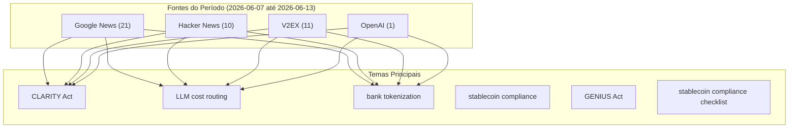


# Destaques do Hacker News

## Destaques
### Hacker News
* **ASML from Machine Builder to Strategic Infrastructure** 🔺 0 — Article URL: https://altairmedia.eu/from-machine-builder-to-strategic-infrastructure/
Comments URL: https://news.ycombinator.com/item?id=48501975
Points: 1
# Comments: 0 [link](https://altairmedia.eu/from-machine-builder-to-strategic-infrastructure/)
* **The Indian workers training AI robots to take their jobs** 🔺 0 — Article URL: https://today.rtl.lu/news/world/the-indian-workers-training-ai-robots-to-take-their-jobs-459004114
Comments URL: https://news.ycombinator.com/item?id=48500825
Points: 1
# Comments: 0 [link](https://today.rtl.lu/news/world/the-indian-workers-training-ai-robots-to-take-their-jobs-459004114)
* **Deezer's new tool can identify AI music from Spotify, Apple Music, and others** 🔺 0 — Article URL: https://techcrunch.com/2026/06/11/deezers-new-tool-can-identify-ai-music-from-spotify-apple-music-and-others/
Comments URL: https://news.ycombinator.com/item?id=48501067
Points: 1
# Comme [link](https://techcrunch.com/2026/06/11/deezers-new-tool-can-identify-ai-music-from-spotify-apple-music-and-others/)
* **India's workers are training AI robots to take their jobs** 🔺 0 — Article URL: https://www.aljazeera.com/gallery/2026/6/11/photos-indias-workers-are-training-ai-robots-to-take-their-jobs
Comments URL: https://news.ycombinator.com/item?id=48501078
Points: 1
# Comment [link](https://www.aljazeera.com/gallery/2026/6/11/photos-indias-workers-are-training-ai-robots-to-take-their-jobs)
* **Europe 2031 – What getting AI wrong means for us** 🔺 0 — Article URL: https://europe2031.ai/
Comments URL: https://news.ycombinator.com/item?id=48501175
Points: 2
# Comments: 0 [link](https://europe2031.ai/)
* **Pokémon Go data trained AI that could assist military drones in war zones** 🔺 0 — Article URL: https://www.theguardian.com/technology/2026/jun/12/pokemon-go-data-trained-ai-that-could-assist-military-drones-in-war-zones
Comments URL: https://news.ycombinator.com/item?id=48501179
Po [link](https://www.theguardian.com/technology/2026/jun/12/pokemon-go-data-trained-ai-that-could-assist-military-drones-in-war-zones)
* **When the Watcher Became the Confidant – How AI Befriends and Infers Our Children** 🔺 0 — Article URL: https://jorgepereiracampos.substack.com/p/when-the-watcher-became-the-confidant
Comments URL: https://news.ycombinator.com/item?id=48501187
Points: 1
# Comments: 0 [link](https://jorgepereiracampos.substack.com/p/when-the-watcher-became-the-confidant)
* **Auto mode for pi.dev. An LLM reviews your coding agent's commands** 🔺 0 — Article URL: https://github.com/vinzenzu/pi-auto-reviewer
Comments URL: https://news.ycombinator.com/item?id=48501272
Points: 1
# Comments: 2 [link](https://github.com/vinzenzu/pi-auto-reviewer)
* **KPMG report on benefits of AI contained AI hallucinations** 🔺 0 — Article URL: https://www.ft.com/content/b3828e92-4961-4b39-84f0-c42f33be3c3f
Comments URL: https://news.ycombinator.com/item?id=48501330
Points: 2
# Comments: 1 [link](https://www.ft.com/content/b3828e92-4961-4b39-84f0-c42f33be3c3f)
* **AI Engineering the Acceleration Whiplash** 🔺 0 — Article URL: https://www.faros.ai/blog/ai-acceleration-whiplash-takeaways
Comments URL: https://news.ycombinator.com/item?id=48501483
Points: 2
# Comments: 0 [link](https://www.faros.ai/blog/ai-acceleration-whiplash-takeaways)

### Google News
* **Why The CLARITY Act Will Not Pass On July 4 - Benzinga** 📊 0 — Why The CLARITY Act Will Not Pass On July 4  Benzinga [link](https://news.google.com/rss/articles/CBMilgFBVV95cUxNVk0xYUZLVEItY3FiY1NtdExKTnN0RXZnOW10c1VxT1BacG5IS1UwM3poMU1Wc3loNFlqMTRLTG1FY1pIWDJTTVBrV010TTBLOFBULUc2R3hMdWU2RnBsY3A1MER3aFNON2RGQ3RDVWI2cnVrQUJ3ZjdyNnNRTHFIaWtMQUlseDMtSHNnUmFoMUVYOUk4dlE?oc=5)
* **Ripple CEO Takes Aim at JPMorgan's Jamie Dimon Over Clarity Act Crypto Bill Criticism - Decrypt** 📊 0 — Ripple CEO Takes Aim at JPMorgan's Jamie Dimon Over Clarity Act Crypto Bill Criticism  Decrypt [link](https://news.google.com/rss/articles/CBMikgFBVV95cUxOejR6TFJ4VmhQaTJiY1BLY000Sk5wbmY1cFdTR3FHUmFZM0laWlloUEpzbUVTVmI4YU9VVzZPTXhTcDh2b056ZUVtRUZ2cFIyd0owTVIzb3lzem5hczRmZHlFdnFsUnA5aUlTWDFoWHdnMXp2VlJySWQ1VHRTVWpWRWltRGdqZXFNdmZrNWg4VktwUdIBmgFBVV95cUxQWGhGT19TTmlmSXFaTlFySW0tejV2Y1pOR1dvUTBYNFJ2VEVNY0F2QXh3cVN2ZzNsYUtWbXBGNHlZeU1TU0Y2NENiajVSU2tUYmpZclRkQ01VcE14Y0EzbUpmdXdfWDVfSHVCVXFIN1V0UjZMVmM1eEs3SDNRNGhkekptXy1iaTZXcDdhc0I2THpUQ0pZN2VibjNn?oc=5)
* **Crypto bill faces crunch time in Senate as digital asset industry urges vote on CLARITY Act - Fox Business** 📊 0 — Crypto bill faces crunch time in Senate as digital asset industry urges vote on CLARITY Act  Fox Business [link](https://news.google.com/rss/articles/CBMiW0FVX3lxTE5nZThsZktDd0dyX1ZORGc2Y1ZYN19zNW5SSFEwVUh4Sm44Z19weDkyWnJTd3l3ZDhJX3Q5Y2ctZWN5Z2dfY0RhaDVIaFZmN05fdDl5a2VMc3AzUUE?oc=5)
* **Breaking Model Lock-in: Cost-Efficient Zero-Shot LLM Routing via a Universal Latent Space - The Association for the Advancement of Artificial Intelligence** 📊 0 — Breaking Model Lock-in: Cost-Efficient Zero-Shot LLM Routing via a Universal Latent Space  The Association for the Advancement of Artificial Intelligence [link](https://news.google.com/rss/articles/CBMiZEFVX3lxTE5BbEpjc3RwdlA5bXlDZk9YRzhhZnNMZW9DcEJhR19Ib1JvbXpqTERLU3NodHN5TVNfY2FUNGZfUlZKcHFzdFEwZWRHNWZrZjMwalNVc1BVbUdjQ3lwcGtOQWFXVVU?oc=5)
* **Routing Strategies: How AI Teams Select the Right Language Model - USA Today** 📊 0 — Routing Strategies: How AI Teams Select the Right Language Model  USA Today [link](https://news.google.com/rss/articles/CBMitgFBVV95cUxPbUhBWE5ubk9kM19CTUtUcUF0c2lvUk5MNEx6VlhVS0ZBb1lCMmdLNjBwdHc3Nnl3SFMtM0V3YlRoaFNyeVAyb19Od2FNRkdEamJ1bzFVZTJZem41MW9RT2hhUXdORTliMDdoNGNabzZsY0RZYV8tLVdXeVpQQk9PNUI5VERKVTBYeDVpdGtnUld6eGdvRktSNnE2eEdJS1R5Q20xNGZSX3J6dE5oeVlhWXVzRXF5UQ?oc=5)
* **Citi opens new route into private markets with tokenized share offering - CoinDesk** 📊 0 — Citi opens new route into private markets with tokenized share offering  CoinDesk [link](https://news.google.com/rss/articles/CBMitwFBVV95cUxPNUtkbVFwSFEycVhCamI3QWtCYXJzUnBZeVZ0RzJjVXNxdU5UU2hQRDVTV3FjX0JsVWVySjYzQndXcHJodldiOGg4UzBjdVBpSVFVVEI3UEFjS2dUN2JwaXlqamdqdm9mZGEyRGNuYlFhSG5mZmszMmFyV1MyV0hucGFJeGVESmJUTWZqNUUtUERoXzlSZDZ6MFo0akZkT3hiVG1YSlVUSVJzRGV2S25FZk0wc3d0NG8?oc=5)
* **Tokenized Deposits Gain a Corporate Treasury Use Case - PYMNTS.com** 📊 0 — Tokenized Deposits Gain a Corporate Treasury Use Case  PYMNTS.com [link](https://news.google.com/rss/articles/CBMilgFBVV95cUxOTlhvZ2R6RWU1SlBlbWExa2h4NWRjbXFkMEtHZWk0VElHNW9oWnBJZ09GNEpueUNoQnlpbW91VnV0VlFFak9kNTh6OHJ0WFFyNWF5SjRPLTMyQkJRdmxvR2RBenlPY3RuU1hiY2Rma29mNkFIdzRuem1ZeUgxNVNUUkJHM0pYcDdlRzFJVFp6QWZ2cUNvalE?oc=5)
* **Singapore bank DBS to offer tokenized gold to retail customers - CoinDesk** 📊 0 — Singapore bank DBS to offer tokenized gold to retail customers  CoinDesk [link](https://news.google.com/rss/articles/CBMiqwFBVV95cUxOWTMwSEVIbE1rOHM4ZG1mYkFIU2tOWDVqTWE1alNmT241Yi1tazhuZmZJb2xIb2lVa0ZMQmNSSUw1dEtlNnZ0VGREYzRqYlV4bnoxaU45XzdGR1JWRXo2eHVoTHBsX3VhdjVuWjBENHp4T3J5c3BvUm5FazlHeVNURUZJN01sUmFyVWZLMVhkNW9UZkRyRTZhTzBVWjJwb2ZXcFhCbVZVZTVaTzg?oc=5)
* **Exclusive | Citigroup Is Rolling Out Tokenized Shares of Private Companies - WSJ** 📊 0 — Exclusive | Citigroup Is Rolling Out Tokenized Shares of Private Companies  WSJ [link](https://news.google.com/rss/articles/CBMiqwFBVV95cUxNeUp0MExDNE90bTdGUmprc21iNXpqUFNvTDhPM1lRWEtrdW1hMjR4ZHB2MEVBdzJKWGpveFRVRzV2LXB6TmliT0hzZWxyWUVickswcUZSbmtEV0E1RHVWUFRBQTAxemFRNm5lVTNoQ1RYb1dsVm5xazV2RlR4alExWm9vQTE2VUJtbzNDb3dBTEIwWVFnXzc1aU9ZZDFrN3A5N244bmNST0sxRVk?oc=5)
* **Reg Wrap: FDIC seeks Bank Secrecy Act stablecoin compliance upgrade - TheBanker.com** 📊 0 — Reg Wrap: FDIC seeks Bank Secrecy Act stablecoin compliance upgrade  TheBanker.com [link](https://news.google.com/rss/articles/CBMiekFVX3lxTE12Q0hjby1yaV9wTWFRbjdmSkQxRVZScTA3OUNFc01fYUlkcWpCTlFvYld6bGM5M1ViSXY4V19FWnBDWGV5VHNGeURHUGMtZ1FyeTczeV9hdmVWLVZQUWtjUkVidjYxVnJESUxrZ3d6OHFHemRKX0o5YkNn?oc=5)
* **Crypto regulatory affairs: New York and European supervisors to collaborate - Elliptic** 📊 0 — Crypto regulatory affairs: New York and European supervisors to collaborate  Elliptic [link](https://news.google.com/rss/articles/CBMihwFBVV95cUxQUl9hZ2c0cm5iaWhSUWsyczlXQ1UxRTRyb09aQkJWRFJ2azRmTXBSYlZNQjFVOXhhaFp0RWFyOXE0bGZ1a1doVlVDLWppQ09ubnFxV3lUOGVaaWVrQnFWWDVfalUwc0V1WUltUGRzejAxeTAyeVF2WVNJZWtIQTM5WWpLcVFoZTg?oc=5)
* **Nasdaq-Listed AXG Secures Bahrain’s First Stablecoin Issuer License to Target $250 Trillion Global Cross-Border Payments Market via On-Chain Channels - markets.businessinsider.com** 📊 0 — Nasdaq-Listed AXG Secures Bahrain’s First Stablecoin Issuer License to Target $250 Trillion Global Cross-Border Payments Market via On-Chain Channels  markets.businessinsider.com [link](https://news.google.com/rss/articles/CBMisAJBVV95cUxPQm1JWnl4YlhoMm80NnN5UmdRcERLN1pSQUhZY2pfNWtydnNEZW1QRy12NEtSN1lsZGVXbktDSlZEUm9INzRKRXFwTGpUcTZsekpiT3FHV2lUY09RbEZYVDVReWtmamx6aV9TSklaUzFYci1uc3p4dGVrYXBpT01PNGp1QXB0VFJuaGJ1TzAzYlF5a1hSM2tBNWRmV2txcWxMTUJUb2xDampIT3N2N2FnWDlWYl9veWZOMFBLRGJZQWNjTEVCV3dobHJVdldJUDNRQnZnMFppNVM2SUdrU0I1RDZsQms2TUptNE1qMmNNUldBRVEzWjdCcXRrZGgxZWlRNVhwSnJpLTRaXzRjb2c5aFpOd3hHeXdacElVdmxsdU5xSWVCVm1EY3czbklrN2Zv?oc=5)
* **CSBS makes recommendations to proposed rule on GENIUS Act implementation - Financial Regulation News -** 📊 0 — CSBS makes recommendations to proposed rule on GENIUS Act implementation  Financial Regulation News - [link](https://news.google.com/rss/articles/CBMipAFBVV95cUxOZVMtZkRLM1l2SF8wUjBxb2dKRDBHUW1OZW9UYXdUZ2VRT05oY3I2cUpOMlVld3duWmx2ak42V3FFaUtlRnBvSktxUy1PLXRNeUxGNEQ1T1NrdlhTb3hUQTd6azJsS2JZTlZLbTFQLUFERGNiUzFmU0dFWmt6RHduSWk3eERHOEFsQjZlLS1ZcFRYZ0JSRmk0UmptektmV0NpYlVZWQ?oc=5)
* **Joint Trades Submit Comments on Tokenized Deposit Aspects of FDIC's GENIUS Act Implementation NPRM - consumerbankers.com** 📊 0 — Joint Trades Submit Comments on Tokenized Deposit Aspects of FDIC's GENIUS Act Implementation NPRM  consumerbankers.com [link](https://news.google.com/rss/articles/CBMi2AFBVV95cUxPUEFJZi0wSmFMT3RlQ0RxQmtnN0ktYU01dGp0WDFxT3oycFJnMXYyYVY1TnJjaXFqRUVfZzJRSUVHX1I3dzBIYTFiMmRWT2E5eXFOTS1OODc0b21DTXEzVExQZy1OSzR2UU1QOGhhMWlWQ1dqSXRvRkx1VGI3ZEw0VkxwQWtNRk1xU21PT0ZveDEyMVEzMlZDVzlHb3o0U1VkeEJvMWEySU5rZFJ3OWl4Rk92Z0wwVGRheTRWUzhqakpqZkUyaGxGVFJlbkxUMlU0TnVSTzBFYXc?oc=5)
* **The Regulatory Landscape for Stablecoins: What Banks and FIs Need to Know - Paxos** 📊 0 — The Regulatory Landscape for Stablecoins: What Banks and FIs Need to Know  Paxos [link](https://news.google.com/rss/articles/CBMicEFVX3lxTE9CeTdMaU1wWWJySjdOQlpXZG1rNmtXRTQ2ZDdCUk9wSmliazlmVFlwN0l5a2pLNnpJaE1LM3VqWlotNDNFVlktOW9hTmlpTnZCMXRmRkVzbGhpV2pkOVN4LUVpcGNmb2IwaDdCTnNEZjk?oc=5)
* **The 2026 CFD broker’s guide to stablecoin integration - FinTech Weekly** 📊 0 — The 2026 CFD broker’s guide to stablecoin integration  FinTech Weekly [link](https://news.google.com/rss/articles/CBMimAFBVV95cUxOV0JrbVl4WV8zejBFeEd1Y05DU0pmOEdHMi11b2pNQmVpYm81M2xvZ2JqR2VWaWFkNDVZWTRkWDAwbGl0NTBWcnVNcmRMVzZPczJhakgwVS1xUy1kZzRBczBPSk5RV0ZabFZsYWNueDVFQjgtdGJwV19Tc0UtNjI4ZVM0MnVwZl9VRGZrMTNfRl9nZWdNQ090cg?oc=5)
* **Become a GENIUS: Key Insights from TRM's Webinar on Stablecoin Risk and Compliance - TRM Labs** 📊 0 — Become a GENIUS: Key Insights from TRM's Webinar on Stablecoin Risk and Compliance  TRM Labs [link](https://news.google.com/rss/articles/CBMiuwFBVV95cUxOb1M0UkpxRk9hbWM0aTBOdHc2eW5ENlp6YlRDU25KTXhkcHo1Y3dDR1QtQjJDaTBBUUcyWEF1SF91SjhLOGNmcWhMRGEtbTdxSTFGOU9hRTNiV1hKZTNzeDlRTGhxZFNGVFVzUDJ3TXJtaWgxcktoOUVIVTVocDVkMmktNjd0eXpQdE1KT0l3RDhhdFNqMGNEakdwaUdLcWx1UEtTR19WTmtlcXBST2IxSEtmU2hNNHQyeDJB?oc=5)
* **U.S. Banking Groups Push For Stricter AML Rules On Stablecoin Secondary Markets - Bitcoin World** 📊 0 — U.S. Banking Groups Push For Stricter AML Rules On Stablecoin Secondary Markets  Bitcoin World [link](https://news.google.com/rss/articles/CBMihAFBVV95cUxPSnVrQmxXQ0hraW5hWG9pMmdVa01KRWhkcnphaDdJQnRPUVBIcmZ4OEV5M002QVlJVGFGRFhQbWduYTBHS212NHlZOG9SY2d3WVZqUkp5NTh1YnlCd3lyWWlIcER6cVJGR2liMkJickV0TVlJNG90TzdNYXQwbzJWcXctSjY?oc=5)
* **The GENIUS Act, Explained: What Enterprise Payment Teams Need to Know - Polygon Labs** 📊 0 — The GENIUS Act, Explained: What Enterprise Payment Teams Need to Know  Polygon Labs [link](https://news.google.com/rss/articles/CBMioAFBVV95cUxNVnBXem4zakZLdHpLZ0hRUEtETHpMM0tLR0ZHWXRmbXRpN1N3M0tRV1NlV1hNd0JGdml2NlpNTmx2RXQ2NVFsemdyc3N2eVM4dE9BTGtaR1J0VVZGbGd3MkpGaWxoQ2FDRjJHRFlSX2E3cFBWUFRxUzcyZ0RvMzJENEh0XzBZb0NMaklSN3Y0YWNGclRGdVBsazk0WlpsZVg5?oc=5)
* **OpenAI considers drastic price cuts, anticipating war for users with Anthropic, WSJ reports - Yahoo Finance** 📊 0 — OpenAI considers drastic price cuts, anticipating war for users with Anthropic, WSJ reports  Yahoo Finance [link](https://news.google.com/rss/articles/CBMipwFBVV95cUxNa1hRS09mSFVOVFh1VWRvSUdOSXhKV1k4bGFKdGdlR2NISTNyVHUtMjF6UnBiU0JRT19yMldUX254VXZ0SVBVTkVGc1J0amI4Y1kwb0tEbnZOMG5yX0ZhSkc4UEI1WXJxcjQwa2VGdlUxNTJFNW9GTnctallrZndyTUJYRFpBdzFqMWUxbzFvZnVOWnk1UWh5Q1B1ckNXNFRhVE9QWTFraw?oc=5)
* **OpenAI CEO Sam Altman admits AI token costs are becoming 'a huge issue' — company seeks improved value as overspending becomes a meme - Tom's Hardware** 📊 0 — OpenAI CEO Sam Altman admits AI token costs are becoming 'a huge issue' — company seeks improved value as overspending becomes a meme  Tom's Hardware [link](https://news.google.com/rss/articles/CBMiogJBVV95cUxNdUtFbWdkV0F5YzdmcG1YbmJ5MVVTS3lDTFhSeDJaMTFCY1BGZ2c0Q3E3cm14VUtjTDJfSnQtcnJOdmRDcVZ5bm8tcE1yU2xpQ2pCZW1oSXJIMHJka1Z4MDNHaDJ5U1Y2VGhmTlpRa29QUXRJY1drN2V0NnZTN0VUSkhvN1doWUxjRUE5cVJuQVE4MDJuTkpyZWN5MTFLMEljcDFDblczbEtqT215SXUwWHUwSXVSMUZ6ek5iT2tmSkZNX1FkRTQ4WGNnX2hrRXIwVERmUUlXLUZweS1MZE1RSUl5aWlvTHNROGV1cHFzSEYzeDBfMDI1WVBHRC1NUGdxWTl3cFdnZkFYOHZPZzd3c1dHNWxGeGdTUTV3eUpEaE1wQQ?oc=5)

## 📊 Métricas do Período (2026-06-07 até 2026-06-13)

- **Total de fontes**: 43
- **Por tipo**: Google News: 21 | Hacker News: 10 | V2EX: 11 | OpenAI: 1
- **Top engagement**: **Why** (0) | **Ripple** (0) | **Crypto** (0)
- **Temas únicos**: 13 categorias

## Tendências

A partir de 7 a 13 de junho 2026, a agenda regulatória dos ativos digitais se intensifica: o CLARITY Act, pressionado pelo setor cripto, enfrenta impasse no Senado, ao passo que a FDIC avança com o GENIUS Act para permitir depósitos tokenizados e o Citi/DBS lançam ofertas de ações e ouro tokenizados. Simultaneamente, supervisores de NY e da UE buscam harmonizar normas de compliance para stablecoins, enquanto a AXG obtém a primeira licença de stablecoin do Bahrein, sinalizando que a tokenização está migrando das propostas para implementações comerciais.

No mesmo período, as empresas de IA concentram‑se em reduzir custos e evitar lock‑in de modelos, com pesquisas sobre “zero‑shot LLM routing” e estratégias de escolha de modelos que aparecem em USA Today e na AAAI. Essa busca de eficiência reflete o debate em comunidades como V2EX sobre a viabilidade de assinaturas de IA (Claude Pro, Max 20x, Chat

## Fontes e Referências

1. [Why The CLARITY Act Will Not Pass On July 4 - Benzinga](https://news.google.com/rss/articles/CBMilgFBVV95cUxNVk0xYUZLVEItY3FiY1NtdExKTnN0RXZnOW10c1VxT1BacG5IS1UwM3poMU1Wc3loNFlqMTRLTG1FY1pIWDJTTVBrV010TTBLOFBULUc2R3hMdWU2RnBsY3A1MER3aFNON2RGQ3RDVWI2cnVrQUJ3ZjdyNnNRTHFIaWtMQUlseDMtSHNnUmFoMUVYOUk4dlE?oc=5) — Google News (CLARITY Act)
2. [Ripple CEO Takes Aim at JPMorgan's Jamie Dimon Over Clarity Act Crypto Bill Criticism - Decrypt](https://news.google.com/rss/articles/CBMikgFBVV95cUxOejR6TFJ4VmhQaTJiY1BLY000Sk5wbmY1cFdTR3FHUmFZM0laWlloUEpzbUVTVmI4YU9VVzZPTXhTcDh2b056ZUVtRUZ2cFIyd0owTVIzb3lzem5hczRmZHlFdnFsUnA5aUlTWDFoWHdnMXp2VlJySWQ1VHRTVWpWRWltRGdqZXFNdmZrNWg4VktwUdIBmgFBVV95cUxQWGhGT19TTmlmSXFaTlFySW0tejV2Y1pOR1dvUTBYNFJ2VEVNY0F2QXh3cVN2ZzNsYUtWbXBGNHlZeU1TU0Y2NENiajVSU2tUYmpZclRkQ01VcE14Y0EzbUpmdXdfWDVfSHVCVXFIN1V0UjZMVmM1eEs3SDNRNGhkekptXy1iaTZXcDdhc0I2THpUQ0pZN2VibjNn?oc=5) — Google News (CLARITY Act)
3. [Crypto bill faces crunch time in Senate as digital asset industry urges vote on CLARITY Act - Fox Business](https://news.google.com/rss/articles/CBMiW0FVX3lxTE5nZThsZktDd0dyX1ZORGc2Y1ZYN19zNW5SSFEwVUh4Sm44Z19weDkyWnJTd3l3ZDhJX3Q5Y2ctZWN5Z2dfY0RhaDVIaFZmN05fdDl5a2VMc3AzUUE?oc=5) — Google News (CLARITY Act)
4. [ASML from Machine Builder to Strategic Infrastructure](https://altairmedia.eu/from-machine-builder-to-strategic-infrastructure/) — Hacker News: Machine Learning
5. [订阅制还能持续多久呢？ oai 和 anthropic 的订阅制都是赔本赚吆喝吧？](https://www.v2ex.com/t/1220007#reply6) — V2EX Tech
6. [想用 hermes+gemini 替换掉 codex 了，各位大佬怎么看？](https://www.v2ex.com/t/1219977#reply10) — V2EX Tech
7. [用 AI 写了个中医自诊网站，亚健康的都来测测，求喷](https://www.v2ex.com/t/1219848#reply109) — V2EX Tech
8. [大家帮推荐个 AI 时代的好用的 IDE 推荐](https://www.v2ex.com/t/1219937#reply12) — V2EX Tech
9. [现在有哪些国内公司能够无上限用 Claude Fable 5？](https://www.v2ex.com/t/1219834#reply30) — V2EX Tech
10. [买 macbook pro 笔记本，跑本地模型，怎么配置性价比比较高？](https://www.v2ex.com/t/1219998#reply4) — V2EX Tech
11. [正好赶上土区 ChatGPT plus 扣费，还是 499try](https://www.v2ex.com/t/1219709#reply19) — V2EX Tech
12. [How Preply combines AI and human tutors to personalize learning](https://openai.com/index/preply) — OpenAI Blog
13. [Breaking Model Lock-in: Cost-Efficient Zero-Shot LLM Routing via a Universal Latent Space - The Association for the Advancement of Artificial Intelligence](https://news.google.com/rss/articles/CBMiZEFVX3lxTE5BbEpjc3RwdlA5bXlDZk9YRzhhZnNMZW9DcEJhR19Ib1JvbXpqTERLU3NodHN5TVNfY2FUNGZfUlZKcHFzdFEwZWRHNWZrZjMwalNVc1BVbUdjQ3lwcGtOQWFXVVU?oc=5) — Google News (LLM cost routing)
14. [Routing Strategies: How AI Teams Select the Right Language Model - USA Today](https://news.google.com/rss/articles/CBMitgFBVV95cUxPbUhBWE5ubk9kM19CTUtUcUF0c2lvUk5MNEx6VlhVS0ZBb1lCMmdLNjBwdHc3Nnl3SFMtM0V3YlRoaFNyeVAyb19Od2FNRkdEamJ1bzFVZTJZem41MW9RT2hhUXdORTliMDdoNGNabzZsY0RZYV8tLVdXeVpQQk9PNUI5VERKVTBYeDVpdGtnUld6eGdvRktSNnE2eEdJS1R5Q20xNGZSX3J6dE5oeVlhWXVzRXF5UQ?oc=5) — Google News (LLM cost routing)
15. [Citi opens new route into private markets with tokenized share offering - CoinDesk](https://news.google.com/rss/articles/CBMitwFBVV95cUxPNUtkbVFwSFEycVhCamI3QWtCYXJzUnBZeVZ0RzJjVXNxdU5UU2hQRDVTV3FjX0JsVWVySjYzQndXcHJodldiOGg4UzBjdVBpSVFVVEI3UEFjS2dUN2JwaXlqamdqdm9mZGEyRGNuYlFhSG5mZmszMmFyV1MyV0hucGFJeGVESmJUTWZqNUUtUERoXzlSZDZ6MFo0akZkT3hiVG1YSlVUSVJzRGV2S25FZk0wc3d0NG8?oc=5) — Google News (bank tokenization)
16. [Tokenized Deposits Gain a Corporate Treasury Use Case - PYMNTS.com](https://news.google.com/rss/articles/CBMilgFBVV95cUxOTlhvZ2R6RWU1SlBlbWExa2h4NWRjbXFkMEtHZWk0VElHNW9oWnBJZ09GNEpueUNoQnlpbW91VnV0VlFFak9kNTh6OHJ0WFFyNWF5SjRPLTMyQkJRdmxvR2RBenlPY3RuU1hiY2Rma29mNkFIdzRuem1ZeUgxNVNUUkJHM0pYcDdlRzFJVFp6QWZ2cUNvalE?oc=5) — Google News (bank tokenization)
17. [Singapore bank DBS to offer tokenized gold to retail customers - CoinDesk](https://news.google.com/rss/articles/CBMiqwFBVV95cUxOWTMwSEVIbE1rOHM4ZG1mYkFIU2tOWDVqTWE1alNmT241Yi1tazhuZmZJb2xIb2lVa0ZMQmNSSUw1dEtlNnZ0VGREYzRqYlV4bnoxaU45XzdGR1JWRXo2eHVoTHBsX3VhdjVuWjBENHp4T3J5c3BvUm5FazlHeVNURUZJN01sUmFyVWZLMVhkNW9UZkRyRTZhTzBVWjJwb2ZXcFhCbVZVZTVaTzg?oc=5) — Google News (bank tokenization)
18. [Exclusive | Citigroup Is Rolling Out Tokenized Shares of Private Companies - WSJ](https://news.google.com/rss/articles/CBMiqwFBVV95cUxNeUp0MExDNE90bTdGUmprc21iNXpqUFNvTDhPM1lRWEtrdW1hMjR4ZHB2MEVBdzJKWGpveFRVRzV2LXB6TmliT0hzZWxyWUVickswcUZSbmtEV0E1RHVWUFRBQTAxemFRNm5lVTNoQ1RYb1dsVm5xazV2RlR4alExWm9vQTE2VUJtbzNDb3dBTEIwWVFnXzc1aU9ZZDFrN3A5N244bmNST0sxRVk?oc=5) — Google News (bank tokenization)
19. [Reg Wrap: FDIC seeks Bank Secrecy Act stablecoin compliance upgrade - TheBanker.com](https://news.google.com/rss/articles/CBMiekFVX3lxTE12Q0hjby1yaV9wTWFRbjdmSkQxRVZScTA3OUNFc01fYUlkcWpCTlFvYld6bGM5M1ViSXY4V19FWnBDWGV5VHNGeURHUGMtZ1FyeTczeV9hdmVWLVZQUWtjUkVidjYxVnJESUxrZ3d6OHFHemRKX0o5YkNn?oc=5) — Google News (stablecoin compliance)
20. [Crypto regulatory affairs: New York and European supervisors to collaborate - Elliptic](https://news.google.com/rss/articles/CBMihwFBVV95cUxQUl9hZ2c0cm5iaWhSUWsyczlXQ1UxRTRyb09aQkJWRFJ2azRmTXBSYlZNQjFVOXhhaFp0RWFyOXE0bGZ1a1doVlVDLWppQ09ubnFxV3lUOGVaaWVrQnFWWDVfalUwc0V1WUltUGRzejAxeTAyeVF2WVNJZWtIQTM5WWpLcVFoZTg?oc=5) — Google News (stablecoin compliance)
21. [Nasdaq-Listed AXG Secures Bahrain’s First Stablecoin Issuer License to Target $250 Trillion Global Cross-Border Payments Market via On-Chain Channels - markets.businessinsider.com](https://news.google.com/rss/articles/CBMisAJBVV95cUxPQm1JWnl4YlhoMm80NnN5UmdRcERLN1pSQUhZY2pfNWtydnNEZW1QRy12NEtSN1lsZGVXbktDSlZEUm9INzRKRXFwTGpUcTZsekpiT3FHV2lUY09RbEZYVDVReWtmamx6aV9TSklaUzFYci1uc3p4dGVrYXBpT01PNGp1QXB0VFJuaGJ1TzAzYlF5a1hSM2tBNWRmV2txcWxMTUJUb2xDampIT3N2N2FnWDlWYl9veWZOMFBLRGJZQWNjTEVCV3dobHJVdldJUDNRQnZnMFppNVM2SUdrU0I1RDZsQms2TUptNE1qMmNNUldBRVEzWjdCcXRrZGgxZWlRNVhwSnJpLTRaXzRjb2c5aFpOd3hHeXdacElVdmxsdU5xSWVCVm1EY3czbklrN2Zv?oc=5) — Google News (stablecoin compliance)
22. [CSBS makes recommendations to proposed rule on GENIUS Act implementation - Financial Regulation News -](https://news.google.com/rss/articles/CBMipAFBVV95cUxOZVMtZkRLM1l2SF8wUjBxb2dKRDBHUW1OZW9UYXdUZ2VRT05oY3I2cUpOMlVld3duWmx2ak42V3FFaUtlRnBvSktxUy1PLXRNeUxGNEQ1T1NrdlhTb3hUQTd6azJsS2JZTlZLbTFQLUFERGNiUzFmU0dFWmt6RHduSWk3eERHOEFsQjZlLS1ZcFRYZ0JSRmk0UmptektmV0NpYlVZWQ?oc=5) — Google News (GENIUS Act)
23. [Joint Trades Submit Comments on Tokenized Deposit Aspects of FDIC's GENIUS Act Implementation NPRM - consumerbankers.com](https://news.google.com/rss/articles/CBMi2AFBVV95cUxPUEFJZi0wSmFMT3RlQ0RxQmtnN0ktYU01dGp0WDFxT3oycFJnMXYyYVY1TnJjaXFqRUVfZzJRSUVHX1I3dzBIYTFiMmRWT2E5eXFOTS1OODc0b21DTXEzVExQZy1OSzR2UU1QOGhhMWlWQ1dqSXRvRkx1VGI3ZEw0VkxwQWtNRk1xU21PT0ZveDEyMVEzMlZDVzlHb3o0U1VkeEJvMWEySU5rZFJ3OWl4Rk92Z0wwVGRheTRWUzhqakpqZkUyaGxGVFJlbkxUMlU0TnVSTzBFYXc?oc=5) — Google News (GENIUS Act)
24. [The Indian workers training AI robots to take their jobs](https://today.rtl.lu/news/world/the-indian-workers-training-ai-robots-to-take-their-jobs-459004114) — Hacker News: AI
25. [Deezer's new tool can identify AI music from Spotify, Apple Music, and others](https://techcrunch.com/2026/06/11/deezers-new-tool-can-identify-ai-music-from-spotify-apple-music-and-others/) — Hacker News: AI
26. [India's workers are training AI robots to take their jobs](https://www.aljazeera.com/gallery/2026/6/11/photos-indias-workers-are-training-ai-robots-to-take-their-jobs) — Hacker News: AI
27. [Europe 2031 – What getting AI wrong means for us](https://europe2031.ai/) — Hacker News: AI
28. [Pokémon Go data trained AI that could assist military drones in war zones](https://www.theguardian.com/technology/2026/jun/12/pokemon-go-data-trained-ai-that-could-assist-military-drones-in-war-zones) — Hacker News: AI
29. [When the Watcher Became the Confidant – How AI Befriends and Infers Our Children](https://jorgepereiracampos.substack.com/p/when-the-watcher-became-the-confidant) — Hacker News: AI
30. [Auto mode for pi.dev. An LLM reviews your coding agent's commands](https://github.com/vinzenzu/pi-auto-reviewer) — Hacker News: AI
31. [KPMG report on benefits of AI contained AI hallucinations](https://www.ft.com/content/b3828e92-4961-4b39-84f0-c42f33be3c3f) — Hacker News: AI
32. [AI Engineering the Acceleration Whiplash](https://www.faros.ai/blog/ai-acceleration-whiplash-takeaways) — Hacker News: AI
33. [准备从 Antigravity 换到 Kiro 用 Claude](https://www.v2ex.com/t/1219980#reply0) — V2EX Tech
34. [Codex 送了一次主动重置， 30 天有效期，记得用](https://www.v2ex.com/t/1219918#reply16) — V2EX Tech
35. [关于 codex 拉新邀请的实际测试情况](https://www.v2ex.com/t/1219958#reply8) — V2EX Tech
36. [家庭搞 k3s 和大量 docker 容器，用 unraid 还是 truenas](https://www.v2ex.com/t/1219972#reply1) — V2EX Tech
37. [The Regulatory Landscape for Stablecoins: What Banks and FIs Need to Know - Paxos](https://news.google.com/rss/articles/CBMicEFVX3lxTE9CeTdMaU1wWWJySjdOQlpXZG1rNmtXRTQ2ZDdCUk9wSmliazlmVFlwN0l5a2pLNnpJaE1LM3VqWlotNDNFVlktOW9hTmlpTnZCMXRmRkVzbGhpV2pkOVN4LUVpcGNmb2IwaDdCTnNEZjk?oc=5) — Google News (stablecoin compliance checklist)
38. [The 2026 CFD broker’s guide to stablecoin integration - FinTech Weekly](https://news.google.com/rss/articles/CBMimAFBVV95cUxOV0JrbVl4WV8zejBFeEd1Y05DU0pmOEdHMi11b2pNQmVpYm81M2xvZ2JqR2VWaWFkNDVZWTRkWDAwbGl0NTBWcnVNcmRMVzZPczJhakgwVS1xUy1kZzRBczBPSk5RV0ZabFZsYWNueDVFQjgtdGJwV19Tc0UtNjI4ZVM0MnVwZl9VRGZrMTNfRl9nZWdNQ090cg?oc=5) — Google News (stablecoin compliance checklist)
39. [Become a GENIUS: Key Insights from TRM's Webinar on Stablecoin Risk and Compliance - TRM Labs](https://news.google.com/rss/articles/CBMiuwFBVV95cUxOb1M0UkpxRk9hbWM0aTBOdHc2eW5ENlp6YlRDU25KTXhkcHo1Y3dDR1QtQjJDaTBBUUcyWEF1SF91SjhLOGNmcWhMRGEtbTdxSTFGOU9hRTNiV1hKZTNzeDlRTGhxZFNGVFVzUDJ3TXJtaWgxcktoOUVIVTVocDVkMmktNjd0eXpQdE1KT0l3RDhhdFNqMGNEakdwaUdLcWx1UEtTR19WTmtlcXBST2IxSEtmU2hNNHQyeDJB?oc=5) — Google News (stablecoin compliance checklist)
40. [U.S. Banking Groups Push For Stricter AML Rules On Stablecoin Secondary Markets - Bitcoin World](https://news.google.com/rss/articles/CBMihAFBVV95cUxPSnVrQmxXQ0hraW5hWG9pMmdVa01KRWhkcnphaDdJQnRPUVBIcmZ4OEV5M002QVlJVGFGRFhQbWduYTBHS212NHlZOG9SY2d3WVZqUkp5NTh1YnlCd3lyWWlIcER6cVJGR2liMkJickV0TVlJNG90TzdNYXQwbzJWcXctSjY?oc=5) — Google News (stablecoin compliance checklist)
41. [The GENIUS Act, Explained: What Enterprise Payment Teams Need to Know - Polygon Labs](https://news.google.com/rss/articles/CBMioAFBVV95cUxNVnBXem4zakZLdHpLZ0hRUEtETHpMM0tLR0ZHWXRmbXRpN1N3M0tRV1NlV1hNd0JGdml2NlpNTmx2RXQ2NVFsemdyc3N2eVM4dE9BTGtaR1J0VVZGbGd3MkpGaWxoQ2FDRjJHRFlSX2E3cFBWUFRxUzcyZ0RvMzJENEh0XzBZb0NMaklSN3Y0YWNGclRGdVBsazk0WlpsZVg5?oc=5) — Google News (stablecoin compliance checklist)
42. [OpenAI considers drastic price cuts, anticipating war for users with Anthropic, WSJ reports - Yahoo Finance](https://news.google.com/rss/articles/CBMipwFBVV95cUxNa1hRS09mSFVOVFh1VWRvSUdOSXhKV1k4bGFKdGdlR2NISTNyVHUtMjF6UnBiU0JRT19yMldUX254VXZ0SVBVTkVGc1J0amI4Y1kwb0tEbnZOMG5yX0ZhSkc4UEI1WXJxcjQwa2VGdlUxNTJFNW9GTnctallrZndyTUJYRFpBdzFqMWUxbzFvZnVOWnk1UWh5Q1B1ckNXNFRhVE9QWTFraw?oc=5) — Google News (OpenAI token pricing)
43. [OpenAI CEO Sam Altman admits AI token costs are becoming 'a huge issue' — company seeks improved value as overspending becomes a meme - Tom's Hardware](https://news.google.com/rss/articles/CBMiogJBVV95cUxNdUtFbWdkV0F5YzdmcG1YbmJ5MVVTS3lDTFhSeDJaMTFCY1BGZ2c0Q3E3cm14VUtjTDJfSnQtcnJOdmRDcVZ5bm8tcE1yU2xpQ2pCZW1oSXJIMHJka1Z4MDNHaDJ5U1Y2VGhmTlpRa29QUXRJY1drN2V0NnZTN0VUSkhvN1doWUxjRUE5cVJuQVE4MDJuTkpyZWN5MTFLMEljcDFDblczbEtqT215SXUwWHUwSXVSMUZ6ek5iT2tmSkZNX1FkRTQ4WGNnX2hrRXIwVERmUUlXLUZweS1MZE1RSUl5aWlvTHNROGV1cHFzSEYzeDBfMDI1WVBHRC1NUGdxWTl3cFdnZkFYOHZPZzd3c1dHNWxGeGdTUTV3eUpEaE1wQQ?oc=5) — Google News (OpenAI token pricing)

---

*Gerado por: cloud/gpt-oss-120b*


---
*Gerado por evo-agent - agente auto-aprimorante em 2026-06-12.*
