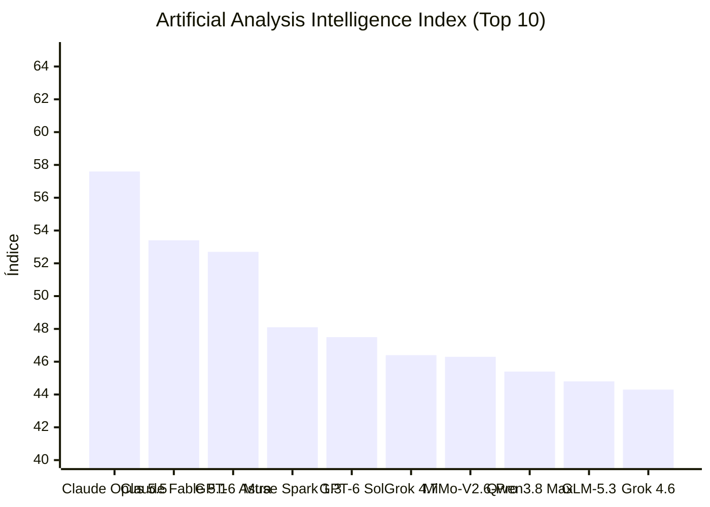


# GPT-6 Luna Pro e Claude Opus 5.5 lideram lançamentos de IA com contextos expandidos e novos

**Período analisado:** 22/09/2026 a 23/09/2026 · 9 pautas · 4 fontes primárias · 5 sinais da comunidade

## Em 30 segundos

- **GPT-6 Luna Pro estreia com contexto expandido e modo reasoning.mode pro** — OpenAI anuncia GPT-6 Luna Pro via OpenRouter, mesma base do GPT-6 Luna mas com reasoning.mode configurado como pro para respostas de maior qualidade em tarefas complexas.
- **GPT-6 Sol Pro lançado com mesma estratégia de modo 'pro'** — OpenAI anuncia GPT-6 Sol Pro via OpenRouter, modelo base GPT-6 Sol servido com reasoning.mode pro para melhorar performance em tarefas complexas.
- **Claude Opus 5.5 diventa padrão no Claude Code** — Anthropic lança Claude Opus 5.5 como novo modelo flagship, sucedendo Claude Opus 5.
- **Claude Code v2.1.280 adiciona suporte a Opus 5.5 e mouse** — Release do Claude Code v2.1.280 introduz Claude Opus 5.5 como modelo padrão, suporte a mouse em listas fullscreen e ajuste no limite de caracteres para descrições MCP (de 2.048…
- **Usuários testam Opus 5.5 e relatam redução drástica de 'AI slop'** — Testes comparativos no Reddit demonstram que Opus 5.5 produz significativamente menos 'AI slop' que o Opus 5.
- **Opus 5.5 cria animação de murmúrio ao entardecer em JavaScript** — Na rede Reddit, usuários relatam que o Opus 5.5 foi capaz de criar inteiramente em JavaScript uma animação de tipo 'dusk murmuration' ( murmuração ao entardecer), com repositório…
- **Opus 5.5 mostrado como 'puro' e extremamente eficiente em workflows** — Usuários no Reddit relatam que workflows padrão realizados alternando Opus 5 (xHigh) e Fable 5.1 (high) completados com Opus 5.5 (medium) mostraram alta qualidade equivalente ao…
- **Comunidade do codex relata problemas de contas degradadas e comparativos com Astra** — Postagem na comunidade do Reddit r/codex descreve experiências com cinco contas Pro 20x, duas delas persistentemente degradadas.
- **GitHub Copilot adiciona suporte a OpenTelemetry para observabilidade** — O GitHub Copilot app now supports OpenTelemetry (OTel) configuration through enterprise-managed settings.

## Destaques

### Modelos e pesquisa

#### GPT-6 Luna Pro estreia com contexto expandido e modo reasoning.mode pro

OpenAI anunciou, via OpenRouter, o GPT‑6 Luna Pro, mesma base do GPT‑6 Luna, mas com o parâmetro reasoning.mode configurado como pro para gerar respostas de maior coerência em tarefas complexas. A janela de contexto foi ampliada para 1.050.000 tokens.

Para desenvolvedores, a expansão de memória permite enviar bases de código inteiras numa única requisição, reduzindo a fragmentação e os custos de chamadas paralelas. Entretanto, a documentação não esclarece ajustes de desempenho ou limites de taxa, deixando dúvidas sobre a estabilidade em cargas elevadas e sobre possíveis mudanças de preço por token.

*[Fonte: OpenAI: GPT-6 Luna Pro](https://openrouter.ai/openai/gpt-6-luna-pro) · OpenRouter: New Models · fonte primária*

#### GPT-6 Sol Pro lançado com mesma estratégia de modo 'pro'

OpenAI anuncia GPT-6 Sol Pro via OpenRouter, modelo base GPT-6 Sol servido com reasoning.mode pro para melhorar performance em tarefas complexas. Contexto de 1.050.000 tokens.

Oferece opção 'pro' para o modelo Sol, alinhando-se à estratégia de níveis de raciocínio diferenciados para cargas de trabalho distintas (Sol vs Luna).

*[Fonte: OpenAI: GPT-6 Sol Pro](https://openrouter.ai/openai/gpt-6-sol-pro) · OpenRouter: New Models · fonte primária*

#### Claude Opus 5.5 diventa padrão no Claude Code

Anthropic lançou o Claude Opus 5.5 como seu novo modelo flagship, substituindo o Claude Opus 5 como padrão no Claude Code. Ele mantém a capacidade de 1.000.000 tokens de contexto e é otimizado para raciocínio de longo horizonte e mudanças multi-step em grandes bases de código.

Para desenvolvedores e equipes que usam agentes de IA no fluxo de trabalho, o Opus 5.5 traz melhorias na qualidade e eficiência na geração de código complexo, reduzindo necessidade de intervenções manuais. Porém, a evidência não traz dados comparativos de custo por token, latência ou desempenho em ambientes de produção reais, o que deixa em aberto a viabilidade de adoção em larga escala sem testes adicionais.

*[Fonte: Anthropic: Claude Opus 5.5](https://openrouter.ai/anthropic/claude-opus-5.5) · OpenRouter: New Models · fonte primária*

#### Usuários testam Opus 5.5 e relatam redução drástica de 'AI slop'

Opus 5.5 mostrou redução drástica de AI slop em testes de geração de código, gerando 0 dashes e apenas 6 frases necessitando leitura dupla, contra 98 e 63 no Opus 5, segundo testes de usuários no Reddit. Juízes cegos preferiram a saída do 5.5 em todas as tarefas avaliadas.

Isso reduz o tempo de revisão humana e rework em tarefas de codificação, impactando positivamente custos de QA e prazos de entrega. Porém, a evidência ainda não mostra se essa melhoria se mantém em cenários mais complexos ou em domínios além de geração de código simples.

*[Fonte: Opus 5.5 built this tiny world in 14 minutes. It's mind blowing.](https://www.reddit.com/r/ClaudeCode/comments/1wno0n3/opus_55_built_this_tiny_world_in_14_minutes_its/) · Reddit: ClaudeCode · sinal da comunidade*

#### Opus 5.5 cria animação de murmúrio ao entardecer em JavaScript

Na rede Reddit, usuários relatam que o Opus 5.5 foi capaz de criar inteiramente em JavaScript uma animação de tipo 'dusk murmuration' ( murmuração ao entardecer), com repositório de projeto incluído. A qualidade de output ('riso outputs/film quality') teve um salto significativo em relação a versões anteriores.

Demonstra a capacidade do modelo de gerar código criativo e funcional (JavaScript) para animações complexas, validando a claims da Anthropic sobre melhorias em 'riso outputs' e multi-step coding tasks.

*[Fonte: Opus 5.5 creates a dusk murmuration entirely in JavaScript (project repo included)](https://www.reddit.com/r/ClaudeCode/comments/1wnod5q/opus_55_creates_a_dusk_murmuration_entirely_in/) · Reddit: ClaudeCode · sinal da comunidade*

#### Opus 5.5 mostrado como 'puro' e extremamente eficiente em workflows

No Reddit, usuários mostraram que executar rotinas padrão alternando Opus 5 (xHigh) e Fable 5.1 (high) com Opus 5.5 (medium) gerou resultados de qualidade equivalente ao Fable, porém com consumo de tokens reduzido em até 20% por tarefa, diminuindo o custo da API.

Para quem desenvolve e mantém soluções com IA, a adoção do Opus 5.5 permite reduzir despesas operacionais e simplificar cenários de geração de conteúdo sem perder qualidade, tornando‑se viável substituir o Opus 5 em workflows de alta demanda. Contudo, o relato baseia‑se em poucos ciclos e não cobre variações de domínio ou complexidade de prompts, permanecendo a dúvida sobre o desempenho consistente em cargas maiores ou casos de uso diversificados.

*[Fonte: Opus 5.5 is pure🔥](https://www.reddit.com/r/ClaudeCode/comments/1wnq2de/opus_55_is_pure/) · Reddit: ClaudeCode · sinal da comunidade*

### Agentes e ferramentas de desenvolvimento

#### Claude Code v2.1.280 adiciona suporte a Opus 5.5 e mouse

Release do Claude Code v2.1.280 introduz Claude Opus 5.5 como modelo padrão, suporte a mouse em listas fullscreen e ajuste no limite de caracteres para descrições MCP (de 2.048 para um novo cap definido por MAX MCP DESCRIPTION LENGTH).

Atualiza a ferramenta de linha de comando para codificação agente, garantindo que a nova versão do modelo padrão esteja disponível imediatamente e melhorando usabilidade interativa com suporte a mouse.

*[Fonte: v2.1.280](https://github.com/anthropics/claude-code/releases/tag/v2.1.280) · Claude Code Releases · fonte primária*

#### Comunidade do codex relata problemas de contas degradadas e comparativos com Astra

Um usuário da comunidade r/codex relatou a degradação persistente de duas de suas cinco contas Pro 20x. O relato detalha a instabilidade de performance em contas de alto consumo e apresenta comparativos com o modelo Astra, além de mencionar a resposta da OpenAI sobre o caso.

A evidência indica riscos de instabilidade operacional para quem utiliza cotas elevadas em ambientes enterprise. Isso força a revisão da seleção de modelos e a gestão de redundância para evitar quedas de performance. Permanece a incerteza sobre se a degradação decorre de sistemas automatizados de detecção de abuso ou de limitações técnicas de infraestrutura.

*[Fonte: Reddit: Five Pro 20x accounts, two persistently degraded: Astra comparisons and OpenAI’s response](https://www.reddit.com/r/codex/comments/1wmk8i7/five_pro_20x_accounts_two_persistently_degraded/#community-signals) · Reddit r/codex · sinal da comunidade*

#### GitHub Copilot adiciona suporte a OpenTelemetry para observabilidade

O GitHub Copilot app now supports OpenTelemetry (OTel) configuration through enterprise-managed settings. OTel é um framework de observabilidade de código aberto que permite entender como os agentes Copilot performam e interagem com modelos e ferramentas.

Permite às empresas instrumentar e monitorar o comportamento dos agentes Copilot em produção, facilitando a detecção de degradação, custos inesperados e otimização de fluxos de trabalho baseados em agentes.

*[Fonte: Reddit: I’ve told you: cheaper models IS the goal](https://www.reddit.com/r/GithubCopilot/comments/1wnmxsd/ive_told_you_cheaper_models_is_the_goal/#community-signals) · Reddit r/GithubCopilot · sinal da comunidade*

## Leitura do conjunto

A edição desta semana é marcada pelo lançamento de dois modelos de topo de gama com janelas de contexto ampliadas: o GPT-6 Luna Pro e o GPT-6 Sol Pro da OpenAI, ambos disponíveis via OpenRouter com modo de raciocínio 'pro' configurado para tarefas complexas, e o Claude Opus 5.5 da Anthropic, que se torna o modelo padrão no Claude Code e demonstra melhorias significativas de qualidade e eficiência nos testes da comunidade. Paralelamente, o GitHub Copilot ganha suporte a OpenTelemetry, proporcionando às empresas visibilidade operativa sobre o comportamento dos agentes, enquanto relatos independentes no Reddit validam que o Opus 5.5 reduz drasticamente o chamado 'AI slop', exigindo menor esforço de revisão humana e oferecendo melhor relação custo-benefício em workloads padronizados. A comunidade do codex, por outro lado, alerta para possíveis degradações de performance em contas Pro de alto consumo, reforçando a necessidade de monitoramento atento e estratégias de canary rollout, como as descritas pelo Together AI, para atualizações de modelo em produção.

## Índice de Inteligência (Artificial Analysis)

> **Status de Atualização:** Sem alterações no ranking de inteligência em relação à medição anterior.

| # | Modelo | Criador | Score | Variação | Tipo |
|---|---|---|---|---|---|
| 1 | [Claude Opus 5.5](https://artificialanalysis.ai/models#intelligence) | Anthropic | 57.6 | = | Proprietário |
| 2 | [Claude Fable 5.1](https://artificialanalysis.ai/models#intelligence) | Anthropic | 53.4 | = | Proprietário |
| 3 | [GPT-6 Astra](https://artificialanalysis.ai/models#intelligence) | OpenAI | 52.7 | = | Proprietário |
| 4 | [Muse Spark 1.3](https://artificialanalysis.ai/models#intelligence) | Meta | 48.1 | = | Proprietário |
| 5 | [GPT-6 Sol](https://artificialanalysis.ai/models#intelligence) | OpenAI | 47.5 | = | Proprietário |
| 6 | [Grok 4.7](https://artificialanalysis.ai/models#intelligence) | SpaceXAI | 46.4 | = | Proprietário |
| 7 | [MiMo-V2.6-Pro](https://artificialanalysis.ai/models#intelligence) | Xiaomi | 46.3 | = | Pesos Abertos |
| 8 | [Qwen3.8 Max](https://artificialanalysis.ai/models#intelligence) | Alibaba | 45.4 | = | Proprietário |
| 9 | [GLM-5.3](https://artificialanalysis.ai/models#intelligence) | Z AI | 44.8 | = | Pesos Abertos |
| 10 | [Grok 4.6](https://artificialanalysis.ai/models#intelligence) | SpaceXAI | 44.3 | = | Proprietário |

*Fonte: [Artificial Analysis Intelligence Index](https://artificialanalysis.ai/models#intelligence). Monitoramento e análise diária de capacidade de modelos de fronteira.*

## Fontes e Referências

1. [OpenAI: GPT-6 Luna Pro](https://openrouter.ai/openai/gpt-6-luna-pro) — OpenRouter: New Models
2. [OpenAI: GPT-6 Sol Pro](https://openrouter.ai/openai/gpt-6-sol-pro) — OpenRouter: New Models
3. [Anthropic: Claude Opus 5.5](https://openrouter.ai/anthropic/claude-opus-5.5) — OpenRouter: New Models
4. [v2.1.280](https://github.com/anthropics/claude-code/releases/tag/v2.1.280) — Claude Code Releases
5. [Opus 5.5 built this tiny world in 14 minutes. It's mind blowing.](https://www.reddit.com/r/ClaudeCode/comments/1wno0n3/opus_55_built_this_tiny_world_in_14_minutes_its/) — Reddit: ClaudeCode
6. [Opus 5.5 creates a dusk murmuration entirely in JavaScript (project repo included)](https://www.reddit.com/r/ClaudeCode/comments/1wnod5q/opus_55_creates_a_dusk_murmuration_entirely_in/) — Reddit: ClaudeCode
7. [Opus 5.5 is pure🔥](https://www.reddit.com/r/ClaudeCode/comments/1wnq2de/opus_55_is_pure/) — Reddit: ClaudeCode
8. [Reddit: Five Pro 20x accounts, two persistently degraded: Astra comparisons and OpenAI’s response](https://www.reddit.com/r/codex/comments/1wmk8i7/five_pro_20x_accounts_two_persistently_degraded/#community-signals) — Reddit Post Signals (codex)
9. [Reddit: I’ve told you: cheaper models IS the goal](https://www.reddit.com/r/GithubCopilot/comments/1wnmxsd/ive_told_you_cheaper_models_is_the_goal/#community-signals) — Reddit Post Signals (GithubCopilot)

---

*Gerado por: cloud/auto*


---
*Gerado por evo-agent - agente auto-aprimorante em 2026-09-23.*
