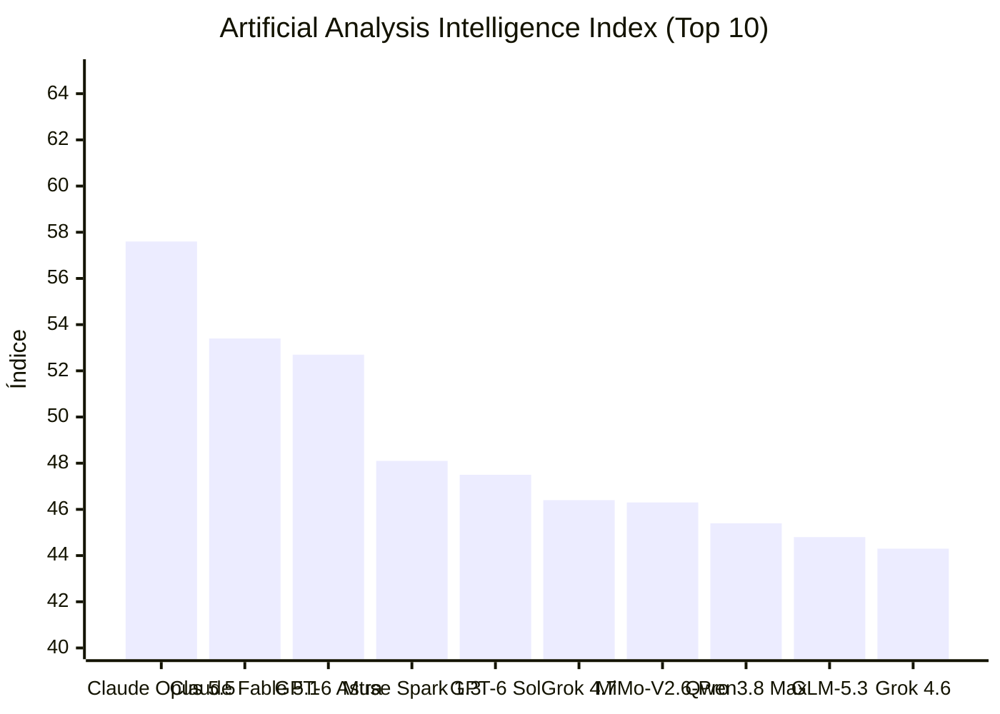


# Claude Opus 5.5 domina benchmarks, enquanto Discordões do GitHub Copilot e Reddit afetam adoções

**Período analisado:** 23/09/2026 a 24/09/2026 · 9 pautas · 5 fontes primárias · 4 sinais da comunidade

## Em 30 segundos

- **GLM‑5.3‑Prime entrega throughput 1,5‑2× maior** — O modelo GLM‑5.3‑Prime, variante de alta velocidade da Z.ai, entrega 1,5‑2× mais saída por segundo que o GLM‑5.3 tradicional, mantendo 1M de tokens de contexto.
- **Qwen3.8 Max Prime aposta em throughput multimídia** — Qwen3.8‑Max‑Prime, SKU distinto com 1M de tokens de contexto, aceita texto, imagem e vídeo, oferecendo maior throughput que o Qwen3.8‑Max.
- **Agenda de long‑horizon em foco com 'Tasteful Agent'** — Novo benchmark, 'The Tasteful Agent', mede a capacidade de agentes em tomar decisões de longo prazo, avaliando hipóteses e implementações.
- **LiteLLM v1.101.2 garante imagens Docker assinadas** — A nova release traz assinatura de imagem cosign, com chave de commit fixo, para garantir que o container não foi alterado.
- **Node 20 sai do GitHub Actions, mudando runners para Node 24** — O runner do GitHub Actions passou a usar Node 24, encerrando suporte ao Node 20.
- **Usuário no VS Code bloqueia botão 'Agents window'** — Comunidade relatou que, mesmo com IA desativada, aparece botão 'Agents window' após atualização, solicitando ocultação.
- **Opus 5.5 gera video render de alta qualidade em uma linha** — Usuário bem‑não testou Opus 5.5 e obteve vídeo 16:9 com música só com um prompt simples.
- **Opus 5.5 força ajustes finos de front‑end em projeto de jogo** — Game designer usou Opus 5.5 como revisor, o que exigiu orientar a IA passo a passo para corrigir inconsistências de design.
- **GPT‑6 Sol é apenas re‑nome do GPT‑6 Terra** — Usuários identificaram que o modelo GPT‑6 Sol foi renomeado de GPT‑6 Terra, alterando percepção de performance.

## Destaques

### Modelos e pesquisa

#### GLM‑5.3‑Prime entrega throughput 1,5‑2× maior

GLM‑5.3‑Prime, variante de alta velocidade da Z.ai, mantém 1 M‑token de contexto do GLM‑5.3 original e entrega de 1,5 a 2 vezes mais saída por segundo, graças a acelerar a inferência. Essa diferença se manifesta em tempos de resposta reduzidos e maior taxa de tokens processados por unidade de tempo.

Para quem constrói e opera pipelines de IA, a variação de throughput traz economia na infraestrutura de inferência, permitindo reduzir a quantidade de instâncias e, consequentemente, a cobrança de cloud. No entanto, a evidência disponível não detalha variação de custo por token nem latência de instância, então a redução real de orçamento pode depender de cenários específicos de carga e de escolha de provedor de nuvem.

*[Fonte: Z.ai: GLM 5.3 Prime](https://openrouter.ai/z-ai/glm-5.3-prime) · OpenRouter: New Models · fonte primária*

#### Qwen3.8 Max Prime aposta em throughput multimídia

Qwen3.8‑Max‑Prime foi anunciado como um SKU distinto do Qwen3.8‑Max, com capacidade de 1 million de tokens de contexto, aceita texto, imagem e vídeo, e entrega throughput maior que o modelo anterior.

Para desenvolvedores e operadores, isso significa que pipelines multimodais podem processar consultas simultâneas em vídeo sem necessidade de escalonar GPUs para cada lote, reduzindo latência de inferência e custo de infraestrutura. A limitação permanece na ausência de benchmark público que quantifique o ganho real em cenários de carga variável, então a adoção exigirá testes internos para confirmar a vantagem no seu caso de uso.

*[Fonte: Qwen: Qwen3.8 Max Prime](https://openrouter.ai/qwen/qwen3.8-max-prime) · OpenRouter: New Models · fonte primária*

#### LiteLLM v1.101.2 garante imagens Docker assinadas

LiteLLM v1.101.2 inclui assinatura de imagens Docker com cosign usando a mesma chave de commit 0112e53, garantindo que cada release possa ser verificada criptograficamente por meio do hash do commit.

Para desenvolvedores, isso significa que, ao puxar a imagem do gerenciador de pacotes, o pipeline pode validar a assinatura antes da execução, reduzindo a possibilidade de código alterado chegar ao ambiente de inferência. A prática exige a integração de cosign nos scripts de CI/CD e a atualização dos repositórios de chaves públicas. Embora a validação seja robusta, ainda há incerteza se a chave pública seja entregue de forma segura em todas as distribuições.

*[Fonte: v1.101.2](https://github.com/BerriAI/litellm/releases/tag/v1.101.2) · LiteLLM Releases · fonte primária*

#### Opus 5.5 gera video render de alta qualidade em uma linha

Usuário testou o Opus 5.5 e, com um prompt simples, gerou em uma única linha de código um vídeo 16:9 com música para o Nomad Tracker, mostrando qualidade industrial. O resultado foi considerado “amazing” pelo autor, evidenciando que o modelo já produz conteúdos visuais prontos para uso direto.

Para quem desenvolve e opera softwares de IA, isso reduz a necessidade de pipelines de pós‑produção, pois a geração de video já inclui coreografia sonora e proporção adequada. Contudo, o experimento está limitado a um único caso do usuário e não fornece métricas de latência, escalabilidade ou estabilidade sob carga, permanecendo a dúvida sobre desempenho em produção e integração com sistemas existentes.

*[Fonte: Opus 5.5 Amazing video render](https://www.reddit.com/r/ClaudeCode/comments/1wot1gs/opus_55_amazing_video_render/) · Reddit: ClaudeCode · sinal da comunidade*

#### Opus 5.5 força ajustes finos de front‑end em projeto de jogo

Game designer usou Opus 5.5 como revisor, o que exigiu orientar a IA passo a passo para corrigir inconsistências de design.

Demonstra necessidade de controle de qualidade em prompts de IA para evitar super‑entregas e retrabalho em projetos interativos.

*[Fonte: got mogged by claude opus 😭](https://www.reddit.com/r/ClaudeCode/comments/1wov62z/got_mogged_by_claude_opus/) · Reddit: ClaudeCode · sinal da comunidade*

### Agentes e ferramentas de desenvolvimento

#### Agenda de long‑horizon em foco com 'Tasteful Agent'

O benchmark "The Tasteful Agent" introduz métricas para avaliar a qualidade de decisões intermediárias — escolha de hipóteses e implementações — que determinam o sucesso final de agentes em tarefas de longo horizonte, preenchendo lacuna dos testes atuais focados apenas no resultado ponta a ponta.

Na prática, equipes passam a dispor de sinais objetivos para ajustar policies nas pipelines de trade-off entre custo e tempo de execução, permitindo podar ramificações ruins antes que consumam orçamento. A evidência não esclarece, contudo, se as métricas generalizam domínios fora de engenharia e pesquisa nem o custo computacional de medição contínua do "gosto" durante a inferência.

*[Fonte: The Tasteful Agent: Measuring and Improving Taste in Long-Horizon Tasks](https://huggingface.co/papers/2609.25804) · HF Daily Papers · fonte primária*

#### Node 20 sai do GitHub Actions, mudando runners para Node 24

O GitHub removeu o Node 20 dos runners do GitHub Actions, passando a usar exclusivamente o Node 24 para execução de workflows que envolvem ações JavaScript. Essa mudança foi comunicada como a notificação final, encerrando o suporte ao ambiente anterior sem possibilidade de reversão automática.

Para equipes que operam pipelines de CI dependentes de comportamentos específicos do Node 20, como pacotes nativos ou APIs descontinuadas, há risco de falha em builds que não foram atualizados. A evidência não confirma se há margem de teste prolongado ou se o opt-out baseado em variáveis de ambiente foi totalmente desativado, deixando em aberto o grau de flexibilidade imediata para adaptação.

*[Fonte: Node 20 is no longer available in GitHub Actions](https://github.blog/changelog/2026-09-23-node-20-is-no-longer-available-in-github-actions) · GitHub Changelog · fonte primária*

#### Usuário no VS Code bloqueia botão 'Agents window'

Comunidade relatou que, mesmo com IA desativada, aparece botão 'Agents window' após atualização, solicitando ocultação.

A presença inesperada pode gerar inseguranças de segurança e UX, exigindo revisão de configurações de extensão.

*[Fonte: Reddit: Is there any way to disable the "Agents window" button ?](https://www.reddit.com/r/vscode/comments/1wovtez/is_there_any_way_to_disable_the_agents_window/#community-signals) · Reddit r/vscode · sinal da comunidade*

#### GPT‑6 Sol é apenas re‑nome do GPT‑6 Terra

Usuários do r/codex identificaram que o modelo GPT‑6 Sol foi simplesmente renomeado de GPT‑6 Terra, alterando a percepção de desempenho baseada em benchmarks. A diferença de nomenclatura fez o GPT‑6 Sol alcançar notas 5.6 superiores sem alteração técnica substancial.

Para quem constrói e opera aplicações, isso implica que comparações de desempenho entre versões podem estar distorcidas. A decisão de adoção pode ser influenciada por uma percepção enganosa de melhorias, aumentando o risco de escolher um modelo sem ganhos reais. A evidência permanece limitada a um relato comunitário, sem validação independente ou dados de benchmark detalhados, deixando dúvida sobre a verdadeira equivalência de performance.

*[Fonte: Reddit: GPT-6 Sol is just GPT-6 Terra renamed as Sol](https://www.reddit.com/r/codex/comments/1wnrh08/gpt6_sol_is_just_gpt6_terra_renamed_as_sol/#community-signals) · Reddit r/codex · sinal da comunidade*

## Leitura do conjunto

O panorama de 24/09 aponta que a evolução de throughput continua centrada em modelos como GLM‑5.3‑Prime e Qwen3.8‑Max Prime, ambos anunciados oficialmente, e que trazem estratégias de descrepância de custos e velocidade em pipelines de dados. Enquanto isso, a comunidade reproduz desafios de UX: o botao 'Agents window' insistente nos ambientes VS Code Copilot e a falta de clareza nas atualizações de planos. Esses relatos combinam uma dose crua de frustração com a promessa de inovação, exibindo que a adoção de IA ainda requer ajustes finos de infraestrutura e experiência do usuário. Dentre os grupos de usuários, a discussão sobre Opus 5.5 evidencia que a qualidade de saída visual já ultrapassa a capacidade de criação de vídeo tradicional, mas não sem exigir atenção a créditos de máquina e orientação de prompts. Por fim, a identificação de que GPT‑6 Sol na verdade é GPT‑6 Terra destaca a necessidade de vigilância em nomenclatura de modelos para manter comparações de desempenho confiáveis em ambientes corporativos. 

## Índice de Inteligência (Artificial Analysis)

> **Status de Atualização:** Sem alterações no ranking de inteligência em relação à medição anterior.

| # | Modelo | Criador | Score | Variação | Tipo |
|---|---|---|---|---|---|
| 1 | [Claude Opus 5.5](https://artificialanalysis.ai/models#intelligence) | Anthropic | 57.6 | = | Proprietário |
| 2 | [Claude Fable 5.1](https://artificialanalysis.ai/models#intelligence) | Anthropic | 53.4 | = | Proprietário |
| 3 | [GPT-6 Astra](https://artificialanalysis.ai/models#intelligence) | OpenAI | 52.7 | = | Proprietário |
| 4 | [Muse Spark 1.3](https://artificialanalysis.ai/models#intelligence) | Meta | 48.1 | = | Proprietário |
| 5 | [GPT-6 Sol](https://artificialanalysis.ai/models#intelligence) | OpenAI | 47.5 | = | Proprietário |
| 6 | [Grok 4.7](https://artificialanalysis.ai/models#intelligence) | SpaceXAI | 46.4 | = | Proprietário |
| 7 | [MiMo-V2.6-Pro](https://artificialanalysis.ai/models#intelligence) | Xiaomi | 46.3 | = | Pesos Abertos |
| 8 | [Qwen3.8 Max](https://artificialanalysis.ai/models#intelligence) | Alibaba | 45.4 | = | Proprietário |
| 9 | [GLM-5.3](https://artificialanalysis.ai/models#intelligence) | Z AI | 44.8 | = | Pesos Abertos |
| 10 | [Grok 4.6](https://artificialanalysis.ai/models#intelligence) | SpaceXAI | 44.3 | = | Proprietário |

*Fonte: [Artificial Analysis Intelligence Index](https://artificialanalysis.ai/models#intelligence). Monitoramento e análise diária de capacidade de modelos de fronteira.*

## Fontes e Referências

1. [Z.ai: GLM 5.3 Prime](https://openrouter.ai/z-ai/glm-5.3-prime) — OpenRouter: New Models
2. [Qwen: Qwen3.8 Max Prime](https://openrouter.ai/qwen/qwen3.8-max-prime) — OpenRouter: New Models
3. [The Tasteful Agent: Measuring and Improving Taste in Long-Horizon Tasks](https://huggingface.co/papers/2609.25804) — HF Daily Papers
4. [v1.101.2](https://github.com/BerriAI/litellm/releases/tag/v1.101.2) — LiteLLM Releases
5. [Node 20 is no longer available in GitHub Actions](https://github.blog/changelog/2026-09-23-node-20-is-no-longer-available-in-github-actions) — GitHub Changelog
6. [Reddit: Is there any way to disable the "Agents window" button ?](https://www.reddit.com/r/vscode/comments/1wovtez/is_there_any_way_to_disable_the_agents_window/#community-signals) — Reddit Post Signals (vscode)
7. [Opus 5.5 Amazing video render](https://www.reddit.com/r/ClaudeCode/comments/1wot1gs/opus_55_amazing_video_render/) — Reddit: ClaudeCode
8. [got mogged by claude opus 😭](https://www.reddit.com/r/ClaudeCode/comments/1wov62z/got_mogged_by_claude_opus/) — Reddit: ClaudeCode
9. [Reddit: GPT-6 Sol is just GPT-6 Terra renamed as Sol](https://www.reddit.com/r/codex/comments/1wnrh08/gpt6_sol_is_just_gpt6_terra_renamed_as_sol/#community-signals) — Reddit Post Signals (codex)

---

*Gerado por: cloud/auto*


---
*Gerado por evo-agent - agente auto-aprimorante em 2026-09-24.*
