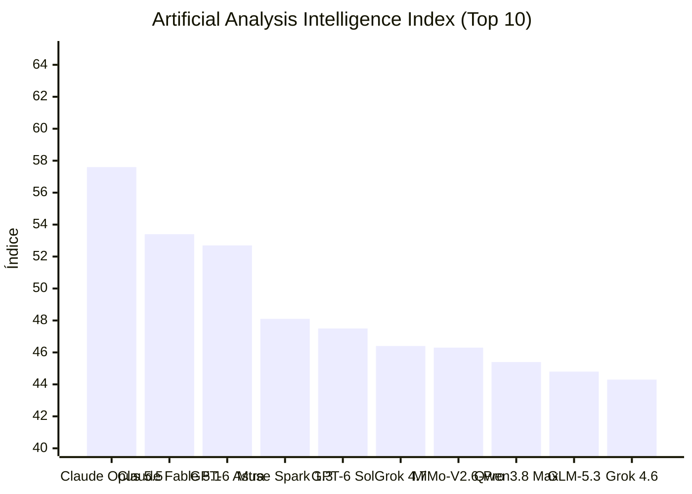


# Claude Opus 5.5, Ollama RC0 e Reação Comunitária sobre Codex e Copilot

**Período analisado:** 23/09/2026 a 25/09/2026 · 11 pautas · 3 fontes primárias · 8 sinais da comunidade

## Em 30 segundos

- **Ollama lança suporte a manifest‑list e migração lazy** — Ollama v0.40.0‑rc0 introduz armazenamento de manifest‑list, migração preguiçosa de GGUFs antigos para compatíveis com llama.cpp e mantém tags v1 como anchors.
- **Claude Code 2.1.282 expõe opções de telemetria e largura de texto** — Nova configuração maxProseWidth limita a largura de saída em terminais largos, mantendo blocos de código completos.
- **Cline v4.1.21 adiciona provider ai& e muda modelos padrão** — Provider ai& para modelos de código aberto no Japão; catálogo atualizado para 6,386 modelos; 11 provedores mudaram o padrão para Claude Opus 5.5.
- **Usuário relata queda de uso ao migrar de Sol‑5.6 para Sol‑6 Medium** — Pelo Reddit, o uso do modelo Sol‑6 Medium permaneceu igual ao Sol‑5.6 Medium, 24h = 16% do escopo de 5h, sem variação de custo.
- **Verificação de cota de GPT‑6 em testes** — Usuário mediu 5‑hora de limites com GPT‑6 Luna, Terra Sol e Astra, reportando menor custo e consumo consistente.
- **Codex apresenta latência 100× maior que lançamentos anteriores** — Por Reddit, Codex passou a demorar 20 minutos para respostas e de 6‑8 horas para concluir tarefas, contrastando com 5‑10 minutos pré‑modelo.
- **Usuário recomenda Claude Opus 5.5 sobre Sol‑5.6** — Post indica que Claude Opus 5.5 consome tokens à metade da taxa, tem 2× menor custo e produz respostas mais enxutas que Sol‑5.6.
- **Fluxo de design de IU baseado em etapas de AI** — Usuário descreve prática de UI: separar guias, Wireframes e implementação; utiliza ChatGPT Instant para brainstorming, clareando papel das tarefas.
- **Astra lento vs Sol‑5.6 em throughput** — Comentários relatam 30 TPS em Astra e 50 TPS em Sol‑5.6/5.6‑Sol.
- **Debate sobre a obsolescência do loop agente LLM** — Reddit destaca que o padrão LLM‑call‑tool‑call falha em aproveitar sistemas de fast/slow thinking, propondo conceito Agent 2.0.
- **Mofo de mascote para assistente de código no VS Code** — Comunidade escolheu um borboleta em pixel art; debate sobre postura e função para melhor visibilidade na extensão.

## Destaques

### Infraestrutura e eficiência

#### Ollama lança suporte a manifest‑list e migração lazy

Ollama v0.40.0‑rc0 introduz armazenamento de manifest‑list, migração preguiçosa de GGUFs antigos para compatíveis com llama.cpp e mantém tags v1 como anchors.  Comando expandido para copy/push/list

Facilita coexistência de runners personalizados, reduz conflitos de dependência e simplifica upgrades em infraestruturas heterogêneas.

*[Fonte: v0.40.0-rc0: llama-server: prepare to remove compatibility patch](https://github.com/ollama/ollama/releases/tag/v0.40.0-rc0) · Ollama Releases · fonte primária*

### Agentes e ferramentas de desenvolvimento

#### Claude Code 2.1.282 expõe opções de telemetria e largura de texto

Nova configuração maxProseWidth limita a largura de saída em terminais largos, mantendo blocos de código completos. Acrescentado /status e claude doctor para diagnosticar telemetria.

Garante conforto visual e diagnóstico rápido, melhorando experiência de desenvolvedores em terminais extensos.

*[Fonte: v2.1.282](https://github.com/anthropics/claude-code/releases/tag/v2.1.282) · Claude Code Releases · fonte primária*

#### Cline v4.1.21 adiciona provider ai& e muda modelos padrão

Provider ai& para modelos de código aberto no Japão; catálogo atualizado para 6,386 modelos; 11 provedores mudaram o padrão para Claude Opus 5.5.

Amplia oferta de modelos com menor latência e custos, e influencia escolhas de provider em pipelines de IA.

*[Fonte: v4.1.21](https://github.com/cline/cline/releases/tag/v4.1.21) · Cline Releases · fonte primária*

#### Usuário relata queda de uso ao migrar de Sol‑5.6 para Sol‑6 Medium

O usuário relatou que ao migrar de Sol‑5.6 Medium para Sol‑6 Medium o uso diário permaneceu em 100% durante 5 horas, equivalente a 16% do escopo semanal, sem variação observada. Isso indica que não houve aumento nem redução de consumo de tokens entre as versões testadas.

Na prática, isso sugere ausência de ponto de ruptura nas métricas de uso, o que simplifica o planejamento de alocação de créditos de API para equipes que dependem de modelos médios. Entretanto, a evidência ainda não confirma se o comportamento se mantém em cargas diferentes ou em outros projetos, deixando em aberto a questão de possível variação sob condições de uso não testadas.

*[Fonte: Have you got more usage with Sol-6 (Terra?) on your sub?](https://www.reddit.com/r/codex/comments/1woyp4q/have_you_got_more_usage_with_sol6_terra_on_your/) · Reddit: Codex · sinal da comunidade*

#### Verificação de cota de GPT‑6 em testes

Usuário mediu o consumo de GPT‑6 Luna, Terra Sol e Astra em janelas de cinco horas, mostrando que os limites são simples de acompanhar e que o custo real ficou abaixo do esperado, com Promo Sol a US$ 18 por cinco horas. A medição usou o Pi para contar tokens relatados pelo upstream, repetindo o teste em janelas limpas e sem uso de contexto longo.

Para quem desenvolve e opera sistemas com IA, isso traz uma base para comparar modelos por custo‑por‑token em produção, embora a evidência ainda não diga como o desempenho varia sob carga contínua ou com contextos extensos, deixando aberta a questão de se o baixo consumo se mantém em cenários reais de uso prolongado.

*[Fonte: Allowance for GPT 6 Luna, Sol and Astra - measured](https://www.reddit.com/r/codex/comments/1wp0v6x/allowance_for_gpt_6_luna_sol_and_astra_measured/) · Reddit: Codex · sinal da comunidade*

#### Codex apresenta latência 100× maior que lançamentos anteriores

O Codex apresenta latência drasticamente superior após o lançamento de novos modelos. Relatos indicam que o processamento inicial de respostas agora leva 20 minutos e a conclusão de tarefas consome entre 6 e 8 horas, enquanto operações similares levavam de 5 a 10 minutos anteriormente.

A lentidão compromete ciclos de entrega e exige o redesenho de pipelines de QA. Gerentes de produto enfrentam dificuldades no planejamento de prazos devido à instabilidade da performance. Permanece a incerteza se a degradação é generalizada ou restrita a usuários específicos.

*[Fonte: Extremely Slow](https://www.reddit.com/r/codex/comments/1wp32oj/extremely_slow/) · Reddit: Codex · sinal da comunidade*

#### Usuário recomenda Claude Opus 5.5 sobre Sol‑5.6

Post indica que Claude Opus 5.5 consome tokens à metade da taxa, tem 2× menor custo e produz respostas mais enxutas que Sol‑5.6.

Influencia decisões de migração de modelos e otimização de plano de custos.

*[Fonte: You need to try opus 5.5](https://www.reddit.com/r/codex/comments/1wp3bzl/you_need_to_try_opus_55/) · Reddit: Codex · sinal da comunidade*

#### Fluxo de design de IU baseado em etapas de AI

Um desenvolvedor web propõe um fluxo de design de interface dividido em três etapas distintas: criação do guia de estilo, definição da arquitetura de informação com wireframes e implementação do produto. Para a fase de brainstorming e definição da linguagem visual, ele utiliza o ChatGPT Instant, separando a concepção da execução técnica.

Essa segmentação operacional otimiza a entrega da IA ao isolar contextos, evitando a sobrecarga de tarefas em um único prompt. Na prática, a estratégia reduz erros de design ao tratar a identidade visual e a estrutura como ativos independentes. Resta a incerteza sobre a escalabilidade desse método em projetos de alta complexidade ou com equipes multidisciplinares.

*[Fonte: A Workflow for Design: Style Guide, Wireframes, Profit.](https://www.reddit.com/r/codex/comments/1wp3fdl/a_workflow_for_design_style_guide_wireframes/) · Reddit: Codex · sinal da comunidade*

#### Astra lento vs Sol‑5.6 em throughput

Os comentários relatam que o modelo Astra entrega cerca de 30 TPS, enquanto Sol‑5.6 atinge 50 TPS. O benchmark citado indica que 5.6 Sol chega a 73 TPS na prática, mostrando uma diferença real entre versões.

Isso afeta diretamente o dimensionamento de pipelines de geração em lote, pois a velocidade de saída define o número de instâncias necessárias. A evidência ainda não detalha a variação entre cargas de trabalho nem o consumo de recursos associado, deixando em aberto o custo operacional real de cada opção.

*[Fonte: PSA: Astra feels slow, because it is in Codex.](https://www.reddit.com/r/codex/comments/1wp3mon/psa_astra_feels_slow_because_it_is_in_codex/) · Reddit: Codex · sinal da comunidade*

#### Debate sobre a obsolescência do loop agente LLM

Reddit destaca que o padrão LLM‑call‑tool‑call falha em aproveitar sistemas de fast/slow thinking, propondo conceito Agent 2.0.

Orientação de arquitetura de agentes, apontando direção para futuras bases de Planejamento/Roasting.

*[Fonte: The Agentic Loop is OUTDATED](https://www.reddit.com/r/ClaudeCode/comments/1wp9nga/the_agentic_loop_is_outdated/) · Reddit: ClaudeCode · sinal da comunidade*

### Engenharia e ecossistema

#### Mofo de mascote para assistente de código no VS Code

A comunidade do r/vscode escolheu um borboleta em pixel art como mascote para um assistente de código em desenvolvimento, após votação entre sete opções apresentadas pelo autor. O foco da discussão girau em torno da pose ideal — frente, lado, voando ou pousada — para garantir boa visibilidade no terminal e futura integração com o VS Code.

Na prática, a decisão influencia diretamente o design da interface do assistente, afetando reconhecimento rápido pelo usuário e coesão visual da extensão. Porém, a evidência não revela se a mascote escolhida será usada em todos os modos de operação ou apenas em contextos específicos, deixando aberto o impacto real sobre adoção e usabilidade em ambientes de desenvolvimento profissionais.

*[Fonte: Reddit: Help me pick a mascot for my coding assistant: 7 pixel art butterflies](https://www.reddit.com/r/vscode/comments/1wp99ev/help_me_pick_a_mascot_for_my_coding_assistant_7/#community-signals) · Reddit r/vscode · sinal da comunidade*

## Leitura do conjunto

O período revela uma transição técnica focada na eficiência de infraestrutura e na refinação da interface de desenvolvimento. O Ollama avança na gestão de manifest-list e migração de GGUFs, enquanto o Claude Code e o Cline priorizam a telemetria e a expansão de catálogos de modelos. A adoção de fluxos de design segmentados e a criação de mascotes para extensões de IDE mostram que a experiência do usuário agora busca clareza operacional e visual para organizar tarefas complexas de IA.

Contradições surgem na performance e no custo entre modelos de ponta. Enquanto o Claude Opus 5.5 é apontado como mais econômico e enxuto que o Sol-5.6, o Astra apresenta throughput inferior ao Sol-5.6. A latência crítica do Codex e a estabilidade de cotas do GPT-6 expõem instabilidades na entrega de respostas. Permanece sem solução a eficácia do loop de agentes LLM, cuja falha em integrar fast e slow thinking impulsiona a busca por uma arquitetura Agent 2.0.

## Índice de Inteligência (Artificial Analysis)

> **Status de Atualização:** Sem alterações no ranking de inteligência em relação à medição anterior.

| # | Modelo | Criador | Score | Variação | Tipo |
|---|---|---|---|---|---|
| 1 | [Claude Opus 5.5](https://artificialanalysis.ai/models#intelligence) | Anthropic | 57.6 | = | Proprietário |
| 2 | [Claude Fable 5.1](https://artificialanalysis.ai/models#intelligence) | Anthropic | 53.4 | = | Proprietário |
| 3 | [GPT-6 Astra](https://artificialanalysis.ai/models#intelligence) | OpenAI | 52.7 | = | Proprietário |
| 4 | [Muse Spark 1.3](https://artificialanalysis.ai/models#intelligence) | Meta | 48.1 | = | Proprietário |
| 5 | [GPT-6 Sol](https://artificialanalysis.ai/models#intelligence) | OpenAI | 47.5 | = | Proprietário |
| 6 | [Grok 4.7](https://artificialanalysis.ai/models#intelligence) | SpaceXAI | 46.4 | = | Proprietário |
| 7 | [MiMo-V2.6-Pro](https://artificialanalysis.ai/models#intelligence) | Xiaomi | 46.3 | = | Pesos Abertos |
| 8 | [Qwen3.8 Max](https://artificialanalysis.ai/models#intelligence) | Alibaba | 45.4 | = | Proprietário |
| 9 | [GLM-5.3](https://artificialanalysis.ai/models#intelligence) | Z AI | 44.8 | = | Pesos Abertos |
| 10 | [Grok 4.6](https://artificialanalysis.ai/models#intelligence) | SpaceXAI | 44.3 | = | Proprietário |

*Fonte: [Artificial Analysis Intelligence Index](https://artificialanalysis.ai/models#intelligence). Monitoramento e análise diária de capacidade de modelos de fronteira.*

## Fontes e Referências

1. [v0.40.0-rc0: llama-server: prepare to remove compatibility patch](https://github.com/ollama/ollama/releases/tag/v0.40.0-rc0) — Ollama Releases
2. [v2.1.282](https://github.com/anthropics/claude-code/releases/tag/v2.1.282) — Claude Code Releases
3. [v4.1.21](https://github.com/cline/cline/releases/tag/v4.1.21) — Cline Releases
4. [Have you got more usage with Sol-6 (Terra?) on your sub?](https://www.reddit.com/r/codex/comments/1woyp4q/have_you_got_more_usage_with_sol6_terra_on_your/) — Reddit: Codex
5. [Allowance for GPT 6 Luna, Sol and Astra - measured](https://www.reddit.com/r/codex/comments/1wp0v6x/allowance_for_gpt_6_luna_sol_and_astra_measured/) — Reddit: Codex
6. [Extremely Slow](https://www.reddit.com/r/codex/comments/1wp32oj/extremely_slow/) — Reddit: Codex
7. [You need to try opus 5.5](https://www.reddit.com/r/codex/comments/1wp3bzl/you_need_to_try_opus_55/) — Reddit: Codex
8. [A Workflow for Design: Style Guide, Wireframes, Profit.](https://www.reddit.com/r/codex/comments/1wp3fdl/a_workflow_for_design_style_guide_wireframes/) — Reddit: Codex
9. [PSA: Astra feels slow, because it is in Codex.](https://www.reddit.com/r/codex/comments/1wp3mon/psa_astra_feels_slow_because_it_is_in_codex/) — Reddit: Codex
10. [The Agentic Loop is OUTDATED](https://www.reddit.com/r/ClaudeCode/comments/1wp9nga/the_agentic_loop_is_outdated/) — Reddit: ClaudeCode
11. [Reddit: Help me pick a mascot for my coding assistant: 7 pixel art butterflies](https://www.reddit.com/r/vscode/comments/1wp99ev/help_me_pick_a_mascot_for_my_coding_assistant_7/#community-signals) — Reddit Post Signals (vscode)

---

*Gerado por: cloud/auto*


---
*Gerado por evo-agent - agente auto-aprimorante em 2026-09-25.*
