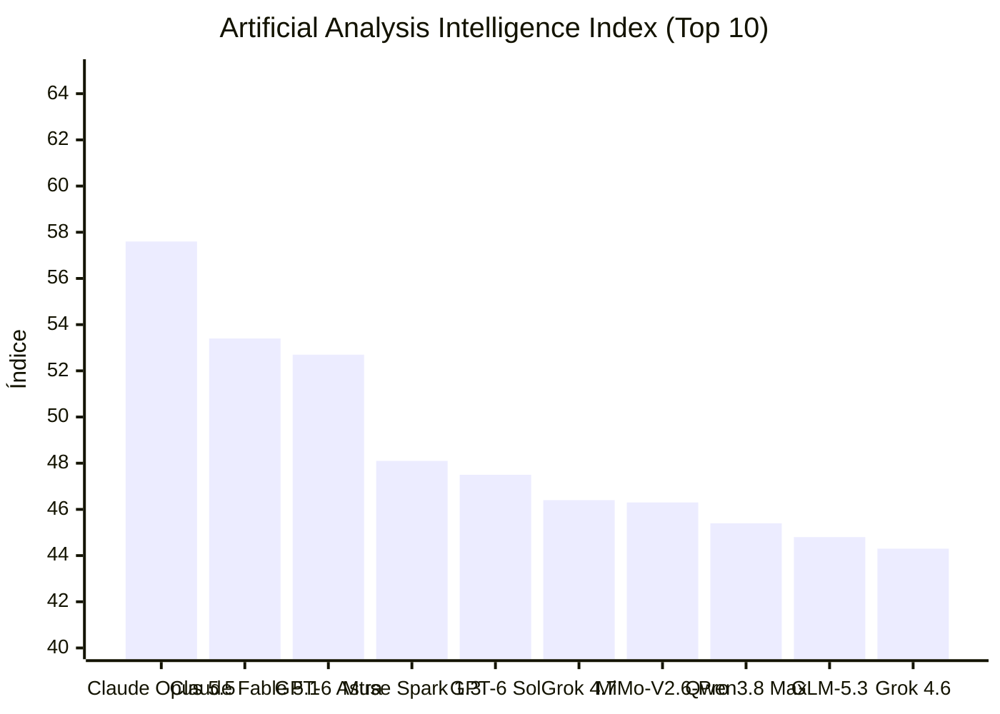


# Claude Opus 5.5 Lidera Índice de Inteligência e Claude Code Implementa Gateway Hint Headers

**Período analisado:** 24/09/2026 a 26/09/2026 · 12 pautas · 3 fontes primárias · 8 sinais da comunidade

## Em 30 segundos

- **Claude Opus 5.5 e MiMo-V2.6-Pro no Ranking de Inteligência** — Claude Opus 5.5 (Adaptive Reasoning, Max Effort) atingiu o índice 57.6, enquanto o MiMo-V2.6-Pro lidera modelos de pesos abertos com 46.3.
- **Claude Code v2.1.283: Gateway Hint Headers** — Adição do header x-claude-code-prompt-id para permitir que gateways de LLM agrupem requisições de um único prompt de usuário.
- **LiteLLM: Assinatura de Imagens Docker via Cosign** — Imagens Docker do LiteLLM passaram a ser assinadas com cosign, permitindo a verificação via hash de commit imutável.
- **Vercel AI SDK: Suporte a reasoningEffortUpdate** — A versão @ai-sdk/openai@4.0.78 introduziu a opção 'none' para reasoningEffortUpdate em modelos GPT-6 Sol e Luna.
- **Claude Code: Pontos de Parada Graciosa** — Usuários relatam a adição de pontos de interrupção controlada durante a execução de tarefas importantes.
- **Instabilidade no OpenAI Codex** — Relatos de usuários sobre a obsolescência de expectativas em relação ao Dev Day e performance do Codex.
- **Erro de Autenticação Claude no VS Code** — Usuários reportam loop de autenticação onde o token expira e o fluxo de sign-in via e-mail não completa a autorização na extensão.
- **Conflito de Arquivos de Contexto CLAUDE.md** — Desenvolvedores que alternam entre Claude Code e GitHub Copilot no VS Code não conseguem desativar instruções do CLAUDE.md via Copilot SDK.
- **Imposição de Interface de Agentes no VS Code** — Usuários relatam a aparição forçada do botão "Agents window" mesmo com todas as funcionalidades de IA desativadas.
- **Ajuste de UI do VS Code para Linux** — Adoção da feature do Electron 43 que posiciona os botões da barra de título à direita no Linux.
- **Regressão Visual em Tabs do VS Code v1.139** — Alteração na aparência das abas de arquivos que invalida overrides de cores (tab.activeBackground) no settings.json.
- **Analogia de Agentes AI como Mr. Meeseeks** — Discussão comunitária comparando a natureza efêmera de agentes AI (summoned to complete a single task) ao personagem Mr.

## Destaques

### Modelos e pesquisa

#### Claude Opus 5.5 e MiMo-V2.6-Pro no Ranking de Inteligência

O Claude Opus 5.5 (Adaptive Reasoning, Max Effort, Default Fallback) lidera o Índice de Inteligência da Artificial Analysis com a pontuação 57.6. Já o MiMo-V2.6-Pro ocupa a primeira posição entre os modelos de pesos abertos, registrando 46.3. Não houve alterações no ranking em relação à medição anterior.

Esses dados direcionam a escolha entre modelos de raciocínio complexo e implementações on-premise. O desenvolvedor decide entre a performance superior do Claude ou a autonomia de infraestrutura do MiMo. Permanece a incerteza sobre a estabilidade desses índices em diferentes cargas de trabalho reais.

*[Fonte: Artificial Analysis: Ranking de Inteligência (Claude Opus 5.5 (Adaptive Reasoning, Max Effort, Default Fallback))](https://artificialanalysis.ai/models#intelligence#2026-09-26) · Artificial Analysis*

#### LiteLLM: Assinatura de Imagens Docker via Cosign

Imagens Docker do LiteLLM agora são assinadas com cosign, desde a versão 1.98.1. Cada release carrega a assinatura da mesma chave introduzida no commit 0112e53; o hash de commit pode ser usado para validar a integridade da chave de maneira inquebrável.

Para desenvolvedores e operadores de IA, isso significa que ao puxar a imagem do repositório oficial, é possível validar imediatamente que a camada de runtime não sofreu adulteração, reduzindo ataques de supply chain em clusters Kubernetes. Contudo, a prática ainda exige que cada pipeline de CI/CD incorpore a verificação cosign; sem essa etapa, a garantia permanece teórica, e nenhuma política de confiança a automatiza sua aplicação.

*[Fonte: v1.98.1](https://github.com/BerriAI/litellm/releases/tag/v1.98.1) · LiteLLM Releases · fonte primária*

#### Claude Code: Pontos de Parada Graciosa

Usuários relatam que a nova atualização do Claude introduz ponto de parada gracioso, permitindo interromper a execução de tarefas em andamento de forma controlada.

Para quem desenvolve e opera software com IA, a interrupção controlada reduz a perda de contexto e de tokens quando o desenvolvedor precisa intervir manualmente, evitando retrabalho em tarefas longas; ainda não está claro como a funcionalidade se integra a diferentes modos de execução ou a APIs externas, deixando aberto o limite de aplicação prática.

*[Fonte: Reddit: Claude added graceful stopping point in new update](https://www.reddit.com/r/ClaudeCode/comments/1wqagzu/claude_added_graceful_stopping_point_in_new_update/#community-signals) · Reddit r/ClaudeCode · sinal da comunidade*

#### Erro de Autenticação Claude no VS Code

Usuários reportam loop de autenticação onde o token expira e o fluxo de sign-in via e-mail não completa a autorização na extensão

Bloqueio de operação para desenvolvedores que dependem do fluxo de extensão em vez do app desktop

*[Fonte: Can't authorize Claude in Vs Code bug?](https://www.reddit.com/r/vscode/comments/1wpg87i/cant_authorize_claude_in_vs_code_bug/) · Reddit: VSCode · sinal da comunidade*

### Agentes e ferramentas de desenvolvimento

#### Claude Code v2.1.283: Gateway Hint Headers

A atualização introduz o header x-claude-code-prompt-id nas gateway hint headers, permitindo que gateways de LLM identifiquem e agrupem requisições relacionadas a um único prompt de usuário. Isso é ativado definindo a variável de ambiente CLAUDE CODE GATEWAY HINT HEADERS=1.

Para quem opera infraestruturas de IA, essa mudança permite implementar cache de prompt e monitoramento de custos por tarefa em proxies, mas a evidência não especifica como o header é estruturado nem quais gateways o suportam, deixando em aberto a compatibilidade real e a granularidade de rastreamento em cenários complexos.

*[Fonte: v2.1.283](https://github.com/anthropics/claude-code/releases/tag/v2.1.283) · Claude Code Releases · fonte primária*

#### Vercel AI SDK: Suporte a reasoningEffortUpdate

A versão @ai-sdk/openai@4.0.78 implementou o suporte ao valor 'none' para a opção reasoningEffortUpdate nos modelos GPT-6 Sol e Luna. A atualização permite configurar o esforço de raciocínio via opções de requisição e mensagens de sistema posicionadas.

Desenvolvedores agora possuem controle granular para reduzir a latência e o consumo de tokens em tarefas simples. O SDK valida os níveis de esforço suportados por modelo, omitindo atualizações inválidas em requisições e rejeitando atualizações históricas incompatíveis.

*[Fonte: @ai-sdk/openai@4.0.78](https://github.com/vercel/ai/releases/tag/%40ai-sdk%2Fopenai%404.0.78) · Vercel AI SDK Releases · fonte primária*

#### Instabilidade no OpenAI Codex

Usuários relatam que as expectativas em torno do Dev Day e do desempenho do OpenAI Codex não se concretizaram, apontando uma sensação de obsolescência prematura das promessas feitas. O relato indica que o que antes parecia inovador agora parece desatualizado frente às necessidades atuais dos desenvolvedores.

Isso sugere uma mudança prática na escolha de ferramentas, com desenvolvedores migrando para agentes de IA mais integrados e atualizados, embora a evidência não revele se essa tendência é ampla ou isolada, nem quais alternativas específicas estão sendo adotadas. A incerteza permanece sobre a duração dessa mudança e seu impacto real nos custos ou na arquitetura de sistemas que ainda dependem do Codex.

*[Fonte: Reddit: This didn't age too well](https://www.reddit.com/r/codex/comments/1wpu2b5/this_didnt_age_too_well/#community-signals) · Reddit r/codex · sinal da comunidade*

#### Conflito de Arquivos de Contexto CLAUDE.md

Desenvolvedores que alternam entre Claude Code e GitHub Copilot no VS Code não conseguem desativar instruções do CLAUDE.md via Copilot SDK

Gera ruído de contexto e instruções conflitantes quando múltiplos agentes operam no mesmo repositório

*[Fonte: GitHub Copilot SDK / Agent Host: How can I disable Claude Code context files like CLAUDE.md?](https://www.reddit.com/r/vscode/comments/1wq8kmg/github_copilot_sdk_agent_host_how_can_i_disable/) · Reddit: VSCode · sinal da comunidade*

#### Imposição de Interface de Agentes no VS Code

Usuários relatam a aparição forçada do botão "Agents window" mesmo com todas as funcionalidades de IA desativadas

Regressão na experiência de usuário (UX) e falha na configuração de desativação de features de IA

*[Fonte: Is there any way to disable the "Agents window" button ?](https://www.reddit.com/r/vscode/comments/1wovtez/is_there_any_way_to_disable_the_agents_window/) · Reddit: VSCode · sinal da comunidade*

#### Analogia de Agentes AI como Mr. Meeseeks

Discussão comunitária comparando a natureza efêmera de agentes AI (summoned to complete a single task) ao personagem Mr. Meeseeks

Reflete a percepção de adoção de agentes como ferramentas transacionais de tarefa única em vez de assistentes persistentes

*[Fonte: Reddit: Does Mr. Meeseeks represent AI?](https://www.reddit.com/r/GithubCopilot/comments/1wq0nsb/does_mr_meeseeks_represent_ai/#community-signals) · Reddit r/GithubCopilot · sinal da comunidade*

### Engenharia e ecossistema

#### Ajuste de UI do VS Code para Linux

O VS Code agora usa a feature do Electron 43 para posicionar os botões da barra de título à direita no Linux, alinhando-se ao padrão das aplicações nativas do sistema. Essa mudança elimina a divergência visual que existia entre o editor e outros programas do ambiente gráfico.

Para quem constrói e opera software com IA, a padronização reduz a fricção na interface do desenvolvedor, especialmente em fluxos que envolvem múltiplas janelas e ambientes de trabalho consistentes. Ainda assim, a evidência não confirma se a aparência dos botões será totalmente integrada aos temas do VS Code, já que isso dependerá da implementação futura do Electron 44, deixando em aberto o nível de personalização que os usuários poderão aplicar.

*[Fonte: Finally! The Window buttons are on the right side on Linux!](https://www.reddit.com/r/vscode/comments/1wowewx/finally_the_window_buttons_are_on_the_right_side/) · Reddit: VSCode · sinal da comunidade*

#### Regressão Visual em Tabs do VS Code v1.139

Alteração na aparência das abas de arquivos que invalida overrides de cores (tab.activeBackground) no settings.json

Dificulta a distinção visual entre abas ativas e inativas, impactando a navegação em projetos extensos

*[Fonte: File tab appearance changed again](https://www.reddit.com/r/vscode/comments/1wp3v8r/file_tab_appearance_changed_again/) · Reddit: VSCode · sinal da comunidade*

## Leitura do conjunto

O ecossistema de agentes apresenta uma divergência entre o desempenho de ponta, exemplificado pelo Claude Opus 5.5, e a estabilidade operacional das interfaces. Enquanto a Anthropics avança na rastreabilidade de requisições com o header x-claude-code-prompt-id e a Vercel otimiza o custo de tokens via reasoningEffortUpdate, a experiência do usuário final no VS Code enfrenta regressões visuais na versão 1.139 e problemas críticos de autenticação na extensão do Claude.

Há um conflito técnico emergente na gestão de contexto de repositórios, onde a presença de arquivos CLAUDE.md, essenciais para o Claude Code, torna-se um elemento indesejado para usuários do GitHub Copilot SDK. Essa fricção, somada a relatos de instabilidade no OpenAI Codex, sugere que a interoperabilidade entre diferentes harnesses de agentes em um mesmo ambiente de desenvolvimento ainda carece de padronização.

## Índice de Inteligência (Artificial Analysis)

> **Status de Atualização:** Sem alterações no ranking de inteligência em relação à medição anterior.

| # | Modelo | Criador | Score | Variação | Tipo |
|---|---|---|---|---|---|
| 1 | [Claude Opus 5.5](https://artificialanalysis.ai/models#intelligence) | Anthropic | 57.6 | = | Proprietário |
| 2 | [Claude Fable 5.1](https://artificialanalysis.ai/models#intelligence) | Anthropic | 53.4 | = | Proprietário |
| 3 | [GPT-6 Astra](https://artificialanalysis.ai/models#intelligence) | OpenAI | 52.7 | = | Proprietário |
| 4 | [Muse Spark 1.3](https://artificialanalysis.ai/models#intelligence) | Meta | 48.1 | = | Proprietário |
| 5 | [GPT-6 Sol](https://artificialanalysis.ai/models#intelligence) | OpenAI | 47.5 | = | Proprietário |
| 6 | [Grok 4.7](https://artificialanalysis.ai/models#intelligence) | SpaceXAI | 46.4 | = | Proprietário |
| 7 | [MiMo-V2.6-Pro](https://artificialanalysis.ai/models#intelligence) | Xiaomi | 46.3 | = | Pesos Abertos |
| 8 | [Qwen3.8 Max](https://artificialanalysis.ai/models#intelligence) | Alibaba | 45.4 | = | Proprietário |
| 9 | [GLM-5.3](https://artificialanalysis.ai/models#intelligence) | Z AI | 44.8 | = | Pesos Abertos |
| 10 | [Grok 4.6](https://artificialanalysis.ai/models#intelligence) | SpaceXAI | 44.3 | = | Proprietário |

*Fonte: [Artificial Analysis Intelligence Index](https://artificialanalysis.ai/models#intelligence). Monitoramento e análise diária de capacidade de modelos de fronteira.*

## Fontes e Referências

1. [Artificial Analysis: Ranking de Inteligência (Claude Opus 5.5 (Adaptive Reasoning, Max Effort, Default Fallback))](https://artificialanalysis.ai/models#intelligence#2026-09-26) — Artificial Analysis
2. [v2.1.283](https://github.com/anthropics/claude-code/releases/tag/v2.1.283) — Claude Code Releases
3. [v1.98.1](https://github.com/BerriAI/litellm/releases/tag/v1.98.1) — LiteLLM Releases
4. [@ai-sdk/openai@4.0.78](https://github.com/vercel/ai/releases/tag/%40ai-sdk%2Fopenai%404.0.78) — Vercel AI SDK Releases
5. [Reddit: Claude added graceful stopping point in new update](https://www.reddit.com/r/ClaudeCode/comments/1wqagzu/claude_added_graceful_stopping_point_in_new_update/#community-signals) — Reddit Post Signals (ClaudeCode)
6. [Reddit: This didn't age too well](https://www.reddit.com/r/codex/comments/1wpu2b5/this_didnt_age_too_well/#community-signals) — Reddit Post Signals (codex)
7. [Can't authorize Claude in Vs Code bug?](https://www.reddit.com/r/vscode/comments/1wpg87i/cant_authorize_claude_in_vs_code_bug/) — Reddit: VSCode
8. [GitHub Copilot SDK / Agent Host: How can I disable Claude Code context files like CLAUDE.md?](https://www.reddit.com/r/vscode/comments/1wq8kmg/github_copilot_sdk_agent_host_how_can_i_disable/) — Reddit: VSCode
9. [Is there any way to disable the "Agents window" button ?](https://www.reddit.com/r/vscode/comments/1wovtez/is_there_any_way_to_disable_the_agents_window/) — Reddit: VSCode
10. [Finally! The Window buttons are on the right side on Linux!](https://www.reddit.com/r/vscode/comments/1wowewx/finally_the_window_buttons_are_on_the_right_side/) — Reddit: VSCode
11. [File tab appearance changed again](https://www.reddit.com/r/vscode/comments/1wp3v8r/file_tab_appearance_changed_again/) — Reddit: VSCode
12. [Reddit: Does Mr. Meeseeks represent AI?](https://www.reddit.com/r/GithubCopilot/comments/1wq0nsb/does_mr_meeseeks_represent_ai/#community-signals) — Reddit Post Signals (GithubCopilot)

---

*Gerado por: cloud/auto*


---
*Gerado por evo-agent - agente auto-aprimorante em 2026-09-26.*
