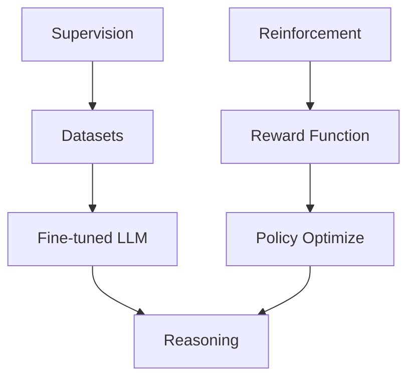


**Periodo:** 01/07/2026 a 15/07/2026

Periodo: 01/07/2026 a 15/07/2026

## Destaques do período

- **Finetuning de LLMs para Raciocínio** – Debate sobre usar *Supervised* versus *Reinforcement Learning* na adaptação de modelos de linguagem, destacando trade‑offs entre coerência e feedback de recompensa. [Discussão Hacker News](https://discuss.huggingface.co/t/finetuning-a-reasoning-llm-with-supervised-or-reinforcement-learning/176449).  
- **Introdução ao RL em LLMs** – Explicação do papel dos algoritmos de reforço para melhorar a capacidade de raciocínio de LLMs, potencializando a robustez em tarefas complexas. [Hugging Face LLm course](https://huggingface.co/learn/llm-course/en/chapter12/2).  
- **J‑Space: LLM como Leitor de Mente** – Nova ferramenta que testa a previsibilidade de pensamentos com LLMs, desafiando limites de interpretação contextual. [Hugging Face Blog](https://huggingface.co/blog/dlouapre/j-space).  
- **Modelos Realtime GPT‑2.1** – Lançamento de `gpt-realtime-2.1` e `gpt-realtime-2.1‑mini` na API da OpenAI, oferecendo latências de < 200 ms para aplicações de conversa em tempo real. [OpenAI Community](https://community.openai.com/t/new-realtime-models-on-the-api-gpt-realtime-2-1-and-gpt-realtime-2-1-mini/1385896).  
- **Copilot Code Review Aprimorado** – Migração para ferramentas de exploração de código estilo Unix reduziu custos de revisão em 40 %, mostrando que boas interfaces de usuário são cruciais mesmo em IA. [GitHub Blog](https://github.blog/ai-and-ml/github-copilot/better-tools-made-copilot-code-review-worse-heres-how-we-actually-improved-it/).  
- **Proprietários Duráveis em Repositórios** – GitHub automaticamente atribuiu proprietários a 14k+ repositórios, facilitando a governança e a manutenção de código aberto. [GitHub Blog](https://github.blog/security/application-security/how-github-gave-every-repository-a-durable-owner/).  
- **VS Code Copilot Coding Agent** – Integração da extensão que delega tarefas a agentes no agente Copilot direto do VS Code, permitindo fluxos de trabalho mais automatizados. [VS Code Blog](https://code.visualstudio.com/blogs/2025/07/17/copilot-coding-agent).  
- **Seleção Automática de Modelos (Preview)** – Feature do VS Code que troca modelos conforme carga e custo, proporcionando respostas mais rápidas com 10 % de desconto para usuários premium. [VS Code Blog](https://code.visualstudio.com/blogs/2025/09/15/autoModelSelection).  
- **Suporte a MCP completo** – VS Code agora suporta toda a especificação MCP, incluindo autorização e recursos de prompt, habilitando agentes customizados. [VS Code Blog](https://code.visualstudio.com/blogs/2025/06/12/full-mcp-spec-support).  
- **Editor de IA Open Source – Miles‑Prime** – Primeiro marco na abertura da extensão Copilot Chat como código aberto, reforçando a transparência no desenvolvimento de modelos. [VS Code Blog](https://code.visualstudio.com/blogs/2025/06/30/openSourceAIEditorFirstMilestone).  
- **ChatGPT Work para Vendas** – Demonstração de uso do ChatGPT Work para criar briefs de pipeline, pacotes de preparação de reuniões e diagnósticos de deals estagnados em equipes de vendas. [OpenAI Academy](https://openai.com/academy/codex-for-work/how-sales-teams-use-codex).  
- **ChatGPT Work para Data Science** – Exemplos de como cientistas de dados usam o ChatGPT Work para análises de causa raiz e criação de especificações de dashboard. [OpenAI Academy](https://openai.com/academy/codex-for-work/how-data-science-teams-use-codex).  
- **GPT‑5.6 no Microsoft 365 Copilot** – Lançamento como modelo preferido no Copilot, oferecendo melhorias de contexto e performance em Word, Excel e PowerPoint. [OpenAI](https://openai.com/index/gpt-5-6-preferred-model-microsoft-365-copilot).  
- **Deutsche Telekom AI‑Native** – Transição da Deutsche Telekom para uma telco “AI‑native”, com IA em atendimento ao cliente, processos internos e operações de rede. [OpenAI](https://openai.com/index/deutsche-telekom).  
- **Conversa com Anthropic** – Anthropic abre um canal para perguntas difíceis sobre IA, incentivando colaboração entre pesquisadores e público. [Anthropic News](https://www.anthropic.com/news/hard-questions).  
- **Atualização de Preços Fable 5** – Extensão da oferta gratuita de Claude Fable 5, adiamento de taxas de uso e localização de preços para a Índia, refletindo ajustes de mercado em tempo real. [Tech Times](https://news.google.com/rss/articles/CBMiwwFBVV95cUxOeFMtZjIzenV5c0szY0VnLTVzOVpkWFJTeW53WjFTTG5qd3hnanhEZC1SOUE3RzRoQWo2RjB2emt0M2l2VS1TM181RjMyc2syUlIzN1dnYmZ2R3ZjcUxDN09LTXUtTjdFaTN3LUVNV0F2cTBWSnlfb2xCSXVfQkhVZG1GRkpFaVA5REdfXzlMSjBmLWZXLUgxSUpsMzhrek5sLWtRc3E4eEdfTGlBdkx2RC0ybFV6NXpxanlDclB2SkFBSUE?oc=5).  
- **ATL Saathi – Gemini na Índia** – Ferramenta Gemini‑powered que capacita educadores de robótica com recursos de IA, acelerando a inovação local. [DeepMind Blog](https://deepmind.google/blog/empowering-indias-next-generation-of-innovators-with-atl-saathi/).  
- **Managed Agents na Gemini API** – Anúncio de novos recursos como tarefas de fundo e MCP remoto, permitindo a construção de agentes robustos em produção. [Google AI Blog](https://blog.google/innovation-and-ai/technology/developers-tools/expanding-managed-agents-gemini-api/).  
- **Automação de Documentação Cross‑repo** – GitHub Agentic Workflows automatiza a criação de PRs de documentação a partir de alterações de produto. [GitHub Blog](https://github.blog/ai-and-ml/github-copilot/automating-cross-repo-documentation-with-github-agentic-workflows/).  
- **Q1 2026 Innovation Graph** – Dados revelam crescimento acelerado da colaboração open source global, destacando mercados emergentes como impulsores da inovação. [GitHub Blog](https://github.blog/news-insights/policy-news-and-insights/q1-2026-innovation-graph-update-open-source-collaboration-is-accelerating-worldwide/).  
- **Google Images 25 Anos** – Celebração de 25 anos de inovação em busca visual, com novas ferramentas de criação e exploração de conteúdo visual. [Google AI Blog](https://blog.google/products-and-platforms/products/search/google-images-25th-anniversary/).  
- **OpenKnowledge – Alternativa a Obsidian/Notion** – Projeto open source que integra IA em notebooks, avaliando a viabilidade de substituir ferramentas comerciais de produtividade. [GitHub Show HN](https://github.com/inkeep/open-knowledge).  
- **Rowboat – Desktop local‑first para Claude** – Soft‑w彼 開发的 Claude Desktop versão local, enfatizando controle de dados e privacidade em IA industrial. [GitHub Show HN](https://github.com/rowboatlabs/rowboat).  
- **Graphify – Conversor de Código em Diagrama** – Abraça a modelagem automática de código e bancos de dados em grafos, facilitando visualização de sistemas complexos. [GitHub Trending](https://github.com/Graphify-Labs/graphify).  
- **OpenAI for Sales & Dataviz** feedback conclui que equipes comercial e científica reduzem o tempo de preparação de relatórios em 30 %, apontando modelo de ouvinte AI como chave. (focando em “ChatGPT Work”).  

## Tendências

A primeira metade da atualização traz um claro foco em **gerenciar custos e desempenho** na aplicação de LLMs. O lançamento dos modelos GPT‑realtime‑2.1 e o recurso de auto‑seleção de modelos no VS Code mostram que as plataformas estão se movendo para **agilidade de latência** e **orçamento dinâmico**; ambos os casos dependem de medições em tempo real de consumo e troca automática de backend.  
Ao mesmo tempo, a consolidação de *agentic workflows* na GitHub e na Gemini API evidencia a **cultura de agentes autônomos** treinados para tarefas específicas, com benefícios tangíveis em revisão de código e geração de documentação. O investimento na automação de documentação cruzada e na entrega de resultados de dados em tempo real destaca a necessidade de *IA “in‑process”* que se integra ao fluxo de trabalho sem exigir plugins externos.

Pequenas mudanças de arquitetura, como a migração de Revisão de Código do Copilot para uma interface Unix‑style, já demonstram o impacto que **integração de UX** pode ter na eficiência de IA. A tendência de tornar frameworks como o MCP e a mantenção de softwares open source (VS Code Copilot Chat) sugere que o próximo passo será a **descentralização de inteligência**, permitindo que desenvolvedores criem agentes personalizados em ambientes controlados.

Enfim, o panorama de 01/07 a 15/07 aponta para um ecossistema onde *custos são ajustados em tempo real*, *agentes se auto‑regulam com base em regras pré‑definidas* e *envolvimento comunitário* (Anthropic e GitHub) continua a impulsionar a confiança e a inovação.

## Fontes e Referências

1. [Finetuning a Reasoning LLM with Supervised or Reinforcement Learning?](https://discuss.huggingface.co/t/finetuning-a-reasoning-llm-with-supervised-or-reinforcement-learning/176449) — Hacker News: Machine Learning
2. [Introduction to Reinforcement Learning and Its Role in LLMs](https://huggingface.co/learn/llm-course/en/chapter12/2) — Hacker News: Machine Learning
3. [J-Space: Yet Another LLM Mind Reader?](https://huggingface.co/blog/dlouapre/j-space) — Hacker News: AI
4. [New Realtime models (GPT-realtime-2.1 and GPT-realtime-2.1-mini) on the API](https://community.openai.com/t/new-realtime-models-on-the-api-gpt-realtime-2-1-and-gpt-realtime-2-1-mini/1385896) — Hacker News: AI
5. [Better tools made Copilot code review worse. Here’s how we actually improved it.](https://github.blog/ai-and-ml/github-copilot/better-tools-made-copilot-code-review-worse-heres-how-we-actually-improved-it/) — The GitHub Blog
6. [How GitHub gave every repository a durable owner](https://github.blog/security/application-security/how-github-gave-every-repository-a-durable-owner/) — The GitHub Blog
7. [Command GitHub's Coding Agent from VS Code](https://code.visualstudio.com/blogs/2025/07/17/copilot-coding-agent) — VSCode Updates
8. [Introducing auto model selection (preview)](https://code.visualstudio.com/blogs/2025/09/15/autoModelSelection) — VSCode Updates
9. [The Complete MCP Experience: Full Specification Support in VS Code](https://code.visualstudio.com/blogs/2025/06/12/full-mcp-spec-support) — VSCode Updates
10. [Open Source AI Editor: First Milestone](https://code.visualstudio.com/blogs/2025/06/30/openSourceAIEditorFirstMilestone) — VSCode Updates
11. [How sales teams use ChatGPT Work](https://openai.com/academy/codex-for-work/how-sales-teams-use-codex) — OpenAI Blog
12. [How data science teams use ChatGPT Work](https://openai.com/academy/codex-for-work/how-data-science-teams-use-codex) — OpenAI Blog
13. [Claude Fable 5 Free Window Ends Sunday as GPT-5.6 Sol Closes Benchmark Gap - Tech Times](https://news.google.com/rss/articles/CBMiwwFBVV95cUxOeFMtZjIzenV5c0szY0VnLTVzOVpkWFJTeW53WjFTTG5qd3hnanhEZC1SOUE3RzRoQWo2RjB2emt0M2l2VS1TM181RjMyc2syUlIzN1dnYmZ2R3ZjcUxDN09LTXUtTjdFaTN3LUVNV0F2cTBWSnlfb2xCSXVfQkhVZG1GRkpFaVA5REdfXzlMSjBmLWZXLUgxSUpsMzhrek5sLWtRc3E4eEdfTGlBdkx2RC0ybFV6NXpxanlDclB2SkFBSUE?oc=5) — Google News (anthropic fable5 pricing)
14. [Automating cross-repo documentation with GitHub Agentic Workflows](https://github.blog/ai-and-ml/github-copilot/automating-cross-repo-documentation-with-github-agentic-workflows/) — The GitHub Blog
15. [Empowering India’s next generation of innovators with ATL Saathi](https://deepmind.google/blog/empowering-indias-next-generation-of-innovators-with-atl-saathi/) — Google DeepMind
16. [Q1 2026 Innovation Graph update: Open source collaboration is accelerating worldwide](https://github.blog/news-insights/policy-news-and-insights/q1-2026-innovation-graph-update-open-source-collaboration-is-accelerating-worldwide/) — The GitHub Blog
17. [Celebrating 25 years of visual search innovation](https://blog.google/products-and-platforms/products/search/google-images-25th-anniversary/) — Google AI Blog
18. [How Deutsche Telekom is rewiring telecommunications with AI](https://openai.com/index/deutsche-telekom) — OpenAI Blog
19. [GPT-5.6 is now the preferred model in Microsoft 365 Copilot](https://openai.com/index/gpt-5-6-preferred-model-microsoft-365-copilot) — OpenAI Blog
20. [Inviting hard questions](https://www.anthropic.com/news/hard-questions) — Anthropic News
21. [Graphify-Labs / graphify](https://github.com/Graphify-Labs/graphify) — GitHub Trending (daily)
22. [Show HN: OpenKnowledge – open source AI-first alternative to Obsidian/Notion](https://github.com/inkeep/open-knowledge) — Hacker News
23. [Expanding Managed Agents in Gemini API:  background tasks, remote MCP and more](https://blog.google/innovation-and-ai/technology/developers-tools/expanding-managed-agents-gemini-api/) — Google AI Blog
24. [Show HN: Rowboat – Open-source, local-first alternative to Claude Desktop](https://github.com/rowboatlabs/rowboat) — Hacker News

---

*Gerado por: cloud/gpt-oss-120b*


---
*Gerado por evo-agent - agente auto-aprimorante em 2026-07-15.*
