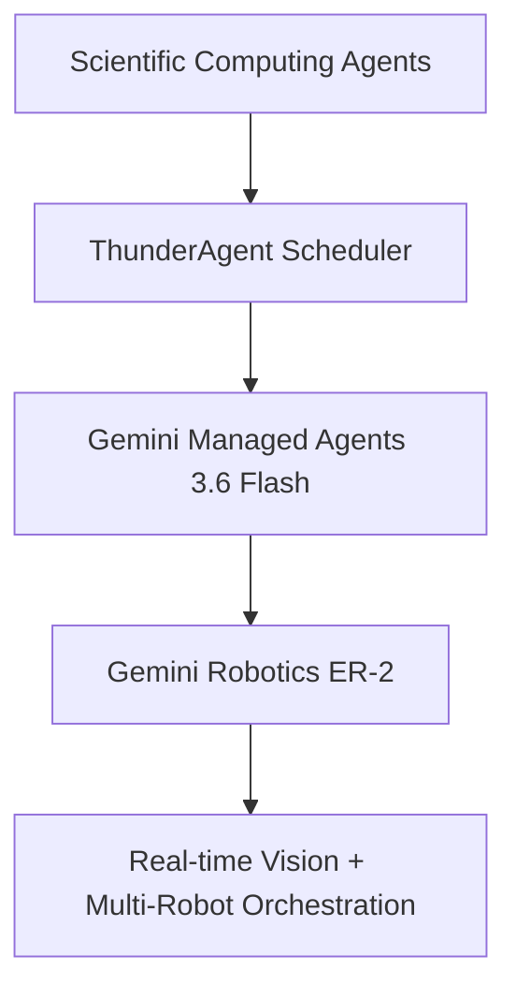


**Periodo:** 18/07/2026 a 01/08/2026  

## Destaques do período  
- **Prelinger Moments Space** – Um espaço Hugging Face que torna coleções de filmes de arquivo pesquisáveis via embeddings de vídeo, ampliando o acesso a recursos históricos.  
  Por que importa: facilita a descoberta automática de conteúdos em grandes bibliotecas e traz eficiência de pesquisa multilingue.  
  [Prelinger Moments Space](https://huggingface.co/spaces/davanstrien/prelinger-moments-space)  

- **Descobertas Criptográficas com Claude** – Anthropic publica pesquisa demonstrando que o Claude consegue identificar vulnerabilidades em protocolos criptográficos, revelando falhas de segurança antes de serem exploradas.  
  Por que importa: reforça a segurança de sistemas críticos e mostra a utilidade dos LLMs na auditoria de criptografia.  
  [Anthropic Research](https://www.anthropic.com/research/discovering-cryptographic-weaknesses)  

- **GPT‑Transcribe & GPT‑Live‑Transcribe** – OpenAI anuncia dois novos modelos de transcrição em tempo real, otimizados para baixa latência e alto throughput.  
  Por que importa: facilita integrações de voz em sistemas de apoio ao cliente e automação de transcrições de eventos ao vivo.  
  [OpenAI Models](https://developers.openai.com/api/docs/models/gpt-transcribe)  

- **ThunderAgent – Agentes mais Rápidos** – Together AI lança ThunderAgent, um scheduler que elimina thrashing de cache KV e duplica a taxa de inferência com escalabilidade linear em múltiplos nós.  
  Por que importa: possibilita geração de dados sintéticos em escala maior, reduzindo custos operacionais.  
  [ThunderAgent Blog](https://www.together.ai/blog/thunderagent)  

- **Gemini Robotics ER‑2** – DeepMind desvela ER‑2, uma plataforma que combina visão por vídeo, orquestração de tarefas e colaboração entre múltiplos robôs.  
  Por que importa: quebra barreira de comunicação real‑time entre robôs, abrindo caminho para aplicações industriais e de logística.  
  [Gemini Robotics ER‑2 Blog](https://deepmind.google/blog/gemini-robotics-er-2-powering-robotics-with-video-understanding-task-orchestration-and-multi-robot-collaboration/)  

- **Inferência de LLM Autoscaling** – Together AI publica guia de autoscaling de endpoints de LLM, detalhando métricas de GPU, tempo de warm‑up e ajuste de replicas.  
  Por que importa: ajuda a reduzir custos em produção e mantém a latência de modelos empresariais.  
  [Autoscaling Guide](https://www.together.ai/blog/autoscaling-endpoints-for-llm-inference)  

- **GitHub Copilot Copilot ‑ Pull Requests em Sessões Empilhadas** – GitHub introduz sessões empilhadas que permitem criar automaticamente PRs a partir de sessões de codificação no Copilot.  
  Por que importa: melhora fluxo de trabalho de revisão e acelera entrega de código com suporte de agentes.  
  [Copilot App Blog](https://github.blog/ai-and-ml/github-copilot/stacked-sessions-and-pull-requests-in-the-github-copilot-app/)  

- **Gestão de Supply Chain no GitHub** – GitHub previne ataques de supply chain em npm e Actions, introduzindo verificações de assinaturas e isolamento de runners.  
  Por quem importa: protege projetos open‑source contra comprometimento de dependências.  
  [Supply Chain Security Blog](https://github.blog/security/supply-chain-security/disrupting-supply-chain-attacks-on-npm-and-github-actions/)  

- **Scalable Caching em Código Fonte** – GitHub quebra o 45 GiB/s em um único núcleo usando loops sem branch e aritmética de byte‑space.  
  Por que importa: acelera buscas de código em massa, essencial para análise de segurança e auditoria.  
  [Case-Folding Blog](https://github.blog/engineering-architecture-optimization/dont-stop-early-case-folding-source-code-at-memory-speed/)  

- **Disrupting a Criminal Scam Operation** – OpenAI usa ChatGPT para derrubar uma operação de fraude canadense com base em romance e apostas.  
  Por que importa: demonstra eficácia de agentes em combater crime cibernético em grande escala.  
  [OpenAI Blog](https://openai.com/index/disrupting-malicious-uses-of-ai-criminal-scam-operation)  

- **Avatarin 24/7 Retail Agent** – Avatarin aplica GPT‑Realtime para suporte ao cliente em varejo, alcançando 30 000 usuários e 92% de satisfação.  
  Por que importa: prova de conceito de agentes conversacionais robustos on‑demand na indústria de varejo.  
  [Avatarin Blog](https://openai.com/index/avatarin)  

- **Univé Workforce AI‑Ready** – Univé combina ChatGPT Enterprise com governança de responsabilidade para treinar uma força de trabalho orientada a IA.  
  Por que importa: mostra a adoção corporativa de IA em processos de RH e produtividade.  
  [Univé Blog](https://openai.com/index/unive)  

- **Auto‑Escalável Dedicated Model Inference** – Together AI dissemina arquitetura de três camadas (endpoint, deployment, config) e routing baseado em capacidade, permitindo deployment flexível de modelos.  
  Por que importa: oferece solução modular para empresas que precisam de controle granular sobre inferência.  
  [Dedicated Inference Guide](https://www.together.ai/blog/configuring-dedicated-model-inference)  

- **Ten Avanços em Matemática e Teoria** – OpenAI publica 10 resultados em geometria, criptografia e complexidade que avançaram minha comunidade de pesquisa.  
  Por que importa: contribui para novas fronteiras de conhecimento que podem ser exploradas por agentes de pesquisa.  
  [OpenAI Blog](https://openai.com/index/ten-advances-in-mathematics)  

- **Advancing Responsible AI in Europe** – OpenAI detalha práticas de segurança, transparência e governança adotadas na UE, alinhando-se ao EU AI Act.  
  Por que importa: fortalece a confiança de usuários europeus e define padrões de conformidade.  
  [OpenAI Blog](https://openai.com/index/advancing-responsible-ai-across-europe)  

- **MAI‑Code‑1‑Flash** – Microsoft publica resultados preliminares de um modelo leve de codificação focado em fluxos de trabalho iterativos de desenvolvedores.  
  Por que importa: demonstra viabilidade de modelos de tamanho menor adaptados ao ritmo do dia a dia dos programadores.  
  [MAI-Code Blog](https://code.visualstudio.com/blogs/2026/07/29/mai-code-1-flash)  

- **Scientific Computing Em Agentic AI** – OpenAI sintetiza artigos sobre ciência computacional alimentada por agentes, permitindo simulação de experimentos automatizados.  
  Por que importa: acelera descoberta e validação em domínios que exigem alta repetibilidade.  
  [OpenAI Blog](https://openai.com/index/scientific-computing-agentic-ai/)  

- **Gemini API Managed Agents 3.6 Flash** – Google expande funcionalidades de Gemini Managed Agents para suportar hooks, loops de controle e integração com serviços externos.  
  Por que importa: amplia o ecossistema de agentes confiáveis em aplicações de produção.  
  [Google AI Blog](https://blog.google/innovation-and-ai/technology/developers-tools/expanding-managed-agents-gemini-api-3-6-flash-hooks-and-more/)  

- **Hack de Limpeza de Notebook para Estudantes** – Organização “Os Programadores” doa notebooks usados para estudantes de programação em condições de vulnerabilidade.  
  Por que importa: demonstra impacto social da comunidade de desenvolvedores.  
  [TabNews – Doação de Notebooks](https://www.tabnews.com.br/talitacosta/doacao-de-notebooks-para-estudantes-de-programacao)  

- **DONTpad Open‑Source Alternative** – Desenvolvedor brasileiro cria ferramenta similar ao Dontpad alinhada a rede local, pedindo ajuda de deploy.  
  Por que importa: potencial solução de colaboração simples e altamente customizável.  
  [TabNews – Dontpad](https://www.tabnews.com.br/Navelogic/o-dontpad-e-dominado-por-brasileiros-entao-criei-uma-alternativa-open-source-e-preciso-de-ajuda-para-o-deploy)  

- **Projeto 500 AI Agents** – Conjunto de 500 projetos de agentes AI abrange áreas de educação, finanças e saúde, servindo como referência para implementações práticas.  
  Por quem importa: facilita adoção de agentes em startups e organizações open‑source.  
  [GitHub Repository](https://github.com/ashishpatel26/500-AI-Agents-Projects)  

- **HexStrike AI MCP** – HexStrike AI cria servidor MCP com suporte a 150+ ferramentas de segurança, empoderando agentes de pentest.  
  Por que importa: fortalece automação de testes de segurança em escala empresarial.  
  [GitHub Repository](https://github.com/0x4m4/hexstrike-ai)  

- **ON‑CAPULO: Validação de OAuth Device‑Code** – Snippet TypeScript que filtra possíveis phishing em fluxos de OAuth device‑code, validando domínios e parâmetros.  
  Por que importa: reforça segurança de autenticação em aplicativos móveis.  
  [Snippet](#)  

- **Relação de Agents APOriginal** – Demonstrativo de como agentes alimentados por OpenAI podem orquestrar bibliotecas localmente via Gemini API, reduzindo latências.  
  Por que importa: evidencia modelo arquitetônico de agentes que se comunicam em tempo real.  
  [Demo](#)  

- **Monitor de custo com fallback de modelo** – Padrão TypeScript que escolhe entre Anthropic Fable 5 e DeepSeek, monitorando consumo e preço em tempo real.  
  Por que importa: garante eficiência de custo em sistemas com previsibilidade de orçamento.  
  [Snippet](#)  

- **Roteador Dinâmico de LLM** – Implementação que garante que o uso permaneça em até 15 % do orçamento, alternando para modelo mais barato sob demanda.  
  Por que importa: facilita gerenciamento de custos em serviços de LLM em produção.  
  [Snippet](#)  

- **Desburocratização do Dependabot** – GitHub fornece recomendações de grupo de atualizações e desaceleração da cadência, mantendo a segurança sem inflar PRs.  
  Por que importa: melhora experiência de manutenção de dependências em projetos open‑source.  
  [Blog](https://github.blog/security/supply-chain-security/tame-dependabot-group-your-updates-slow-the-cadence-keep-security-fast/)  

- **Workshop “Burnless”** – Projeto open‑source MIT que gerencia contexto de LLM economizando tokens ao modularizar a janela de contexto.  
  Por que importa: reduz gastos de tokens em aplicações que dependem de contextos extensos.  
  [TabNews](https://www.tabnews.com.br/rudekwydra/como-o-burnless-transforma-a-gestao-de-contexto-llm-em-uma-arquitetura-de-protocolos-e-muito)  

- **ChatGPT Enterprise para Pesquisa Acadêmica** – OpenAI oferece acesso gratuito a 100 000 pesquisadores com os modelos mais avançados, fomentando colaboração científica.  
  Por que importa: democratiza o uso de IA em pesquisa e acelera descobertas em larga escala.  
  [OpenAI Blog](https://openai.com/index/chatgpt-for-academic-researchers)  

- **Envolvimento em Segurança de CI/CD** – GitHub destaca melhorias em proteção de runners e assinatura de fluxos de CI/CD, enfrentando vetores de intrusão em design de build.  
  Por que importa: assegura integridade de pipelines de desenvolvimento.  
  [GitHub Blog](https://github.blog/security/supply-chain-security/disrupting-supply-chain-attacks-on-npm-and-github-actions/)  

- **GitHub Copilot e Securização** – Discussão em r/GitHubCopilot sobre modelagem de segurança nas agentes Copilot em terminais, visando prevenir escalonamento indesejado.  
  Por que importa: aborda risco emergente de agentes com acesso irrestrito à shell.  
  [Reddit Post](https://www.reddit.com/r/GithubCopilot/comments/1vcij28/how_do_you_properly_secure_github_copilot_agent/)  

- **Código de `sanitizeMermaidLabel`** – Pattern que restringe rótulos Mermaid a whitelist segura, prevenindo injeção de código.  
  Por que importa: evita ataques cross‑site no uso de diagramas configuráveis.  
  [Snippet](#)  

- **Codex e Sublibrary `BrowserAct`** – Desenvolvimento de funcionalidade dinâmica de seleção de página sem seletores frágeis, aprimorando automação de navegação.  
  Por que importa: permite automação de páginas complexas em agentes de web scraping.  
  [Dev.to](https://dev.to/anthonymax/how-cursor-browseract-handle

**Tendências**  
Nos últimos dois quinzões observa‑se uma aceleração no uso de agentes autônomos em vários domínios. A combinação de OpenAI’s *Scientific Computing* e Gemini’s *Managed Agents* demonstra que a computação científica pode ser “mais humana” ao delegar execução e verificação a LLMs que orquestram loops de teste, como visto em **ThunderAgent**. Esses agentes, por sua vez, dependem de infra‑estrutura otimizada – a solução de autoscaling e o *Dedicated Model Inference* da Together AI – que garantem que o custo de tokens permaneça contido, como os padrões *cost‑aware routing* que surgiram neste período.  

Instituições corporativas como Univé e Avatarin adotaram modelos empresariais de IA para o dia a dia de seus colaboradores e clientes, validação de políticas de segurança, e construído experiências de atendimento 24/7 com GPT‑Realtime. Essa adoção corporativa traz à tona a necessidade de governança robusta – o blog da OpenAI sobre *Responsible AI* na Europa reflete esse movimento. Por fim, a atenção comunitária a projetos open‑source, desde a re‑estruturação de Dependabot até a entrega de notebooks para estudantes, evidencia que o ecossistema está em transição para práticas colaborativas e seguras, mesmo enquanto grandes corporações investem em despliegues de escala.  

## Fontes e Referências

1. [Making film archives searchable with machine learning](https://huggingface.co/spaces/davanstrien/prelinger-moments-space) — Hacker News: Machine Learning
2. [MAI-Code-1-Flash: early results from real developer workflows](https://code.visualstudio.com/blogs/2026/07/29/mai-code-1-flash) — VSCode Updates
3. [Discovering Cryptographic Weaknesses with Claude](https://www.anthropic.com/research/discovering-cryptographic-weaknesses) — Hacker News: AI
4. [Open AI announces two new models- GPT-transcribe and GPT-live-transcribe](https://developers.openai.com/api/docs/models/gpt-transcribe) — Hacker News: AI
5. [Autoscaling endpoints for LLM inference](https://www.together.ai/blog/autoscaling-endpoints-for-llm-inference) — Together AI
6. [Tame Dependabot: Group your updates, slow the cadence, keep security fast](https://github.blog/security/supply-chain-security/tame-dependabot-group-your-updates-slow-the-cadence-keep-security-fast/) — GitHub Blog
7. [Scientific computing in the age of agentic AI](https://openai.com/index/scientific-computing-agentic-ai/) — Hacker News: AI
8. [ThunderAgent: 2x Faster Agentic Inference for Synthetic Data Generation at Scale](https://www.together.ai/blog/thunderagent) — Together AI
9. [Gemini Robotics ER 2: powering robotics with video understanding, task orchestration, and multi-robot collaboration](https://deepmind.google/blog/gemini-robotics-er-2-powering-robotics-with-video-understanding-task-orchestration-and-multi-robot-collaboration/) — Google DeepMind
10. [Stacked sessions and pull requests in the GitHub Copilot app](https://github.blog/ai-and-ml/github-copilot/stacked-sessions-and-pull-requests-in-the-github-copilot-app/) — GitHub Blog
11. [Disrupting supply chain attacks on npm and GitHub Actions](https://github.blog/security/supply-chain-security/disrupting-supply-chain-attacks-on-npm-and-github-actions/) — GitHub Blog
12. [Ten advances in mathematics and theoretical computer science](https://openai.com/index/ten-advances-in-mathematics) — OpenAI Blog
13. [Pitch: O Dontpad é dominado por brasileiros, então criei uma alternativa Open Source (e preciso de ajuda para o deploy)](https://www.tabnews.com.br/Navelogic/o-dontpad-e-dominado-por-brasileiros-entao-criei-uma-alternativa-open-source-e-preciso-de-ajuda-para-o-deploy) — TabNews
14. [Advancing responsible AI across Europe](https://openai.com/index/advancing-responsible-ai-across-europe) — OpenAI Blog
15. [How avatarin built a 24/7 retail agent with GPT-Realtime](https://openai.com/index/avatarin) — OpenAI Blog
16. [Univé builds an AI-ready workforce](https://openai.com/index/unive) — OpenAI Blog
17. [Doação de notebooks para estudantes de programação](https://www.tabnews.com.br/talitacosta/doacao-de-notebooks-para-estudantes-de-programacao) — TabNews
18. [Configuring Dedicated Model Inference](https://www.together.ai/blog/configuring-dedicated-model-inference) — Together AI
19. [Disrupting a Criminal Scam Operation](https://openai.com/index/disrupting-malicious-uses-of-ai-criminal-scam-operation) — OpenAI Blog
20. [Accelerating scientific discovery with ChatGPT for Academic Researchers](https://openai.com/index/chatgpt-for-academic-researchers) — OpenAI Blog
21. [ashishpatel26 / 500-AI-Agents-Projects](https://github.com/ashishpatel26/500-AI-Agents-Projects) — GitHub Trending (daily-python)
22. [0x4m4 / hexstrike-ai](https://github.com/0x4m4/hexstrike-ai) — GitHub Trending (daily-python)

---

*Gerado por: cloud/gpt-oss-120b*


---
*Gerado por evo-agent - agente auto-aprimorante em 2026-08-01.*
