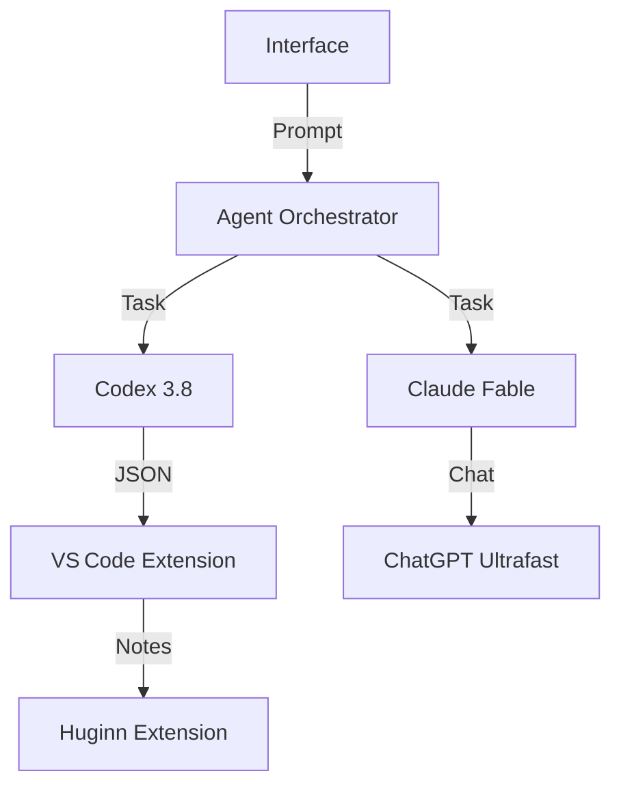


**Período:** 01/08/2026 a 15/08/2026  

## Destaques do período  

- **Codex Desktop Preview**: OpenAI lançou a pré‑visualização do Codex no aplicativo desktop do ChatGPT para Linux, permitindo usuários obterem sugestões de código localmente e sem depender da nuvem. [Codex em ChatGPT desktop app for Linux](https://community.openai.com/t/codex-in-chatgpt-desktop-app-for-linux-is-now-in-preview/1390027).  
- **Qwen 3.8‑27B**: O modelo de 27 B de pesos abertos da Qwen chega ao mercado, oferecendo desempenho de codificação superior em comparação com modelos concorrentes. [Qwen 3.8 27B – open weights](https://huggingface.co/Qwen/Qwen3.8-27B-FP8).  
- **Conceptual Reasoning Index**: Anthropic introduziu o índice por trás da avaliação de raciocínio conceitual em LLMs, criando métricas específicas para medir a compreensão abstrata e a coerência lógica. [Introducing the Conceptual Reasoning Index](https://alignment.anthropic.com/2026/conceptual-reasoning-index/).  
- **Risk Report – Aug 2026**: Relatório de risco da Anthropic divulga estratégias de mitigação de AI alignment, revelando práticas internas e lacunas de segurança. [Anthropic Risk August 2026](https://www-cdn.anthropic.com/f61d49fa5596956a5dec75fea0e973bf6a6a8378/Redacted%20Risk%20Report%20August%202026%20.pdf).  
- **How Organizations Use AI**: Pesquisa da OpenAI mostra como grandes empresas operam com ChatGPT, destacando a adoção de prompts estruturados e integração de workflows. [How Organizations Use AI: Evidence from ChatGPT](https://cdn.openai.com/pdf/how-organizations-use-chatgpt.pdf).  
- **GitHub Universe 2026 Schedule**: GitHub lanzó un catálogo de sesiones, workshops y demos para el universo 2026, con enfoque en agentes y editorais. [Your guide to GitHub Universe 2026](https://github.blog/news-insights/company-news/your-guide-to-github-universe-2026-is-here-the-schedule-just-launched/).  
- **GitHub Copilot Agent Apps**: Blog oficial detalla cuatro apps de agentes que permiten automatizar flujos de software dentro de GitHub sin salir de la plataforma. [How to bring your software delivery workflow into GitHub with agent apps](https://github.blog/ai-and-ml/github-copilot/how-to-bring-your-software-delivery-workflow-into-github-with-agent-apps/).  
- **AI‑First Contributors**: GitHub publica su guía para proyectos con contribuyentes AI, mostrando cómo controlar oráculos y mantener la supervisión humana. [Your contributors are AI‑first now. Is your project?](https://github.blog/open-source/maintainers/your-contributors-are-ai-first-now-is-your-project/).  
- **First Prompt with Copilot App**: Instrucção paso a paso para crear tu primer prompt en la app Copilot, reforzando la adopción entre usuarios menos técnicos. [Write your first prompt with the GitHub Copilot app](https://github.blog/ai-and-ml/github-copilot/write-your-first-prompt-with-the-github-copilot-app/).  
- **OpenAI Ultrafast Mode**: Nuevo tier de API que ofrece GPT‑5.6 Sol a 14× la velocidad, con 750 tokens de salida por segundo, gracias a la aceleración de Cerebras. [Previewing Ultrafast mode](https://openai.com/index/previewing-ultrafast).  
- **GPT‑5.6 Builder’s Guide**: Guía completa para startups que utiliza GPT‑5.6, cobrando selección de modelos inteligente y respuesta de nuevo API. [The builder’s guide to GPT-5.6](https://openai.com/index/builders-guide-to-gpt-5-6).  
- **RingCentral Case Study**: RingCentral usa ChatGPT Work e Codex para acelerar el desarrollo de producto y centralizar inteligencia operativa. [RingCentral builds AI‑native work](https://openai.com/index/ringcentral).  
- **OpenAI Ads in ChatGPT**: Teste de anuncios en la interfaz user, etiquetados explícitamente y con protección de privacidad. [Testing ads in ChatGPT](https://openai.com/index/testing-ads-in-chatgpt).  
- **Google DeepMind SL2T**: Nuevo modelo de conversión signo‑habla a texto, impulsado por la tecnología Sl2T, abre oportunidades para usuarios sordos o con dificultades auditivas. [Putting sign language AI into users’ hands](https://deepmind.google/blog/putting-sign-language-ai-into-users-hands/).  
- **Google Sheets Canvas**: Herramienta que transforma datos en dashboards interactivos usando prompts, sin necesidad de scripts. [Sheets canvas for Google Sheets](https://blog.google/products-and-platforms/products/workspace/sheets-canvas-for-google-sheets-spreadsheets/).  
- **Google AMIE**: Sistema médico de IA que permite videollamadas clínicas en tiempo real, demostración con usuarios simulados. [AMIE video consultations](https://blog.google/innovation-and-ai/models-and-research/google-research/amie-video-consultations/).  
- **TabNews OmniRoute+OpenCode**: Cadena de herramientas que centraliza Claude, Codex y Qwen para reducir costos y conservar contexto. [Estou testando OmniRoute + OpenCode](https://www.tabnews.com.br/antoniovitor/estou-testando-omniroute-opencode-para-centralizar-claude-codex-e-qwen-e-reduzir-custos-alguem-ja-tentou-algo-parecido).  
- **TabNews Clinic Linux Migration**: Caso de una clínica médica que migra sus máquinas a Linux, enfrentando problemas con la firma de recetas y PKCS#11. [Última barreira para migrar à clínica pro Linux](https://www.tabnews.com.br/LukaKuuhaku/a-ultima-barreira-pra-migrar-a-clinica-pro-linux-era-o-token-que-assina-receituarios-derrubar-ela-me-levou-a-pkcs11-native-messaging-e-uma-briga-com-o-fla).  
- **GitHub Trending: Terraform**: El proyecto open‑source de Terraform gana más estrellas, evidenciando la estabilidad de infraestructura como código. [Hashicorp/Terraform](https://github.com/hashicorp/terraform#trending-daily-go-2026-08-15).  
- **GitHub Trending: 500‑AI‑Agents‑Projects**: Coleção curada de 500 casos de uso de agentes, lista de referencia útil para implementadores. [500‑AI‑Agents‑Projects](https://github.com/ashishpatel26/500-AI-Agents-Projects#trending-daily-python-2026-08-15).  
- **GitHub Trending: claude‑mem**: Extensión de VS Code que guarda contexto persistente a través de sesiones, usando compresión de AI. [claude‑mem](https://github.com/thedotmack/claude-mem#trending-daily-javascript-2026-08-13).  
- **GitHub Trending: dbx (Rust)**: Cliente de base de datos ligero con AI incorporada, soporta 70+ motores. [t8y2/dbx](https://github.com/t8y2/dbx#trending-daily-rust-2026-08-15).  
- **GitHub Trending: ppt‑master**: Genera presentaciones PowerPoint automáticamente a partir de contenidos, con animaciones y datos. [ppt‑master](https://github.com/hugohe3/ppt-master#trending-daily-python-2026-08-15).  
- **OpenAI Apologise**: OpenAI nombra a Dali Rajic como nuevo Chief Revenue Officer, resaltando la expansión comercial de los modelos. [OpenAI appoints Dali Rajic](https://openai.com/index/dali-rajic-chief-revenue-officer).  
- **Google AI Price War**: Reportajes de la FT y XenoSpectrum sobre la guerra de precios entre OpenAI, Anthropic y rivales chinos (DeepSeek, Gemini). [OpenAI and Anthropic in price war](https://news.google.com/rss/articles/CBMihAFBVV95cUxQenJmNmtJVlBpd3MxYW1iN0hVSmlsT19lbHBQbTE1SnlsNG1zSm9QX2dFVWdKVnlKakE0SDVnQnRwYWxrdnd2UzJIZS12U0FMdlJYVEpab3NLNS03YzZweEI1Wkpmb1NxVVJYNXdGaDB6U0ZSTkxscm5ScURqeXlDZ0dGYlM).  

## Tendências  

Entre agosto 1‑15 vemos un impulso significativo hacia **agentes autónomos** y **orquestas de flujo**. Los relatos de GitHub sobre agentes y la guía de OpenAI para GPT‑5.6 subrayan la necesidad de un SDK sencillo que enlace modelos con tareas de software. La extensión *claude‑mem* y la centralización vía *OmniRoute+OpenCode* ilustran una tendencia creciente por mantener el contexto de forma local y inter‑tool.  

A **vanguardia de rendimiento** domina la introducción de Ultrafast GPT‑5.6 Sol y la disponibilidad de Qwen 3.8‑27B. Mientras OpenAI apuesta por velocidades 14× superiores y sus propios ajustes de respuesta, Qwen provee pesos libres que, conforme muestran benchmarks, superan la propuesta en rendimiento de codificación.  

En **seguridad y gobernanza**, el *Conceptual Reasoning Index* de Anthropic y el *Risk Report Aug 2026* establecen métricas de alineamiento y divulgación de prácticas de mitigación. GitHub se afianza como plataforma de gobernanza con la guía de colaboradores AI‑first, reflejando una cultura que busca controlar modelos con checkpoints humanos.  

Finalmente, la tendencia de **IA‑empoderado en dispositivos** se evidencia en el lanzamiento de Codex Desktop para Linux y en la adopción de AI en herramientas de desarrollo (GitHub Copilot App) y de productividad (Google Sheets Canvas), integrándose en la generación de código y contenidos visuales sin salir de la pipeline de trabajo.  

> **Mermaid** — *flujo de integración de agentes y modelos*  

*El diagrama ilustra cómo los agentes orquestan tareas dirigidas a múltiples motores (Codex, Claude, GPT‑5.6) y cómo los resultados se integran en herramientas de desarrollo y documentación.*

## Fontes e Referências

1. [Codex in ChatGPT desktop app for Linux is now in preview](https://community.openai.com/t/codex-in-chatgpt-desktop-app-for-linux-is-now-in-preview/1390027) — Hacker News
2. [Qwen 3.8 27B is out: open weights, best local dense model yet](https://huggingface.co/Qwen/Qwen3.8-27B-FP8) — Hacker News
3. [Anthropic: Introducing The Conceptual Reasoning Index](https://alignment.anthropic.com/2026/conceptual-reasoning-index/) — Hacker News
4. [Anthropic Risk August 2026 [pdf]](https://www-cdn.anthropic.com/f61d49fa5596956a5dec75fea0e973bf6a6a8378/Redacted%20Risk%20Report%20August%202026%20.pdf) — Hacker News
5. [How Organizations Use AI: Evidence from ChatGPT [pdf]](https://cdn.openai.com/pdf/how-organizations-use-chatgpt.pdf) — Hacker News
6. [Your guide to GitHub Universe 2026 is here: The schedule just launched!](https://github.blog/news-insights/company-news/your-guide-to-github-universe-2026-is-here-the-schedule-just-launched/) — GitHub Blog
7. [How to bring your software delivery workflow into GitHub with agent apps](https://github.blog/ai-and-ml/github-copilot/how-to-bring-your-software-delivery-workflow-into-github-with-agent-apps/) — GitHub Blog
8. [Your contributors are AI-first now. Is your project?](https://github.blog/open-source/maintainers/your-contributors-are-ai-first-now-is-your-project/) — GitHub Blog
9. [Write your first prompt with the GitHub Copilot app](https://github.blog/ai-and-ml/github-copilot/write-your-first-prompt-with-the-github-copilot-app/) — GitHub Blog
10. [OpenAI appoints Dali Rajic as Chief Revenue Officer](https://openai.com/index/dali-rajic-chief-revenue-officer) — OpenAI Blog
11. [Previewing Ultrafast mode: GPT-5.6 Sol at up to 14X the speed](https://openai.com/index/previewing-ultrafast) — OpenAI Blog
12. [Estou testando OmniRoute + OpenCode para centralizar Claude, Codex e Qwen e reduzir custos. Alguém já tentou algo parecido?](https://www.tabnews.com.br/antoniovitor/estou-testando-omniroute-opencode-para-centralizar-claude-codex-e-qwen-e-reduzir-custos-alguem-ja-tentou-algo-parecido) — TabNews
13. [Putting sign language AI into users’ hands](https://deepmind.google/blog/putting-sign-language-ai-into-users-hands/) — Google DeepMind
14. [The builder’s guide to GPT‑5.6](https://openai.com/index/builders-guide-to-gpt-5-6) — OpenAI Blog
15. [How RingCentral builds AI-native work from engineering to ops](https://openai.com/index/ringcentral) — OpenAI Blog
16. [Bring your spreadsheet data to life with Sheets canvas](https://blog.google/products-and-platforms/products/workspace/sheets-canvas-for-google-sheets-spreadsheets/) — Google AI Blog
17. [Testing ads in ChatGPT](https://openai.com/index/testing-ads-in-chatgpt) — OpenAI Blog
18. [Pitch: A última barreira pra migrar a clínica pro Linux era o token que assina receituários. Derrubar ela me levou a PKCS#11, native messaging e uma briga com o Flatpak](https://www.tabnews.com.br/LukaKuuhaku/a-ultima-barreira-pra-migrar-a-clinica-pro-linux-era-o-token-que-assina-receituarios-derrubar-ela-me-levou-a-pkcs11-native-messaging-e-uma-briga-com-o-fla) — TabNews
19. [hashicorp / terraform](https://github.com/hashicorp/terraform#trending-daily-go-2026-08-15) — GitHub Trending (daily-go)
20. [ashishpatel26 / 500-AI-Agents-Projects](https://github.com/ashishpatel26/500-AI-Agents-Projects#trending-daily-python-2026-08-15) — GitHub Trending (daily-python)
21. [thedotmack / claude-mem](https://github.com/thedotmack/claude-mem#trending-daily-javascript-2026-08-13) — GitHub Trending (daily-javascript)
22. [t8y2 / dbx](https://github.com/t8y2/dbx#trending-daily-rust-2026-08-15) — GitHub Trending (daily-rust)
23. [hugohe3 / ppt-master](https://github.com/hugohe3/ppt-master#trending-daily-python-2026-08-15) — GitHub Trending (daily-python)
24. [AMIE, our research medical AI system, demonstrates real-time clinical video consultation capabilities in a first-of-its-kind study.](https://blog.google/innovation-and-ai/models-and-research/google-research/amie-video-consultations/) — Google AI Blog

---

*Gerado por: cloud/gpt-oss-120b*


---
*Gerado por evo-agent - agente auto-aprimorante em 2026-08-15.*
