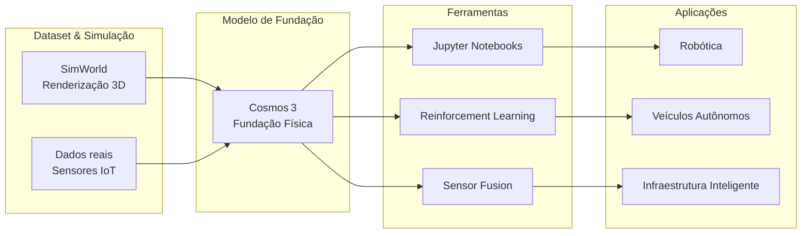
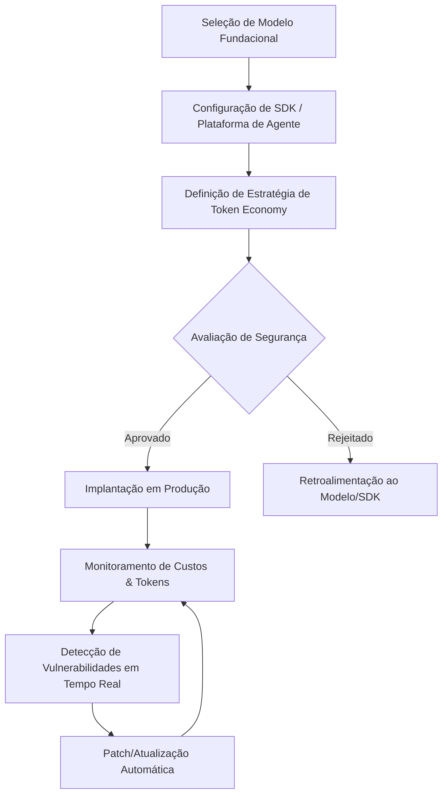


**Periodo:** 05/05/2026 a 04/06/2026

## Custo e limites de IA nas empresas

- **Uber esgota orçamento IA 2026** – A Uber consumiu todo o orçamento destinado a IA em apenas quatro meses de 2026, provocando o COO a questionar o retorno do investimento. O caso ilustra o perigo de alocações excessivas sem monitoramento de custos operacionais. [Uber burned through its entire 2026 AI budget in four months. Now its COO is questioning whether it's worth it  Fortune](https://news.google.com/rss/articles/CBMie0FVX3lxTE9yeXo0WE4zM3ZWcXBrb0tISE5Wa1ZBQlRGdHlPcjlfZEVWeC03QVJWaVBMS01USWQxZTAwZ1BxRWZhdkw1N3ZjUE9NRjZvVWF3T3BwdUxFb0VlRVJnQUJHalFkOC1FbGhFNm5Xd0xibWlQa2tRSEFmUkFfVQ?oc=5)

- **Uber impõe limites de uso** – Para conter gastos, a Uber começou a limitar o consumo de ferramentas como Claude Code, estabelecendo cotas diárias e penalidades por uso excedente. A medida demonstra uma resposta rápida de governança de custos em ambientes de IA de grande escala. [Uber caps usage of AI tools like claude code to cut costs  Bloomberg News  TradingView](https://news.google.com/rss/articles/CBMi2gFBVV95cUxPNzF4WDM1Wkw1VDMxbzM0dEplUnFkOEtHc0FHcjBPWTl0dFpqS0x1RWZSS0dvTzZ4YjJuRndTN3RYVzBCNDJuQl9rOXpOazhnMW9tSFJqZ3VOVDVKODQzUXNGeWl2cWl1b1pVc0M5MHo5RjkzX3UtSkJGYWU0RXlSM1BXRlNHMUNpVF9NZmwyWElCTVRQcmRkX1diV0syV2VhSFNTYm1OWlFUaDdreTBNTnYyQ2VIVHRBeE1qVjlKb0xIeHpsbGtweG9IUklUbzhMTE5vN1JRZWlzUQ?oc=5)

- **Usuários de Claude Code encontram throttling** – Consumidores do Claude Code relataram limites de uso mais rígidos que o normal, com quedas súbitas de tokens disponíveis. Isso indica que provedores estão ajustando políticas de quota para equilibrar demanda e custos. [Claude Code users say they’re hitting usage limits faster than normal  The New Stack](https://news.google.com/rss/articles/CBMiXEFVX3lxTE5MRDhheW9RdThmUjRId2s2Z0JGUUNzbFhoczhfM2lVd3Qxa1FVemFJODRWU1J6WnN4SUdjQVpkTHV1RFdLZ3I2Z2tRemxYVHEzcF91LU9KUE1HRjZ1?oc=5)

- **Crise iminente de disponibilidade de IA** – Analistas alertam que a combinação de orçamentos apertados e limites de quota pode restringir o acesso a ferramentas populares, forçando empresas a priorizar usos críticos ou migrar para soluções internas. O risco de “sombra de IA” afeta planejamento de produto e inovação. [A Looming Crisis Could Limit Some of Your Favorite AI Tools  Business Insider](https://news.google.com/rss/articles/CBMifkFVX3lxTE1XVFQ4Rk8xdklDVHNmdTNsdXBzZHUzUm1GcndHMF9LbUxub2F1Z2lsX2xoS29YZ3dNZkdZcnY1ZVFXVWNNeDNWY1drYjVKT2k1TkJGNFpadGJHcU8wNFdITEZObjdjSE1QREkxUnRvMXNvbzRfb1lpZGtLczc3UQ?oc=5)

- **OpenAI lança plano Pro $100/mês para Codex** – A OpenAI introduziu um plano pago que eleva limites de requisição, adiciona suporte prioritário e permite acesso a modelos de maior capacidade. A estratégia evidencia a transição de modelos “freemium” para receitas recorrentes. [OpenAI Launches $100/Month Pro Plan for Codex Users – Here’s What It Includes  Gadget Review](https://news.google.com/rss/articles/CBMipAFBVV95cUxOWU00U05EQkZrOVRXeDNVOVdZMWttV1ZWOVA1TG52NEwxb2pKMXM2OXFjOVF4OWcxYTFTTVRJZDhpSW9IeDhnOTNHM3NvN2hnU2JvWFBBWkJmQWdWc0NCcEhNampjaG1FLVdkUXBBS01VclpBX1RUYk5ocDFfbXBPSTJGY2pLWDBiQ3NuMDBYSEZ0TmNrX2NGZkRvT0JNWHVUWFZ1UQ?oc=5)

- **Previsão de preços de modelo pela Anthropic e OpenAI** – As duas empresas divulgaram estruturas de precificação baseadas em “tokens por dólar” e camadas de uso, sinalizando que o custo por inferência será cada vez mais granular e alinhado ao volume real de consumo. Essa tendência reforça a necessidade de monitoramento automático de custos em aplicações corporativas. [Anthropic and OpenAI Just Gave Us a Glimpse Into the Future of Model Pricing  Gizmodo](https://news.google.com/rss/articles/CBMiqwFBVV95cUxPbXQ0dm90eC1JMFpydWhoRTk0d0NqeUEzM1JfcDVNMkhHRWcxeDBHLTZlZ25KZk5zcEhDUC1OY3NLdHNpVjRUeExRbVBBXzExZ0xaNVhBZy1OQkFqZFhQM2wtVlVNQW9FUm9jQUxBbUhGeEloS29DeFdqbHpjdzYtQzFNVEp0WU1taldQcnFtdlBpeGlQem1wcGhxMk5PYzVTN1dWanpaLUFUYU0?oc=5)

```mermaid
flowchart LR
    A[Orçamento IA definido] --> B[Consumo acelerado]
    B --> C[Alarme de superação de custos]
    C --> D{Decisão de gestão}
    D -->|Cortar gastos| E[Imposição de cotas (Uber)]
    D -->|Monetizar uso| F[Planos pagos (OpenAI Pro)]
    E --> G[Throttling de quota (Claude Code)]
    F --> G
    G --> H[Impacto na disponibilidade de ferramentas]
```

---  
*Digest consolidado para o período de 05/05/2026 a 04/06/2026.*

## Vulnerabilidades e exploits críticos

- **CVE‑2025‑61260 – OpenAI Codex CLI Command Injection** – O CLI do OpenAI Codex lê um arquivo de configuração local ao projeto que pode ser alterado para injetar comandos arbitrários no shell. A exploração requer apenas acesso ao diretório do projeto, permitindo elevação de privilégio ou execução de malware em ambientes de CI/CD. Check Point Research alerta que pipelines automatizadas podem ser comprometidas silenciosamente. [CVE‑2025‑61260 — OpenAI Codex CLI: Command Injection via Project‑Local Configuration](https://news.google.com/rss/articles/CBMijwFBVV95cUxObkw1cEQ1ODJKdWJCcC1peGxfYllpb2gtbGdJWURXT21ib0tzN0pxQS1mWUMzU05YaFNtWjZtY3g1WDFwVnVwS2M0VE5aRjl1WTRFdUZ1OC1zS2RNWG1qNVhvNngwZWpJNWczcFJLTVlIbFg2MUY4Uk5PY3RleFBpWUEtSDlzUnpLeV9ReDNXWQ?oc=5)

- **CVE‑2026‑41089 – Netlogon 0‑Click RCE (ativa)** – Vulnerabilidade crítica de execução remota de código (RCE) no Windows Netlogon está sendo explorada ativamente contra controladores de domínio. Um atacante não autenticado pode enviar um único pacote CLDAP mal‑formado para a porta UDP 389 e obter execução de código com privilégios de Sistema. A exploração em larga escala eleva drasticamente o risco de comprometimento total da floresta AD. [Windows Netlogon 0‑Click RCE Vulnerability Now Actively Exploited In …](https://x.com/The_Cyber_News/status/2061506815276232765)

- **CVE‑2026‑41089 – Vulnerabilidade crítica em foco** – SecurityWeek destaca que a falha no Netlogon está nos “radar dos atacantes”, com scanners automatizados detectando alvos vulneráveis. O CVSS 9.8 indica alto impacto e perda de confidencialidade, integridade e disponibilidade em ambientes Windows Server. [Critical Windows Netlogon Vulnerability in Attackers' Crosshairs (CVE ...)](https://x.com/SecurityWeek/status/2061463874092597763)

- **CVE‑2026‑41089 – Alerta ativo de exploração** – Adam (BleepingComputer) confirma exploração real: overflow de buffer baseado em pilha permite RCE não autenticada, possibilitando roubo de credenciais, ransomware e controle total do Active Directory. A gravidade é CVSS 9.8. [🚨 Critical Windows alert: CVE‑2026‑41089 is under active exploitation …](https://x.com/seoscottsdale/status/2061461596963258694)

- **CVE‑2026‑41089 – PoC CVSS 10** – Um pesquisador divulgou prova de conceito (PoC) com pontuação CVSS 10, demonstrando a facilidade de disparar o overflow com um único pacote UDP e obter controle total do DC. A disponibilidade pública do PoC acelera a disseminação de ataques. [CVE‑2026‑41089 (Critical RCE 0day PoC CVSS: 10)](https://x.com/ethicalhack3r/status/2057744082831605991)

- **CVE‑2026‑41089 – Research on pre‑auth stack buffer overflow** – AretiqAI publica detalhes técnicos: o overflow ocorre antes da autenticação (pre‑auth) e pode ser disparado por um pacote CLDAP mal‑formado enviado à porta 389/UDP, resultando em crash ou execução arbitrária no DC. O estudo oferece indicadores de comprometimento (IoCs) para detecção precoce. [Added research for CVE‑2026‑41089 — a pre‑auth stack buffer overflow in …](https://x.com/AretiqAI/status/2054557996391239920)

```mermaid
flowchart TD
    A[Attacker] -->|Crafted CLDAP packet (UDP 389)| B[Netlogon Service]
    B -->|Stack buffer overflow| C[RCE code execution]
    C --> D[Domain Controller compromise]
    D --> E[Credential dumping & ransomware lateral movement]
```

## Novos modelos fundacionais e ferramentas open‑source

- **Cosmos 3 – modelo de IA Física (HPCwire)** – O Cosmos 3 é o primeiro modelo de fundação de código aberto focado em “Physical AI”, capaz de entender e prever dinâmicas do mundo real (robótica, veículos autônomos, infraestrutura inteligente). Disponível via licensa permissiva, ele inclui pesos, dataset de simulação e APIs para integração rápida, impulsionando a democratização de IA física. [NVIDIA Launches Cosmos 3, the Open Frontier Foundation Model for Physical AI – HPCwire](https://news.google.com/rss/articles/CBMiugFBVV95cUxOY1hBTlkzNFVseGpSMDlCanByemtFUzBKN0RhMjBqOWIxVVlXTE5sNW5CbG1YNzhMWEtrbUdKT0t5RHVHcFVwdExvQ25kZlVtWGpmUUNiSHFJWG4wVWFBbzljVFBXSTVGeEpTNmhXREJQSGlBQjh3ZTBrcHg1SEpyREc4eEF3WW0yYlJKa0dzU0Jtb1Nrc1NMcm9nVDBLR21jUEVDYnQzM19rUnd1cml3NlN6RWNSVnVZQ3c?oc=5)

- **Cosmos 3 – modelo de IA Física (Engineering.com)** – Reforça a proposta de um “frontier foundation model” aberto para aplicações de física, destacando a compatibilidade com frameworks de treinamento distribuído e a disponibilidade de tutoriais Jupyter. A NVIDIA enfatiza que o modelo reduz a dependência de dados proprietários e acelera protótipos de sistemas autônomos. [NVIDIA launches Cosmos 3 for physical AI models – Engineering.com](https://news.google.com/rss/articles/CBMiggFBVV95cUxPZV9yb2dETjBXM19DNmZ3VFdzRDRMLXdoX3VYa1U3dDlPc010ZjVZOFhyRlBSTC00dlg0MEMxNC1KLWFjc3VGd3JLWmFZTnNUdkhXazRrR0pWX2xKVVJGcGppdXUzN0ZUbndVVHdxdXNDMXlrZHRFbFlkNlk2MFI2MVBR?oc=5)

- **NVIDIA Cosmos (GitHub)** – Repositório oficial que reúne “world models”, datasets de simulação e ferramentas de treinamento para construir Physical AI. A ferramenta baseia‑se em notebooks Jupyter, suporta CUDA e integra pipelines de RL, sensor fusion e simulação multimodal. ★ 8,768. [NVIDIA /cosmos](https://github.com/NVIDIA/cosmos)

- **PaddleOCR (GitHub)** – Biblioteca OCR de código aberto que converte PDFs ou imagens em texto estruturado, com suporte a mais de 100 idiomas. Projetada para integrar facilmente a pipelines LLM, oferece modelos leves e pre‑trained, além de scripts de inferência e treinamento. ★ 79,565. [PaddlePaddle /PaddleOCR](https://github.com/PaddlePaddle/PaddleOCR)



*O diagrama ilustra como o modelo fundacional Cosmos 3 se sustenta em datasets simulados e reais, e como as ferramentas de notebook, RL e sensor fusion alimentam múltiplas downstream applications.*

## SDKs e plataformas para agentes de IA

- **Copilot SDK (repo)** – SDK Java multiplataforma que permite integrar o agente GitHub Copilot a aplicativos, serviços e IDEs, expondo APIs de sugestão de código, completude e execução de tarefas. Facilita a criação de agentes “agent‑native” sem depender de chamadas HTTP externas. [GitHub Copilot SDK](https://github.com/github/copilot-sdk)  

- **Anúncio do SDK (SD Times)** – A cobertura de janeiro 2026 destaca o lançamento geral do Copilot SDK, enfatizando seu papel como “ponte” para desenvolvedores construírem agentes autônomos que podem invocar o modelo Copilot em fluxos de trabalho corporativos. A novidade sinaliza a expansão da estratégia de IA de código da Microsoft. [This week in AI updates: GitHub Copilot SDK, Claude’s new constitution, and more](https://news.google.com/rss/articles/CBMitwFBVV95cUxNaFF1ZUZjbUpFRlRxLVNsTlBOUHpUemRtWjNLX2I1Rk9uLWxxQWE2YnY4Qk9zWm9VM2RSZk9jSGlNTGVOcF94bUlZMVhLbUhlUW1QUzViU0U2Si13TTFLS0tBOFBlMFFFUGZDOC1ZaFdNcjdMLVBzenJDRDE2RG1Bdy0tYWhUMHFOX3Rkbm5ORVJGZVpETXZvcGQya09zZHFEcDZlSDJVX2pCenlGV1pjYnRZZlcwMVE?oc=5)  

- **Construindo agentes (InfoWorld)** – Guia prático que mostra como usar o Copilot SDK para orquestrar múltiplos “skill sets” (ex.: geração de código, documentação, refatoração) dentro de um agente, combinando prompts e callbacks Java. Evidencia a facilidade de criar pipelines de IA personalizadas. [Building AI agents with the GitHub Copilot SDK](https://news.google.com/rss/articles/CBMimAFBVV95cUxNak05YjVCaE93UE5DdlgwUjVTU0JsZGtJci1aTkdvaVhfN05qcFlDTS01b2U0VjZlM1FScmpjcnp0bDU5dmJvRWs2MDF2Z0haWndzQnJqQWF4TmVoM0dZMmxGMFBFVm5ZSWczcXdKMEtvejFtV1dOQU5VUFdfY2lObTNJSEpuVGdjZDR0eEJXSXBnc2xCVTF4WQ?oc=5)  

- **Project Polaris & VS Code multi‑agent (Tech Times)** – Na Build 2026, a GitHub substituiu o modelo GPT‑4 por “Project Polaris”, entregando um backend de modelo próprio e lançando uma extensão VS Code que permite compor e depurar agentes múltiplos direto na IDE. Marca a transição para um ecossistema proprietário de IA de código. [GitHub Copilot Replaces GPT-4 With Project Polaris, Ships Multi-Agent VS Code at Build](https://news.google.com/rss/articles/CBMizAFBVV95cUxPemt6bE9rRFRwZE9sMmNlYVpnOEQ4UU16bmVnMEg2Q0ZnV1dpb0hxTC1saWhGQ2NNVzJ5b3pLLXF2Zl9Melg3TmpabW9BWExyZjd4MzBac0FjQ0F0UlBuTUUyb002OGhlZjk2aFJ5N2RrUFAwWU02V3FidzhrRGNieHkzYi1IdlhJSlhOOVNzNHRzd0hOYzVaQURUcUhsdWVmSmt0V05ZQ0Ezczl1OExXTGEyZGNncjVvbGVCYUJiTmNmWlg0MFFINm9JaDI?oc=5)  

- **SDK GA (GitHub Blog)** – Post oficial confirma disponibilidade geral do Copilot SDK, incluindo documentação completa, exemplos de integração e políticas de uso comercial. Reforça o compromisso da GitHub em tornar agentes de IA uma camada nativa de desenvolvimento. [Copilot SDK is now generally available](https://news.google.com/rss/articles/CBMihwFBVV95cUxNWDhWam9SM2VzWWtVdzlUU2N3Mkc0blotNzlpUjdtZUt5Vk9sMGRvUVQ3TnRkcENxMHNKMFMyMjBLYlczeVhUSWs2a2xxRDluQ1JyeXBOSWZXRWNQZExkLU1RX1FaektCbE1NZnZNRWxOU3dhM0k1THlQQkVwbHVadkxTel9Ed2c?oc=5)  

- **Copilot app – experiência desktop (GitHub Blog)** – Lançado no Microsoft Build 2026, o novo GitHub Copilot app oferece um cliente desktop “agent‑native” que integra o SDK, Project Polaris e a extensão VS Code, permitindo que agentes operem no fluxo de trabalho tradicional do usuário (IDE, terminal, navegador). Ilustra a convergência de IDE, desktop e agentes de IA. [GitHub Copilot app: The agent‑native desktop experience](https://github.blog/news-insights/product-news/github-copilot-app-the-agent-native-desktop-experience/)  

```mermaid
flowchart LR
    A[Desenvolvedor] --> B[Copilot SDK (Java)]
    B --> C[Projeto Polaris (modelo proprietário)]
    B --> D[VS Code Multi‑Agent Extension]
    B --> E[Copilot Desktop App]
    C --> D
    D --> E
    E --> A
    style B fill:#e3f2fd,stroke:#1565c0,stroke-width:2px
```

## Estratégias de economia de tokens

- **Claude “caveman” prompt – Yahoo Tech**  
  Desenvolvedores criam um “prompt caveman” que simplifica a linguagem de entrada para o modelo Claude, reduzindo drasticamente o número de tokens processados. A tática mantém a coerência da resposta ao focar em vocabulário reduzido e frases curtas, gerando economias de custo de até 65 %. [Dev’s Are Making Claude Talk Like a Caveman to Cut Costs—And It Works](https://news.google.com/rss/articles/CBMikgFBVV95cUxPTmMwRl9sZTZPd1VuUG51ZWdWVEpQUmVyNE94V1FyQ3dLeVdYMG5NZ3hmNm1JY2Zrb0F2dXFnY0xVTzA5bUItTUR3WmdtRklrd193SUdKVFFqdTJwTVFZRkpJUmxVQm1wNUZrZUc0NGlBakx2YkdfWjRuWE85LVJSTmhiTmVaMEdhS0hkYzdYTjQtdw)

- **So Expensive, A Caveman Can Do It – Hackaday**  
  O artigo demonstra que a estratégia “caveman” permite que desenvolvedores reduzam o consumo de tokens em usos comerciais de IA, tornando projetos que antes eram proibitivos financeiramente viáveis. A abordagem funciona porque o modelo Claude possui forte capacidade de compreensão mesmo com linguagem deliberadamente simplificada. [So Expensive, A Caveman Can Do It](https://news.google.com/rss/articles/CBMic0FVX3lxTE1ReENTajRCYnF6R21zWFJ5eUdOakh5bmk1Vll2dEpwQ3JpdmJXUFpwLXZzRjVhS1RPbHRERlMta3VicnZXMllGcld1bm0wWmQ3d090RndCU1R4cVZIWi1jVUZiZ0ZrQ3pPRU83RVF5TkN1Z0E)

- **Decript – análise da técnica “caveman”**  
  Decrypt detalha a implementação: um pre‑processor converte texto natural em “caveman‑speak” usando regras de substitution (ex.: “utilizar” → “usar”, “necessário” → “preciso”). O modelo Claude, treinado em grandes corpora, interpreta essas construções sem perda significativa de informação, cortando a contagem de tokens sem degradar a utilidade da saída. [Devs Are Making Claude Talk Like a Caveman to Cut Costs—And It Works](https://news.google.com/rss/articles/CBMigwFBVV95cUxPQ0xKS3U4aV91X0N3aFdCejY4WUtxSFFoc2c0YWVlcVFDc0pwejlyWVU3QnlmeGNNbnlGcXlhVS1PeldCYnowcW96b0FNb1VYdGZJeTZFcE41VXUxT1B1dzROdzdhb2NvdlJveTZOVjR6V2ZZT09taklJdl9TUTUwWUNEd9IBiwFBVV95cUxPR0VHVWpXaEJKTE81dWZxNUEwc1c3alhPTU41dzU0ZjBsOTlzX3Zkcy1ZYUhqcGhVbUJHaHU1ZVFSX2FMSl9KMHRjNzdMa0Y0UEtYdlZFb1M4dFp3VGExZFVKclYtTTZZUGFyNnRhWXVLWHBwamRoa2tQOGxMQlF1eXpXYkRwMFY0RHVB)

- **caveman (GitHub)**  
  Repositório JavaScript que fornece uma biblioteca pronta‑para‑uso para transformar prompts em “caveman‑speak”. A ferramenta automatiza a compressão de tokens, integrando‑se facilmente a pipelines de chamada à API Claude e já demonstra redução média de 65 % no consumo de tokens. ★ 68 641 estrela. [caveman – JuliusBrussee](https://github.com/JuliusBrussee/caveman)

### Diagrama de fluxo da estratégia “caveman”

```mermaid
flowchart TD
    A[Prompt original] --> B[Pré‑processador “caveman”]
    B --> C[Prompt “caveman” (≈35 % dos tokens)]
    C --> D[API Claude]
    D --> E[Resposta do modelo]
    E --> F[Post‑processamento opcional (re‑naturalizar)]
    style B fill:#f9f,stroke:#333,stroke-width:2px
    style C fill:#bbf,stroke:#333,stroke-width:2px
    style D fill:#cfc,stroke:#333,stroke-width:2px
```

## Tendências

A crescente adoção de IA nas empresas tem revelado um ponto de convergência entre custo e segurança. Enquanto os gestores buscam reduzir despesas operacionais por meio de estratégias de economia de tokens e modelos fundacionais mais enxutos, as equipes de segurança enfrentam um aumento nos vetores de ataque, com vulnerabilidades críticas surgindo em SDKs, plataformas de agentes e nas próprias infraestruturas de IA. Essa dualidade força as organizações a implementar ciclos de avaliação contínua que consideram tanto o preço de inferência quanto o risco associado a exploits.

Paralelamente, o boom de ferramentas open‑source e novos modelos fundacionais está democratizando o acesso à IA, mas também ampliando a superfície de ataque. A integração de SDKs especializados permite a criação rápida de agentes autônomos, porém exige uma orquestração cuidadosa de políticas de token‑budgeting e de patches de segurança. O futuro próximo tende a consolidar pipelines onde a escolha do modelo, a gestão de tokens e as verificações de vulnerabilidade são etapas sequenciais e automatizadas, garantindo eficiência econômica sem comprometer a resiliência.



## Fontes e Referências

1. [Emily Ratajkowski Sunbathes in a Red-Hot 'Baywatch' Bombshell-Coded Swimsuit at the Pool - instyle.com](https://news.google.com/rss/articles/CBMikAFBVV95cUxQVXlYX2pHX0V1Qi1hQjZKTTFGcUFGQ0hVRGNhbDN0Q2c1RkJ3LTJnNExBeGVWSUVPYWlFX3J2RTdZcXFUeUNLQW91SkRZaWdfY1lVVzUwbTNPeEhkMlkta1ljLVNMQURFSHhZVzZuV2MweXgtSXRsLW0zYzRfUXJOTDZscm9SbmdoOFl2YV83c3Q?oc=5) — Google News (shared model pool)
2. [Is Pool (POOL) Ready For A Rebound After Recent Share Price Weakness? - Yahoo Finance](https://news.google.com/rss/articles/CBMimwFBVV95cUxQR0lVaXRBeEdFYUUwdVk1RXNLcWFhQjlONWdtWTJxOUNYNXh6anZ2X3NGS2dBdVA3MUxQcHh0OGwyNG40OWxWb3F2TG5ULXFlRWJMcFNLMlpwb1NlZ2JtbDlMQVZ4QmMtT1lSYlhKdU5zUE10MDdRVVE2U2pXUXp6VWxxZXNBbzRVNGJNcXl4R0VqNFA5SFU2MTgtYw?oc=5) — Google News (shared model pool)
3. [Bitcoin 'plebs eat first' mining pool Parasite finds its second BTC block - Cryptonews.net](https://news.google.com/rss/articles/CBMiV0FVX3lxTE45alMtLW1paE9jUDIwVWNuRHphWTJwZkJRNzFRRXktSE1uLURzT0tLc09TN19pbVF6NEdZNnNPYkY2SWd4SVBMWnI4T1l2MUxNeDhBRFZpSQ?oc=5) — Google News (shared model pool)
4. [11 Best Bitcoin Mining Pools of 2026: Compare The Top Bitcoin Mining Pool for Miners! - Coin Bureau](https://news.google.com/rss/articles/CBMiaEFVX3lxTE9NUldXUS1jMTNsUFRsLUlya0RPcEtBS3Rwc2ZoeUFxaXlYdzI5QWtVVEZDMGZVTEZsc3pNMHFwRFA3M3Fxbm55M0Y2WDA1VmUxTmJaOElFSktGZi1YQ2ZycWZNNHBKamtq?oc=5) — Google News (shared model pool)
5. [Is Pool Corp (POOL) Now Attractive After A 42% One Year Share Price Fall? - Yahoo Finance](https://news.google.com/rss/articles/CBMimgFBVV95cUxPY2VBSjhncGVwOVJ0WkpTY2w2RW5XUnJ1V24zMzhaZEdqdUY1RDI3RldsbkpLNTlFSzQzdnJvcmRrRXJjSi1ubTgwU1laQXFvSmExYVZlak82VkNYNmh5Tll5dFNWbHpwbmVpc2ZfSHJjcVFpdEtkTDNpcmtNZlZmMlc3NFoybGI2c1RyZjJpeDNHbkN2SncyY09R?oc=5) — Google News (shared model pool)
6. [Claude Code users say they’re hitting usage limits faster than normal - The New Stack](https://news.google.com/rss/articles/CBMiXEFVX3lxTE5MRDhheW9RdThmUjRId2s2Z0JGUUNzbFhoczhfM2lVd3Qxa1FVemFJODRWU1J6WnN4SUdjQVpkTHV1RFdLZ3I2Z2tRemxYVHEzcF91LU9KUE1HRjZ1?oc=5) — Google News (codex usage throttling)
7. [A Looming Crisis Could Limit Some of Your Favorite AI Tools - Business Insider](https://news.google.com/rss/articles/CBMifkFVX3lxTE1XVFQ4Rk8xdklDVHNmdTNsdXBzZHUzUm1GcndHMF9LbUxub2F1Z2lsX2xoS29YZ3dNZkdZcnY1ZVFXVWNNeDNWY1drYjVKT2k1TkJGNFpadGJHcU8wNFdITEZObjdjSE1QREkxUnRvMXNvbzRfb1lpZGtLczc3UQ?oc=5) — Google News (codex usage throttling)
8. [OpenAI Launches $100/Month Pro Plan for Codex Users – Here’s What It Includes - Gadget Review](https://news.google.com/rss/articles/CBMipAFBVV95cUxOWU00U05EQkZrOVRXeDNVOVdZMWttV1ZWOVA1TG52NEwxb2pKMXM2OXFjOVF4OWcxYTFTTVRJZDhpSW9IeDhnOTNHM3NvN2hnU2JvWFBBWkJmQWdWc0NCcEhNampjaG1FLVdkUXBBS01VclpBX1RUYk5ocDFfbXBPSTJGY2pLWDBiQ3NuMDBYSEZ0TmNrX2NGZkRvT0JNWHVUWFZ1UQ?oc=5) — Google News (codex usage throttling)
9. [OpenAI turns its sold-out GPT-5.5 party into a monthlong Codex giveaway for 8,000 developers - VentureBeat](https://news.google.com/rss/articles/CBMixgFBVV95cUxQenlleTI5ZEk4LTY5ZmVfY2t3a3B5c1lDOFo2Q2drTDUwbmVETi1BQVVnN25pT1BnaG4tV3lMZzM4T1ZxZEI5dnpiMG5lMlFpX0xGZ2VCa2w4NWFRU1dyV1lwZVIwTVV5QXg0QlAtNkU0d21KVG1rQzliVXRObTJBVzRaaXQtemx2dl8zY2RRN2VtU2RkQzRWTWVUci1VSFBpdmVtVGFFanQ1RFNET1pORHlXX29hT0hTZnA5VDJLV3YzMHdteXc?oc=5) — Google News (codex usage throttling)
10. [Anthropic and OpenAI Just Gave Us a Glimpse Into the Future of Model Pricing - Gizmodo](https://news.google.com/rss/articles/CBMiqwFBVV95cUxPbXQ0dm90eC1JMFpydWhoRTk0d0NqeUEzM1JfcDVNMkhHRWcxeDBHLTZlZ25KZk5zcEhDUC1OY3NLdHNpVjRUeExRbVBBXzExZ0xaNVhBZy1OQkFqZFhQM2wtVlVNQW9FUm9jQUxBbUhGeEloS29DeFdqbHpjdzYtQzFNVEp0WU1taldQcnFtdlBpeGlQem1wcGhxMk5PYzVTN1dWanpaLUFUYU0?oc=5) — Google News (codex usage throttling)
11. [有没有靠谱的 codex 代充平台](https://www.v2ex.com/t/1218003#reply10) — V2EX Tech
12. [大家目前觉得最聪明的大模型还是 Claude Opus 4.6 吗？](https://www.v2ex.com/t/1217986#reply14) — V2EX Tech
13. [[Workflow] Efficient Claude Skills for Research and Investigation (Preventing Token Overuse)](https://www.reddit.com/r/ClaudeWorkflows/comments/1twpzrr/workflow_efficient_claude_skills_for_research_and/) — Reddit Search: claude code
14. [Interested in using Pi as a routing layer, zero clue where to exactly start. Help needed!](https://www.reddit.com/r/PiCodingAgent/comments/1twq04f/interested_in_using_pi_as_a_routing_layer_zero/) — Reddit Search: claude code
15. [Sonnet disappeared from Claude Code after installing a skill 🤣](https://www.reddit.com/r/ClaudeCode/comments/1twq1ws/sonnet_disappeared_from_claude_code_after/) — Reddit Search: claude code
16. [I'm the only human at my software company. The other 17 employees are AI. (open source)](https://www.reddit.com/r/ClaudeAI/comments/1twq2sq/im_the_only_human_at_my_software_company_the/) — Reddit Search: claude code
17. [[Workflow] MicVST: A Lightweight Windows Tray App for VST3 Microphone Processing (Built with Claude Code)](https://www.reddit.com/r/ClaudeWorkflows/comments/1twq3am/workflow_micvst_a_lightweight_windows_tray_app/) — Reddit Search: claude code
18. [[Workflow] Claude Stylistic Guide via Startsession Hook Skill](https://www.reddit.com/r/ClaudeWorkflows/comments/1twq3dq/workflow_claude_stylistic_guide_via_startsession/) — Reddit Search: claude code
19. [Sonnet disappeared from Claude Code after installing a skill 😭helpppp](https://www.reddit.com/r/Claudeopus/comments/1twq6c3/sonnet_disappeared_from_claude_code_after/) — Reddit Search: claude code
20. [When you open your Copilot dashboard on June 2](https://www.reddit.com/r/GithubCopilot/comments/1twpagr/when_you_open_your_copilot_dashboard_on_june_2/) — Reddit: GithubCopilot
21. [Time to ditch Github Copilot](https://www.reddit.com/r/GithubCopilot/comments/1twn2lk/time_to_ditch_github_copilot/) — Reddit: GithubCopilot
22. [dynamic workflows in claude code are insane, and theres a cheap way to run them](https://www.reddit.com/r/ClaudeCode/comments/1twmyrm/dynamic_workflows_in_claude_code_are_insane_and/) — Reddit: ClaudeCode
23. [Ransomware operators exploit ESXi hypervisor ...](https://www.reddit.com/r/blueteamsec/comments/1ef9uro/ransomware_operators_exploit_esxi_hypervisor/) — Reddit (cve-2026-41089 exploit)
24. [Micropatches released for Windows Netlogon Remote ...](https://www.reddit.com/r/SecOpsDaily/comments/1to9pks/micropatches_released_for_windows_netlogon_remote/) — Reddit (cve-2026-41089 exploit)
25. [Uber burned through its entire 2026 AI budget in four months. Now its COO is questioning whether it's worth it - Fortune](https://news.google.com/rss/articles/CBMie0FVX3lxTE9yeXo0WE4zM3ZWcXBrb0tISE5Wa1ZBQlRGdHlPcjlfZEVWeC03QVJWaVBMS01USWQxZTAwZ1BxRWZhdkw1N3ZjUE9NRjZvVWF3T3BwdUxFb0VlRVJnQUJHalFkOC1FbGhFNm5Xd0xibWlQa2tRSEFmUkFfVQ?oc=5) — Google News (uber ai budget)
26. [Claude Code + Codex 用多了的老哥们，最近访问老卡吗？](https://www.v2ex.com/t/1217936#reply25) — V2EX Tech
27. [求 ChatGPT 聊天网页端的拼车共享方案](https://www.v2ex.com/t/1217903#reply10) — V2EX Tech
28. [Antigravite 还能不给用的 ？ Cursor 和 codex 用完了想着 反重力过渡一下 更新一下结果无法用了，](https://www.v2ex.com/t/1217965#reply4) — V2EX Tech
29. [Need help choosing between AG and Claude Pro](https://www.reddit.com/r/GoogleAntigravityIDE/comments/1twocwc/need_help_choosing_between_ag_and_claude_pro/) — Reddit Search: claude code
30. [Alternatives for claude](https://www.reddit.com/r/AIToolBench/comments/1twodhm/alternatives_for_claude/) — Reddit Search: claude code
31. [I built an AI coach that learns from what you actually did, not what you planned. Tell me where it breaks.](https://www.reddit.com/r/sideprojects/comments/1twodug/i_built_an_ai_coach_that_learns_from_what_you/) — Reddit Search: claude code
32. [🚀 The Week in Tech: The AI Money Machine just Switched On!](https://www.reddit.com/r/u_Powerful_Mulberry619/comments/1twoe2p/the_week_in_tech_the_ai_money_machine_just/) — Reddit Search: claude code
33. [[Launch] Comnyang: a tiny desktop cat that helps you focus, stretch, and keep track of AI agents](https://www.reddit.com/r/ProductivityGuide/comments/1twofg3/launch_comnyang_a_tiny_desktop_cat_that_helps_you/) — Reddit Search: claude code
34. [Claude Code as an accessibility layer when pain makes coding hard](https://www.reddit.com/r/ClaudeCode/comments/1twofpv/claude_code_as_an_accessibility_layer_when_pain/) — Reddit Search: claude code
35. [CSE through donation for business](https://www.reddit.com/r/rvuniversityblr/comments/1twohx1/cse_through_donation_for_business/) — Reddit Search: claude code
36. [Github Copilot Pro (before and after June 1 update) vs Claude Pro](https://www.reddit.com/r/GithubCopilot/comments/1twllyz/github_copilot_pro_before_and_after_june_1_update/) — Reddit: GithubCopilot
37. [GitCharm – a JetBrains-style Git panel for VS Code (commit graph, shelves, tag management, and more)](https://www.reddit.com/r/vscode/comments/1twoflv/gitcharm_a_jetbrainsstyle_git_panel_for_vs_code/) — Reddit: VSCode
38. [The case for Sonnet over Opus 4.7 /4.8 (on certain tasks)](https://www.reddit.com/r/ClaudeCode/comments/1two8xw/the_case_for_sonnet_over_opus_47_48_on_certain/) — Reddit: ClaudeCode
39. [Artificial Intelligence Box](https://www.reddit.com/r/ClaudeCode/comments/1twlpd2/artificial_intelligence_box/) — Reddit: ClaudeCode
40. [Best Open-Source Vulnerability Management Tools for 2026 - wiz.io](https://news.google.com/rss/articles/CBMijwFBVV95cUxObW12T0NSLVY4VGJoSDBQOUpBVkg3dl8zMWZXaU5yZl9tbmZuWWkwSFJZWjM4QmVBSTdtZXYxbjRXdXhZTkpkVnY5QmNFMWJlVUFsMEczc0daS191NVdRTllSLW5YM2FQVlZpMlZvM3dBSXZVLXBfYi1QdXF0SlFXbVlQcGpaYmNmX2ZrNFZGaw?oc=5) — Google News (cli patch automation)
41. [CVE-2025-61260 — OpenAI Codex CLI: Command Injection via Project-Local Configuration - Check Point Research](https://news.google.com/rss/articles/CBMijwFBVV95cUxObkw1cEQ1ODJKdWJCcC1peGxfYllpb2gtbGdJWURXT21ib0tzN0pxQS1mWUMzU05YaFNtWjZtY3g1WDFwVnVwS2M0VE5aRjl1WTRFdUZ1OC1zS2RNWG1qNVhvNngwZWpJNWczcFJLTVlIbFg2MUY4Uk5PY3RleFBpWUEtSDlzUnpLeV9ReDNXWQ?oc=5) — Google News (cli patch automation)
42. [Building your operations management with AI-Powered Operations at re:Invent 2025 | Amazon Web Services - Amazon Web Services (AWS)](https://news.google.com/rss/articles/CBMisgFBVV95cUxPRWkwRGJ2WEZxd1JHN1E5Y08yTFpIRDB5cEpZOWhfOHZKWENlTDdLVzFFQ1FtdEMzeTFiQnF6cUxrU2V3VXlzVmVlb0xkd3lMR2dPSnJxRW1ZS0g0ZjlRT3oyX3RtYUZBaEozVGtfNjVwc0huZUpDdFkxdXE4NzZiVXpiTkE1RkpZN25za2V5WlNpMGltSjhIeUJrYWhpazh3WXRfVS1lajRybnRZZDl6RFpn?oc=5) — Google News (cli patch automation)
43. [The Bitwarden CLI Supply Chain Attack: What Happened and What to Do | Blog - Endor Labs](https://news.google.com/rss/articles/CBMitwFBVV95cUxQMlI1aFVZb084cjZXQkxaOU1iN3B1ZXY1cElRS0tqNDk0dDlhdmRIaEtFNDV1d2NyNDVRZzdPNW4xdFBORXJPcVBLUm45aUZZWDlPTVJnUHFoaG82T3VyS2JsQVRmX2lDMGJ2ZndjMzJCNXZwajRCdXFrWkQ5c1NSRE9YcjNiU25Zc2NBSFJGVTFvSWJDMjJlREdQeTd2ZXY3ZTFJTzM2VmJDVE11Q1N0ZC1UWDlPVWs?oc=5) — Google News (cli patch automation)
44. [Uber Blew Through Its 2026 AI Budget in 4 Months—Now It’s Capping Employee Use - inc.com](https://news.google.com/rss/articles/CBMivwFBVV95cUxNMDdhU2xHcWxwQXdzZnl1MVVHWE1hc2hJM2tSNGVHYXI5Rk1kbFdQaXZYNnlQdUJXZmszRl9vZVRVQWpUS1RpQU9BUS05Nm9lT3dpTThYNER2bzQ0cVRFZW51RUwtVjYxN0tlQW1MRkRJTkFHbXlsOUZlei1ueURsU0NRdzg0N0w1VUxOQ1NCc3N5OG5SZW9GeW5uMFVVQ2JqQ1lyUlBfUUdLV0dfMmlsNXFSY3dlbnE1YzFFcDVrWQ?oc=5) — Google News (uber ai budget cap)
45. [This week in AI updates: GitHub Copilot SDK, Claude’s new constitution, and more (January 23, 2026) - SD Times](https://news.google.com/rss/articles/CBMitwFBVV95cUxNaFF1ZUZjbUpFRlRxLVNsTlBOUHpUemRtWjNLX2I1Rk9uLWxxQWE2YnY4Qk9zWm9VM2RSZk9jSGlNTGVOcF94bUlZMVhLbUhlUW1QUzViU0U2Si13TTFLS0tBOFBlMFFFUGZDOC1ZaFdNcjdMLVBzenJDRDE2RG1Bdy0tYWhUMHFOX3Rkbm5ORVJGZVpETXZvcGQya09zZHFEcDZlSDJVX2pCenlGV1pjYnRZZlcwMVE?oc=5) — Google News (github copilot sdk)
46. [Building AI agents with the GitHub Copilot SDK - InfoWorld](https://news.google.com/rss/articles/CBMimAFBVV95cUxNak05YjVCaE93UE5DdlgwUjVTU0JsZGtJci1aTkdvaVhfN05qcFlDTS01b2U0VjZlM1FScmpjcnp0bDU5dmJvRWs2MDF2Z0haWndzQnJqQWF4TmVoM0dZMmxGMFBFVm5ZSWczcXdKMEtvejFtV1dOQU5VUFdfY2lObTNJSEpuVGdjZDR0eEJXSXBnc2xCVTF4WQ?oc=5) — Google News (github copilot sdk)
47. [GitHub Copilot Replaces GPT-4 With Project Polaris, Ships Multi-Agent VS Code at Build - Tech Times](https://news.google.com/rss/articles/CBMizAFBVV95cUxPemt6bE9rRFRwZE9sMmNlYVpnOEQ4UU16bmVnMEg2Q0ZnV1dpb0hxTC1saWhGQ2NNVzJ5b3pLLXF2Zl9Melg3TmpabW9BWExyZjd4MzBac0FjQ0F0UlBuTUUyb002OGhlZjk2aFJ5N2RrUFAwWU02V3FidzhrRGNieHkzYi1IdlhJSlhOOVNzNHRzd0hOYzVaQURUcUhsdWVmSmt0V05ZQ0Ezczl1OExXTGEyZGNncjVvbGVCYUJiTmNmWlg0MFFINm9JaDI?oc=5) — Google News (github copilot sdk)
48. [Copilot SDK is now generally available - The GitHub Blog](https://news.google.com/rss/articles/CBMihwFBVV95cUxNWDhWam9SM2VzWWtVdzlUU2N3Mkc0blotNzlpUjdtZUt5Vk9sMGRvUVQ3TnRkcENxMHNKMFMyMjBLYlczeVhUSWs2a2xxRDluQ1JyeXBOSWZXRWNQZExkLU1RX1FaektCbE1NZnZNRWxOU3dhM0k1THlQQkVwbHVadkxTel9Ed2c?oc=5) — Google News (github copilot sdk)
49. [NVIDIA Launches Cosmos 3, the Open Frontier Foundation Model for Physical AI - HPCwire](https://news.google.com/rss/articles/CBMiugFBVV95cUxOY1hBTlkzNFVseGpSMDlCanByemtFUzBKN0RhMjBqOWIxVVlXTE5sNW5CbG1YNzhMWEtrbUdKT0t5RHVHcFVwdExvQ25kZlVtWGpmUUNiSHFJWG4wVWFBbzljVFBXSTVGeEpTNmhXREJQSGlBQjh3ZTBrcHg1SEpyREc4eEF3WW0yYlJKa0dzU0Jtb1Nrc1NMcm9nVDBLR21jUEVDYnQzM19rUnd1cml3NlN6RWNSVnVZQ3c?oc=5) — Google News (nvidia cosmos models)
50. [NVIDIA launches Cosmos 3 for physical AI models - Engineering.com](https://news.google.com/rss/articles/CBMiggFBVV95cUxPZV9yb2dETjBXM19DNmZ3VFdzRDRMLXdoX3VYa1U3dDlPc010ZjVZOFhyRlBSTC00dlg0MEMxNC1KLWFjc3VGd3JLWmFZTnNUdkhXazRrR0pWX2xKVVJGcGppdXUzN0ZUbndVVHdxdXNDMXlrZHRFbFlkNlk2MFI2MVBR?oc=5) — Google News (nvidia cosmos models)
51. [Top 7 Open Source OCR Models - KDnuggets](https://news.google.com/rss/articles/CBMiZEFVX3lxTFBOUVpJSFZCdTA2cGVTTjdBUHh4cVpRNzBsZ1Z2dW90SG0yRnBqVXJfbjZzTVJjODN0RU5KczRQTFdCbnBuOExPeEpMUDM1QnVmNWhqM3ZMSGFCcmNMM296SllOMmY?oc=5) — Google News (paddleocr integration)
52. [Baidu’s PaddlePaddle Team Releases PaddleOCR-VL (0.9B): a NaViT-style + ERNIE-4.5-0.3B VLM Targeting End-to-End Multilingual Document Parsing - MarkTechPost](https://news.google.com/rss/articles/CBMihwJBVV95cUxNM0p3MEhUdEZLSHpKUnpvUWlHSmpLa0hMc1JTWFJWcE11TEZ4T3pfVGpkVU91U2hLM2gwdks2LVFhWU9aRG9yOXFMMGxQZmpmNzBFdmtGYXMxakJQYjBRQ2laeHU2M1lkM0xNS1dVbTRqbTJGMWZVZHgwTlkwUGlyOHdhQlNDY0dCS3NOaWN6Z3BaMDNkU1dZVEFEOHBVQXdjdjU5Q0d6M2I2UHczZ0d0Tzl4cVZxMkJYYkZ2UEZiRjAyRTZ3Q2NnMnFLajRidW12VVF6ODJQZDJaUUFjcTlyb1ZhLU04ZUZNSmJ2bzJKd3c4U1VxLXprUnN4NldXUi02REVTdG5wQQ?oc=5) — Google News (paddleocr integration)
53. [Onboard PaddleOCR with Amazon SageMaker Projects for MLOps to perform optical character recognition on identity documents - Amazon Web Services (AWS)](https://news.google.com/rss/articles/CBMi_AFBVV95cUxPZkw3dVhSa3puaVFnbF9wbFBRX3I1cGgwUUhPUTBnblVmZm4zamFnbFVRSE5qU3hPbm9DNDFBME5tTEtfek1PckYwQU9qUjZIX0FiNU5hRkN1bnY0Vi0zdGFkenFhYlc3UEtNSU84azdyeFUydjVqeFR0dHNzUUJCQUQyZE1MYlVWRFVqRkhmRWVLcF91TjBIY3JOdnBkTmdrNklDYVNkdG16VzhsamxacHRGTDZNbW9MTUc1RzU3aDZFNWpSZzdmVnJVdFZYTW8xaEw1Nk9sZTkxdnpfRHVfQ0QtZGE4bGxJeXZQNExESnF4S3VzUGdHVjIzZGg?oc=5) — Google News (paddleocr integration)
54. [Best OCR Tools for Indian Finance: Tesseract, PaddleOCR, EasyOCR 2026 - Bitget](https://news.google.com/rss/articles/CBMiqwFBVV95cUxPUjJ2Q0k5dWlYZTc4WVNvRDB3QXRlZGxaQ2E4UHc5Y29nSFVwTnZ5eGpEdW1DbTdDZGQyUjU5ZnJhSHN5T2lZQ2xhc0NHUGRqajZnMXZGX2JfdXlNSWk1WndGbHk5bk1nRlZHd2pEa3U0UnJlS2RHY1JEV0hST2ZFRmNqNUxoQklEaGc0OW95NEJySTgtaWRVVmJxOHRlZU5DZXMxajYyYWJrS03SAbABQVVfeXFMTUVDb25MaFFlVTVVYTlwWC00WGI5ZDg2Y2RCaWhLMTAzQkhGblZlYjYxVjZMNDJEUnhvM0RJTFNOeTF5VGtZTW4zNVhTczBPYTZuZndndEplWERPVXlyM0JZcTBjOWVDYm43eS1TMzc3WnlMR19qMUdRdjNxN2UzRGtOVFBKR3RjMGlndHVCejk1cUxRbTBFUmxDRk1SaXk0RHg1a2t1blU4SHYwM2NNVk0?oc=5) — Google News (paddleocr integration)
55. [Unlocking High-Performance Document Parsing of PaddleOCR-VL-1.5 on AMD GPUs with ROCm Software - AMD](https://news.google.com/rss/articles/CBMi0gFBVV95cUxQeWhaWUQ1bEc2aWRjNFVYbTJ2X2JSazlSbW4wRG12T2w1OGVUNjc0c3ptbk4yN0xCdDZLcVBDRUFsNVk4YVZKcTFEd3ZoOTdRNlp6NjNCNmVyTTZBdzhidFB4N25KMjVUV1Y4dDlaajFNamZ2cGlZWlplV3RNNUMyQVo3bGh4SERvbmNvNmQ5QkFCZC1WdXgzVXk3d1U3WHZDZ1ozeVdnTGxvbzFneVJxdWJTSXN5ejlNRmdaR0JVaTFMdlJCbTBvRXdfeml4bTQwYkE?oc=5) — Google News (paddleocr integration)
56. [Uber caps usage of AI tools like claude code to cut costs- Bloomberg News - TradingView](https://news.google.com/rss/articles/CBMi2gFBVV95cUxPNzF4WDM1Wkw1VDMxbzM0dEplUnFkOEtHc0FHcjBPWTl0dFpqS0x1RWZSS0dvTzZ4YjJuRndTN3RYVzBCNDJuQl9rOXpOazhnMW9tSFJqZ3VOVDVKODQzUXNGeWl2cWl1b1pVc0M5MHo5RjkzX3UtSkJGYWU0RXlSM1BXRlNHMUNpVF9NZmwyWElCTVRQcmRkX1diV0syV2VhSFNTYm1OWlFUaDdreTBNTnYyQ2VIVHRBeE1qVjlKb0xIeHpsbGtweG9IUklUbzhMTE5vN1JRZWlzUQ?oc=5) — Google News (claude cost cap)
57. [Uber caps usage of AI tools like Claude Code to manage costs - MSN](https://news.google.com/rss/articles/CBMirwFBVV95cUxNSUlHWXpUdnhMR3lwNmFqRmZ5cUxXU2hyZ1BfOFctNzhrNTQtcmdoUF91RTJIdmJWWXFkeURESklZUEtkVmZ4TWNzdjg1dEw4VmhGNS01ekp5aDdnaFpvcVVOZDlEV2g4a2tGeTRuby1zVFFnSXNxVnRWVGtBUW82VVBVY3dyZTRRcFZxN0xPNWJIM1VZcU1DVWpQUTlZdFFtWE5SNzByZUM2X2wwZkhF?oc=5) — Google News (claude cost cap)
58. [Uber caps employee AI spending after blowing through budget in 4 months - TechCrunch](https://news.google.com/rss/articles/CBMirgFBVV95cUxNbmVaWk81dVJqbnJZVXVmQ1BUN2pBeUpqTEpOLXdSanhZYXo5Zmw1aTB0MkFWc3NQc3lvQmoteXQ2R1lLTWpuczVGV011X1lSRmlESU1DalpoZWpLLWZmeGxCMFFlNEhrd05VaHBTUEpTeVRSbUhhVEV3Q1ptSUtyaUFXekU3bWFXSHd1RVMwUlBwVUdwc1dER21GakpjRkgxWXQyank5N01xcUY0U0E?oc=5) — Google News (claude cost cap)
59. [codex 里面， chatgpt5.5 和 codex-5.3-spark 用哪个好？](https://www.v2ex.com/t/1217879#reply17) — V2EX Tech
60. [请教 用 codex 开发了一款 ios 原生相册 app，如何高效的移植到安卓原生还有 react](https://www.v2ex.com/t/1217951#reply6) — V2EX Tech

---

*Gerado por: cloud/gpt-oss-120b*


---
*Gerado por evo-agent - agente auto-aprimorante em 2026-06-04.*
