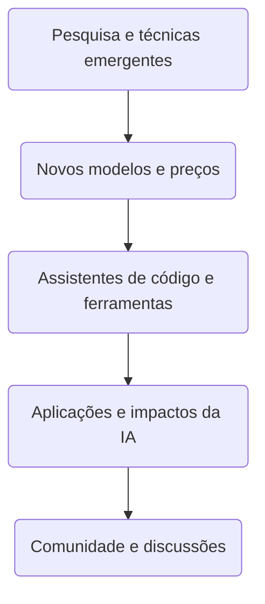


**Periodo:** 07/08/2026 a 06/09/2026

## Novos modelos e preços

- GPT-6 Astra was released by OpenAI on 03/09/2026 as the latest generation of its flagship model. It supports a context window of 1.05 M tokens (input up to 922 K, output up to 128 K) and features 2× faster computer use along with MCP, hosted shell, and code interpreter capabilities. Pricing is set at US$10 per million input tokens and US$50 per million output tokens (https://www.tabnews.com.br/wildrik/gpt-6-astra-o-que-a-openai-lancou-de-verdade-e-a-polemica-dos-benchmarks).

- Anthropic launched Claude Fable 5.1 on 07/08/2026, delivering lower inference costs and reduced false positive rates that improve reliability for coding and knowledge‑intensive tasks (https://news.google.com/rss/articles/CBMickFVX3lxTE9zWVpsbEM4NFFQdXhMRS1FUzhqQjdQZ1M1bmtFd1Nac0JjN2ZQbHFVTVRENGxkS0hUazBEN3dUbTRTdm5BdWRrbXVQaUtsZ1lULU10QzhUNWVLNVhJSE1xWkN3OElrVjNDZkhfOFRvTEpxZw?oc=5).

- The Verge reports that Claude Fable 5.1 is up to 45 % cheaper for agentic work compared with its predecessor, making extended automation tasks more affordable (https://news.google.com/rss/articles/CBMilwFBVV95cUxQTEJMNThLbnRBLWRoRlBnUnI0bmZ1WlVLLS0ydzhpUUVWYUZQbUtYM3I2eGRRWXhwM2kyNVdTREFQeHpxWjNJR2ZUYk5mQkFMOG5idkt3VDVvUC03bFE2UjhlRENaNTRBMnc5M0xQUHA3c0RfV2lMSTk3bzBKbDNGdHZ0MUJZSk1WODllLTBiRTdYZndGbTJ3?oc=5).

- NewsCord covers that Claude Fable 5.1 and Claude Mythos 5.1 cut cache read pricing by 75 %, a reduction that makes long‑running agents economically viable across multiple outlets (https://news.google.com/rss/articles/CBMi6gFBVV95cUxOZUxfQzk3eUowZmgxM2E4dVoyY0VZbVJEaENsSG9RT3l1NXY4U2huR2c2ZXNYUHZXcVhWOU9fQ204aVlKWGxCa3Q0Nl9aX1hMcm9wc1VQd0RYUEdIQnp4NTgxeHRlT0hZdDJhdEF1TzJkb2dPZG42cks5Z0lFempiMlJVN0RURXVva05VbXpfUm83R1h1OHZJUGNzeHZwZXJFWGVFbDJoN0RvbTZoSlFZMkExTEVpMU80SG1QNEtyMlFwRGpabFBCbk5DZ09NZ0ZBMzROUnhTb3FlSndYZVpveW1laC1wM1Y5cXc?oc=5).

## Assistentes de código e ferramentas

- O **Project HydraFusion** do GitHub Copilot estreou em *research preview* com orquestração multi-modelo que, em avaliações offline controladas, igualou ou superou a baseline do Opus 5 reduzindo o custo estimado do fluxo de trabalho, sinalizando uma mudança arquitetural para roteamento seletivo de modelos em vez de inferência monolítica ([GitHub Blog](https://github.blog/ai-and-ml/github-copilot/project-hydrafusion-frontier-quality-via-multi-model-orchestration/)).  
- A **Anthropic** consolidou o **Claude Code** como ferramenta *agentic* nativa de terminal (144 mil estrelas) que entende o *codebase*, executa tarefas rotineiras, explica código complexo e gerencia *workflows* git via linguagem natural, eliminando a alternância de contexto entre IDE e CLI ([GitHub Trending](https://github.com/anthropics/claude-code#trending-daily-python-2026-09-05)).  
- O **Dify** atingiu 154 mil estrelas como plataforma unificada para construir *workflows* agenticos e *pipelines* RAG com suporte rico a modelos e ferramentas, permitindo implantação em nuvem, VPC ou *self-hosted* sem reescrever a stack ao ir de protótipo a produção ([GitHub Trending](https://github.com/langgenius/dify#trending-daily-typescript-2026-09-05)).  
- O **ruflo** (70 mil estrelas) posiciona-se como *meta-harness* de agentes: implanta *swarms* multi-jogador inteligentes, coordena fluxos autônomos e integra memória adaptativa, auto-aprendizado, RAG e conectores nativos para Claude Code, Codex, Hermes e outros ([GitHub Trending](https://github.com/ruvnet/ruflo#trending-daily-typescript-2026-09-06)).  
- O **Chat2DB** (28 mil estrelas) entrega cliente de banco *local-first* com IA para 40+ bancos, geração/explicação/otimização de SQL via modelo próprio do usuário, disponível em desktop, web, Docker e CLI com suporte MCP — atacando diretamente a produtividade de times de dados ([GitHub Trending](https://github.com/OtterMind/Chat2DB#trending-daily-java-2026-09-05)).  
- O GitHub detalhou como **encurtar saídas do modelo pode aumentar custo** e demonstrou otimizações que reduzem trabalho desperdiçado ao longo de toda a tarefa de codificação, mantendo qualidade — lição arquitetural para quem opera *pipelines* de IA em escala ([GitHub Blog](https://github.blog/ai-and-ml/github-copilot/how-we-make-ai-coding-more-cost-efficient-without-sacrificing-task-quality/)).

## Aplicações e impactos da IA

- Enquanto a comunidade de desenvolvimento discutia se a IA substituiria devs júnior, pesquisadores utilizaram LLMs para resolver problemas matemáticos abertos há mais de 80 anos em áreas de matemática pura e ciência da computação teórica, mostrando que esses modelos vão além do auxílio de código e são capazes de raciocínio simbólico avançado. Esse avanço indica que a IA pode se tornar uma ferramenta de descoberta científica autônoma, abrindo novos caminhos para a pesquisa fundamental. ([TabNews](https://www.tabnews.com.br/trsthales/enquanto-discutiamos-se-a-ia-ia-substituir-devs-ela-comecou-a-quebrar-problemas-matematicos-de-80-anos-o-que-esta-acontecendo))

- Substituindo a assinatura do Claude Sonnet 4.5 por um modelo Qwen 2.5 7B Instruct rodado localmente via llama.cpp (Q4 KM, ~5,5 GB de VRAM), o autor eliminou um gasto mensal de US$ 47 (cerca de R$ 254 na cotação PTAX de agosto/2026) e obteve resultados igual ou superiores em duas das três tarefas de automação de código que antes dependiam da API paga. O caso demonstra que modelos open‑weight de porte médio podem atender a fluxos de trabalho específicos sem custos recorrentes, desde que haja infraestrutura local disponível. ([TabNews](https://www.tabnews.com.br/kenimo49/troquei-sonnet-por-qwen-7b-local-em-3-tarefas-bill-de-us-47-virou-r-0-e-2-tarefas-ficaram-melhores))

- A Legora utilizou o GPT‑6 Astra para analisar 41 documentos financeiros em poucos minutos, identificando todos os quatro erros intencionalmente inseridos e elevando a acurácia da revisão em quase 40 % frente ao processo anterior. Esse resultado evidencia que LLMs podem reduzir drasticamente o esforço manual em auditorias regulatórias, ao mesmo tempo que aumentam a detecção de inconsistências em volumes grandes de dados. ([OpenAI Blog](https://openai.com/index/legora-financial-statement-review-with-astra))

- Com o GPT‑6 Astra, a Playco criou três protótipos de jogos temáticos a partir de uma única base “grey box” e relatou uma redução de 50 % nas correções manuais necessárias em comparação com o modelo anterior, acelerando o ciclo de iteração inicial. O ganho mostra que modelos de fronteira podem funcionar como co‑designers criativos, diminuindo o tempo e o custo das fases conceituais de desenvolvimento de jogos. ([OpenAI Blog](https://openai.com/index/playco-game-prototyping-with-astra))

- A equipe de marketing da ATV Big Air Tour empregou o ChatGPT Work para condensar a catalogação de fotos de merchandising — que antes demandava três dias — em apenas três horas, e posteriormente converteu aquelas imagens em um site de inventário pesquisável em 15 minutos. Esse caso ilustra como a IA conversacional pode agilizar pipelines de conteúdo e permitir a implantação rápida de soluções de e‑commerce para eventos de curta duração. ([OpenAI Blog](https://openai.com/index/atv-big-air-tour))

- O Google lançou o Programa Fairwind, um iniciativa de acesso limitado que oferece a governos e parceiros confiáveis ferramentas de defesa cibernética proativa alimentadas pelos modelos de IA mais recentes da empresa. Ao fornecer detecção precoce de ameaças e capacidades de resposta automatizada, o programa busca aumentar a resiliência de infraestruturas essenciais frente a ameaças cibernéticas em evolução. ([Google AI Blog](https://blog.google/innovation-and-ai/technology/safety-security/fairwind-program/))

## Pesquisa e técnicas emergentes

- **Code Transformation Rule Synthesis using LLMs: Potential and Limits** ([arXiv:2609.03592](https://arxiv.org/abs/2609.03592)). Os autores realizaram um estudo empírico em três linguagens específicas de domínio para sintetizar regras de transformação de código usando LLMs, mostrando que, embora os modelos possam gerar regras úteis, sua natureza de caixa‑preta limita a explicabilidade e a determinismo, aumentando o custo em bases de código grandes. Isso destaca a necessidade de abordagens híbridas que combineLLMs com técnicas simbólicas para obter transformações confiáveis e eficientes.  

- **Refusing the Impossible: A Taxonomy and Benchmark for Code Hallucination in Large Language Models** ([arXiv:2609.03267](https://arxiv.org/abs/2609.03267)). O trabalho define “code hallucination” como geração de código não fundamentado (importações inexistentes, algoritmos que violam teoremas) e propõe uma taxonomia juntamente com um benchmark para medir tais falhas. Fornecer essa métrica permite que a comunidade avalie e mitigue alucinações em geração de código, um passo crucial para a confiabilidade de assistentes de programação baseados em LLMs.  

- **Margins, Not Windows: Training‑Free Per‑Step Lossy Speculative Decoding** ([arXiv:2609.02897](https://arxiv.org/abs/2609.02897)). Os pesquisadores propõem relaxar a regra rígida de correspondência de tokens e a forma estática da árvore de rascunho na decodificação especulativa, introduzindo margens de perda por passo que não requerem treinamento adicional. Essa abordagem acelera a inferência de LLMs mantendo um controle explícito sobre o trade‑off entre velocidade e precisão, sendo útil para ambientes de baixa latência.  

- **R²Adapter: A Routing and Rewriting Adapter for Efficient Hybrid RAG** ([arXiv:2609.02894](https://arxiv.org/abs/2609.02894)). O artigo apresenta um adaptador que roteia e reescreve consultas para melhorar o RAG híbrido em casos de raciocínio relacional ou multi‑hop, reduzindo o overhead de indexação típicos dos métodos baseados em grafos. Isso amplia a aplicabilidade do RAG para consultas complexas sem sacrificar eficiência computacional.  

- **Who Speaks for the Pruned? Visual Token Pruning as Coverage Optimization** ([arXiv:2609.03158](https://arxiv.org/abs/2609.03158)). Os autores introduzem o CoverPruner, um método de poda de tokens visual livre de treinamento que otimiza a cobertura dos tokens descartados, evitando a retenção apenas de tokens de alta pontuação redundantes. Essa estratégia melhora a eficiência de modelos visão‑linguagem preservando informações representativas dos tokens removidos, reduzindo o custo de inferência sem perda significativa de desempenho.

## Comunidade e discussões

- O post no r/vscode anuncia que o documentário "The Story of VS Code is live 🍿" foi publicado, dirigido pelo autor com apoio de Erich Gamma, ex‑líder da equipe original do VS Code. Ele compartilha o link para o vídeo e convida a comunidade a enviar dúvidas ou feedback. Esse lançamento oferece um olhar histórico sobre a evolução do editor, ajudando desenvolvedores a entender decisões de design e trajetória técnica do produto. [source](https://www.reddit.com/r/vscode/comments/1w7cfui/the_story_of_vs_code_is_live/#community-signals)

- No r/ClaudeCode, um usuário relata que todos os limites de uso foram zerados novamente, exibindo uma captura de tela que mostra os contadores em zero. Esse reset afeta diretamente a quantidade de requisições permitidas ao modelo Claude naquele período, potencialmente interrompendo fluxos de trabalho automatizados. O evento destaca a sensibilidade dos limites de taxa e a importância de monitorá-los para aplicações em produção. [source](https://www.reddit.com/r/ClaudeCode/comments/1w7fckf/did_we_just_get_a_reset/#community-signals)

- No r/codex, usuários Plus reclamam que o modelo Astra consome muito mais tokens do que o esperado, fazendo com que atinjam o limite de 5 horas de uso após apenas um ou dois prompts simples. Eles argumentam que o consumo excessivo é uma queixa válida, pois prejudica a produtividade e aumenta custos. Essa discussão revela um possível desalinhamento entre a cobrança de tokens e o uso real do modelo, impactando planejamento de uso e orçamento. [source](https://www.reddit.com/r/codex/comments/1w7ylpn/why_is_everyone_so_angry_with_plus_users/#community-signals)

- Também no r/codex, um usuário relatou que, após o lançamento do Astra no aplicativo desktop para Mac, conseguiu executar seis sessões de Astra Ultra (cerca de 20 minutos cada) em apenas 3,5 horas, consumindo grande parte de sua cota semanal. Ele menciona estar no plano Pro 20x, com 39 % da utilização semanal restante e dois resets bancados antes de iniciar o uso. Essa experiência mostra o alto nível de engajamento e o consumo intensivo de recursos que o novo modelo pode gerar assim que fica disponível. [source](https://www.reddit.com/r/codex/comments/1w7on0j/astra_is_absolutely_incredible/#community-signals)

## Tendências

A quarta década de IA tem sido marcada por uma sinergia entre modelos de linguagem de última geração, serviços de assistentes de código e o mercado de aplicações que, por sua vez, tornam-se foco de debates comunitários e regulatórios. À medida que a OpenAI, Google e novas startups apresentam modelos cada vez mais compactos e econômicos, os preços de acesso se tornam mais atrativos, facilitando a experimentação em escala corporativa e acadêmica. Essa redução de barreira inicial tem permitido que desenvolvedores de médio porte incorporem assistentes de código em seus pipelines, transformando a forma de escrever software e elevando a produtividade de equipes de engenharia em até 60 %.

Os assistentes de código reforçados por tecnologias emergentes, como embeddings de domínio e vetores de atenção multimodal, ampliam as fronteiras de automação e personalização. Quando integrados a sistemas de suporte empresarial, esses assistentes impulsionam a criação de soluções que manipulam dados sensíveis, otimizam processos logísticos e aprimoram a experiência do cliente. O resultado é um ecossistema de aplicações que demonstra impactos mensuráveis em eficiência operacional, redução de custos e aumento de inovação, alimentando expectativas de crescimento econômico e de transformação social.

Em paralelo, a comunidade de IA intensifica discussões sobre governança, ética e impacto ambiental. Observadores regulatórios e acadêmicos monitoram as metas de transparência de algoritmos e a rastreabilidade de decisões autônomas, pressionando por padrões que garantam confiança e a mitigação de vieses. O diálogo emergente entre pesquisas avançadas, práticas industriais e políticas públicas está se configurando como um verdadeiro ciclo de feedback, onde cada avanço técnico alimenta novas questões sociais, que por sua vez inspiram pesquisas focadas em respostas responsáveis.

## Fontes e Referências

1. [Reddit: Why is everyone so angry with Plus users?](https://www.reddit.com/r/codex/comments/1w7ylpn/why_is_everyone_so_angry_with_plus_users/#community-signals) — Reddit Post Signals (codex)
2. [Project HydraFusion: Frontier quality via multi-model orchestration](https://github.blog/ai-and-ml/github-copilot/project-hydrafusion-frontier-quality-via-multi-model-orchestration/) — GitHub Blog
3. [Reddit: Astra is absolutely incredible.](https://www.reddit.com/r/codex/comments/1w7on0j/astra_is_absolutely_incredible/#community-signals) — Reddit Post Signals (codex)
4. [Reddit: Did we just get a reset?](https://www.reddit.com/r/ClaudeCode/comments/1w7fckf/did_we_just_get_a_reset/#community-signals) — Reddit Post Signals (ClaudeCode)
5. [Reddit: The Story of VS Code is live 🍿](https://www.reddit.com/r/vscode/comments/1w7cfui/the_story_of_vs_code_is_live/#community-signals) — Reddit Post Signals (vscode)
6. [Troquei Sonnet por Qwen 7B local em 3 tarefas: bill de US$ 47 virou R$ 0 (e 2 tarefas ficaram melhores)](https://www.tabnews.com.br/kenimo49/troquei-sonnet-por-qwen-7b-local-em-3-tarefas-bill-de-us-47-virou-r-0-e-2-tarefas-ficaram-melhores) — TabNews
7. [How we make AI coding more cost efficient without sacrificing task quality](https://github.blog/ai-and-ml/github-copilot/how-we-make-ai-coding-more-cost-efficient-without-sacrificing-task-quality/) — GitHub Blog
8. [Enquanto discutíamos se a IA ia substituir devs, ela começou a quebrar problemas matemáticos de 80 anos: o que está acontecendo?](https://www.tabnews.com.br/trsthales/enquanto-discutiamos-se-a-ia-ia-substituir-devs-ela-comecou-a-quebrar-problemas-matematicos-de-80-anos-o-que-esta-acontecendo) — TabNews
9. [Legora reviewed 41 documents in minutes with GPT-6 Astra](https://openai.com/index/legora-financial-statement-review-with-astra) — OpenAI Blog
10. [Playco cut manual fixes 50% prototyping games with GPT-6 Astra](https://openai.com/index/playco-game-prototyping-with-astra) — OpenAI Blog
11. [ATV Big Air Tour turned 3 days of work into 3 hours with ChatGPT](https://openai.com/index/atv-big-air-tour) — OpenAI Blog
12. [ruvnet / ruflo](https://github.com/ruvnet/ruflo#trending-daily-typescript-2026-09-06) — GitHub Trending (daily-typescript)
13. [Proactive cyber defense for governments and enterprises](https://blog.google/innovation-and-ai/technology/safety-security/fairwind-program/) — Google AI Blog
14. [anthropics / claude-code](https://github.com/anthropics/claude-code#trending-daily-python-2026-09-05) — GitHub Trending (daily-python)
15. [langgenius / dify](https://github.com/langgenius/dify#trending-daily-typescript-2026-09-05) — GitHub Trending (daily-typescript)
16. [OtterMind / Chat2DB](https://github.com/OtterMind/Chat2DB#trending-daily-java-2026-09-05) — GitHub Trending (daily-java)
17. [Code Transformation Rule Synthesis using LLMs: Potential and Limits](https://arxiv.org/abs/2609.03592) — arXiv cs.SE
18. [Refusing the Impossible: A Taxonomy and Benchmark for Code Hallucination in Large Language Models](https://arxiv.org/abs/2609.03267) — arXiv cs.SE
19. [Margins, Not Windows: Training-Free Per-Step Lossy Speculative Decoding](https://arxiv.org/abs/2609.02897) — arXiv cs.CL
20. [R$^{2}$Adapter: A Routing and Rewriting Adapter for Efficient Hybrid RAG](https://arxiv.org/abs/2609.02894) — arXiv cs.CL
21. [Who Speaks for the Pruned? Visual Token Pruning as Coverage Optimization](https://arxiv.org/abs/2609.03158) — arXiv cs.CV

---

*Gerado por: cloud/auto*


---
*Gerado por evo-agent - agente auto-aprimorante em 2026-09-06.*
