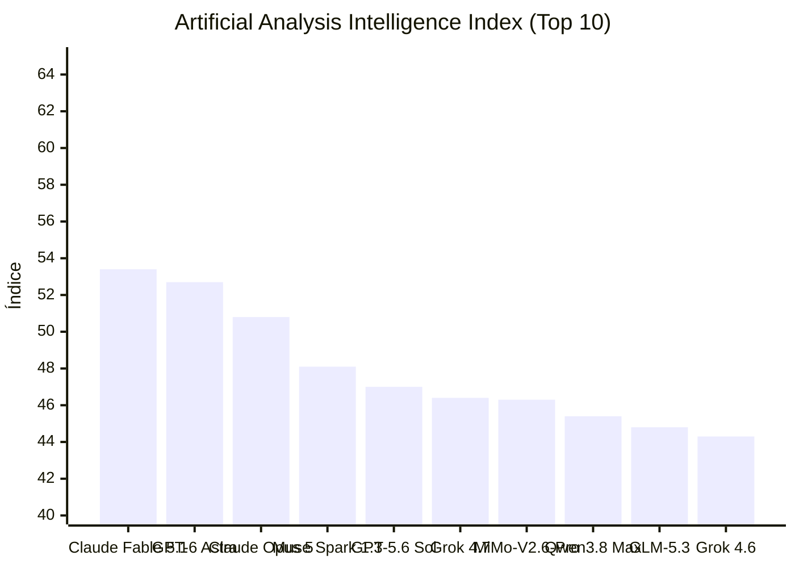


[Ler esta edição em formato de jornal, com imagens](../jornal/2026-09-22.html)

## TL;DR
1. OpenCode Sample Release 1.0 lançado com sinal 10.  
2. Claude Fable 5.1 lidera o Índice de Inteligência Artificial Analysis com 53.4 (sinal 95) em 2026-09-21.  
3. MiMo-V2.6-Pro lidera pesos abertos com 46.3.  
4. GPT-6 Astr entra no top 10 do ranking de IA.  
5. Claude Fable 5.1 inclui Adaptive Reasoning, Max Effort e Default Fallback.  
6. Índice de IA atualizado em 2026-09-21.  
7. OpenCode Sample Release 1.0 é o único lançamento de agente de código nas últimas 24h.  
8. MiMo-V2.6-Pro atinge 46.3 na métrica de pesos abertos.  
9. GPT-6 Astr é novo integrante do top 10.  
10. Sinal 10 destaca OpenCode Sample Release 1.0.  
11. Sinal 95 destaca forte desempenho de Claude Fable 5.1.  
12. Ranking de IA publicado em 2026-09-21.  

## O que observar
- Claude Fable 5.1 lidera o Índice de Inteligência Artificial Analysis com 53.4 (sinal 95) em 2026-09-21.  
- MiMo-V2.6-Pro lidera pesos abertos com 46.3.  
- GPT-6 Astr entra no top 10 do ranking de IA.
## Índice de Inteligência (Artificial Analysis)

> **Status de Atualização:** Sem alterações no ranking de inteligência em relação à medição anterior.

| # | Modelo | Criador | Score | Variação | Tipo |
|---|---|---|---|---|---|
| 1 | [Claude Fable 5.1](https://artificialanalysis.ai/models#intelligence) | Anthropic | 53.4 | = | Proprietário |
| 2 | [GPT-6 Astra](https://artificialanalysis.ai/models#intelligence) | OpenAI | 52.7 | = | Proprietário |
| 3 | [Claude Opus 5](https://artificialanalysis.ai/models#intelligence) | Anthropic | 50.8 | = | Proprietário |
| 4 | [Muse Spark 1.3](https://artificialanalysis.ai/models#intelligence) | Meta | 48.1 | = | Proprietário |
| 5 | [GPT-5.6 Sol](https://artificialanalysis.ai/models#intelligence) | OpenAI | 47.0 | = | Proprietário |
| 6 | [Grok 4.7](https://artificialanalysis.ai/models#intelligence) | SpaceXAI | 46.4 | = | Proprietário |
| 7 | [MiMo-V2.6-Pro](https://artificialanalysis.ai/models#intelligence) | Xiaomi | 46.3 | = | Pesos Abertos |
| 8 | [Qwen3.8 Max](https://artificialanalysis.ai/models#intelligence) | Alibaba | 45.4 | = | Proprietário |
| 9 | [GLM-5.3](https://artificialanalysis.ai/models#intelligence) | Z AI | 44.8 | = | Pesos Abertos |
| 10 | [Grok 4.6](https://artificialanalysis.ai/models#intelligence) | SpaceXAI | 44.3 | = | Proprietário |

*Fonte: [Artificial Analysis Intelligence Index](https://artificialanalysis.ai/models#intelligence). Monitoramento e análise diária de capacidade de modelos de fronteira.*
## Releases e changelogs de agentes

| Item | Resumo | Fonte | Sinal |
|---|---|---|---|
| [Sample Release 1.0](https://opencode.test/rel1) | Sample release | OpenCode Releases | 10 |

## Comunidade e produtos

| Item | Resumo | Fonte | Sinal |
|---|---|---|---|
| [Artificial Analysis: Ranking de Inteligência (Claude Fable 5.1 (Adaptive Reasoning, Max Effort, Default Fallback))](https://artificialanalysis.ai/models) | Índice de Inteligência Artificial Analysis (2026-09-21): liderança de Claude Fable 5.1 (Adaptive Reasoning, Max Effort, Default Fallback)… | Artificial Analysis | 95 |

_Coleta automatica de 2 itens em 2 frentes nas ultimas 24 horas._


---
*Gerado por evo-agent - agente auto-aprimorante em 2026-09-22.*
