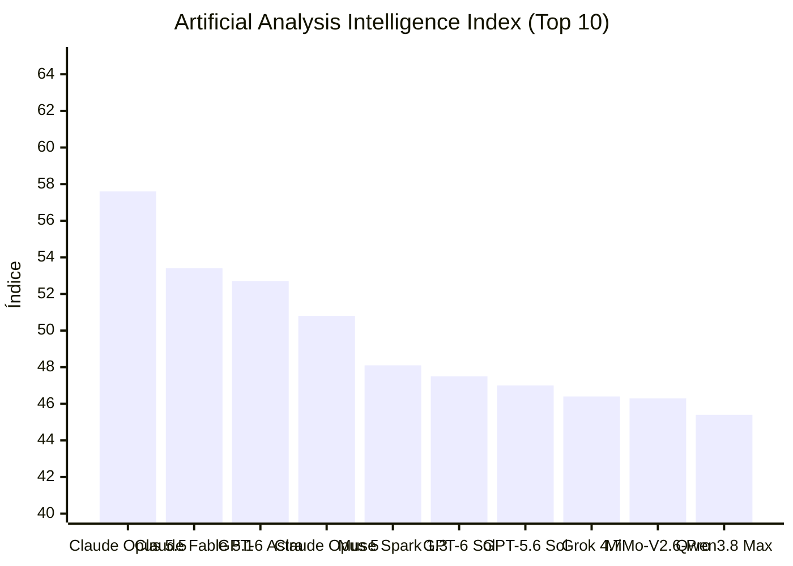


[Ler esta edição em formato de jornal, com imagens](../jornal/2026-09-22.html)

## Lançamento do dia

- **[OpenAI: GPT-6 Sol](https://openrouter.ai/openai/gpt-6-sol)** (OpenRouter: New Models) — 1050000 tokens de contexto. GPT-6 Sol is the cost-efficient high-end model in OpenAI's GPT-6 series, positioned below the flagship GPT-6…
- **[OpenAI: GPT-6 Sol Pro](https://openrouter.ai/openai/gpt-6-sol-pro)** (OpenRouter: New Models) — 1050000 tokens de contexto. GPT-6 Sol Pro is the same underlying model as GPT-6 Sol, served with reasoning.mode set to pro for…
- **[OpenAI: GPT-6 Luna](https://openrouter.ai/openai/gpt-6-luna)** (OpenRouter: New Models) — 1050000 tokens de contexto. GPT-6 Luna is the fast, cost-efficient model in OpenAI's GPT-6 series, positioned below GPT-6 Sol. It is suited…
- **[OpenAI: GPT-6 Luna Pro](https://openrouter.ai/openai/gpt-6-luna-pro)** (OpenRouter: New Models) — 1050000 tokens de contexto. GPT-6 Luna Pro is the same underlying model as GPT-6 Luna, served with reasoning.mode set to pro for…
- **[Anthropic: Claude Opus 5.5](https://openrouter.ai/anthropic/claude-opus-5.5)** (OpenRouter: New Models) — 1000000 tokens de contexto. Claude Opus 5.5 is Anthropic's flagship model for demanding reasoning, coding, and long-horizon agentic work,…

## TL;DR  
1. Release do dia: OpenAI GPT‑6 Sol, Sol Pro, Luna, Luna Pro (1 050 000 tokens).  
2. Anthropic lança Claude Opus 5.5 (1 000 000 tokens).  
3. OpenAI publisha “Better prompt caching” para GPT‑6 (cache hit maior).  
4. Codex CLI v0.156.0 chega, mantém compatibilidade com GPT‑6.  
5. Copilot CLI 1.0.88 adiciona notificações OSC 777 (terminal Ghostty/WezTerm).  
6. Cline SDK v0.0.85 corrige falha de token‑limit em chamadas de ferramenta.  
7. Claude Code v2.1.280 inclui Claude Opus 5.5 como modelo padrão.  
8. DeepSeek V4.1 Flash chega a 3 525 likes e 512 120 downloads (image‑text‑to‑text).  
9. HF Trending: Prism‑ML Ternary‑Bonsai‑2‑27B‑gguf (222 7879 downloads, text‑generation).  
10. Paper “CodeMidas: Scaling Agentic Coding RL Environments from Code Itself” recebe 91 votos.  
11. Paper “Grounded Skill Synthesis from Code at Scale for Agentic Intelligence” obtém 89 votos.  
12. Paper “OmniVChat” recebe 34 votos (audio‑video multimodal).  

## O que observar  
- Custos e limites de token nos novos GPT‑6 e Claude Opus 5.5.  
- Melhorias de cache e diagnóstico em GPT‑6 para otimizar latência.  
- Corrige comportamento de sub‑agentes no Cline SDK e novas características de paralelismo.
## Índice de Inteligência (Artificial Analysis)

> **Status de Atualização:** Sem alterações no ranking de inteligência em relação à medição anterior.

| # | Modelo | Criador | Score | Variação | Tipo |
|---|---|---|---|---|---|
| 1 | [Claude Opus 5.5](https://artificialanalysis.ai/models#intelligence) | Anthropic | 57.6 | = | Proprietário |
| 2 | [Claude Fable 5.1](https://artificialanalysis.ai/models#intelligence) | Anthropic | 53.4 | = | Proprietário |
| 3 | [GPT-6 Astra](https://artificialanalysis.ai/models#intelligence) | OpenAI | 52.7 | = | Proprietário |
| 4 | [Claude Opus 5](https://artificialanalysis.ai/models#intelligence) | Anthropic | 50.8 | = | Proprietário |
| 5 | [Muse Spark 1.3](https://artificialanalysis.ai/models#intelligence) | Meta | 48.1 | = | Proprietário |
| 6 | [GPT-6 Sol](https://artificialanalysis.ai/models#intelligence) | OpenAI | 47.5 | = | Proprietário |
| 7 | [GPT-5.6 Sol](https://artificialanalysis.ai/models#intelligence) | OpenAI | 47.0 | = | Proprietário |
| 8 | [Grok 4.7](https://artificialanalysis.ai/models#intelligence) | SpaceXAI | 46.4 | = | Proprietário |
| 9 | [MiMo-V2.6-Pro](https://artificialanalysis.ai/models#intelligence) | Xiaomi | 46.3 | = | Pesos Abertos |
| 10 | [Qwen3.8 Max](https://artificialanalysis.ai/models#intelligence) | Alibaba | 45.4 | = | Proprietário |

*Fonte: [Artificial Analysis Intelligence Index](https://artificialanalysis.ai/models#intelligence). Monitoramento e análise diária de capacidade de modelos de fronteira.*
## GitHub Trending

| Item | Resumo | Fonte | Sinal |
|---|---|---|---|
| [affaan-m / ECC](https://github.com/affaan-m/ECC) | The agent harness performance optimization system. Skills, instincts, memory, security, and research-first development for Claude Code,… | GitHub Trending (daily-javascript) | 265019 |
| [anthropics / claude-code](https://github.com/anthropics/claude-code) | Claude Code is an agentic coding tool that lives in your terminal, understands your codebase, and helps you code faster by executing… | GitHub Trending (daily-typescript) | 147465 |
| [clash-verge-rev / clash-verge-rev](https://github.com/clash-verge-rev/clash-verge-rev) | A modern GUI client based on Tauri, designed to run in Windows, macOS and Linux for tailored proxy experience \| ⭐ 146,159 \| Lang: Rust | GitHub Trending (daily-rust) | 146159 |
| [browser-use / browser-use](https://github.com/browser-use/browser-use) | Agents that use the browser. \| ⭐ 115,773 \| Lang: Python | GitHub Trending (daily-python) | 115773 |
| [supabase / supabase](https://github.com/supabase/supabase) | The Postgres development platform. Supabase gives you a dedicated Postgres database to build your web, mobile, and AI applications. \| ⭐… | GitHub Trending (weekly) | 110525 |
| [earendil-works / pi](https://github.com/earendil-works/pi) | AI agent toolkit: unified LLM API, agent loop, TUI, coding agent CLI \| ⭐ 108,112 \| Lang: TypeScript | GitHub Trending (daily-typescript) | 108112 |
| [JuliusBrussee / caveman](https://github.com/JuliusBrussee/caveman) | 🪨 why use many token when few token do trick. Viral skill + proxy for coding agents that cuts 65% of tokens by talking like a caveman. \|… | GitHub Trending (daily-go) | 107269 |
| [addyosmani / agent-skills](https://github.com/addyosmani/agent-skills) | Production-grade engineering skills for AI coding agents. \| ⭐ 98,133 \| Lang: JavaScript | GitHub Trending (daily-javascript) | 98133 |
| [infiniflow / ragflow](https://github.com/infiniflow/ragflow) | RAGFlow is a leading open-source Retrieval-Augmented Generation (RAG) engine that fuses cutting-edge RAG with Agent capabilities to create… | GitHub Trending (daily-go) | 91109 |
| [home-assistant / core](https://github.com/home-assistant/core) | 🏡 Open source home automation that puts local control and privacy first. \| ⭐ 90,975 \| Lang: Python | GitHub Trending (weekly) | 90975 |
| [Leonxlnx / taste-skill](https://github.com/Leonxlnx/taste-skill) | Taste-Skill - gives your AI good taste. stops the AI from generating boring, generic slop \| ⭐ 89,049 \| Lang: JavaScript | GitHub Trending (daily-javascript) | 89049 |
| [Panniantong / Agent-Reach](https://github.com/Panniantong/Agent-Reach) | Give your AI agent eyes to see the entire internet. Read & search Twitter, Reddit, YouTube, GitHub, Bilibili, XiaoHongShu — one CLI, zero… | GitHub Trending (weekly) | 84365 |
| [stablyai / orca](https://github.com/stablyai/orca) | Orca is the ADE for working with a fleet of parallel agents. Run any coding agent with your own subscription. Available on desktop, mobile… | GitHub Trending (daily-typescript) | 75119 |
| [cline / cline](https://github.com/cline/cline) | Autonomous coding agent as an SDK, IDE extension, or CLI assistant. \| ⭐ 68,974 \| Lang: TypeScript | GitHub Trending (weekly) | 68974 |
| [docling-project / docling](https://github.com/docling-project/docling) | Get your documents ready for gen AI \| ⭐ 67,532 \| Lang: Python | GitHub Trending (daily-python) | 67532 |

## Modelos: lançamentos e trending

| Item | Resumo | Fonte | Sinal |
|---|---|---|---|
| [convaiinnovations/laya](https://huggingface.co/convaiinnovations/laya) | text-classification · 1736 likes · 0 downloads · trending 1692 | HF Trending Models | 1692 |
| [Qwen: Qwen3.8 Omni Flash](https://openrouter.ai/qwen/qwen3.8-omni-flash) | 1000000 tokens de contexto. Qwen3.8 Omni Flash is an omni-modal reasoning model from Alibaba, the first Qwen model built around agentic… | OpenRouter: New Models | - |
| [prism-ml/Ternary-Bonsai-2-27B-gguf](https://huggingface.co/prism-ml/Ternary-Bonsai-2-27B-gguf) | text-generation · 1729 likes · 2227879 downloads · trending 1589 | HF Trending Models | 1589 |
| [OpenAI: GPT-6 Sol](https://openrouter.ai/openai/gpt-6-sol) | 1050000 tokens de contexto. GPT-6 Sol is the cost-efficient high-end model in OpenAI's GPT-6 series, positioned below the flagship GPT-6… | OpenRouter: New Models | - |
| [Qwen/Qwen-Image-2.1](https://huggingface.co/Qwen/Qwen-Image-2.1) | text-to-image · 1435 likes · 6523 downloads · trending 1388 | HF Trending Models | 1388 |
| [OpenAI: GPT-6 Sol Pro](https://openrouter.ai/openai/gpt-6-sol-pro) | 1050000 tokens de contexto. GPT-6 Sol Pro is the same underlying model as GPT-6 Sol, served with reasoning.mode set to pro for… | OpenRouter: New Models | - |
| [XingChen-AGI/Xing4.0-29B-A4B](https://huggingface.co/XingChen-AGI/Xing4.0-29B-A4B) | text-generation · 1120 likes · 18394 downloads · trending 1019 | HF Trending Models | 1019 |
| [OpenAI: GPT-6 Luna](https://openrouter.ai/openai/gpt-6-luna) | 1050000 tokens de contexto. GPT-6 Luna is the fast, cost-efficient model in OpenAI's GPT-6 series, positioned below GPT-6 Sol. It is suited… | OpenRouter: New Models | - |
| [abenzerps/Qwen-Image-2.1-Uncensored-GGUF](https://huggingface.co/abenzerps/Qwen-Image-2.1-Uncensored-GGUF) | text-to-image · 1014 likes · 182313 downloads · trending 915 | HF Trending Models | 915 |
| [OpenAI: GPT-6 Luna Pro](https://openrouter.ai/openai/gpt-6-luna-pro) | 1050000 tokens de contexto. GPT-6 Luna Pro is the same underlying model as GPT-6 Luna, served with reasoning.mode set to pro for… | OpenRouter: New Models | - |
| [deepseek-ai/DeepSeek-V4.1-Flash](https://huggingface.co/deepseek-ai/DeepSeek-V4.1-Flash) | image-text-to-text · 3525 likes · 512120 downloads · trending 781 | HF Trending Models | 781 |
| [Anthropic: Claude Opus 5.5](https://openrouter.ai/anthropic/claude-opus-5.5) | 1000000 tokens de contexto. Claude Opus 5.5 is Anthropic's flagship model for demanding reasoning, coding, and long-horizon agentic work,… | OpenRouter: New Models | - |
| [Qwen/Qwen3.8-27B](https://huggingface.co/Qwen/Qwen3.8-27B) | image-text-to-text · 15968 likes · 7153238 downloads · trending 593 | HF Trending Models | 593 |
| [abenzerps/Qwen-Image-2.1-GGUF](https://huggingface.co/abenzerps/Qwen-Image-2.1-GGUF) | text-to-image · 613 likes · 33232 downloads · trending 563 | HF Trending Models | 563 |
| [harshatheg/Qwen-2.5-1B-RLCD](https://huggingface.co/harshatheg/Qwen-2.5-1B-RLCD) | text-generation · 518 likes · 0 downloads · trending 501 | HF Trending Models | 501 |

## Reddit

| Item | Resumo | Fonte | Sinal |
|---|---|---|---|
| [CLAUDE.md for Opus 5.5 based on Anthropic's official platform docs. (alleged model growth report included)](https://www.reddit.com/r/ClaudeAI/comments/1wnl999/claudemd_for_opus_55_based_on_anthropics_official/) | I previously shared a CLAUDE.md file for Opus 5 after reading through Anthropic's docs because I noticed how many of the things people… | Reddit: ClaudeAI | - |
| [Opus 5.5 High Benchmark.](https://www.reddit.com/r/ClaudeAI/comments/1wngwwq/opus_55_high_benchmark/) | Model: opus 5.5 Effort: high Duration: 15 minutes Prompt: "Build me a high quality 3D Sakura using threejs in HTML CSS js" used maybe 1% if… | Reddit: ClaudeAI | - |
| [Opus 5.5 One Shot Video Generation](https://www.reddit.com/r/ClaudeAI/comments/1wnh4fn/opus_55_one_shot_video_generation/) | I was bored at work while Opus 5.5 dropped, so I gave it a simple prompt to make a creepy feeling video about my job. My only prompt to… | Reddit: ClaudeAI | - |
| [Opus 5.5 outperforms Fable 5.1 while costing 67% less per task](https://www.reddit.com/r/ClaudeAI/comments/1wni0qk/opus_55_outperforms_fable_51_while_costing_67/) | submitted by /u/BannedForThe7thTime \[link\] \[comments\] | Reddit: ClaudeAI | - |
| [Opus 5.5 in Claude Code is crazy fast, especially at spotting UI bugs](https://www.reddit.com/r/ClaudeAI/comments/1wnil7n/opus_55_in_claude_code_is_crazy_fast_especially/) | Been using Opus 5.5 in Claude Code and the speed is honestly wild. It's not just faster at writing code, it also finds bugs way quicker… | Reddit: ClaudeAI | - |
| [Opus 5.5 and GPT-6 Sol dropped on the same day, so I lined up every benchmark I could find](https://www.reddit.com/r/ClaudeAI/comments/1wnjyp1/opus_55_and_gpt6_sol_dropped_on_the_same_day_so_i/) | Anthropic and OpenAI both shipped new models today, GPT 6 Sol and Opus 5.5, and I wanted to pull up a proper head-to-head. On raw scores,… | Reddit: ClaudeAI | - |
| [Holy shit, it refuses to eat usage.](https://www.reddit.com/r/ClaudeAI/comments/1wnk240/holy_shit_it_refuses_to_eat_usage/) | I'm liking 5.5 quite a lot, I assume everyone is and that's why it's so silent in here. It's quite competent, and DOES NOT EAT USAGE!!!… | Reddit: ClaudeAI | - |
| [Opus 5.5: First impressions by a trained philosopher](https://www.reddit.com/r/ClaudeAI/comments/1wnkgie/opus_55_first_impressions_by_a_trained_philosopher/) | I do an open-ended "interview" with all new models that come out from the major labs. This is a vibe check, not a benchmark. The purpose is… | Reddit: ClaudeAI | - |
| [Opus 5.5 creates a train journey drawn entirely in JavaScript](https://www.reddit.com/r/ClaudeAI/comments/1wnkvys/opus_55_creates_a_train_journey_drawn_entirely_in/) | Opus 5.5 has an obvious step up in riso art and animations I noticed. It single-shot this in about 45 minutes. Full claude repo here - have… | Reddit: ClaudeAI | - |
| [Opus 5.5 got me excited the same way Opus 4.6 did](https://www.reddit.com/r/ClaudeAI/comments/1wnkx23/opus_55_got_me_excited_the_same_way_opus_46_did/) | I feel like this time I'm actually using an improved version of 4.6 for the first time. The output is amazing, the speed is crazy good, and… | Reddit: ClaudeAI | - |
| [Dear Anthropic please do not nerf](https://www.reddit.com/r/ClaudeAI/comments/1wnl1no/dear_anthropic_please_do_not_nerf/) | This model is an absolute joy to talk to, I do not want this dumbed down like so many prior releases post launch. Can we stop with that plz… | Reddit: ClaudeAI | - |
| [I animated how the Model Context Protocol (MCP) works how AI ...](https://www.reddit.com/r/mcp/comments/1ucnt47/i_animated_how_the_model_context_protocol_mcp/) | 22 de jun. de 2026 ... I animated how the Model Context Protocol (MCP) works how AI agents connect to tools, data & APIs A 10-minute visual… | Reddit (Model Context Protocol) | - |
| [Are there any Practical AI Coding Agents with generous limits out ...](https://www.reddit.com/r/ChatGPTCoding/comments/1miicxg/are_there_any_practical_ai_coding_agents_with/) | 5 de ago. de 2025 ... ... ai coding agent for full month working hours. It looks beauty, but I've hit higher limits than these faster...… | Reddit (AI coding agent) | - |
| [Reddit: I Built a VSCode Extension and a VBIDE Add-in for Modern VBA (Excel/Word/PowerPoint/Access) & VB6 Development](https://www.reddit.com/r/vscode/comments/1wn7j64/i_built_a_vscode_extension_and_a_vbide_addin_for/) | https://github.com/WilliamSmithEdward/xlide vscode https://github.com/WilliamSmithEdward/xlide vbide… | Reddit Post Signals (vscode) | - |
| [Reddit: Added turn timers to the Claude Code panel in VS Code](https://www.reddit.com/r/vscode/comments/1wn87tx/added_turn_timers_to_the_claude_code_panel_in_vs/) | The Claude Code terminal shows how long each task takes, but the VS Code panel doesn't. I made a small script that adds it.… | Reddit Post Signals (vscode) | - |

## Hacker News

| Item | Resumo | Fonte | Sinal |
|---|---|---|---|
| [GPT-6 Sol and Luna](https://openai.com/index/introducing-gpt-6-sol-and-luna/) | GPT-6 Sol and Luna \| ⬆ 412 points \| 💬 209 comments \| by OfficialTurkey | Hacker News | 830 |
| [Claude Opus 5.5](https://www.anthropic.com/claude-opus-5-5) | Claude Opus 5.5 \| ⬆ 244 points \| 💬 169 comments \| by throwaway371647 | Hacker News | 582 |
| [OpenAI GPT–6 Astra breaks Enigma message that has resisted solution since 2005](https://www.cryptocellar.org/bgac/the-mvueh-break.html) | OpenAI GPT–6 Astra breaks Enigma message that has resisted solution since 2005 \| ⬆ 132 points \| 💬 151 comments \| by sohkamyung | Hacker News | 434 |
| [Overreliance on AI contributed to missile strike on Iran school – Pentagon](https://www.bloomberg.com/graphics/2026-iran-school-attack/) | Overreliance on AI contributed to missile strike on Iran school – Pentagon \| ⬆ 149 points \| 💬 70 comments \| by devonnull | Hacker News | 289 |
| [Study: Young users (9 to 18Y) ditch Google for AI, with unknown consequences](https://norwegianscitechnews.com/2026/09/young-users-ditch-google-for-ai-with-unknown-consequences/) | Study: Young users (9 to 18Y) ditch Google for AI, with unknown consequences \| ⬆ 47 points \| 💬 67 comments \| by giuliomagnifico | Hacker News | 181 |
| [People Training OpenAI's AI Fired for Using AI to Train the AI](https://www.404media.co/people-training-openais-ai-fired-for-using-ai-to-train-the-ai/) | People Training OpenAI's AI Fired for Using AI to Train the AI \| ⬆ 54 points \| 💬 37 comments \| by pier25 | Hacker News | 128 |
| [Stanford R&DE Uses AI to Race Swap Students for Advertising](https://stanfordreview.org/stanford-r-de-uses-ai-to-race-swap-students-for-advertising/) | Stanford R&DE Uses AI to Race Swap Students for Advertising \| ⬆ 50 points \| 💬 30 comments \| by docdeek | Hacker News | 110 |
| [Claude Opus 5.5 Intelligence, Performance and Price Analysis (Max)](https://artificialanalysis.ai/models/claude-opus-5-5) | Claude Opus 5.5 Intelligence, Performance and Price Analysis (Max) \| ⬆ 56 points \| 💬 25 comments \| by theanonymousone | Hacker News | 106 |
| [Claude Status – Elevated errors for multiple models](https://status.claude.com/incidents/7g1qpkyz5gxh) | Claude Status – Elevated errors for multiple models \| ⬆ 48 points \| 💬 26 comments \| by corvad | Hacker News | 100 |
| [Robin Williams' Daughter to Fans Creating AI Videos: 'Have Some Shame'](https://variety.com/2026/film/news/robin-williams-daughter-ai-videos-1236871568/) | Robin Williams' Daughter to Fans Creating AI Videos: 'Have Some Shame' \| ⬆ 52 points \| 💬 18 comments \| by CharlesW | Hacker News | 88 |
| [Did OpenAI solve the wrong Navier-Stokes problem?](https://www.scientificamerican.com/article/did-openai-solve-the-wrong-navier-stokes-problem/) | Did OpenAI solve the wrong Navier-Stokes problem? \| ⬆ 43 points \| 💬 17 comments \| by tomjakubowski | Hacker News | 77 |
| [LLM Ass Bench](https://www.assbench.com/) | LLM Ass Bench \| ⬆ 45 points \| 💬 15 comments \| by fragmede | Hacker News | 75 |
| [JetBrains Air: A System of Products for Agentic Software Development](https://blog.jetbrains.com/blog/2026/09/22/introducing-jetbrains-air/) | JetBrains Air: A System of Products for Agentic Software Development \| ⬆ 34 points \| 💬 19 comments \| by FinnLobsien | Hacker News | 72 |
| [Unreal Agent](https://unreallabs.ai/blog/unreal-agent/) | Unreal Agent \| ⬆ 31 points \| 💬 17 comments \| by trollied | Hacker News | 65 |
| [Launch HN: Coverage Cat (YC S22) – Umbrella insurance via your personal agent](https://www.coveragecat.com/) | Launch HN: Coverage Cat (YC S22) – Umbrella insurance via your personal agent \| ⬆ 24 points \| 💬 20 comments \| by botacode | Hacker News | 64 |

## Releases e changelogs de agentes

| Item | Resumo | Fonte | Sinal |
|---|---|---|---|
| [v2.1.280](https://github.com/anthropics/claude-code/releases/tag/v2.1.280) | What's changed Added Claude Opus 5.5 (claude-opus-5-5), now the default Opus model — 1M context, $4/$20 per Mtok with $0.20/Mtok cache… | Claude Code Releases | - |
| [v1.18.32](https://github.com/anomalyco/opencode/releases/tag/v1.18.32) | Core Bugfixes Fixed Bedrock image attachments so they are only hoisted for Claude, Nova, and Llama 4 models. Fixed Together AI streaming… | OpenCode Releases | - |
| [rust-v0.156.0](https://github.com/openai/codex/releases/tag/rust-v0.156.0) | Release 0.156.0 | Codex CLI Releases | - |
| [1.0.88](https://github.com/github/copilot-cli/releases/tag/v1.0.88) | 2026-09-22 Add optional OSC 777 terminal notifications for direct Ghostty and WezTerm sessions. Text selection now works in bottom-anchored… | Copilot CLI Releases | - |
| [Security improvements for SSH](https://github.blog/changelog/2026-09-22-security-improvements-for-ssh) | We’re removing several SSH algorithms, adding a new algorithm, and requiring larger RSA SSH keys to improve security. The changes are as… | GitHub Changelog | - |
| [v4.1.20](https://github.com/cline/cline/releases/tag/v4.1.20) | Changed Sub-agents spawned in the same step now run their tool calls at the same time rather than one after another. Tools that must run in… | Cline Releases | - |
| [v0.34.3](https://github.com/ollama/ollama/releases/tag/v0.34.3) | What's Changed GET /api/show now advertises each model's thinking controls and default: curl http://localhost:11434/api/show -d '{"model":… | Ollama Releases | - |
| [@ai-sdk/react@4.0.112](https://github.com/vercel/ai/releases/tag/%40ai-sdk%2Freact%404.0.112) | Patch Changes 7976437: fix(react): prevent stale throttled completion updates from overwriting a newer request 0343bb1: fix(ai): keep… | Vercel AI SDK Releases | - |
| [1.0.88-2](https://github.com/github/copilot-cli/releases/tag/v1.0.88-2) | Fixed Text selection now works in bottom-anchored dialogs, including login device codes | Copilot CLI Releases | - |
| [OpenAI’s GPT-6 Sol and GPT-6 Luna now available](https://github.blog/changelog/2026-09-22-openais-gpt-6-sol-and-gpt-6-luna-now-available) | OpenAI’s GPT-6 family is expanding in GitHub Copilot with two additional models: GPT-6 Sol, and GPT-6 Luna. Joining the previously released… | GitHub Changelog | - |
| [SDK v0.0.85](https://github.com/cline/cline/releases/tag/sdk%2Fsdk%2Fv0.0.85) | A turn that hits the model's output-token limit without producing a usable tool call is now retried instead of failing the run. Reasoning… | Cline Releases | - |
| [@ai-sdk/svelte@5.0.109](https://github.com/vercel/ai/releases/tag/%40ai-sdk%2Fsvelte%405.0.109) | Patch Changes 0343bb1: fix(ai): keep replacement completion requests loading and cancellable when an earlier request settles Updated… | Vercel AI SDK Releases | - |
| [1.0.88-1](https://github.com/github/copilot-cli/releases/tag/v1.0.88-1) | Fixed Preserve /allow-all during managed-settings refresh failures, and remember exact session approvals for missing paths without granting… | Copilot CLI Releases | - |
| [Claude Opus 5.5 is now available in GitHub Copilot](https://github.blog/changelog/2026-09-22-claude-opus-5-5-is-now-available-in-github-copilot) | Claude Opus 5.5, Anthropic’s newest Opus model, is now available in GitHub Copilot. You can use it for agentic coding, long-running agentic… | GitHub Changelog | - |
| [@ai-sdk/vue@4.0.109](https://github.com/vercel/ai/releases/tag/%40ai-sdk%2Fvue%404.0.109) | Patch Changes 0343bb1: fix(ai): keep replacement completion requests loading and cancellable when an earlier request settles Updated… | Vercel AI SDK Releases | - |

## Fabricantes e ferramentas

| Item | Resumo | Fonte | Sinal |
|---|---|---|---|
| [Better prompt caching for GPT-6](https://openai.com/index/better-prompt-caching-for-gpt-6) | Learn how GPT-6 improves prompt caching with higher cache hit rates, new diagnostics, explicit breakpoints, and controls that reduce… | OpenAI Blog | - |
| [How UK AISI and EvalEval Are Making Benchmark Results Reproducible](https://huggingface.co/blog/evaleval-aisi) | - | Hugging Face Blog | - |
| [Introducing GPT-6 Sol and Luna](https://openai.com/index/introducing-gpt-6-sol-and-luna) | Meet GPT-6 Sol and Luna, two models that bring frontier intelligence to everyday work with different balances of capability and cost. | OpenAI Blog | - |
| [Transformers now runs llama.cpp quants](https://huggingface.co/blog/transformers-llama-cpp-quants) | - | Hugging Face Blog | - |
| [Priorities and principles for effective third party assessments](https://openai.com/index/priorities-principles-third-party-assessments) | OpenAI outlines priorities and principles for rigorous, secure, and independent third-party AI safety assessments of frontier models and… | OpenAI Blog | - |
| [Jun Kim, oMLX creator and maintainer, joins Hugging Face to support the MLX community](https://huggingface.co/blog/omlx) | - | Hugging Face Blog | - |

## Pesquisa

| Item | Resumo | Fonte | Sinal |
|---|---|---|---|
| [CodeMidas: Scaling Agentic Coding RL Environments from Code Itself](https://huggingface.co/papers/2609.22068) | Training capable coding agents via reinforcement learning (RL) requires diverse tasks with reliable verifiers. Open-source codebases offer… | HF Daily Papers | 91 |
| [Grounded Skill Synthesis from Code at Scale for Agentic Intelligence](https://huggingface.co/papers/2609.05571) | Reusable skills give agents transferable procedural knowledge, making scalable acquisition essential for extending agents beyond prior… | HF Daily Papers | 89 |
| [EvoOntology: A Self-Evolving Ontology Layer for Data Agents](https://huggingface.co/papers/2609.15779) | Data agents aim to fulfill natural-language instructions over heterogeneous data, including tables, files, and databases. However, data… | HF Daily Papers | 73 |
| [RecreationWorld: Scalable and Verifiable Environments for Hybrid Computer-Use Agents](https://huggingface.co/papers/2609.22000) | Computer-use agents (CUAs) have advanced along two separate lines: graphical interaction and software development through code and the… | HF Daily Papers | 64 |
| [IntBMoE: Integrating Block-Level Conditioning into Expert Composition for Full-Participation Mixture-of-Experts](https://huggingface.co/papers/2609.21346) | Mixture-of-Experts (MoE) scales capacity, but existing designs cannot set three quantities independently. For a single token, participation… | HF Daily Papers | 37 |
| [OmniVChat: Synthesizing, Benchmarking, and Training for Native Audio-Visual Dialogue](https://huggingface.co/papers/2609.21465) | We define OmniVChat (Omni Video Chat) as the task of native audio-visual dialogue between a user and an omni model. In OmniVChat, omni… | HF Daily Papers | 34 |
| [Paint-Anything: Unified Any-Color Control for Image Generation and Editing](https://huggingface.co/papers/2609.20816) | Professional design requires any-color control: the ability to specify an object's target color with any 24-bit hex value for image… | HF Daily Papers | 33 |
| [Designer-RSI: Evolving Procedural Memory from User Traffic for Agentic Graphic Design](https://huggingface.co/papers/2609.22086) | Professional graphic design is a long-horizon agentic task in which structured, editable artifacts emerge from many interdependent actions,… | HF Daily Papers | 24 |
| [OmniVBench: A Benchmark and Large-Scale Dataset for Omni Reference-to-Video Generation](https://huggingface.co/papers/2609.22069) | Reference-to-video (R2V) generation is evolving toward increasingly general and versatile reference control, giving rise to the emerging… | HF Daily Papers | 19 |
| [BI-Agent and BI-Bench: Towards Automating End-to-End Business Intelligence](https://huggingface.co/papers/2609.20886) | Business intelligence (BI) is a cornerstone of enterprise decision-making and is widely used by enterprise users in software such as Power… | HF Daily Papers | 14 |
| [NostrAgent: A Decentralized Identity and Delegation Architecture for Sovereign Agentic Systems](https://arxiv.org/abs/2609.22944) | arXiv:2609.22944v1 Announce Type: new Abstract: Autonomous AI agents increasingly act across organizational boundaries on behalf of human… | arXiv cs.SE | - |
| [Characterizing Feedback Statements in Machine Learning Jupyter Notebooks](https://arxiv.org/abs/2609.22912) | arXiv:2609.22912v1 Announce Type: new Abstract: Machine learning development in Jupyter notebooks is iterative and feedback-driven.… | arXiv cs.SE | - |
| ["It Comes in Notebooks": Changes and Challenges when Operationalizing ML Prototypes](https://arxiv.org/abs/2609.22903) | arXiv:2609.22903v1 Announce Type: new Abstract: Machine learning practitioners commonly prototype models in computational notebooks before… | arXiv cs.SE | - |
| [Towards the Generalizability of Leveraging ChatGPT in APR via Self-enhancing: An Empirical Study](https://arxiv.org/abs/2609.22844) | arXiv:2609.22844v1 Announce Type: new Abstract: Automated Program Repair (APR) increasingly relies on Large Language Models (LLMs).… | arXiv cs.SE | - |
| [From Code to Requirements: Agentic Reverse Engineering of Business Rules at Enterprise Scale](https://arxiv.org/abs/2609.22719) | arXiv:2609.22719v1 Announce Type: new Abstract: Business requirements for enterprise software systems are rarely captured in structured… | arXiv cs.SE | - |

## Comunidade e produtos

| Item | Resumo | Fonte | Sinal |
|---|---|---|---|
| [Artificial Analysis: Ranking de Inteligência (Claude Fable 5.1 (Adaptive Reasoning, Max Effort, Default Fallback))](https://artificialanalysis.ai/models) | Índice de Inteligência Artificial Analysis (2026-09-22): liderança de Claude Fable 5.1 (Adaptive Reasoning, Max Effort, Default Fallback)… | Artificial Analysis | 95 |
| [Are you good enough? Who sets the bar?](https://dev.to/unitbuilds/are-you-good-enough-who-sets-the-bar-456g) | Friday, I had a tech interview, aced it... Well except manual code review... That had me spiraling.... | Dev.to (ai) | 90 |
| [MCP vs. API Explained: Do We Still Need APIs After MCP?](https://dev.to/thesnehamk/mcp-vs-api-explained-do-we-still-need-apis-after-mcp-2kkk) | No. MCP doesn't replace APIs — it sits on top of them. An MCP server is, almost always, a thin... | Dev.to (llm) | 18 |
| [Does my AI agent memory graph change when it reads, or only when it writes?](https://dev.to/izgorodin/does-my-ai-agent-memory-graph-change-when-it-reads-or-only-when-it-writes-20mj) | You ask the agent about the payments retry table, and it comes back with the retry table plus the... | Dev.to (agents) | 15 |
| [🐳 Como você usa Docker?](https://www.tabnews.com.br/allexcardos/como-voce-usa-docker) | Fala, pessoal! Estou fazendo uma pesquisa rápida para entender como desenvolvedores realmente utilizam Docker no dia a dia. Tem perguntas… | TabNews | 10 |
| [What Is Samsara (IOT) Doing With MCP And Why Does It Matter? - Yahoo Finance](https://news.google.com/rss/articles/CBMikwFBVV95cUxOekc0UENfYndBLXBZeWpQTEVMX1E2aHpXdjBfclIwaGJOb24wX3V6VEVEWkh4RHNxYnZ2OG80M3Zlb3Flc1VTY281ZzgzZ0J4N01yR2lGMU1qWDh5RGNkbGs4MmZWeG4tQzN5dzNmRnp5TkRnaV85SW02Q003NHNkRzBOdk9HeFBVb2JTcHlTcGtpSmc?oc=5) | What Is Samsara (IOT) Doing With MCP And Why Does It Matter? Yahoo Finance | Google News (Model Context Protocol) | - |
| [Synthetic sagas](https://www.scattered-thoughts.net/writing/synthetic-sagas/) | Comments | Lobsters: vibecoding | - |
| [No Sloptober](https://no-sloptober.com/) | Comments | Lobsters: AI | - |
| [🔬 An Oscar, Two Asteroids, and the Algorithm in Your sklearn: John Platt on AI for Science](https://www.latent.space/p/john-platt) | We talked to Google’s Oscar winning “Giganerd” about automating science, solving climate change, and how future generations can contribute… | Latent Space | - |
| [GPT-6 Sol 已在 Codex 可用，还有 GPT-6 Luna](https://www.v2ex.com/t/1244096) | - | V2EX Tech | - |
| [Introducing Claude Opus 5.5 - Anthropic](https://news.google.com/rss/articles/CBMiU0FVX3lxTE9xbTN1a0tOdm9kT0JxbVBHMU9XYUhpUjd0MHNFYm8yd2pRMnhjdEYzdjF3ckZEY1V0a2ZQTXlyRUhteVozMlhDbVQ3Mm1KWlRYbUVF?oc=5) | Introducing Claude Opus 5.5 Anthropic | Google News (Claude Code) | - |
| [Gemini CLI on X](https://x.com/geminicli/status/2019817083052388520) | 6 de fev. de 2026 ... Gemini CLI *currently* has 3 modes... - Build (default) - Accepting edits (shift+tab) - Yolo mode (ctrl+y) Build mode… | X/Twitter (Gemini CLI) | - |
| [Martin Monperrus on X: "An AI coding agent can successfully build ...](https://x.com/martinmonperrus/status/2035235502962467253) | 20 de mar. de 2026 ... An AI coding agent can successfully build itself from scratch. From a 926-word written spec, Claude implemented it. | X/Twitter (AI coding agent) | - |
| [Claude Opus 5.5 is now available in GitHub Copilot - The GitHub Blog](https://news.google.com/rss/articles/CBMilwFBVV95cUxPUUlkM09YV1hLeExMYlZDOGpYNkNrZGswZHlsVWhRN0FINTdBMXRoazl3dDBucElIa09FMVJTM1pQLWlVMHJ3QVAxZnRUdkFIZURiXzc2SVVfZjhQaV9vY2VxdXJqcnM2ekI0YWlhWDBsc2lndk9QbXV3YUVENVZtU2dodDlfM2F5a0dGM2RBd0JDMmx6MmU0?oc=5) | Claude Opus 5.5 is now available in GitHub Copilot The GitHub Blog | Google News (GitHub Copilot agent) | - |
| [OpenAI upgrading ChatGPT and Codex with two more GPT-6 models - 9to5Mac](https://news.google.com/rss/articles/CBMimAFBVV95cUxPYTJxeGhLeG5sZVh1Q1lOX0JHeWZpLXk1cExnT3o5U3JzYngtZmFYY3hoMFNfRzRtZ1JFZlVlLXQwRHhtak5qMFIwZFlBdS1lNi1MNkQ2OEpYVzNSVlltQUprdjBzTGI0SlNodnUxajVaVV9WUW92MFlfUnk0eGJWNEpwNjhEWklwLURSMnJUYWduLTI5Y1dTRg?oc=5) | OpenAI upgrading ChatGPT and Codex with two more GPT-6 models 9to5Mac | Google News (OpenAI Codex) | - |

_Coleta automatica de 111 itens em 8 frentes nas ultimas 24 horas._


---
*Gerado por evo-agent - agente auto-aprimorante em 2026-09-22.*
