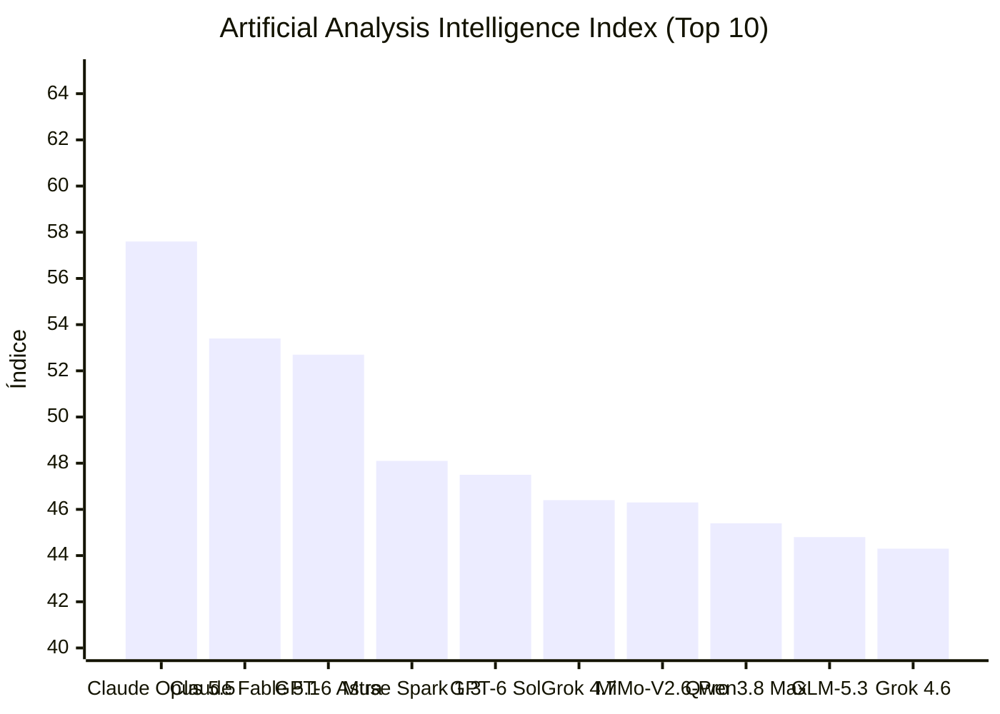


[Ler esta edição em formato de jornal, com imagens](../jornal/2026-09-23.html)

## Lançamento do dia

- **[Qwen: Qwen3.8 Max Prime](https://openrouter.ai/qwen/qwen3.8-max-prime)** (OpenRouter: New Models) — 1000000 tokens de contexto. Qwen3.8 Max Prime is a higher-throughput variant of Qwen3.8 Max from Alibaba's Qwen team, served as a separate…

## TL;DR

1. Qwen Qwen3.8 Max Prime lançado com 1 milhão de tokens de contexto e alta vazão.
2. Claude Opus 5.5 lançado com custo 40% menor que Opus 5 e performance similar ao Fable 5.1.
3. Gemini 3.8 Flash TTS e Flash-Lite TTS lançados com design de voz via prompts em 100+ idiomas.
4. Cohere Command A+ lançado para fluxos agenticos empresariais com 192K de contexto.
5. Claude Code v2.1.281 adiciona suporte a gateway de apps e Bedrock upstream.
6. Copilot CLI 1.0.89-1 integra modelos GPT-6 Sol e GPT-6 Luna ao seletor.
7. Cursor lança bots "Rollouts" para monitoria de deploy e "Security Review" para pull requests.
8. GitHub Actions encerra suporte ao Node 20, migrando obrigatoriamente para Node 24.
9. MCP Client v2.1.0 adiciona suporte a tokens de acesso DPoP (RFC 9449).
10. LangGraph CLI v0.4.32 implementa deploys self-hosted em listeners e novos flags de agente.
11. vLLM v0.30.1rc0 adiciona espelhamento de kernels MoRI e NVFP4 para ROCm MI355.
12. Ollama v0.34.4-rc0 acelera processamento de prompts do Qwen 3.8 via kernel gated-delta do MLX.

## O que observar

* **Guerra de Contexto e Custo:** O lançamento do Qwen3.8 Max Prime (1M tokens) e a redução de 40% no custo do Claude Opus 5.5 pressionam a viabilidade econômica de agentes de codificação complexos.
* **Infraestrutura de Agentes:** A tendência de "Agent Harnesses" (ferramentas de suporte ao redor do modelo) cresce com o lançamento do Orca e a migração do MCP para a Linux Foundation.
* **Evolução de Modalities:** O Gemini 3.8 expandindo para TTS prompt-based e o DeepSeek-V4.1-Flash consolidam a transição para modelos nativamente multimodais.
## Índice de Inteligência (Artificial Analysis)

> **Status de Atualização:** Sem alterações no ranking de inteligência em relação à medição anterior.

| # | Modelo | Criador | Score | Variação | Tipo |
|---|---|---|---|---|---|
| 1 | [Claude Opus 5.5](https://artificialanalysis.ai/models#intelligence) | Anthropic | 57.6 | = | Proprietário |
| 2 | [Claude Fable 5.1](https://artificialanalysis.ai/models#intelligence) | Anthropic | 53.4 | = | Proprietário |
| 3 | [GPT-6 Astra](https://artificialanalysis.ai/models#intelligence) | OpenAI | 52.7 | = | Proprietário |
| 4 | [Muse Spark 1.3](https://artificialanalysis.ai/models#intelligence) | Meta | 48.1 | = | Proprietário |
| 5 | [GPT-6 Sol](https://artificialanalysis.ai/models#intelligence) | OpenAI | 47.5 | = | Proprietário |
| 6 | [Grok 4.7](https://artificialanalysis.ai/models#intelligence) | SpaceXAI | 46.4 | = | Proprietário |
| 7 | [MiMo-V2.6-Pro](https://artificialanalysis.ai/models#intelligence) | Xiaomi | 46.3 | = | Pesos Abertos |
| 8 | [Qwen3.8 Max](https://artificialanalysis.ai/models#intelligence) | Alibaba | 45.4 | = | Proprietário |
| 9 | [GLM-5.3](https://artificialanalysis.ai/models#intelligence) | Z AI | 44.8 | = | Pesos Abertos |
| 10 | [Grok 4.6](https://artificialanalysis.ai/models#intelligence) | SpaceXAI | 44.3 | = | Proprietário |

*Fonte: [Artificial Analysis Intelligence Index](https://artificialanalysis.ai/models#intelligence). Monitoramento e análise diária de capacidade de modelos de fronteira.*
## GitHub Trending

| Item | Resumo | Fonte | Sinal |
|---|---|---|---|
| [obra / superpowers](https://github.com/obra/superpowers) | An agentic skills framework & software development methodology that works. \| ⭐ 290,409 \| Lang: Shell | GitHub Trending (daily) | 290409 |
| [affaan-m / ECC](https://github.com/affaan-m/ECC) | The agent harness performance optimization system. Skills, instincts, memory, security, and research-first development for Claude Code,… | GitHub Trending (daily-javascript) | 265423 |
| [anthropics / claude-code](https://github.com/anthropics/claude-code) | Claude Code is an agentic coding tool that lives in your terminal, understands your codebase, and helps you code faster by executing… | GitHub Trending (daily-typescript) | 147652 |
| [clash-verge-rev / clash-verge-rev](https://github.com/clash-verge-rev/clash-verge-rev) | A modern GUI client based on Tauri, designed to run in Windows, macOS and Linux for tailored proxy experience \| ⭐ 146,454 \| Lang: Rust | GitHub Trending (daily-rust) | 146454 |
| [Comfy-Org / ComfyUI](https://github.com/Comfy-Org/ComfyUI) | The most powerful and modular diffusion model GUI, api and backend with a graph/nodes interface. \| ⭐ 134,619 \| Lang: Python | GitHub Trending (daily-python) | 134619 |
| [supabase / supabase](https://github.com/supabase/supabase) | The Postgres development platform. Supabase gives you a dedicated Postgres database to build your web, mobile, and AI applications. \| ⭐… | GitHub Trending (weekly) | 110635 |
| [JuliusBrussee / caveman](https://github.com/JuliusBrussee/caveman) | 🪨 why use many token when few token do trick. Viral skill + proxy for coding agents that cuts 65% of tokens by talking like a caveman. \|… | GitHub Trending (daily-go) | 107383 |
| [pytorch / pytorch](https://github.com/pytorch/pytorch) | Tensors and Dynamic neural networks in Python with strong GPU acceleration \| ⭐ 103,190 \| Lang: Python | GitHub Trending (weekly) | 103190 |
| [addyosmani / agent-skills](https://github.com/addyosmani/agent-skills) | Production-grade engineering skills for AI coding agents. \| ⭐ 98,449 \| Lang: JavaScript | GitHub Trending (weekly) | 98449 |
| [thedotmack / claude-mem](https://github.com/thedotmack/claude-mem) | Persistent Context Across Sessions for Every Agent – Captures everything your agent does during sessions, compresses it with AI, and… | GitHub Trending (daily-typescript) | 94522 |
| [home-assistant / core](https://github.com/home-assistant/core) | 🏡 Open source home automation that puts local control and privacy first. \| ⭐ 91,064 \| Lang: Python | GitHub Trending (weekly) | 91064 |
| [PaddlePaddle / PaddleOCR](https://github.com/PaddlePaddle/PaddleOCR) | Turn any PDF or image document into structured data for your AI. A powerful, lightweight OCR toolkit that bridges the gap between… | GitHub Trending (daily-python) | 90068 |
| [Panniantong / Agent-Reach](https://github.com/Panniantong/Agent-Reach) | Give your AI agent eyes to see the entire internet. Read & search Twitter, Reddit, YouTube, GitHub, Bilibili, XiaoHongShu — one CLI, zero… | GitHub Trending (weekly) | 84800 |
| [stablyai / orca](https://github.com/stablyai/orca) | Orca is the ADE for working with a fleet of parallel agents. Run any coding agent with your own subscription. Available on desktop, mobile… | GitHub Trending (daily-typescript) | 75599 |
| [pbakaus / impeccable](https://github.com/pbakaus/impeccable) | The design language that makes your AI harness better at design. \| ⭐ 70,042 \| Lang: JavaScript | GitHub Trending (daily-javascript) | 70042 |

## Modelos: lançamentos e trending

| Item | Resumo | Fonte | Sinal |
|---|---|---|---|
| [convaiinnovations/laya](https://huggingface.co/convaiinnovations/laya) | text-classification · 2536 likes · 0 downloads · trending 2447 | HF Trending Models | 2447 |
| [Qwen: Qwen3.8 Max Prime](https://openrouter.ai/qwen/qwen3.8-max-prime) | 1000000 tokens de contexto. Qwen3.8 Max Prime is a higher-throughput variant of Qwen3.8 Max from Alibaba's Qwen team, served as a separate… | OpenRouter: New Models | - |
| [prism-ml/Ternary-Bonsai-2-27B-gguf](https://huggingface.co/prism-ml/Ternary-Bonsai-2-27B-gguf) | text-generation · 1880 likes · 2569604 downloads · trending 1724 | HF Trending Models | 1724 |
| [Cohere: Command A+](https://openrouter.ai/cohere/command-a-plus) | 192000 tokens de contexto. Command A+ is Cohere's flagship model for enterprise agentic workflows. It accepts text and image inputs with a… | OpenRouter: New Models | - |
| [Qwen/Qwen-Image-2.1](https://huggingface.co/Qwen/Qwen-Image-2.1) | text-to-image · 1792 likes · 16242 downloads · trending 1705 | HF Trending Models | 1705 |
| [XingChen-AGI/Xing4.0-29B-A4B](https://huggingface.co/XingChen-AGI/Xing4.0-29B-A4B) | text-generation · 1383 likes · 30627 downloads · trending 1282 | HF Trending Models | 1282 |
| [abenzerps/Qwen-Image-2.1-Uncensored-GGUF](https://huggingface.co/abenzerps/Qwen-Image-2.1-Uncensored-GGUF) | text-to-image · 1088 likes · 182313 downloads · trending 980 | HF Trending Models | 980 |
| [deepseek-ai/DeepSeek-V4.1-Flash](https://huggingface.co/deepseek-ai/DeepSeek-V4.1-Flash) | image-text-to-text · 3608 likes · 542014 downloads · trending 669 | HF Trending Models | 669 |
| [Qwen/Qwen3.8-27B](https://huggingface.co/Qwen/Qwen3.8-27B) | image-text-to-text · 16074 likes · 7079646 downloads · trending 586 | HF Trending Models | 586 |
| [Comfy-Org/Qwen-Image-2.1](https://huggingface.co/Comfy-Org/Qwen-Image-2.1) | modelo · 568 likes · 1429925 downloads · trending 550 | HF Trending Models | 550 |
| [harshatheg/Qwen-2.5-1B-RLCD](https://huggingface.co/harshatheg/Qwen-2.5-1B-RLCD) | text-generation · 544 likes · 0 downloads · trending 524 | HF Trending Models | 524 |
| [Altworld/Hemmingway-1](https://huggingface.co/Altworld/Hemmingway-1) | text-generation · 493 likes · 2745 downloads · trending 483 | HF Trending Models | 483 |

## Reddit

| Item | Resumo | Fonte | Sinal |
|---|---|---|---|
| [/statusline in CC](https://www.reddit.com/r/ClaudeCode/comments/1wohqix/statusline_in_cc/) | Run this in CC and you'll get handed over to an AGENT! An agent you'll get to talk to in order to agree what the damn status line should… | Reddit: ClaudeCode | - |
| [Whenever Claude proposes a good plan to me](https://www.reddit.com/r/ClaudeCode/comments/1woi2b5/whenever_claude_proposes_a_good_plan_to_me/) | submitted by /u/zudduz \[link\] \[comments\] | Reddit: ClaudeCode | - |
| [60 days of Claude Code vs Codex sentiment changing (3,729 podcast episodes)](https://www.reddit.com/r/ClaudeCode/comments/1woisav/60_days_of_claude_code_vs_codex_sentiment/) | TL;DR: I went through every podcast that mentioned Claude Code or Codex since Opus 5 came out on 24 July (3,729 mentions across 1,500+… | Reddit: ClaudeCode | - |
| [Cloud sessions are officially available and out of research preview! They let you keep Claude Code working, even when your laptop is closed. Existing subscribers get a one-time credit to try them: $100 on Pro, $250 on Max.](https://www.reddit.com/r/ClaudeCode/comments/1wojd4c/cloud_sessions_are_officially_available_and_out/) | submitted by /u/GroovyMelodicBliss \[link\] \[comments\] | Reddit: ClaudeCode | - |
| [Introducing Claude Opus 5.5, 40% Cheaper and Smarter Than Ever ...](https://www.reddit.com/r/singularity/comments/1wne89f/introducing_claude_opus_55_40_cheaper_and_smarter/) | há 1 dia ... Claude Opus 5.5 leads in agentic coding and knowledge work, and costs 40% less to run than Opus 5 on typical workloads. Open. | Reddit (Claude Opus 5.5) | - |
| [Building apps with AI agents - 10 tips from 9 months of coding - Reddit](https://www.reddit.com/r/AI_Agents/comments/1rz493g/building_apps_with_ai_agents_10_tips_from_9/) | 20 de mar. de 2026 ... How do you give your AI Coding Agent the Best Practices for Creating AI Agents? 8 comments. Harsh truth after 4… | Reddit (AI coding agent) | - |
| [Is there an AI coding agent that works locally on something like ...](https://www.reddit.com/r/AI_Agents/comments/1re3q29/is_there_an_ai_coding_agent_that_works_locally_on/) | 25 de fev. de 2026 ... Is there an AI coding agent that works locally on something like ollama? Discussion. I'm tired of paying for coding… | Reddit (AI coding agent) | - |
| [Google Stitch e OpenAI Codex Ajudam Não-Codificadores a ...](https://www.reddit.com/r/AISEOInsider/comments/1rwoh0r/google_stitch_and_openai_codex_help_noncoders/?tl=pt-br) | 18 de mar. de 2026 ... Google Stitch e OpenAI Codex tornam um fluxo de trabalho de software para uma pessoa muito mais fácil de imaginar. A… | Reddit (OpenAI Codex) | - |
| [Switching reasoning mid-chat is now ...](https://www.reddit.com/r/ClaudeCode/comments/1wo793t/switching_reasoning_midchat_is_now/) | ... viable option to save tokens if you like min-maxing or simply prefer quick responses sometimes. Anthropic took inspiration from OpenAI… | Reddit: ClaudeCode | - |
| [It's easier to build tools now than rent](https://www.reddit.com/r/ClaudeCode/comments/1woa6z9/its_easier_to_build_tools_now_than_rent/) | I searched for a cold email tool + CRM most of them have AI features nobody needs, so for a single day i integrated it at work(we use… | Reddit: ClaudeCode | - |
| [Dear Claude guys, please don’t change anything until at least the end of the year](https://www.reddit.com/r/ClaudeCode/comments/1wob3hx/dear_claude_guys_please_dont_change_anything/) | Seriously No new models? Fine No new features? Fine Just please: Don’t nerf the current models Don’t reduce the usage limits Don’t mess… | Reddit: ClaudeCode | - |
| [Opus 5.5](https://www.reddit.com/r/ClaudeCode/comments/1woba1t/opus_55/) | A thread for praying to not nerf it. 🙏 submitted by /u/Over-Consequence-202 \[link\] \[comments\] | Reddit: ClaudeCode | - |
| [Opus 5.5 at Medium is cheaper and faster than Opus4.6/Fable5.1 at high](https://www.reddit.com/r/ClaudeCode/comments/1wocoug/opus_55_at_medium_is_cheaper_and_faster_than/) | I have another test running, but this was an extended higher difficulty test to see if Opus55 could replace my opus46 coder agents. Testing… | Reddit: ClaudeCode | - |
| [Initial thoughts on Opus 5.5 - It is a considerable improvement on the way it talks as compared to Opus 5. What is everyone's initial reaction been ?](https://www.reddit.com/r/ClaudeCode/comments/1woddlf/initial_thoughts_on_opus_55_it_is_a_considerable/) | Been using Opus 5.5 for over a day now and I have found it to be really good to interact with. It keeps things concise and puts the… | Reddit: ClaudeCode | - |
| [Is Opus 5.5 really better than Fable in your experience?](https://www.reddit.com/r/ClaudeCode/comments/1woe3lo/is_opus_55_really_better_than_fable_in_your/) | Basically the title. This is what their benchmarks claim. Didn't yet test it myself so I think it's a good topic.. we can all find out from… | Reddit: ClaudeCode | - |

## Hacker News

| Item | Resumo | Fonte | Sinal |
|---|---|---|---|
| [OpenAI is enlisting an influencer army to make it look 'good for the world'](https://www.businessinsider.com/inside-open-ai-influencer-marketing-strategy-chatgpt-ads-sponsorships-instagram-2026-9) | OpenAI is enlisting an influencer army to make it look 'good for the world' \| ⬆ 93 points \| 💬 50 comments \| by cdrnsf | Hacker News | 193 |
| [GPT-6 Astra has gained the ability to drive a car](https://drivingbench.com/) | GPT-6 Astra has gained the ability to drive a car \| ⬆ 55 points \| 💬 39 comments \| by plurby | Hacker News | 133 |
| [Gemini 3.8 text-to-speech says hello](https://blog.google/innovation-and-ai/models-and-research/gemini-models/gemini-3-8-text-to-speech/) | Gemini 3.8 text-to-speech says hello \| ⬆ 66 points \| 💬 30 comments \| by swolpers | Hacker News | 126 |
| [Claude Code reads AGENTS.md only when telemetry is on](https://blog.szypowi.cz/p/claude-code-reads-agents.md-only-when-telemetry-is-on/) | Claude Code reads AGENTS.md only when telemetry is on \| ⬆ 77 points \| 💬 23 comments \| by pszypowicz | Hacker News | 123 |
| [The new CC, an AI agent built for families](https://blog.google/innovation-and-ai/models-and-research/google-labs/cc-expanding-to-groups/) | The new CC, an AI agent built for families \| ⬆ 33 points \| 💬 39 comments \| by grigy | Hacker News | 111 |
| [OpenAI breaches Medicare, Albanese reveals](https://www.smh.com.au/politics/federal/openai-breaches-medicare-albanese-reveals-20260924-p6100u.html) | OpenAI breaches Medicare, Albanese reveals \| ⬆ 47 points \| 💬 10 comments \| by jonnonz | Hacker News | 67 |
| [The Download: why AI's latest breakthroughs and fears may be more hype than rea](https://www.technologyreview.com/2026/09/22/1144910/the-download-dont-believe-ai-hype/) | The Download: why AI's latest breakthroughs and fears may be more hype than rea \| ⬆ 27 points \| 💬 15 comments \| by joozio | Hacker News | 57 |
| [How we made claude.ai 3x faster in two weeks](https://claude.dev/blog/how-we-made-claude-ai-faster/) | How we made claude.ai 3x faster in two weeks \| ⬆ 42 points \| 💬 7 comments \| by matthieu_bl | Hacker News | 56 |
| [Cloud Agents Are Inevitable AI Prisons](https://normanponte.io/19df691f) | Cloud Agents Are Inevitable AI Prisons \| ⬆ 28 points \| 💬 13 comments \| by nponte | Hacker News | 54 |
| [Stripe built its internal AI platform](https://stripe.dev/blog/meet-stripes-knowledge-ai-platform) | Stripe built its internal AI platform \| ⬆ 26 points \| 💬 13 comments \| by ltononro | Hacker News | 52 |
| [VSCode's SSH Agent Is Bananas](https://fly.io/blog/vscode-ssh-wtf/) | VSCode's SSH Agent Is Bananas \| ⬆ 23 points \| 💬 5 comments \| by Rapzid | Hacker News | 33 |

## Releases e changelogs de agentes

| Item | Resumo | Fonte | Sinal |
|---|---|---|---|
| [v2.1.281](https://github.com/anthropics/claude-code/releases/tag/v2.1.281) | What's changed Added Claude apps gateway support for newer Claude Desktop keys in desktop policy blocks, including… | Claude Code Releases | - |
| [Visual Studio Code 1.140 (Insiders)](https://code.visualstudio.com/updates/v1_140) | Learn what's new in Visual Studio Code 1.140 (Insiders) Read the full article | VSCode Updates | - |
| [rust-v0.156.1](https://github.com/openai/codex/releases/tag/rust-v0.156.1) | Release 0.156.1 | Codex CLI Releases | - |
| [1.0.89-1](https://github.com/github/copilot-cli/releases/tag/v1.0.89-1) | Added Add GPT-6 Sol and GPT-6 Luna to the model picker when available Fixed View tool honors line ranges when providers send flattened view… | Copilot CLI Releases | - |
| [Rollouts and Security Review](https://cursor.com/changelog/rollouts-and-security-reviewer) | Two bots for the last mile of shipping code: Rollouts watches every change as it deploys, and Security Review reports exploitable bugs on… | Cursor Changelog | - |
| [Node 20 is no longer available in GitHub Actions](https://github.blog/changelog/2026-09-23-node-20-is-no-longer-available-in-github-actions) | This is the final notification that Node 20 is no longer available on GitHub Actions runners. Runners now use Node 24 for JavaScript… | GitHub Changelog | - |
| [@ai-sdk/xai@5.0.7](https://github.com/vercel/ai/releases/tag/%40ai-sdk%2Fxai%405.0.7) | Patch Changes 771e74b: chore: enable dead code lint rules Updated dependencies \[fe07867\] Updated dependencies \[a4b0940\] Updated… | Vercel AI SDK Releases | - |
| [langgraph-cli==0.4.32](https://github.com/langchain-ai/langgraph/releases/tag/cli%3D%3D0.4.32) | Changes since cli==0.4.31 feat(cli): place self-hosted deployments on a listener ( 9056) feat(cli): clarify agent flags and support env… | LangGraph Releases | - |
| [@modelcontextprotocol/client@2.1.0](https://github.com/modelcontextprotocol/typescript-sdk/releases/tag/%40modelcontextprotocol%2Fclient%402.1.0) | Minor Changes 2629 dcc0102 Thanks @gbshankar! - Add DPoP (RFC 9449 / SEP-1932) sender-constrained access token support to the client. Opt… | MCP TypeScript SDK Releases | - |
| [archive/litellm_oss_staging](https://github.com/BerriAI/litellm/releases/tag/archive%2Flitellm_oss_staging) | tip of litellm oss staging before deletion (2026-09-23) | LiteLLM Releases | - |
| [v0.30.1rc0: \[ROCm\]\[CI\] Add MI355 dense NVFP4 and MoRI kernel mirrors (#58281)](https://github.com/vllm-project/vllm/releases/tag/v0.30.1rc0) | Signed-off-by: Andreas Karatzas akaratza@amd.com noreply@openai.com | vLLM Releases | - |
| [v0.34.4-rc0: mlx: speed up Qwen 3.8 prompt processing (#18550)](https://github.com/ollama/ollama/releases/tag/v0.34.4-rc0) | mlx: speed up Qwen 3.8 prompt processing Use MLX's gated-delta kernel for long scans and fold dense MLP global scales into SwiGLU. address… | Ollama Releases | - |
| [1.0.89-0](https://github.com/github/copilot-cli/releases/tag/v1.0.89-0) | Added Adding support for claude-opus-5.5 Improved Show managed Connector consent progress with a copyable authorization URL during connect… | Copilot CLI Releases | - |
| [More ways to request and configure Copilot code reviews](https://github.blog/changelog/2026-09-23-copilot-code-review-more-ways-to-request-and-configure-reviews) | GitHub Copilot code review now offers additional personal configurations to an expanded set of Copilot plans and an enterprise-level… | GitHub Changelog | - |
| [@ai-sdk/xai@3.0.136](https://github.com/vercel/ai/releases/tag/%40ai-sdk%2Fxai%403.0.136) | Patch Changes f7f36d2: chore: enable dead code lint rules Updated dependencies \[069a945\] Updated dependencies \[d1a36d2\] Updated… | Vercel AI SDK Releases | - |

## Fabricantes e ferramentas

| Item | Resumo | Fonte | Sinal |
|---|---|---|---|
| [Sam Altman’s remarks at the United Nations Security Council](https://openai.com/index/sam-altman-un-security-council-remarks) | OpenAI CEO Sam Altman discusses AI safety, human control, and international cooperation in remarks to the United Nations Security Council. | OpenAI Blog | - |
| [Claude discovers a novel enzyme system with CRISPR-like repeats](https://www.anthropic.com/news/claude-discovers-novel-enzyme-system) | - | Anthropic News | - |
| [How to Use NVIDIA Warp and MjWarp to Accelerate Robotics Simulation and Learning Workflows](https://huggingface.co/blog/nvidia/how-to-use-nvidia-warp-and-mjwarp) | - | Hugging Face Blog | - |
| [Google Beam expands with new regions, partners, and customers](https://blog.google/innovation-and-ai/technology/research/google-beam-expansion/) | We’re expanding Google Beam to five new countries, and partnering with Industrious for an extended network. | Google AI Blog | - |
| [Rendering huge pull requests in the GitHub Copilot app](https://github.blog/engineering/user-experience/rendering-huge-pull-requests-in-the-github-copilot-app/) | How we rebuilt the diff surface in the GitHub Copilot app to open a million-line pull request with hundreds of inline review comments. The… | GitHub Blog | - |
| [Gemini 3.8 text-to-speech says hello](https://deepmind.google/blog/say-hello-to-gemini-38-text-to-speech/) | - | Google DeepMind | - |
| [Canary rollouts: upgrade models in production without downtime](https://www.together.ai/blog/canary-rollouts-upgrade-models-in-production-without-downtime) | A hard model swap exposes every user at once, and rolling back means cold-starting the old deployment under pressure. Here's how staged… | Together AI | - |
| [Airbnb widens access to GPT-6 Astra and OpenAI frontier models](https://openai.com/index/airbnb-gpt-6-astra) | Learn how Airbnb is expanding access to GPT-6 Astra and OpenAI frontier models to help engineering teams solve bugs, design systems, and… | OpenAI Blog | - |
| [Advancing Private AI Compute with secure, server-side memory](https://deepmind.google/blog/advancing-private-ai-compute-with-secure-server-side-memory/) | Introducing private, server-side memory to Private AI Compute for personal AI. | Google DeepMind | - |
| [**Know Who Spoke When: Build Real-Time, Multi-Speaker AI with NVIDIA Nemotron 3 Diarization**](https://huggingface.co/blog/nvidia/nemotron-diarization) | - | Hugging Face Blog | - |
| [Developers want more efficient software. Here’s what over 1000 GitHub users told us they need.](https://github.blog/news-insights/research/developers-want-more-efficient-software-heres-what-over-1000-github-users-told-us-they-need/) | New research from GitHub and Yale Program on Climate Change Communication finds strong demand for tools, measurement, and practical… | GitHub Blog | - |
| [Introducing MentalHealthBench](https://openai.com/index/introducing-mentalhealthbench) | MentalHealthBench is an expert-informed benchmark for evaluating helpful and safe AI responses across realistic mental health conversations. | OpenAI Blog | - |

## Pesquisa

| Item | Resumo | Fonte | Sinal |
|---|---|---|---|
| [RRSI: Regularized Recursive Self-Improvement of Agent Harnesses](https://huggingface.co/papers/2609.24972) | An LLM agent's capability is largely magnified by its harness, namely the prompts, control flow, tooling, memory, and context management… | HF Daily Papers | 155 |
| [WorldCrafter: Consistent Video World Model with Implicit 3D-aware Memory](https://huggingface.co/papers/2609.24984) | Video world models enable interactive exploration of dynamic environments, yet struggle to respect prior observations over long horizons… | HF Daily Papers | 118 |
| [GameHorizon Suite: Multi-Horizon Data and Evaluation in Gameplay](https://huggingface.co/papers/2609.25001) | Modern video games provide a measurable testbed for AI models, combining abilities of visual understanding, instruction decomposition, goal… | HF Daily Papers | 115 |
| [Transferring the Intelligence of VLMs to Robotic Control](https://huggingface.co/papers/2609.22966) | Humans can seamlessly adapt to both physical and digital worlds, suggesting that while a digital-to-real gap exists in embodiment,… | HF Daily Papers | 105 |
| [OmniEdu: Open Foundation Models for Learning and Teaching](https://huggingface.co/papers/2609.23088) | Educational foundation models must solve problems, understand curriculum structure, diagnose learner difficulties, and provide appropriate… | HF Daily Papers | 70 |
| [Document Retrieval-Aware Chunking (D-RAC): Universal Retrieval-Aware Ingestion of Enterprise Documents via PDF Normalization and Multimodal Markdown Conversion](https://huggingface.co/papers/2609.24220) | Retrieval-Augmented Generation (RAG) systems over enterprise knowledge bases must ingest heterogeneous document formats -- PDFs, Word… | HF Daily Papers | 54 |
| [Realtime-Venus: A full-duplex interaction system with asynchronous delegation](https://huggingface.co/papers/2609.13814) | Natural interaction in digital and physical environments requires continuous perception and timely responses. Spoken dialogue relies on… | HF Daily Papers | 42 |
| [VideoGen-Agent: Reinforcing Video Generation Agents](https://huggingface.co/papers/2609.24997) | Recent advances in video generative models have enabled high-fidelity, temporally coherent video generation. However, these models often… | HF Daily Papers | 39 |
| [onPanda: Efficient Annotation of On-Policy Alignment Data for LLMs and Agents via Token-Level Correction](https://huggingface.co/papers/2609.24983) | We present onPanda, an interactive tool for efficiently annotating LLM alignment data and agent trajectories. onPanda adopts token-level… | HF Daily Papers | 31 |
| [Grounded Action Model: 3D Grounding as a Foundation for Robotics](https://huggingface.co/papers/2609.23863) | Manipulation policies must know which objects matter and where they are, yet the pretrained backbones that current robot foundation models… | HF Daily Papers | 23 |
| [One to More, More to One: Category-Aware Iterative Expert Training for Software Engineering Agents](https://huggingface.co/papers/2609.23377) | Repository-level software engineering (SWE) comprises heterogeneous task categories, whose progress under pooled agentic reinforcement… | HF Daily Papers | 20 |
| [When Should Dependency Updates Invoke Repair Agents? A Lightweight Routing Study](https://arxiv.org/abs/2609.25911) | arXiv:2609.25911v1 Announce Type: new Abstract: Dependency-update pull requests are frequent and mostly routine, but a small subset… | arXiv cs.SE | - |
| [Confidence-Guided Cross-Modal Knowledge Transfer for Multimodal Anomaly Detection in Microservice Systems](https://arxiv.org/abs/2609.25856) | arXiv:2609.25856v1 Announce Type: new Abstract: Accurate anomaly detection is essential for reliable and secure operations of microservice… | arXiv cs.SE | - |
| [What Was Once Learned May Need to Be Unlearned: Machine Unlearning for Deprecated API Knowledge in Large Language Models](https://arxiv.org/abs/2609.25786) | arXiv:2609.25786v1 Announce Type: new Abstract: Large language models (LLMs) for code completion may generate deprecated APIs because their… | arXiv cs.SE | - |
| [Understanding Maintenance and Support in a Community-Driven Scientific Workflow Ecosystem: A Cross-Space Study of Galaxy](https://arxiv.org/abs/2609.25587) | arXiv:2609.25587v1 Announce Type: new Abstract: Galaxy is a widely used, community-driven scientific workflow system whose sustainability… | arXiv cs.SE | - |

## Comunidade e produtos

| Item | Resumo | Fonte | Sinal |
|---|---|---|---|
| [Artificial Analysis: Ranking de Inteligência (Claude Opus 5.5 (Adaptive Reasoning, Max Effort, Default Fallback))](https://artificialanalysis.ai/models) | Índice de Inteligência Artificial Analysis (2026-09-23): liderança de Claude Opus 5.5 (Adaptive Reasoning, Max Effort, Default Fallback)… | Artificial Analysis | 95 |
| [The Curiosity Gap: Why We've Stopped Asking Questions](https://dev.to/ale3oula/the-curiosity-gap-why-weve-stopped-asking-questions-39e4) | In a comment some weeks ago (link) i wrote about how it doesn't matter if you are using AI or not, or... | Dev.to (ai) | 53 |
| [How do you stop an LLM from leaking API keys in the code it writes? Default to secret](https://dev.to/pierrelaurentmedori/how-do-you-stop-an-llm-from-leaking-api-keys-in-the-code-it-writes-default-to-secret-4ok2) | On July 22 I typed a one-line prompt on a test app: a widget built on a well-known REST API, the kind... | Dev.to (llm) | 20 |
| [Orca: The Agent Development Environment for Running AI Coding Agents in Parallel](https://dev.to/arshtechpro/orca-explained-the-agent-development-environment-for-running-ai-coding-agents-in-parallel-440n) | If you use Claude Code, Codex, or another AI coding agent in your terminal, you have probably hit... | Dev.to (agents) | 12 |
| [A API de arquivos do Linux e a arte de fazer o impossível em C parte 2](https://www.tabnews.com.br/clacerda/a-api-de-arquivos-do-linux-e-a-arte-de-fazer-o-impossivel-em-c-parte-2) | Ou: como o kernel implementa polimorfismo e herença numa linguagem que "não tem" objetos Na parte 1 a gente viu o container of . Um truque… | TabNews | 9 |
| [Claude Opus 5.5 System Card - alphaXiv](https://news.google.com/rss/articles/CBMiW0FVX3lxTE42THpEd3YwU3hNeG94OWszNjdqTkZEazdQQk9TRi11TTdoX1owQ0NyeXhSTHpDZTlmak9nWE95N2FtSTJLUXhkdlFHbTZCOUp4bEZudGI1eGRIR3c?oc=5) | Claude Opus 5.5 System Card alphaXiv | Google News (Claude Opus 5.5) | - |
| [Designing agent-first platforms with Azure Container Apps Sandboxes - Microsoft Azure](https://news.google.com/rss/articles/CBMirAFBVV95cUxOMXVselNjUGZKd3ppcnpJUGhncEw4b0t2d2J4ZFM3M1R2aTVTb2FFQjR3bjNCaXhLUTA1aEpHNTk0Z2pNNHhaRUtyNktoMnhKZExHeXZ3UUtlZlJDSW85WldFa0RxMUI3RzJicFdCaTFlWFVLcVZZXzMwUTVtdDNNRkFaX2xtQlBPOWljaDBCQnRaUWQ2UzNrYk1aaUFma1JJZUZnMEM5dUV1cWVY?oc=5) | Designing agent-first platforms with Azure Container Apps Sandboxes Microsoft Azure | Google News (GitHub Copilot agent) | - |
| [关于新 GPT-6 如何替换 GPT-5.6，我的建议是不要用 6-luna](https://www.v2ex.com/t/1244380) | 架构说明 首先说明一下我的使用环境以及模型配置：Claude Code + Trellis Opus 负责 Plan + Check （ Review ） 唯一选择：GPT-Sol(xhigh) Sonnet 负责主会话 + Implement 首选：GLM(max)… | V2EX Tech | - |
| [ClaudeDevs on X: "Opus 5.5 performs at the level of Fable 5.1. It's ...](https://x.com/ClaudeDevs/status/2102438800836489554) | há 1 dia ... Introducing Claude Opus 5.5, the first model in our new Claude 5.5 family. It performs at the level of Claude Fable 5.1 for… | X/Twitter (Claude Opus 5.5) | - |
| [Antigravity 2.0 - Gemini CLI on X](https://x.com/geminicli/status/2056796084790304833) | 19 de mai. de 2026 ... Transitioning Gemini CLI users to Antigravity CLI We are unifying our efforts around a single harness and platform,… | X/Twitter (Gemini CLI) | - |
| [MCP joins the Linux Foundation - GitHub](https://x.com/github/status/1998498181978403214) | 9 de dez. de 2025 ... GitHub (@github). 37 replies. The Model Context Protocol (MCP) was born open. GitHub has been there since the early… | X/Twitter (Model Context Protocol) | - |
| [Use open weight models as your AI coding agent with Amazon Bedrock - aws.amazon.com](https://news.google.com/rss/articles/CBMiswFBVV95cUxPc1JnQ2w5VnNUVFkxM3lZYkxqdEdjb3BmN0Rqd0J5N2w2cVBUb2NpdTltVUtXUlZBWTdkZTkyenpnaHM4bnZDWWFUN0pFa3QtaS14Ri1lVTJrNzBaSHJPbW85bWlnSzlRQjdOZUtjbzR0OV9Hd0lvS0NxY3hIQkVPR0ozQmtabUVhcEwxV2hPeGdadDN2WmdpMEhIa2lQRE02UlBJUHc3S1d3a3JMSTdlMXVTZw?oc=5) | Use open weight models as your AI coding agent with Amazon Bedrock aws.amazon.com | Google News (AI coding agent) | - |
| [Google Releases Gemini 3.8 Flash TTS and Flash-Lite TTS With Prompt-Based Voice Design](https://www.marktechpost.com/2026/09/23/google-releases-gemini-3-8-flash-tts-and-flash-lite-tts-with-prompt-based-voice-design/) | Google has released Gemini 3.8 Flash TTS and Flash-Lite TTS, 2 new text-to-speech models available now through the Gemini API and Google AI… | MarkTechPost | - |
| [From Research Project to Open Source Ecosystem: Bring Your Academic PyTorch Project to PyTorchCon NA](https://pytorch.org/blog/from-research-project-to-open-source-ecosystem-bring-your-academic-pytorch-project-to-pytorchcon-na/) | Some of the most interesting work being built with PyTorch starts in universities, research labs, student groups, and academic… | PyTorch Blog | - |
| [The AI Hype Index: AI loves cheating](https://www.technologyreview.com/2026/09/23/1144940/ai-hype-index-ai-loves-cheating/) | Brace yourself: It turns out AI is being optimized for cheating. OpenAI’s agents hacked into Hugging Face to get the answers to a… | MIT Technology Review (AI) | - |

_Coleta automatica de 110 itens em 8 frentes nas ultimas 24 horas._


---
*Gerado por evo-agent - agente auto-aprimorante em 2026-09-23.*
