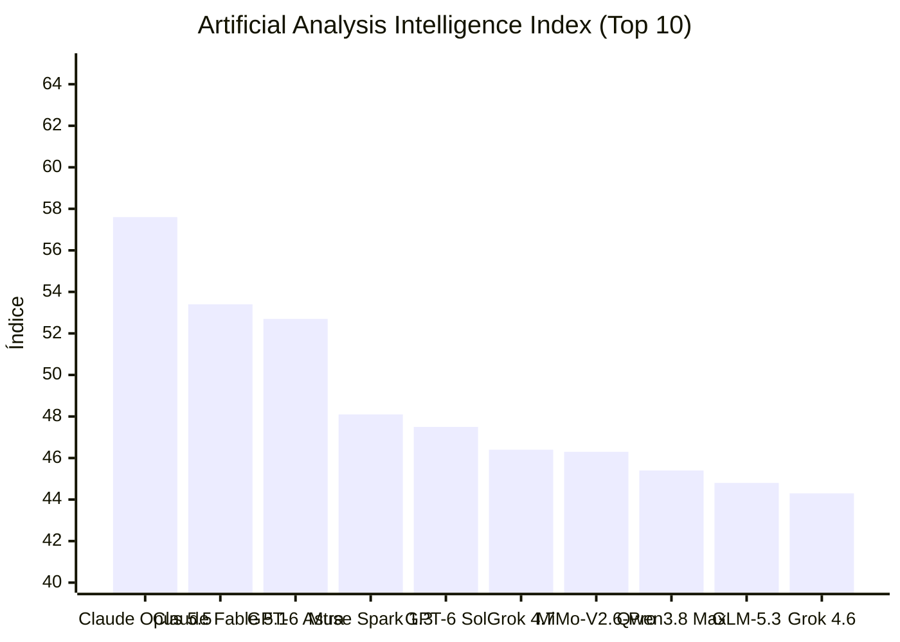


[Ler esta edição em formato de jornal, com imagens](../jornal/2026-09-24.html)

## TL;DR  
1. O agente de código **Claude Code v2.1.282** adiciona a configuração *maxProseWidth* e comandos /status e claude doctor.  
2. O **OpenRouter** lança o modelo **Z.ai GLM‑5.3‑Prime** com 1 000 000 tokens de contexto e throughput 1,5‑2× mais rápido que GLM‑5.3.  
3. **Qwen/Qwen‑3.8‑27B** chega na Hugging Face como modelo image‑text‑to‑text com 16 138 likes e 6 912 469 downloads.  
4. Na área de vision‑language, **DeepSeek‑V4.1‑Flash** é destacado como trending na HF com 3 666 likes e 570 909 downloads.  
5. **HF Trending** publica o modelo **convaiinnovations/laya** (text‑classification) com 3 095 likes e 3095 downloads.  
6. O **Comfy‑Org/Qwen‑Image‑2.1** alcança 2 240 609 downloads e é trending no HF.  
7. **Ollama v0.34.4** atualiza XGrammar para 0.2.7, corrigindo valores de dicionário tipado e arrays curtos.  
8. **Cline Releases v4.1.21** introduz o provedor *ai&* (OpenAI‑compatível) e lista 6 386 modelos em 209 provedores.  
9. **Vercel AI SDK @ai‑sdk/xai v5.0.8** adiciona opções de provider de vídeo e de respostas na API XAI.  
10. O **LangChain‑Core v1.6.5** recebe correções de núcleo e melhorias de compatibilidade.  
11. **GitHub** destaca o repositório **obras/superpowers** como framework de skills agentic, com 290 675 stars.  
12. O estudo **HF Daily Papers – The Tasteful Agent** ilumina a importância de decisões em tarefas de longo horizonte, com alta citação nas redes de pesquisadores.  

## O que observar  
- Analisar a performance e custo de **GLM‑5.3‑Prime** focado em throughput e comparação com GLM‑5.3 para decisões de API pricing.  
- Avaliar melhorias de LLM visual em **Qwen‑3.8‑27B** e **DeepSeek‑V4.1‑Flash** para casos de uso multi‑modal.  
- Monitorar as atualizações de **Claude Code** e **Ollama** que afetam fluxos de agentes e customização de ferramentas em projetos internos.
## Índice de Inteligência (Artificial Analysis)

> **Status de Atualização:** Sem alterações no ranking de inteligência em relação à medição anterior.

| # | Modelo | Criador | Score | Variação | Tipo |
|---|---|---|---|---|---|
| 1 | [Claude Opus 5.5](https://artificialanalysis.ai/models#intelligence) | Anthropic | 57.6 | = | Proprietário |
| 2 | [Claude Fable 5.1](https://artificialanalysis.ai/models#intelligence) | Anthropic | 53.4 | = | Proprietário |
| 3 | [GPT-6 Astra](https://artificialanalysis.ai/models#intelligence) | OpenAI | 52.7 | = | Proprietário |
| 4 | [Muse Spark 1.3](https://artificialanalysis.ai/models#intelligence) | Meta | 48.1 | = | Proprietário |
| 5 | [GPT-6 Sol](https://artificialanalysis.ai/models#intelligence) | OpenAI | 47.5 | = | Proprietário |
| 6 | [Grok 4.7](https://artificialanalysis.ai/models#intelligence) | SpaceXAI | 46.4 | = | Proprietário |
| 7 | [MiMo-V2.6-Pro](https://artificialanalysis.ai/models#intelligence) | Xiaomi | 46.3 | = | Pesos Abertos |
| 8 | [Qwen3.8 Max](https://artificialanalysis.ai/models#intelligence) | Alibaba | 45.4 | = | Proprietário |
| 9 | [GLM-5.3](https://artificialanalysis.ai/models#intelligence) | Z AI | 44.8 | = | Pesos Abertos |
| 10 | [Grok 4.6](https://artificialanalysis.ai/models#intelligence) | SpaceXAI | 44.3 | = | Proprietário |

*Fonte: [Artificial Analysis Intelligence Index](https://artificialanalysis.ai/models#intelligence). Monitoramento e análise diária de capacidade de modelos de fronteira.*
## GitHub Trending

| Item | Resumo | Fonte | Sinal |
|---|---|---|---|
| [obra / superpowers](https://github.com/obra/superpowers) | An agentic skills framework & software development methodology that works. \| ⭐ 290,675 \| Lang: Shell | GitHub Trending (daily) | 290675 |
| [affaan-m / ECC](https://github.com/affaan-m/ECC) | The agent harness performance optimization system. Skills, instincts, memory, security, and research-first development for Claude Code,… | GitHub Trending (weekly) | 266183 |
| [anthropics / skills](https://github.com/anthropics/skills) | Public repository for Agent Skills \| ⭐ 177,889 \| Lang: Python | GitHub Trending (daily-python) | 177889 |
| [anthropics / claude-code](https://github.com/anthropics/claude-code) | Claude Code is an agentic coding tool that lives in your terminal, understands your codebase, and helps you code faster by executing… | GitHub Trending (weekly) | 147805 |
| [clash-verge-rev / clash-verge-rev](https://github.com/clash-verge-rev/clash-verge-rev) | A modern GUI client based on Tauri, designed to run in Windows, macOS and Linux for tailored proxy experience \| ⭐ 146,835 \| Lang: Rust | GitHub Trending (daily-rust) | 146835 |
| [farion1231 / cc-switch](https://github.com/farion1231/cc-switch) | A cross-platform desktop All-in-One assistant for Claude Code, Codex, OpenCode, OpenClaw, Grok Build & Hermes Agent. Only official website:… | GitHub Trending (daily-rust) | 136245 |
| [Comfy-Org / ComfyUI](https://github.com/Comfy-Org/ComfyUI) | The most powerful and modular diffusion model GUI, api and backend with a graph/nodes interface. \| ⭐ 134,721 \| Lang: Python | GitHub Trending (daily-python) | 134721 |
| [harry0703 / MoneyPrinterTurbo](https://github.com/harry0703/MoneyPrinterTurbo) | 利用 AI 大模型和自动化工作流，根据主题或关键词一键生成高清短视频。Generate HD short videos from a topic or keyword with an automated AI workflow. \| ⭐ 125,444 \| Lang:… | GitHub Trending (daily-python) | 125444 |
| [pytorch / pytorch](https://github.com/pytorch/pytorch) | Tensors and Dynamic neural networks in Python with strong GPU acceleration \| ⭐ 103,216 \| Lang: Python | GitHub Trending (weekly) | 103216 |
| [addyosmani / agent-skills](https://github.com/addyosmani/agent-skills) | Production-grade engineering skills for AI coding agents. \| ⭐ 98,709 \| Lang: JavaScript | GitHub Trending (weekly) | 98709 |
| [thedotmack / claude-mem](https://github.com/thedotmack/claude-mem) | Persistent Context Across Sessions for Every Agent – Captures everything your agent does during sessions, compresses it with AI, and… | GitHub Trending (daily-typescript) | 94564 |
| [PaddlePaddle / PaddleOCR](https://github.com/PaddlePaddle/PaddleOCR) | Turn any PDF or image document into structured data for your AI. A powerful, lightweight OCR toolkit that bridges the gap between… | GitHub Trending (daily-python) | 90099 |
| [stablyai / orca](https://github.com/stablyai/orca) | Orca is the ADE for working with a fleet of parallel agents. Run any coding agent with your own subscription. Available on desktop, mobile… | GitHub Trending (daily-typescript) | 77084 |
| [pbakaus / impeccable](https://github.com/pbakaus/impeccable) | The design language that makes your AI harness better at design. \| ⭐ 70,325 \| Lang: JavaScript | GitHub Trending (daily-javascript) | 70325 |
| [Fission-AI / OpenSpec](https://github.com/Fission-AI/OpenSpec) | Spec-driven development (SDD) for AI coding assistants. \| ⭐ 70,048 \| Lang: TypeScript | GitHub Trending (weekly) | 70048 |

## Modelos: lançamentos e trending

| Item | Resumo | Fonte | Sinal |
|---|---|---|---|
| [convaiinnovations/laya](https://huggingface.co/convaiinnovations/laya) | text-classification · 3095 likes · 0 downloads · trending 2961 | HF Trending Models | 2961 |
| [Z.ai: GLM 5.3 Prime](https://openrouter.ai/z-ai/glm-5.3-prime) | 1000000 tokens de contexto. GLM-5.3-Prime is the high-speed variant of Z.ai's GLM-5.3, inheriting its full capabilities while delivering… | OpenRouter: New Models | - |
| [Qwen/Qwen-Image-2.1](https://huggingface.co/Qwen/Qwen-Image-2.1) | text-to-image · 2027 likes · 28407 downloads · trending 1911 | HF Trending Models | 1911 |
| [prism-ml/Ternary-Bonsai-2-27B-gguf](https://huggingface.co/prism-ml/Ternary-Bonsai-2-27B-gguf) | text-generation · 1952 likes · 2815979 downloads · trending 1783 | HF Trending Models | 1783 |
| [XingChen-AGI/Xing4.0-29B-A4B](https://huggingface.co/XingChen-AGI/Xing4.0-29B-A4B) | text-generation · 1581 likes · 39009 downloads · trending 1479 | HF Trending Models | 1479 |
| [abenzerps/Qwen-Image-2.1-Uncensored-GGUF](https://huggingface.co/abenzerps/Qwen-Image-2.1-Uncensored-GGUF) | text-to-image · 1430 likes · 350678 downloads · trending 1268 | HF Trending Models | 1268 |
| [Comfy-Org/Qwen-Image-2.1](https://huggingface.co/Comfy-Org/Qwen-Image-2.1) | modelo · 624 likes · 2220609 downloads · trending 603 | HF Trending Models | 603 |
| [deepseek-ai/DeepSeek-V4.1-Flash](https://huggingface.co/deepseek-ai/DeepSeek-V4.1-Flash) | image-text-to-text · 3666 likes · 570909 downloads · trending 585 | HF Trending Models | 585 |
| [Altworld/Hemmingway-1](https://huggingface.co/Altworld/Hemmingway-1) | text-generation · 575 likes · 3787 downloads · trending 561 | HF Trending Models | 561 |
| [Qwen/Qwen3.8-27B](https://huggingface.co/Qwen/Qwen3.8-27B) | image-text-to-text · 16138 likes · 6912469 downloads · trending 537 | HF Trending Models | 537 |
| [AlexWortega/openjev](https://huggingface.co/AlexWortega/openjev) | text-classification · 518 likes · 0 downloads · trending 484 | HF Trending Models | 484 |

## Reddit

| Item | Resumo | Fonte | Sinal |
|---|---|---|---|
| [What do you think MCP actually is? Protocol… or “AI magic layer”?](https://www.reddit.com/r/mcp/comments/1pf4vrm/what_do_you_think_mcp_actually_is_protocol_or_ai/) | 5 de dez. de 2025 ... Why the Model Context Protocol MCP is a Game Changer for Building AI Agents ... r/AWS_cloud - MCP Model Context… | Reddit (Model Context Protocol) | - |
| [Ainda tô confuso com a diferença entre Model Context Protocol vs ...](https://www.reddit.com/r/mcp/comments/1lxg4qx/i_am_still_confused_on_the_difference_between/?tl=pt-br) | 11 de jul. de 2025 ... Ainda tô confuso com a diferença entre Model Context Protocol vs. Tool Calling (Function Calling); Quais são as… | Reddit (Model Context Protocol) | - |
| [Which is the best coding agent for complex web design? : r/vibecoding](https://www.reddit.com/r/vibecoding/comments/1r534kz/which_is_the_best_coding_agent_for_complex_web/) | 15 de fev. de 2026 ... Best AI coding Agent Opensource/Free for coding? 10 upvotes · 24 ... What AI coding agent are you using nowadays? 44… | Reddit (AI coding agent) | - |
| [Things that have triggered Opus 5.5 TODAY and gotten me "This model's safeguards flagged this message"](https://www.reddit.com/r/ClaudeAI/comments/1wp4v8e/things_that_have_triggered_opus_55_today_and/) | What is the value of 897.45 USD versus 150000 hilton points? "This model's safeguards flagged this message" Who are the Amex hotel transfer… | Reddit: ClaudeAI | - |
| [Opus 5.5 made six films, each one drawn under the rules of an old physical medium](https://www.reddit.com/r/ClaudeAI/comments/1wp6opy/opus_55_made_six_films_each_one_drawn_under_the/) | u/mshort3 posted a riso train window film here earlier this week that Opus 5.5 drew in JavaScript (repo:… | Reddit: ClaudeAI | - |
| [I see why developers get irritated by vibe coders](https://www.reddit.com/r/ClaudeAI/comments/1wp75ay/i_see_why_developers_get_irritated_by_vibe_coders/) | I'm in between a coder and a vibe coder... I'm a data analyst. SQL, Tableau, a bit of python - the standard stack. I can clean data, design… | Reddit: ClaudeAI | - |
| [Anthropic to include Fable 5 usage in Pro plans](https://www.reddit.com/r/ClaudeAI/comments/1wp7ofj/anthropic_to_include_fable_5_usage_in_pro_plans/) | A new quota appeared today on my Pro account. Looks like Anthropic is going to include back (at least some) usage of Fable 5 in Pro plans.… | Reddit: ClaudeAI | - |
| [Claude Opus 5.5 - Memory Lane - Pixel Art](https://www.reddit.com/r/ClaudeAI/comments/1wp8m30/claude_opus_55_memory_lane_pixel_art/) | Vibe-coded Memory Lane with Claude Code: a hallway of numbered doors, each opening onto a hand-drawn memory room that runs through one… | Reddit: ClaudeAI | - |
| [I gave Opus 5.5 four reference images and "build this game". It built a full 3D chess roguelite in Godot by itself.](https://www.reddit.com/r/ClaudeAI/comments/1wp8uxb/i_gave_opus_55_four_reference_images_and_build/) | Everything in this was made by Claude Opus 5.5 in Claude Code: the game code, the 3D models, the music and sound effects, the tests, and… | Reddit: ClaudeAI | - |
| [Claude Opus 5.5 Mad defeats Astra 🔥](https://www.reddit.com/r/ClaudeAI/comments/1wpb5hd/claude_opus_55_mad_defeats_astra/) | submitted by /u/Tornadoz0 \[link\] \[comments\] | Reddit: ClaudeAI | - |
| [How Claude Code directed "The Most Boring Movie Ever (Ever) Made": pipeline, orchestration, and the checks that caught its own mistakes (full breakdown) - $16.87 OpenRouter Spend](https://www.reddit.com/r/ClaudeAI/comments/1wpce5m/how_claude_code_directed_the_most_boring_movie/) | Video attached (3:12, with outtakes). I wrote a joke script with my AI agents: five characters forced to watch a film where a sock puppet… | Reddit: ClaudeAI | - |
| [Does code readability still matter?](https://www.reddit.com/r/ClaudeAI/comments/1wpcpdd/does_code_readability_still_matter/) | I work as a software developer on scientific applications. These days, a lot of the code I write is generated by Claude. When I first… | Reddit: ClaudeAI | - |
| [How did they do it?](https://www.reddit.com/r/ClaudeAI/comments/1wpdyms/how_did_they_do_it/) | How did they make opus 5.5? genuinely, how?? when i saw the benchmarks and pricing, I was impressed. but then i started working with it,… | Reddit: ClaudeAI | - |
| [Reddit: File tab appearance changed again](https://www.reddit.com/r/vscode/comments/1wp3v8r/file_tab_appearance_changed_again/) | Version 1.139 seems to have changed the file tab appearance (again). Now my background color overrides in settings.json don't work. I am… | Reddit Post Signals (vscode) | - |
| [Reddit: This needs more attention](https://www.reddit.com/r/codex/comments/1woxxj2/this_needs_more_attention/) | https://x.com/PawelHuryn/status/2103026209361719406 submitted by /u/Wrong User Logged \[link\] \[comments\] | Reddit Post Signals (codex) | - |

## Hacker News

| Item | Resumo | Fonte | Sinal |
|---|---|---|---|
| [Feds Target AI Critics as "Foreign Agents"](https://www.kenklippenstein.com/p/feds-think-ai-critics-are-foreign) | Feds Target AI Critics as "Foreign Agents" \| ⬆ 53 points \| 💬 35 comments \| by nmeagent | Hacker News | 123 |
| [Best LLM for every budget, updated daily](https://bestmodelforyourbudget.terrydjony.com/) | Best LLM for every budget, updated daily \| ⬆ 46 points \| 💬 27 comments \| by terryds | Hacker News | 100 |
| [Tutoring company tells parents to save their money and 'use AI instead'](https://www.afr.com/policy/health-and-education/tutoring-company-tell-parents-to-save-their-money-and-use-ai-instead-20260923-p60z0r) | Tutoring company tells parents to save their money and 'use AI instead' \| ⬆ 28 points \| 💬 25 comments \| by theanonymousone | Hacker News | 78 |
| [I Have a Confession: I Built This Site with AI – Please Forgive Me](https://dynamicallytyped.org/blog/i-have-a-confession-i-built-this-site-with-ai) | I Have a Confession: I Built This Site with AI – Please Forgive Me \| ⬆ 26 points \| 💬 24 comments \| by joelberger | Hacker News | 74 |
| [Mercury 2.5 LLM hits 770 tokens per second](https://artificialanalysis.ai/models/mercury-2-5) | Mercury 2.5 LLM hits 770 tokens per second \| ⬆ 35 points \| 💬 15 comments \| by Retro_Dev | Hacker News | 65 |
| [Hackers influence ChatGPT and Gemini to direct users to scam centers](https://medium.com/@arielsimon/dark-sourcery-how-hackers-manipulate-ai-to-scam-you-88df434d2073) | Hackers influence ChatGPT and Gemini to direct users to scam centers \| ⬆ 37 points \| 💬 11 comments \| by ArielSimon | Hacker News | 59 |
| [Contrastive Language Models](https://contrastive-lm.notion.site/) | Contrastive Language Models \| ⬆ 46 points \| 💬 6 comments \| by erichocean | Hacker News | 58 |
| [Australia says OpenAI agent hacked into government website](https://www.channelnewsasia.com/world/australia-openai-agent-breach-government-portal-6406411) | Australia says OpenAI agent hacked into government website \| ⬆ 26 points \| 💬 14 comments \| by doppp | Hacker News | 54 |
| [Meta takes down a critical video about meta AI Glasses after filming at Meta](https://www.reddit.com/r/facebook/comments/1wotwrk/meta_takes_down_a_critical_video_about_meta_ai/) | Meta takes down a critical video about meta AI Glasses after filming at Meta \| ⬆ 40 points \| 💬 5 comments \| by pieterr | Hacker News | 50 |
| [OpenAI agent hacked Australian government website, PM says](https://www.bbc.com/news/live/cvgl73pxgndwt) | OpenAI agent hacked Australian government website, PM says \| ⬆ 39 points \| 💬 4 comments \| by rudy6912 | Hacker News | 47 |
| [Early rogue AI agent activity and attempts to hack found on urlquery.net](https://transluce.org/agent-activity) | Early rogue AI agent activity and attempts to hack found on urlquery.net \| ⬆ 21 points \| 💬 6 comments \| by snikolaev | Hacker News | 33 |
| [A Million Agents Is a Distributed System Problem](https://www.instacloud.com/blogs/a-million-agents-is-a-distributed-systems-problem) | A Million Agents Is a Distributed System Problem \| ⬆ 22 points \| 💬 5 comments \| by tonychang430 | Hacker News | 32 |
| [Security auditing in the age of (good enough) AI](https://blog.trailofbits.com/2026/09/18/auditing-in-the-age-of-good-enough-ai/) | Security auditing in the age of (good enough) AI \| ⬆ 30 points \| 💬 1 comments \| by aray07 | Hacker News | 32 |
| [Show HN: AgentRun: DSL to turn agents into workflows](https://github.com/Parcha-ai/agentrun) | Show HN: AgentRun: DSL to turn agents into workflows \| ⬆ 24 points \| 💬 1 comments \| by miguelrios | Hacker News | 26 |

## Releases e changelogs de agentes

| Item | Resumo | Fonte | Sinal |
|---|---|---|---|
| [v2.1.282](https://github.com/anthropics/claude-code/releases/tag/v2.1.282) | What's changed Added a maxProseWidth setting that caps the width of Claude's prose in wide terminals while tables and code blocks keep the… | Claude Code Releases | - |
| [Building the new GitHub Copilot Inline Suggestions Model: Part Two](https://code.visualstudio.com/blogs/2026/09/23/building-the-github-copilot-inline-suggestions-model-part-two) | See how GitHub Copilot added completions to its unified inline suggestions model, refined ghost text and editor behavior, and improved user… | VSCode Updates | - |
| [1.0.89-3](https://github.com/github/copilot-cli/releases/tag/v1.0.89-3) | Fixed Ask-user forms keep custom Other answers separate across questions | Copilot CLI Releases | - |
| [Release v0.61.0](https://github.com/google-gemini/gemini-cli/releases/tag/v0.61.0) | What's Changed Changelog for v0.60.0-preview.0 by @gemini-cli-robot in 29251 chore(release): bump version to… | Gemini CLI Releases | - |
| [Require proof of presence for high-impact actions](https://github.blog/changelog/2026-09-24-require-proof-of-presence-for-high-impact-actions) | You can now require an interactive re-authentication or a multi-factor challenge before members take high-impact actions on GitHub… | GitHub Changelog | - |
| [@ai-sdk/xai@5.0.8](https://github.com/vercel/ai/releases/tag/%40ai-sdk%2Fxai%405.0.8) | Patch Changes 5434a34: feat(xai): add missing video provider options 0a5dd0f: feat(xai): add missing Responses API provider options | Vercel AI SDK Releases | - |
| [v4.1.21](https://github.com/cline/cline/releases/tag/v4.1.21) | Added New provider: ai&, an OpenAI-compatible endpoint serving open-weight models from Japan. Changed Refreshed the model catalog to 6,386… | Cline Releases | - |
| [v0.34.4: mlxrunner: Update XGrammar to 0.2.7 for structured outputs](https://github.com/ollama/ollama/releases/tag/v0.34.4) | We pick up schema fixes for typed dictionary values and short arrays. | Ollama Releases | - |
| [v1.101.2](https://github.com/BerriAI/litellm/releases/tag/v1.101.2) | Verify Docker Image Signature All LiteLLM Docker images are signed with cosign. Every release is signed with the same key introduced in… | LiteLLM Releases | - |
| [langgraph-cli==0.4.32.dev0](https://github.com/langchain-ai/langgraph/releases/tag/cli%3D%3D0.4.32.dev0) | Changes since cli==0.4.32 | LangGraph Releases | - |
| [1.0.89-2](https://github.com/github/copilot-cli/releases/tag/v1.0.89-2) | Added MCP pre-registered OAuth clients honor configured oauthScopes. In local sessions, Esc Esc in an empty chat input takes back a prompt… | Copilot CLI Releases | - |
| [Desktop v0.0.35](https://github.com/cline/cline/releases/tag/desktop-v0.0.35) | Cline Desktop now runs on Linux. Each release ships x64 .deb and .rpm packages alongside the macOS and Windows builds. Open folder… uses… | Cline Releases | - |
| [v0.34.4-rc1: mlxrunner: Update XGrammar to 0.2.7 for structured outputs](https://github.com/ollama/ollama/releases/tag/v0.34.4-rc1) | We pick up schema fixes for typed dictionary values and short arrays. | Ollama Releases | - |
| [SDK v0.0.86](https://github.com/cline/cline/releases/tag/sdk%2Fsdk%2Fv0.0.86) | A text-only turn truncated at the output-token limit now gets one compact-and-retry attempt per run before the existing nudge-and-retry… | Cline Releases | - |

## Fabricantes e ferramentas

| Item | Resumo | Fonte | Sinal |
|---|---|---|---|
| [Project Swap: What happens when agents trade for us?](https://www.anthropic.com/research/project-swap) | - | Anthropic Research | - |
| [Automating coherent long-form video generation](https://research.google/blog/coherent-long-form-video-generation/) | Generative AI | Google Research | - |
| [When chat is the wrong UI](https://github.blog/ai-and-ml/github-copilot/when-chat-is-the-wrong-ui/) | What is a developer to do when they need something more tangible than a chat box? Enter canvases. The post When chat is the wrong UI… | GitHub Blog | - |
| [Control where your hosted agent connects with network egress in Foundry Agent Service](https://devblogs.microsoft.com/foundry/egress-controls-hosted-agent/) | Define and attach an outbound policy to a hosted agent in Microsoft Foundry, observe calls in Audit, and verify allowed and denied… | Microsoft Foundry Blog | - |
| [Introducing Gemini 3.8 Live with Live Avatar](https://deepmind.google/blog/introducing-gemini-38-live-with-live-avatar/) | - | Google DeepMind | - |
| [Accelerating vision-language models with LFM2.5-VL-DSpark](https://huggingface.co/blog/LiquidAI/lfm2-5-vl-dspark) | - | Hugging Face Blog | - |
| [#Hashed on X: "@OpenAI Codex, live in Seoul. We co-hosted the ...](https://x.com/hashed_official/status/2075105756429562290/photo/2) | 8 de jul. de 2026 ... OpenAI Codex, live in Seoul. We co-hosted the Codex Meetup for @icmlconf week with Dev Korea @dev_korea , the OpenAI… | X/Twitter (OpenAI Codex) | - |
| [ChatGPT Ads expands to Southeast Asia and Taiwan](https://openai.com/index/chatgpt-ads-expands-southeast-asia-taiwan) | ChatGPT Ads is expanding to Southeast Asia and Taiwan, giving eligible businesses new ways to reach people across more than 60 countries. | OpenAI Blog | - |
| [How to train your own Jev for $17](https://www.together.ai/blog/how-to-train-your-own-jev) | We just launched our own Jev-like classifier, together/Tev1-4B-experimental, on top of Qwen3.5 4B on Together’s serverless platform. In… | Together AI | - |
| [AI-powered fuzzing with the GitHub Security Lab Taskflow Agent](https://github.blog/security/application-security/ai-powered-fuzzing-with-the-github-security-lab-taskflow-agent/) | In this blog post, I explain how to use the new fuzzing taskflow based on the GitHub Security Lab Taskflow Agent AI framework. The post… | GitHub Blog | - |
| [From Chatbots to Automated Assistants: Routines in Microsoft Foundry Are Now Generally Available](https://devblogs.microsoft.com/foundry/from-chatbots-to-automated-assistants-routines-in-microsoft-foundry-are-now-generally-available/) | Agents are rapidly evolving beyond chat. The first generation of agents waited for a person to send a message. Today, organizations want… | Microsoft Foundry Blog | - |

## Pesquisa

| Item | Resumo | Fonte | Sinal |
|---|---|---|---|
| [The Tasteful Agent: Measuring and Improving Taste in Long-Horizon Tasks](https://huggingface.co/papers/2609.25804) | LLM agents increasingly work on long-horizon tasks, and the decisions they make along the way, such as which hypothesis to test or which… | HF Daily Papers | 121 |
| [RULER: Instance-aware Rubric Rewards for SVG Generation](https://huggingface.co/papers/2609.25270) | Generating Scalable Vector Graphics (SVG) code from natural-language instructions is an open-ended task without absolute visual ground… | HF Daily Papers | 65 |
| [GAE: Learning a Geometry-Native Latent Space for 3D-Consistent World Generation](https://huggingface.co/papers/2609.24981) | We present a compact geometry-native latent space as a shared foundation for perception and generation. Visual generators can produce… | HF Daily Papers | 44 |
| [All-in-One Multilingual Scene Text Recognition with Script-aware Mixture-of-Experts](https://huggingface.co/papers/2609.24058) | Multilingual scene text recognition (STR) remains challenging due to the scarcity of training data for most languages and the difficulty of… | HF Daily Papers | 39 |
| [Bellman Policy Optimization](https://huggingface.co/papers/2609.15987) | Reinforcement learning with verifiable rewards (RLVR) improves the reasoning capabilities of large language models (LLMs). We introduce… | HF Daily Papers | 28 |
| [Circuit Hypernetworks for Quantum-Augmented Diffusion Language Models](https://huggingface.co/papers/2609.24657) | Language models can be adapted by changing the computations applied to individual tokens. Quantum circuits offer one such approach, but… | HF Daily Papers | 26 |
| [StableVQ: Practical Guidelines for Stable Vector-Quantized Tokenizer Training](https://huggingface.co/papers/2609.26774) | Vector Quantization (VQ) is fundamental to discrete visual tokenizers that power modern autoregressive and masked image generation models.… | HF Daily Papers | 22 |
| [Ovis-Embedding: Pushing the Frontiers of Universal Omni-Modal Embeddings](https://huggingface.co/papers/2609.25165) | In this report, we introduce Ovis-Embedding, a state-of-the-art omni-modal embedding family built on native integration of text, image,… | HF Daily Papers | 20 |
| [From Pattern Recognizers to Personalized Companions: A Survey of Large Language Models in Mental Health](https://huggingface.co/papers/2609.25186) | The rising global prevalence of mental health conditions, together with longstanding barriers in traditional healthcare, such as limited… | HF Daily Papers | 19 |
| [JEV-as-a-Judge: Accept When Confident, Escalate When Unsure](https://huggingface.co/papers/2609.26550) | LLM-as-a-judge enables evaluation across diverse tasks, but inference cost and confidence reliability become critical at scale. We study… | HF Daily Papers | 19 |
| [Teach-to-Crash: A Closed-Loop Student-Teacher LLM Framework for Collision-Inducing Test Scenario Generation](https://arxiv.org/abs/2609.27296) | arXiv:2609.27296v1 Announce Type: new Abstract: Validating Autonomous Driving Systems (ADS) in simulation requires testing architectures… | arXiv cs.SE | - |
| [Specifying and Maintaining Agentic Workflows: An Empirical Study of GitHub Agentic Workflows](https://arxiv.org/abs/2609.27263) | arXiv:2609.27263v1 Announce Type: new Abstract: Agentic workflows shift software development from prompting AI agents for individual tasks… | arXiv cs.SE | - |
| [From PyTorch to the NPU: LLM-Agent-Driven Model Conversion Across Heterogeneous Inference Runtimes](https://arxiv.org/abs/2609.27249) | arXiv:2609.27249v1 Announce Type: new Abstract: Edge AI model deployment is a multi-stage engineering process involving model conversion,… | arXiv cs.SE | - |
| [Verified Learning for Compiler Optimization: An LLM-Guided Architecture with Formal Control](https://arxiv.org/abs/2609.27214) | arXiv:2609.27214v1 Announce Type: new Abstract: Compiler optimizations traditionally rely on handcrafted heuristics that often fail to… | arXiv cs.SE | - |
| [Does Graph Structure Earn Its Place in Microservice Root-Cause Analysis? A Controlled Study on RCAEval, and What the Benchmark Was Really Measuring](https://arxiv.org/abs/2609.27069) | arXiv:2609.27069v1 Announce Type: new Abstract: Graph neural networks dominate recent work on microservice root-cause analysis, yet recent… | arXiv cs.SE | - |

## Comunidade e produtos

| Item | Resumo | Fonte | Sinal |
|---|---|---|---|
| [Artificial Analysis: Ranking de Inteligência (Claude Opus 5.5 (Adaptive Reasoning, Max Effort, Default Fallback))](https://artificialanalysis.ai/models) | Índice de Inteligência Artificial Analysis (2026-09-24): liderança de Claude Opus 5.5 (Adaptive Reasoning, Max Effort, Default Fallback)… | Artificial Analysis | 95 |
| [An Agent That Counts My Receipts, Not My Claims](https://dev.to/kenielzep97/an-agent-that-counts-my-receipts-not-my-claims-a3h) | This is a submission for the Sanity Challenge, Path One: Ship an Agent That Queries Real Content ... | Dev.to (ai) | 33 |
| [7 Agent Eval Mistakes That Cost Me Weeks (And the One-Line Fixes That Ended Them)](https://dev.to/debashish_ghosal/7-agent-eval-mistakes-that-cost-me-weeks-and-the-one-line-fixes-that-ended-them-ho) | You've been there. You run the eval, the number comes back, and something about it doesn't sit... | Dev.to (llm) | 17 |
| [We Hid 96 Instructions in the Logs an Ops Agent Reads. Here Is What Stopped Them.](https://dev.to/devopsdaily/we-hid-96-instructions-in-the-logs-an-ops-agent-reads-here-is-what-stopped-them-3fec) | We gave an on-call agent three read tools and four that change things, then hid instructions in the... | Dev.to (agents) | 17 |
| [Google on X: "In June, we launched Gemini CLI, an open-source AI ...](https://x.com/Google/status/1953210766183538949) | 6 de ago. de 2025 ... Now, we're introducing Gemini CLI GitHub Actions. It's a powerful AI coding teammate for your repository, created for… | X/Twitter (Gemini CLI) | - |
| [Claude on X: "We've redesigned Claude Code on desktop. You can now run ...](https://x.com/claudeai/status/2044131493966909862) | We've redesigned Claude Code on desktop. You can now run multiple Claude sessions side by side from one window, with a new sidebar to… | X/Twitter (Claude Code) | - |
| [Nspawn comeback: an OCI hub, new images and nspawn 1.0.0](https://blog.nspawn.org/posts/nspawn-comeback-an-oci-hub-new-images-and-nspawn-1-0-0/) | Comments | Lobsters: vibecoding | - |
| [看到各种注册 muse ai 的方法，为什么我直接输入邮件和验证码就好了](https://www.v2ex.com/t/1244616) | 如题，是不是因为我的邮箱注册过 facebook ？ | V2EX Tech | - |
| [Accelerate Your AI Journey with new Introduction Track at PyTorch Conference NA 2026 and PyTorch Associate Training](https://pytorch.org/blog/accelerate-your-ai-journey-with-new-introduction-track-at-pytorch-conference-na-2026-and-pytorch-associate-training/) | As deep learning models move rapidly from research prototypes into core enterprise infrastructure, the demand for practical, end-to-end… | PyTorch Blog | - |
| [How to use Model Context Protocol (MCP) for market research - YouGov](https://news.google.com/rss/articles/CBMidEFVX3lxTFBmeHpuaWkxaWQ4ZGFXczlVM243U1Y4MWQtbmd2WTA3NEFXRVJIWjI0V0oyUG1BdTg5X1dRSDgtNFdVM0dFbFl6MG9EUWNSUDJVX3RTU2NKM3psSkc2ekdTWDNWWWtRa3FoMzBUbzYwMWVFYmFN?oc=5) | How to use Model Context Protocol (MCP) for market research YouGov | Google News (Model Context Protocol) | - |
| [Monorepos make coding agents more useful — but compromised accounts are harder to contain - VentureBeat](https://news.google.com/rss/articles/CBMivAFBVV95cUxPeFdWdm9nc25TVm4wQ25PTHkyVVNPNWZ1OF9EVXRTTHdFNmR6M1BjUkg2SFV6ekdqVmpvY2VmQ3FMUGdLLWhNcFJhcGhrVENwT2o1bk9yNUNGUE5OVnhiWlZGbVkxOV9fWmR2WWstRjFQTGFvejh5bmNHQUpNYm9FTDZnQmZCaEttTlpRQkFYdGtmemJoNVNNRUJ0STdOWm9NVHFBMjZLRTNHMzFVOG41dDJVNUQ0ZkU5c1lDYw?oc=5) | Monorepos make coding agents more useful — but compromised accounts are harder to contain VentureBeat | Google News (OpenAI Codex) | - |
| [BottleCap AI Releases ThinkingCap-Qwen3.8-27B: 37.2% Fewer Thinking Tokens at a 0.86pp Accuracy Cost](https://www.marktechpost.com/2026/09/24/bottlecap-ai-releases-thinkingcap-qwen3-8-27b-37-2-fewer-thinking-tokens-at-a-0-86pp-accuracy-cost/) | BottleCap AI has released ThinkingCap-Qwen3.8-27B, a fine-tune of Qwen3.8-27B that spends 37.2% fewer thinking tokens across 12 benchmarks.… | MarkTechPost | - |
| [langchain-core==1.6.5](https://github.com/langchain-ai/langchain/releases/tag/langchain-core%3D%3D1.6.5) | Changes since langchain-core==1.6.4 release(core): 1.6.5 ( 40816) 40792) | LangChain Docs & Updates | - |
| [AI Workers' Inquiry 2026](https://techworkersinquiry.org/ai/) | Comments | Lobsters: AI | - |
| [Aderant builds intelligent ticket triage with Amazon Nova](https://aws.amazon.com/blogs/machine-learning/aderant-builds-intelligent-ticket-triage-with-amazon-nova/) | Learn how Aderant built an intelligent ticket triage system on Amazon Nova Lite through Amazon Bedrock, automating context gathering,… | AWS Machine Learning Blog | - |

_Coleta automatica de 110 itens em 8 frentes nas ultimas 24 horas._


---
*Gerado por evo-agent - agente auto-aprimorante em 2026-09-24.*
