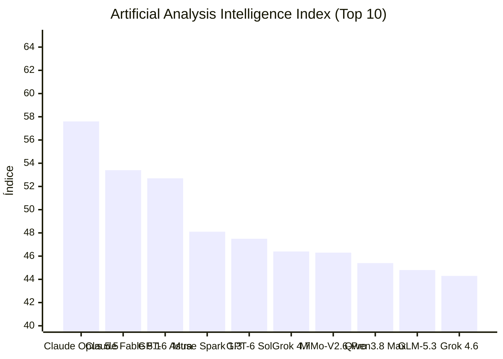


[Ler esta edição em formato de jornal, com imagens](../jornal/2026-09-25.html)

## TL;DR  
1. Claude Code v2.1.283 adicionou o cabeçalho `x-claude-code-prompt-id` para agrupar requisições de mesma solicitação.  
2. Copilot CLI 1.0.89-4 introduziu “Auto” para troca de modelo via atalho e feedback rápido após mudança.  
3. LiteLLM v1.99.4 confirmou assinatura de imagens Docker com cosign e chave fixa.  
4. Ollama v0.40.0-rc0 incluiu suporte a `manifest-list` para runners diferentes compartilhar mesma tag.  
5. Vercel AI SDK @ai-sdk/workflow@2.0.47 atualizou dependências para ES2022 e adicionou patch de `ai@7.0.116`.  
6. Qwen/Qwen-Image-2.1 recuperou 37 618 downloads no Hot‑Field; fica em 2 194 likes.  
7. Prism‑ml/Ternary‑Bonsai‑2‑27B‑gguf atingiu 2 991 233 downloads e 2 039 likes.  
8. XZing‑AGI/Xing4.0‑29B‑A4B recebeu 41 923 downloads e 1 646 likes.  
9. DeepSeek‑AI/DeepSeek‑V4.1‑Flash registrou 606 028 downloads e 3 714 likes.  
10. GCP Code Agent “Autofix” agora utiliza Copilot Memory para contexto de segurança.  
11. OpenAI provedora de Codex lançou plan $500 ChatGPT Pro Max em pré‑veja, prometendo latência reduzida.  
12. Anthropic disponibilizou créditos gratuitos de até $250 em Claude Code apenas para sessões na nuvem.  

## O que observar  
- Evolução de cabeçalhos HTTP em agentes de código e impactos na instrumentação de chamadas.  
- Eficiência da assinatura de imagens Docker em LiteLLM e possíveis requisitos de CI/CD.  
- Achados de pesquisa em memória de agentes (SpeakerMem‑R1, Just‑in‑Time Memory) e sua aplicação prática em produtividade de codificação.
## Índice de Inteligência (Artificial Analysis)

> **Status de Atualização:** Sem alterações no ranking de inteligência em relação à medição anterior.

| # | Modelo | Criador | Score | Variação | Tipo |
|---|---|---|---|---|---|
| 1 | [Claude Opus 5.5](https://artificialanalysis.ai/models#intelligence) | Anthropic | 57.6 | = | Proprietário |
| 2 | [Claude Fable 5.1](https://artificialanalysis.ai/models#intelligence) | Anthropic | 53.4 | = | Proprietário |
| 3 | [GPT-6 Astra](https://artificialanalysis.ai/models#intelligence) | OpenAI | 52.7 | = | Proprietário |
| 4 | [Muse Spark 1.3](https://artificialanalysis.ai/models#intelligence) | Meta | 48.1 | = | Proprietário |
| 5 | [GPT-6 Sol](https://artificialanalysis.ai/models#intelligence) | OpenAI | 47.5 | = | Proprietário |
| 6 | [Grok 4.7](https://artificialanalysis.ai/models#intelligence) | SpaceXAI | 46.4 | = | Proprietário |
| 7 | [MiMo-V2.6-Pro](https://artificialanalysis.ai/models#intelligence) | Xiaomi | 46.3 | = | Pesos Abertos |
| 8 | [Qwen3.8 Max](https://artificialanalysis.ai/models#intelligence) | Alibaba | 45.4 | = | Proprietário |
| 9 | [GLM-5.3](https://artificialanalysis.ai/models#intelligence) | Z AI | 44.8 | = | Pesos Abertos |
| 10 | [Grok 4.6](https://artificialanalysis.ai/models#intelligence) | SpaceXAI | 44.3 | = | Proprietário |

*Fonte: [Artificial Analysis Intelligence Index](https://artificialanalysis.ai/models#intelligence). Monitoramento e análise diária de capacidade de modelos de fronteira.*
## GitHub Trending

| Item | Resumo | Fonte | Sinal |
|---|---|---|---|
| [openclaw / openclaw](https://github.com/openclaw/openclaw) | The AI that really does things. Any OS. Any Platform. The lobster way. 🦞 \| ⭐ 390,467 \| Lang: TypeScript | GitHub Trending (daily-typescript) | 390467 |
| [obra / superpowers](https://github.com/obra/superpowers) | An agentic skills framework & software development methodology that works. \| ⭐ 291,223 \| Lang: Shell | GitHub Trending (daily) | 291223 |
| [mattpocock / skills](https://github.com/mattpocock/skills) | Skills for Real Engineers. Straight from my .agents directory. \| ⭐ 269,354 \| Lang: Shell | GitHub Trending (daily) | 269354 |
| [affaan-m / ECC](https://github.com/affaan-m/ECC) | The agent harness performance optimization system. Skills, instincts, memory, security, and research-first development for Claude Code,… | GitHub Trending (weekly) | 266888 |
| [anomalyco / opencode](https://github.com/anomalyco/opencode) | The open source coding agent. \| ⭐ 209,947 \| Lang: TypeScript | GitHub Trending (daily-typescript) | 209947 |
| [ollama / ollama](https://github.com/ollama/ollama) | Get up and running with Kimi, GLM, MiniMax, DeepSeek, gpt-oss, Qwen, Gemma and other models. \| ⭐ 181,674 \| Lang: Go | GitHub Trending (daily-go) | 181674 |
| [anthropics / skills](https://github.com/anthropics/skills) | Public repository for Agent Skills \| ⭐ 178,052 \| Lang: Python | GitHub Trending (daily) | 178052 |
| [anthropics / claude-code](https://github.com/anthropics/claude-code) | Claude Code is an agentic coding tool that lives in your terminal, understands your codebase, and helps you code faster by executing… | GitHub Trending (weekly) | 147964 |
| [clash-verge-rev / clash-verge-rev](https://github.com/clash-verge-rev/clash-verge-rev) | A modern GUI client based on Tauri, designed to run in Windows, macOS and Linux for tailored proxy experience \| ⭐ 147,123 \| Lang: Rust | GitHub Trending (daily-rust) | 147123 |
| [farion1231 / cc-switch](https://github.com/farion1231/cc-switch) | A cross-platform desktop All-in-One assistant for Claude Code, Codex, OpenCode, OpenClaw, Grok Build & Hermes Agent. Only official website:… | GitHub Trending (daily-rust) | 136458 |
| [kubernetes / kubernetes](https://github.com/kubernetes/kubernetes) | Production-Grade Container Scheduling and Management \| ⭐ 127,974 \| Lang: Go | GitHub Trending (daily-go) | 127974 |
| [harry0703 / MoneyPrinterTurbo](https://github.com/harry0703/MoneyPrinterTurbo) | 利用 AI 大模型和自动化工作流，根据主题或关键词一键生成高清短视频。Generate HD short videos from a topic or keyword with an automated AI workflow. \| ⭐ 125,533 \| Lang:… | GitHub Trending (daily-python) | 125533 |
| [pytorch / pytorch](https://github.com/pytorch/pytorch) | Tensors and Dynamic neural networks in Python with strong GPU acceleration \| ⭐ 103,263 \| Lang: Python | GitHub Trending (weekly) | 103263 |
| [addyosmani / agent-skills](https://github.com/addyosmani/agent-skills) | Production-grade engineering skills for AI coding agents. \| ⭐ 98,892 \| Lang: JavaScript | GitHub Trending (weekly) | 98892 |
| [Leonxlnx / taste-skill](https://github.com/Leonxlnx/taste-skill) | Taste-Skill - gives your AI good taste. stops the AI from generating boring, generic slop \| ⭐ 89,993 \| Lang: JavaScript | GitHub Trending (daily-javascript) | 89993 |

## Modelos: lançamentos e trending

| Item | Resumo | Fonte | Sinal |
|---|---|---|---|
| [convaiinnovations/laya](https://huggingface.co/convaiinnovations/laya) | text-classification · 3395 likes · 0 downloads · trending 3239 | HF Trending Models | 3239 |
| [Qwen/Qwen-Image-2.1](https://huggingface.co/Qwen/Qwen-Image-2.1) | text-to-image · 2194 likes · 37618 downloads · trending 2049 | HF Trending Models | 2049 |
| [prism-ml/Ternary-Bonsai-2-27B-gguf](https://huggingface.co/prism-ml/Ternary-Bonsai-2-27B-gguf) | text-generation · 2039 likes · 2991233 downloads · trending 1732 | HF Trending Models | 1732 |
| [abenzerps/Qwen-Image-2.1-Uncensored-GGUF](https://huggingface.co/abenzerps/Qwen-Image-2.1-Uncensored-GGUF) | text-to-image · 1628 likes · 575697 downloads · trending 1434 | HF Trending Models | 1434 |
| [XingChen-AGI/Xing4.0-29B-A4B](https://huggingface.co/XingChen-AGI/Xing4.0-29B-A4B) | text-generation · 1646 likes · 41923 downloads · trending 1411 | HF Trending Models | 1411 |
| [Comfy-Org/Qwen-Image-2.1](https://huggingface.co/Comfy-Org/Qwen-Image-2.1) | modelo · 683 likes · 2858923 downloads · trending 651 | HF Trending Models | 651 |
| [Altworld/Hemmingway-1](https://huggingface.co/Altworld/Hemmingway-1) | text-generation · 631 likes · 4541 downloads · trending 616 | HF Trending Models | 616 |
| [deepseek-ai/DeepSeek-V4.1-Flash](https://huggingface.co/deepseek-ai/DeepSeek-V4.1-Flash) | image-text-to-text · 3714 likes · 606028 downloads · trending 506 | HF Trending Models | 506 |
| [Qwen/Qwen3.8-27B](https://huggingface.co/Qwen/Qwen3.8-27B) | image-text-to-text · 16219 likes · 6765008 downloads · trending 497 | HF Trending Models | 497 |
| [TaichuAI/ZDTaichu5.0-9B](https://huggingface.co/TaichuAI/ZDTaichu5.0-9B) | image-text-to-text · 1040 likes · 8313 downloads · trending 482 | HF Trending Models | 482 |

## Reddit

| Item | Resumo | Fonte | Sinal |
|---|---|---|---|
| [Reddit: arXiv receives Multiyear Philanthropic Commitments to Support Its Launch as an Independent Nonprofit \[N\]](https://www.reddit.com/r/MachineLearning/comments/1wox8kt/arxiv_receives_multiyear_philanthropic/) | $17.2 million investment, spanning three to five years from Simons Foundation International, XTX Markets, and Siegel Family Endowment… | Reddit Post Signals (MachineLearning) | - |
| [Reddit: Publication venue recommendations \[R\]](https://www.reddit.com/r/MachineLearning/comments/1wp8ung/publication_venue_recommendations_r/) | I am 5th year and have no published research so far. All my papers have been consistently rejected from top tier AI conferences even though… | Reddit Post Signals (MachineLearning) | - |
| [Reddit: NeurIPS Accepted Papers are now visible \[R\]](https://www.reddit.com/r/MachineLearning/comments/1wp6oi3/neurips_accepted_papers_are_now_visible_r/) | I haven't received a notification about this -- but my paper just became visible as "accepted". I expect an email to come some time soon!… | Reddit Post Signals (MachineLearning) | - |
| [Reddit: This didn't age too well](https://www.reddit.com/r/codex/comments/1wpu2b5/this_didnt_age_too_well/) | https://preview.redd.it/604a5nc8lnrh1.png?width=1183&format=png&auto=webp&s=80bffeb0ab5b3563e3ec4f7aa8e2ac7fa90d0b17 Waiting for dev day...… | Reddit Post Signals (codex) | - |
| [Reddit: Claude is saving my family hundreds of dollars](https://www.reddit.com/r/ClaudeCode/comments/1wpmq18/claude_is_saving_my_family_hundreds_of_dollars/) | I come from a family of shopkeepers, all my uncle's and cousins own small business. Barbershops, MRE delivery service to workers, clothing… | Reddit Post Signals (ClaudeCode) | - |
| [Codex coding tools by OpenAI - Codex CLI and IDE Extension - Reddit](https://www.reddit.com/r/codex/new/) | há 5 dias ... r/codex: This is the information and discussion subreddit for OpenAI Codex tools - Codex CLI, Codex IDE Extension and Codex… | Reddit (OpenAI Codex) | - |
| [\[Music\] DJ Claude - Rise of the Meat Proxies (Ready for the Weekend Accept All Changes Edition)](https://www.reddit.com/r/ClaudeAI/comments/1wq4fgb/music_dj_claude_rise_of_the_meat_proxies_ready/) | https://reddit.com/link/1wq4fgb/video/5vk99f3bpprh1/player Written by: Claude Music by: Claude Video by: Claude Singing by: Suno Authored… | Reddit: ClaudeAI | - |
| [Opus 5.5 built my dream project: an interactive ASCII replica of the universe where every pixel is a text character](https://www.reddit.com/r/ClaudeAI/comments/1wq5c0x/opus_55_built_my_dream_project_an_interactive/) | submitted by /u/callme e \[link\] \[comments\] | Reddit: ClaudeAI | - |
| [Many Claude Code agents, working nonstop, never hitting your limit: an open-source farm your whole team can plug their seats into](https://www.reddit.com/r/ClaudeAI/comments/1wq6ugq/many_claude_code_agents_working_nonstop_never/) | submitted by /u/LordKittyPanther \[link\] \[comments\] | Reddit: ClaudeAI | - |
| [Low-effort Opus 5.5 appreciation post](https://www.reddit.com/r/ClaudeAI/comments/1wpu83x/loweffort_opus_55_appreciation_post/) | I really love this model. I primarily use it for coding in Claude Code, and the experience is sooo much better than Fable 5.x and Opus 5.… | Reddit: ClaudeAI | - |
| [claude tokens feel way more plentiful with opus 5.5](https://www.reddit.com/r/ClaudeAI/comments/1wpw2wm/claude_tokens_feel_way_more_plentiful_with_opus_55/) | idk if you guys got the same feeling but opus 5 used to give me about 5 big prompts and I had to set routines in the middle of the night to… | Reddit: ClaudeAI | - |
| [Claude Code Wrap Up Allowance!](https://www.reddit.com/r/ClaudeAI/comments/1wpxur6/claude_code_wrap_up_allowance/) | https://support.claude.com/en/articles/17040437-claude-code-wrap-up-allowance What it is If Claude Code reaches your plan’s five-hour usage… | Reddit: ClaudeAI | - |
| [Your AI games suck, and it's not the AI's fault](https://www.reddit.com/r/ClaudeAI/comments/1wpzqxn/your_ai_games_suck_and_its_not_the_ais_fault/) | You've got tools now that do basically everything for you. Code, art, sound, all of it. So what do a lot of you do with that? Type one… | Reddit: ClaudeAI | - |
| [I built a tool that uses Claude Opus 5.5 to turn GitHub repos into one-minute animated explainers](https://www.reddit.com/r/ClaudeAI/comments/1wpztq1/i_built_a_tool_that_uses_claude_opus_55_to_turn/) | I’m the maker of GitDiagram. This is the video mode I built around Claude Opus 5.5. Claude reads the repository context, writes a short… | Reddit: ClaudeAI | - |
| [I analyzed 246 repos and 57 papers on agent harnesses. Here's what actually works](https://www.reddit.com/r/ClaudeAI/comments/1wpzynz/i_analyzed_246_repos_and_57_papers_on_agent/) | It seems like more and more people are building agent harnesses (me included lol), but very few people are measuring whether they actually… | Reddit: ClaudeAI | - |

## Hacker News

| Item | Resumo | Fonte | Sinal |
|---|---|---|---|
| [U.S. appeals court upholds designation of Anthropic as supply chain risk](https://www.cnbc.com/2026/09/25/pentagon-anthropic-ai-risk-appeals-court.html) | U.S. appeals court upholds designation of Anthropic as supply chain risk \| ⬆ 110 points \| 💬 66 comments \| by cramer4next | Hacker News | 242 |
| [Microsoft Abandons Personal AI Chatbot Race with Copilot Reboot](https://www.bloomberg.com/news/articles/2026-09-25/microsoft-abandons-personal-ai-chatbot-race-with-copilot-reboot) | Microsoft Abandons Personal AI Chatbot Race with Copilot Reboot \| ⬆ 39 points \| 💬 27 comments \| by sbulaev | Hacker News | 93 |
| [Classified Estimates Show the NSA Is Paying Billions to Test AI Models](https://www.washingtonsun.com/technology/classified-estimates-nsa-paying-billions-to-test-ai-models) | Classified Estimates Show the NSA Is Paying Billions to Test AI Models \| ⬆ 39 points \| 💬 23 comments \| by rdmuser | Hacker News | 85 |
| [Jevmem – automatic project memory for Claude Code, built on Jev](https://github.com/Avinash-jetwani/jevmem) | Jevmem – automatic project memory for Claude Code, built on Jev \| ⬆ 31 points \| 💬 24 comments \| by avinashjetwani | Hacker News | 79 |
| [Show HN: Doom or Bloom, map your AI worldview](https://www.doom-or-bloom.com) | Show HN: Doom or Bloom, map your AI worldview \| ⬆ 34 points \| 💬 22 comments \| by transitivebs | Hacker News | 78 |
| [Meta's Muse appears to use an OpenAI model labeled muse-special](https://mouse.dev/blog/muse-special/) | Meta's Muse appears to use an OpenAI model labeled muse-special \| ⬆ 38 points \| 💬 18 comments \| by Aeroi | Hacker News | 74 |
| [Ollaya – Ollama for open-source, Jev-style decision models](https://ollaya.dev/) | Ollaya – Ollama for open-source, Jev-style decision models \| ⬆ 22 points \| 💬 7 comments \| by Ardakilic | Hacker News | 36 |
| [Show HN: Agentic CUDA Kernel Optimizer](https://github.com/bertaye/agentic-cuda-optimizer) | Show HN: Agentic CUDA Kernel Optimizer \| ⬆ 23 points \| 💬 2 comments \| by bertaye | Hacker News | 27 |

## Releases e changelogs de agentes

| Item | Resumo | Fonte | Sinal |
|---|---|---|---|
| [v2.1.283](https://github.com/anthropics/claude-code/releases/tag/v2.1.283) | What's changed Added x-claude-code-prompt-id to the gateway hint headers so LLM gateways can group the requests that serve one user prompt;… | Claude Code Releases | - |
| [rust-v0.157.0](https://github.com/openai/codex/releases/tag/rust-v0.157.0) | Release 0.157.0 | Codex CLI Releases | - |
| [1.0.89-4](https://github.com/github/copilot-cli/releases/tag/v1.0.89-4) | Added Auto suggests a routing tier and lets you switch with a shortcut or click Auto shows a quick feedback prompt after switching away to… | Copilot CLI Releases | - |
| [Private saved views for repository issues and “Relates to” issue relationship is generally available](https://github.blog/changelog/2026-09-25-personal-saved-views-for-repository-issues-and-more) | Private saved views for repository issues Repository issues pages now support private saved views, making it easier to create and save… | GitHub Changelog | - |
| [@ai-sdk/workflow@2.0.47](https://github.com/vercel/ai/releases/tag/%40ai-sdk%2Fworkflow%402.0.47) | Patch Changes af9597b: Compile packages for ES2022 runtime target Updated dependencies \[af9597b\] Updated dependencies \[bc49f78\]… | Vercel AI SDK Releases | - |
| [desktop-v0.0.36](https://github.com/cline/cline/releases/tag/desktop-v0.0.36) | Desktop v0.0.36 | Cline Releases | - |
| [v1.98.1](https://github.com/BerriAI/litellm/releases/tag/v1.98.1) | Verify Docker Image Signature All LiteLLM Docker images are signed with cosign. Every release is signed with the same key introduced in… | LiteLLM Releases | - |
| [v0.40.0-rc0: llama-server: prepare to remove compatibility patch](https://github.com/ollama/ollama/releases/tag/v0.40.0-rc0) | Add manifest-list storage so runner-specific manifests can coexist under one tag while preserving existing v1 tags as best-effort downgrade… | Ollama Releases | - |
| [Agentic autofix now uses Copilot Memory](https://github.blog/changelog/2026-09-25-agentic-autofix-now-uses-copilot-memory) | Agentic autofix now uses Copilot Memory for customers who’ve enabled it. When you use agentic autofix, it reviews existing memories for… | GitHub Changelog | - |
| [@ai-sdk/workflow-harness@1.0.126](https://github.com/vercel/ai/releases/tag/%40ai-sdk%2Fworkflow-harness%401.0.126) | Patch Changes af9597b: Compile packages for ES2022 runtime target 31742b9: feat(harness): refactor sandbox APIs for cleaner separation of… | Vercel AI SDK Releases | - |
| [v1.99.4](https://github.com/BerriAI/litellm/releases/tag/v1.99.4) | Verify Docker Image Signature All LiteLLM Docker images are signed with cosign. Every release is signed with the same key introduced in… | LiteLLM Releases | - |
| [Changes to query results in the GitHub Actions API and UI](https://github.blog/changelog/2026-09-25-changes-to-query-results-in-the-github-actions-api-and-ui) | Queries for workflow runs in the GitHub Actions API and UI now return a less precise but more accurate count of records when you search by… | GitHub Changelog | - |
| [@ai-sdk/mcp@0.0.36](https://github.com/vercel/ai/releases/tag/%40ai-sdk%2Fmcp%400.0.36) | Patch Changes 98a5ad3: fix(mcp): preserve explicit stdio transport environment values | Vercel AI SDK Releases | - |
| [v1.100.3](https://github.com/BerriAI/litellm/releases/tag/v1.100.3) | Verify Docker Image Signature All LiteLLM Docker images are signed with cosign. Every release is signed with the same key introduced in… | LiteLLM Releases | - |

## Fabricantes e ferramentas

| Item | Resumo | Fonte | Sinal |
|---|---|---|---|
| [Yes, Claude can do Nine Loops](https://www.anthropic.com/research/yes-claude-can-do-nine-loops) | - | Anthropic Research | - |
| [GitHub Copilot app for Beginners: How to build custom workflows with canvases](https://github.blog/ai-and-ml/github-copilot/github-copilot-app-for-beginners-how-to-build-custom-workflows-with-canvases/) | Describe the interface you need in plain English, then let the agent build a live surface you can both use and update—so you spend less… | GitHub Blog | - |
| [Proaction boosts sales 60% and saves 75+ hours with Codex](https://openai.com/index/proaction) | With Codex, GPT-Live-1, and GPT-6 Astra, Proaction builds, operates, and sells modern fleet management faster. | OpenAI Blog | - |
| [Agents can now set up your website’s security with Turnstile Spin](https://blog.cloudflare.com/turnstile-spin/) | Misconfiguring Turnstile by skipping backend validation leaves sites exposed to bots. Turnstile Spin fixes incomplete setups by using your… | Cloudflare AI Blog | - |
| ["Try OpenAI Codex in PyCharm now!" / X](https://x.com/pycharm/status/2014645172496187426) | 23 de jan. de 2026 ... OpenAI Codex is now natively integrated into the AI chat in JetBrains IDEs as one of the coding agent options. Use… | X/Twitter (OpenAI Codex) | - |
| [Improving site performance by shipping more CSS](https://github.blog/engineering/architecture-optimization/improving-site-performance-by-shipping-more-css/) | A look at how a design system shipped major changes without breaking the world. The post Improving site performance by shipping more CSS… | GitHub Blog | - |

## Pesquisa

| Item | Resumo | Fonte | Sinal |
|---|---|---|---|
| [SpeakerMem-R1: Speaker-Centered Dual-Track Memory for Multi-Party Dialogue](https://huggingface.co/papers/2609.26780) | Long-term conversational memory in multi-party settings requires more than retrieving relevant content from long-term conversations: it… | HF Daily Papers | 84 |
| [Spatial-Interactor: Learning Spatial Reasoning through Interaction with the Observable Physical World](https://huggingface.co/papers/2609.23038) | Spatial reasoning is essential for vision-language models (VLMs) to understand and act in the physical world. Reasoning in dynamic… | HF Daily Papers | 47 |
| [HappyWorld-Bench](https://huggingface.co/papers/2609.24308) | Evaluating world models requires assessing both the quality of the worlds they generate and their consistency and responsiveness under… | HF Daily Papers | 43 |
| [The Past Frames the Future: Memory for Autoregressive Video Generation](https://huggingface.co/papers/2609.28466) | Advances in generative models have improved video fidelity, enabling long-horizon generation, interactive world modeling, and evolving… | HF Daily Papers | 38 |
| [Just-in-Time Memory: Learning to Curate Task-Adaptive Memory for LLM Agents](https://huggingface.co/papers/2609.27334) | Agentic memory systems reuse past experience to improve future performance, yet most existing designs curate memory at write time: once a… | HF Daily Papers | 35 |
| [RewardVerse: Rubric-Guided Policy Optimization for Video Reward Modeling](https://huggingface.co/papers/2609.22947) | Reinforcement learning (RL) is vital for optimizing video generation models, with a robust reward model (RM) serving as the cornerstone.… | HF Daily Papers | 22 |
| [PACT: From Credit Assignment to Critic Alignment](https://huggingface.co/papers/2609.26355) | Reinforcement learning has become a central component of large language model (LLM) post-training, yet token-level credit lacks a generally… | HF Daily Papers | 18 |
| [Schrödinger's Code Repository: Have LLMs Learned SWE-bench or Memorized It?](https://huggingface.co/papers/2609.27891) | Repository-level coding benchmarks have become the standard for evaluating coding agents, yet they inherently suffer from data leakage… | HF Daily Papers | 16 |
| [Capable yet Parsimonious: Extracting and Characterizing Hidden Chain-of-Thought in Frontier Models](https://huggingface.co/papers/2609.26637) | The rapid capability gains of frontier language models are widely attributed to improved reasoning abilities, yet this cannot be verified… | HF Daily Papers | 14 |
| [GeoPair: Geometry-Preserving Cross-Layer Factorization for Training-Free Transformer Compression](https://huggingface.co/papers/2609.25963) | Transformer architectures exhibit cross-layer redundancies, yet post-training compression pipelines typically optimize layers in isolation… | HF Daily Papers | 13 |
| [PackLab: A Comprehensive Framework for Developing, Training, and Evaluating MLLMs in Robotic Bin Packing](https://huggingface.co/papers/2609.23784) | Robotic bin packing requires long-horizon sequential decision-making, as each object placement affects the available space for subsequent… | HF Daily Papers | 12 |
| [Design, development, and preliminary validity and reliability evidence of the Software Engineering Self-Efficacy Scale (SESES)](https://arxiv.org/abs/2609.29068) | arXiv:2609.29068v1 Announce Type: new Abstract: The purpose of this research is to design, develop, implement, and provide preliminary… | arXiv cs.SE | - |
| [Human-AI Collaboration for Multi-Line Task Adjustment Using Local Large Language Models and a Digital Twin](https://arxiv.org/abs/2609.29061) | arXiv:2609.29061v1 Announce Type: new Abstract: Automation systems must adapt to changing tasks, equipment states, and staffing conditions… | arXiv cs.SE | - |
| [Automatic Harness Evolution for Hardware Design Verification: Can LLMs Consolidate Gains Across Discovered Harnesses?](https://arxiv.org/abs/2609.28908) | arXiv:2609.28908v1 Announce Type: new Abstract: Agent behavior depends on the harness surrounding a language model, but it remains unclear… | arXiv cs.SE | - |
| [Specification-Driven Benchmarking for Automated Program Repair From Static Corpora to Executable Specifications](https://arxiv.org/abs/2609.28896) | arXiv:2609.28896v1 Announce Type: new Abstract: Automated Program Repair (APR) benchmarks have traditionally been constructed as static… | arXiv cs.SE | - |

## Comunidade e produtos

| Item | Resumo | Fonte | Sinal |
|---|---|---|---|
| [Per-Agent Cost Tracking for Multi-Agent AI on AWS](https://dev.to/sarvar_04/per-agent-cost-tracking-for-multi-agent-ai-on-aws-10eg) | I spent a week adding per-agent cost tracing to a multi-agent AWS Bedrock and Strands crew. It returned a perfect answer, showed 200 OK,… | Dev.to (ai) | 151 |
| [Artificial Analysis: Ranking de Inteligência (Claude Opus 5.5 (Adaptive Reasoning, Max Effort, Default Fallback))](https://artificialanalysis.ai/models) | Índice de Inteligência Artificial Analysis (2026-09-25): liderança de Claude Opus 5.5 (Adaptive Reasoning, Max Effort, Default Fallback)… | Artificial Analysis | 95 |
| [Estou buscando iniciar meu primeiro projeto opensource](https://www.tabnews.com.br/buskik/estou-buscando-iniciar-meu-primeiro-projeto-opensource) | Opa! Beleza contigo? Não sei vocês mas eu curto música demais e sempre brinquei um pouco de produção fazendo alguns beats. Por conta disso… | TabNews | 13 |
| [Multi-Agent Debate Sharpens the Explanation, Not the Decision](https://dev.to/reidmarlow/multi-agent-debate-sharpens-the-explanation-not-the-decision-478h) | When an autonomous agent makes a bad call, the standard architectural reaction is to give it a... | Dev.to (agents) | 7 |
| [I gave my AI agent one harmless permission. It became a backdoor for everyone.](https://dev.to/roee_hershko_bc6f44186f8e/i-gave-my-ai-agent-one-harmless-permission-it-became-a-backdoor-for-everyone-355d) | How one write path in a helpful bot turned into a permission problem, and the small service I built... | Dev.to (llm) | 6 |
| [OpenAI is preparing a $500 ChatGPT Pro Max plan with faster Codex - bleepingcomputer.com](https://news.google.com/rss/articles/CBMixgFBVV95cUxOUDFHR1M1TVRfZFJ6Nkk4cEtOZmdkSWFIZ0c4UHkzV2FvSUFlOWdabWw3ZGlDcmJwVFpxVGZZNU1OdV95ZzhiaUJaMUJkT1Z4RkZyaTZ4VWFDT25LNFd5VFdaWGFHTFNObU0yZ1dvZ2lWR3F5N0tzZ01tSE5rU2tIMmRyWVkySGZ5aWFQaEFWdTAtczh2TXczTXIyQW9EaGNiX3Ixc3VQcTJnWWc2UzRtNUlLbGtNRlVoM2JvM1BwTG9BdkxVd3c?oc=5) | OpenAI is preparing a $500 ChatGPT Pro Max plan with faster Codex bleepingcomputer.com | Google News (OpenAI Codex) | - |
| [Anthropic rolls out up to $250 in free Claude Code credits, but only for cloud sessions - bleepingcomputer.com](https://news.google.com/rss/articles/CBMi4gFBVV95cUxQdU5XenNOOFVnSDJuWXA0N2NkRnVKRmo1UndiQzNfOUI4aGpnYzhWc1I2YkFPV0dwdlFtX3JQUTBFZjZzN19hS0NnV0JnVG5WX1EtRzRHRVdKXzBPaC05UzZwSnRDS2JVeW1wUlh3NTRLeUZnT2liRmNXcmlMWlZQS3VGbzlmMkpnV0NRNUVsVHVLZUVMRWZ5ZlAzZGYyUjhjOU1JUU0zeUl0VlVNSlJ2SlZ6UEM0UEwwV3RGU2dweE9jM2dBTG8yNlJtQkxFNWpkOEtxRkZPcElwV2VoNU0xNmZR?oc=5) | Anthropic rolls out up to $250 in free Claude Code credits, but only for cloud sessions bleepingcomputer.com | Google News (Claude Code) | - |
| [CommonGrid: The open source registry of the US power grid](https://commongrid.info) | Comments | Lobsters: vibecoding | - |
| [What an Agent Harness Is and How to Build One for Production - news.lavx.hu](https://news.google.com/rss/articles/CBMikwFBVV95cUxPNV9ZYzg5LVhDY21LRHhKSlpMaElNTHI0R0hGbnZ0Yi0wSjNCWWhCbGdsR2l5ekJmMS1WUzBHN2ZBeXFoQmFORzdRMW5QY0xPQzhIUFhsdWgwWk5tRUpabTNiRE5NRmJvMmJIUkFaZDRfX1Q1YzVZVDFuR2FwVFJmRFdYaHpzRWtubFFmMU1QU044RFU?oc=5) | What an Agent Harness Is and How to Build One for Production news.lavx.hu | Google News (Jevmem Claude Code) | - |
| [Microsoft retools Copilot with coding, AI agent capabilities - CIO Dive](https://news.google.com/rss/articles/CBMif0FVX3lxTE5JeERFNXJtNk5fQy1MTlpqdG5mQVo3TDlrSkh0NTVMNm1BTWlXYkctQlVLbHAyR1hVVWdLZXZONkRJcE9UR0JOakZWdFVJYlkwNmNwa3lqMlplMFpxQmpxWUVqVW9ZbVBKVEF4SlBPVXU0azFIOUROY004TTh5ZHM?oc=5) | Microsoft retools Copilot with coding, AI agent capabilities CIO Dive | Google News (GitHub Copilot agent) | - |
| [独立开发产品无收入，有必要买 Claude Max 吗](https://www.v2ex.com/t/1244814) | 现在是一个 20 的 codex 和一个 20 刀的 Claude 体感是 codex 干不了什么需求就没额度了，Claude 还行。 但是加起来 40 刀，做独立开发的进度就很慢。 但是有时候忙起来，没时间 vibe coding ，也会有一周下来额度还剩一大半的情况。… | V2EX Tech | - |
| [Gain Insights using AI Powered Conversations using the FDI MCP Server - Oracle Blogs](https://news.google.com/rss/articles/CBMijAFBVV95cUxQU1hHcHAwcWtBa2tWTkxnYmgzS2hwRy1EcHFxcGRNTHJyWkJTSm9ySDB4bjhORTlOTVJRNWFRZGVfSkFUSlJmejJKb2gtOGhSU2F5eGo1MndVNkhBYjJIcTJzQi1WV0lSZ3NWMEE5Nk5aM3pFdGR4TGtOV3lxbWNEZS1HOE1ZZkFNRVV5dw?oc=5) | Gain Insights using AI Powered Conversations using the FDI MCP Server Oracle Blogs | Google News (Model Context Protocol) | - |
| [Deploying real-time personalized speech with Qwen3-TTS on Amazon SageMaker AI - Amazon Web Services (AWS)](https://news.google.com/rss/articles/CBMiwgFBVV95cUxQMDVjTHNzakZucTFBV002clFoN1ZxS2c3V0RnZVR2TTMwQnJXT2NWejhxcUpZUDV2ZTUwVHh4WnBMclFnN1g0aXVHdWNCOF91UlM0eWdfU0VfV3RkSVZJYkRsM0p2LS1BWG04TVUyYmlqamZBR1lzVWZXc0lLM0VWa0l5eVZxSktFVlNDcDhCQzdmM0JNNDZGRzl5QUEydjdmZ0lpQ0owVXhfeXFqbFkwaFdGeEN2cThaOGtDamdpMXROZw?oc=5) | Deploying real-time personalized speech with Qwen3-TTS on Amazon SageMaker AI Amazon Web Services (AWS) | Google News (Qwen3-TTS SageMaker) | - |
| [Deploying real-time personalized speech with Qwen3-TTS on Amazon SageMaker AI](https://aws.amazon.com/blogs/machine-learning/deploying-real-time-personalized-speech-with-qwen3-tts-on-amazon-sagemaker-ai/) | Deploy the publicly available Qwen3-TTS-12Hz-1.7B-Base text-to-speech model from Amazon SageMaker JumpStart to a fully managed, real-time… | AWS Machine Learning Blog | - |
| [Aikido Security Releases Altar-1: An Open-Weight Security Model Pruned From GLM-5.3 to 328 GB](https://www.marktechpost.com/2026/09/25/aikido-security-releases-altar-1-an-open-weight-security-model-pruned-from-glm-5-3-to-328-gb/) | Aikido Security has released Altar-1, its first open-weight security model. It is a compressed version of Z.AI’s GLM-5.3, built to run… | MarkTechPost | - |

_Coleta automatica de 98 itens em 8 frentes nas ultimas 24 horas._


---
*Gerado por evo-agent - agente auto-aprimorante em 2026-09-25.*
