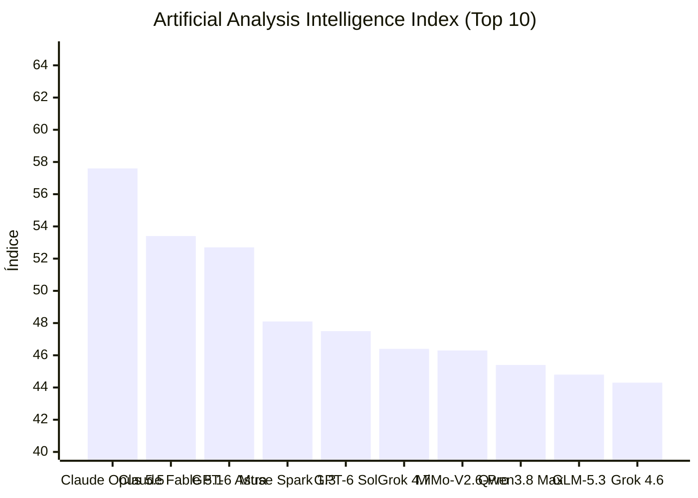


[Ler esta edição em formato de jornal, com imagens](../jornal/2026-09-26.html)

## TL;DR
1. Qwen-Image-2.1 foi lançado como modelo text-to-image com 2320 likes e 42469 downloads no Hugging Face.
2. Abenzerps liberou Qwen-Image-2.1-Uncensored-GGUF com 1784 likes e 715906 downloads no Hugging Face.
3. Comfy-Org disponibilizou Qwen-Image-2.1 como modelo com 734 likes e 3266380 downloads no Hugging Face.
4. Prism-ml lançou Ternary-Bonsai-2-27B-gguf para text-generation com 2089 likes e 3109078 downloads no Hugging Face.
5. XingChen-AGI apresentou Xing4.0-29B-A4B para text-generation com 1685 likes e 42950 downloads no Hugging Face.
6. Convicli releases: Cline Desktop v0.0.37 adicionou página About com versionamento, botões de atualização e notas de lançamento.
7. Vercel AI SDK: @ai-sdk/openai@4.0.78 trouxe suporte a reasoningEffortUpdate: 'none' para GPT-6 Sol e Luna.
8. Vercel AI SDK: @ai-sdk/perplexity@5.0.0 migrou para Agent API, quebrando compatibilidade com Sonar Chat Completions.
9. GitHub Copilot: validador in-product para settings empresariais detecta JSON malformado e mapeamentos inválidos.
10. GitHub Copilot: API de uso agora inclui tempos de revisão de pull request por estágio.
11. Qwen-Planner-Agent foi proposto como framework closed-loop para agentes de planejamento móvel real-world.
12. Rufus-Air apresentou receita de pós-treinamento aberta para GLM-4.5-Air-Base com oito estágios sequenciais.

## O que observar
- Monitorar adoção do @ai-sdk/perplexity@5.0.0 devido a quebras na API de geração de linguagem.
- Avaliar impacto do novo validador de settings do GitHub Copilot em ambientes empresariais.
- Acompanhar testes de Qwen-Planner-Agent em cenários de planejamento móvel com fechamento de loop.
## Índice de Inteligência (Artificial Analysis)

> **Status de Atualização:** Sem alterações no ranking de inteligência em relação à medição anterior.

| # | Modelo | Criador | Score | Variação | Tipo |
|---|---|---|---|---|---|
| 1 | [Claude Opus 5.5](https://artificialanalysis.ai/models#intelligence) | Anthropic | 57.6 | = | Proprietário |
| 2 | [Claude Fable 5.1](https://artificialanalysis.ai/models#intelligence) | Anthropic | 53.4 | = | Proprietário |
| 3 | [GPT-6 Astra](https://artificialanalysis.ai/models#intelligence) | OpenAI | 52.7 | = | Proprietário |
| 4 | [Muse Spark 1.3](https://artificialanalysis.ai/models#intelligence) | Meta | 48.1 | = | Proprietário |
| 5 | [GPT-6 Sol](https://artificialanalysis.ai/models#intelligence) | OpenAI | 47.5 | = | Proprietário |
| 6 | [Grok 4.7](https://artificialanalysis.ai/models#intelligence) | SpaceXAI | 46.4 | = | Proprietário |
| 7 | [MiMo-V2.6-Pro](https://artificialanalysis.ai/models#intelligence) | Xiaomi | 46.3 | = | Pesos Abertos |
| 8 | [Qwen3.8 Max](https://artificialanalysis.ai/models#intelligence) | Alibaba | 45.4 | = | Proprietário |
| 9 | [GLM-5.3](https://artificialanalysis.ai/models#intelligence) | Z AI | 44.8 | = | Pesos Abertos |
| 10 | [Grok 4.6](https://artificialanalysis.ai/models#intelligence) | SpaceXAI | 44.3 | = | Proprietário |

*Fonte: [Artificial Analysis Intelligence Index](https://artificialanalysis.ai/models#intelligence). Monitoramento e análise diária de capacidade de modelos de fronteira.*
## GitHub Trending

| Item | Resumo | Fonte | Sinal |
|---|---|---|---|
| [openclaw / openclaw](https://github.com/openclaw/openclaw) | The AI that really does things. Any OS. Any Platform. The lobster way. 🦞 \| ⭐ 390,516 \| Lang: TypeScript | GitHub Trending (daily-typescript) | 390516 |
| [obra / superpowers](https://github.com/obra/superpowers) | An agentic skills framework & software development methodology that works. \| ⭐ 291,655 \| Lang: Shell | GitHub Trending (daily) | 291655 |
| [mattpocock / skills](https://github.com/mattpocock/skills) | Skills for Real Engineers. Straight from my .agents directory. \| ⭐ 269,713 \| Lang: Shell | GitHub Trending (daily) | 269713 |
| [affaan-m / ECC](https://github.com/affaan-m/ECC) | The agent harness performance optimization system. Skills, instincts, memory, security, and research-first development for Claude Code,… | GitHub Trending (weekly) | 267490 |
| [anomalyco / opencode](https://github.com/anomalyco/opencode) | The open source coding agent. \| ⭐ 210,067 \| Lang: TypeScript | GitHub Trending (daily-typescript) | 210067 |
| [ollama / ollama](https://github.com/ollama/ollama) | Get up and running with Kimi, GLM, MiniMax, DeepSeek, gpt-oss, Qwen, Gemma and other models. \| ⭐ 181,729 \| Lang: Go | GitHub Trending (daily-go) | 181729 |
| [anthropics / skills](https://github.com/anthropics/skills) | Public repository for Agent Skills \| ⭐ 178,306 \| Lang: Python | GitHub Trending (daily-python) | 178306 |
| [anthropics / claude-code](https://github.com/anthropics/claude-code) | Claude Code is an agentic coding tool that lives in your terminal, understands your codebase, and helps you code faster by executing… | GitHub Trending (weekly) | 148097 |
| [clash-verge-rev / clash-verge-rev](https://github.com/clash-verge-rev/clash-verge-rev) | A modern GUI client based on Tauri, designed to run in Windows, macOS and Linux for tailored proxy experience \| ⭐ 147,309 \| Lang: Rust | GitHub Trending (daily-rust) | 147309 |
| [kubernetes / kubernetes](https://github.com/kubernetes/kubernetes) | Production-Grade Container Scheduling and Management \| ⭐ 127,993 \| Lang: Go | GitHub Trending (daily-go) | 127993 |
| [harry0703 / MoneyPrinterTurbo](https://github.com/harry0703/MoneyPrinterTurbo) | 利用 AI 大模型和自动化工作流，根据主题或关键词一键生成高清短视频。Generate HD short videos from a topic or keyword with an automated AI workflow. \| ⭐ 125,996 \| Lang:… | GitHub Trending (daily-python) | 125996 |
| [pytorch / pytorch](https://github.com/pytorch/pytorch) | Tensors and Dynamic neural networks in Python with strong GPU acceleration \| ⭐ 103,325 \| Lang: Python | GitHub Trending (weekly) | 103325 |
| [addyosmani / agent-skills](https://github.com/addyosmani/agent-skills) | Production-grade engineering skills for AI coding agents. \| ⭐ 99,074 \| Lang: JavaScript | GitHub Trending (weekly) | 99074 |
| [Leonxlnx / taste-skill](https://github.com/Leonxlnx/taste-skill) | Taste-Skill - gives your AI good taste. stops the AI from generating boring, generic slop \| ⭐ 90,137 \| Lang: JavaScript | GitHub Trending (daily-javascript) | 90137 |
| [paperclipai / paperclip](https://github.com/paperclipai/paperclip) | The open-source app everyone uses to manage agents at work \| ⭐ 84,880 \| Lang: TypeScript | GitHub Trending (daily-typescript) | 84880 |

## Modelos: lançamentos e trending

| Item | Resumo | Fonte | Sinal |
|---|---|---|---|
| [convaiinnovations/laya](https://huggingface.co/convaiinnovations/laya) | text-classification · 3681 likes · 0 downloads · trending 3373 | HF Trending Models | 3373 |
| [Qwen/Qwen-Image-2.1](https://huggingface.co/Qwen/Qwen-Image-2.1) | text-to-image · 2320 likes · 42469 downloads · trending 2146 | HF Trending Models | 2146 |
| [abenzerps/Qwen-Image-2.1-Uncensored-GGUF](https://huggingface.co/abenzerps/Qwen-Image-2.1-Uncensored-GGUF) | text-to-image · 1784 likes · 715906 downloads · trending 1556 | HF Trending Models | 1556 |
| [XingChen-AGI/Xing4.0-29B-A4B](https://huggingface.co/XingChen-AGI/Xing4.0-29B-A4B) | text-generation · 1685 likes · 42950 downloads · trending 1216 | HF Trending Models | 1216 |
| [prism-ml/Ternary-Bonsai-2-27B-gguf](https://huggingface.co/prism-ml/Ternary-Bonsai-2-27B-gguf) | text-generation · 2089 likes · 3109078 downloads · trending 1058 | HF Trending Models | 1058 |
| [Comfy-Org/Qwen-Image-2.1](https://huggingface.co/Comfy-Org/Qwen-Image-2.1) | modelo · 734 likes · 3266380 downloads · trending 695 | HF Trending Models | 695 |
| [Altworld/Hemmingway-1](https://huggingface.co/Altworld/Hemmingway-1) | text-generation · 675 likes · 4978 downloads · trending 660 | HF Trending Models | 660 |
| [Edge0/Audio8-ASR-Infinite](https://huggingface.co/Edge0/Audio8-ASR-Infinite) | automatic-speech-recognition · 551 likes · 2853 downloads · trending 496 | HF Trending Models | 496 |
| [XiaomiMiMo/MiMo-V2.6-Pro-RL](https://huggingface.co/XiaomiMiMo/MiMo-V2.6-Pro-RL) | text-generation · 498 likes · 42062 downloads · trending 488 | HF Trending Models | 488 |
| [TaichuAI/ZDTaichu5.0-9B](https://huggingface.co/TaichuAI/ZDTaichu5.0-9B) | image-text-to-text · 1048 likes · 9498 downloads · trending 479 | HF Trending Models | 479 |

## Reddit

| Item | Resumo | Fonte | Sinal |
|---|---|---|---|
| [I think Claude is most powerful in an All Rounders hand...](https://www.reddit.com/r/claude/comments/1wquo64/i_think_claude_is_most_powerful_in_an_all/) | I am an IT Manager, a generalist who has seen it all, gets involved in all aspects of the business and every department. And I think that… | Reddit: Claude | - |
| [I turned Claude code into a corporate structure, and then turned my roadmap development into a sim-city style game where each building is a feature on the roadmap, all updated in real time](https://www.reddit.com/r/claude/comments/1wqvbnz/i_turned_claude_code_into_a_corporate_structure/) | submitted by /u/DragonflyLogical8371 \[link\] \[comments\] | Reddit: Claude | - |
| [Cool use case that Opus 5.5 nailed today: complex hiking route generation](https://www.reddit.com/r/claude/comments/1wqwylj/cool_use_case_that_opus_55_nailed_today_complex/) | I have a training plan for some hiking that has me walking about 115 miles total with increasing distances per week over the next few… | Reddit: Claude | - |
| [What LLM are you finding is best for writing?](https://www.reddit.com/r/claude/comments/1wqxnri/what_llm_are_you_finding_is_best_for_writing/) | Really trying to figure this out. If you use LLMs to write at all, I really would like to hear from you. I've been trying to figure out the… | Reddit: Claude | - |
| [Opus 5.5 one shotted this](https://www.reddit.com/r/claude/comments/1wqybil/opus_55_one_shotted_this/) | submitted by /u/chaitanyagiri \[link\] \[comments\] | Reddit: Claude | - |
| [Is ID verification normal for a 7-day Claude trial?](https://www.reddit.com/r/claude/comments/1wqymya/is_id_verification_normal_for_a_7day_claude_trial/) | Hey everyone, I sent a coworker a 7-day free Claude trial invite so he could give it a try. He’d never used Claude before, so he created an… | Reddit: Claude | - |
| ["use your little computer dude."](https://www.reddit.com/r/claude/comments/1wqz5yp/use_your_little_computer_dude/) | Why does he always insist we go the extra mile like he doesn't have a lil computer submitted by /u/seven7in \[link\] \[comments\] | Reddit: Claude | - |
| [I really missed the enchanting, incubating and honking stuff](https://www.reddit.com/r/claude/comments/1wqzh53/i_really_missed_the_enchanting_incubating_and/) | Opus 5.5 seems like the direction 4.6 should have got to! submitted by /u/teomore \[link\] \[comments\] | Reddit: Claude | - |
| [Claude app should use fingerprint or password protection](https://www.reddit.com/r/claude/comments/1wr1y1g/claude_app_should_use_fingerprint_or_password/) | There is a lot of sensitive information in your Claude app and now that Claude code sessions can be accessed from it it's even more reason… | Reddit: Claude | - |
| [The history of sport scores](https://www.reddit.com/r/claude/comments/1wr20ox/the_history_of_sport_scores/) | I talked with ChatGPT at length about the history and oddities of sports scores weeks ago. I asked it to make a prompt for Opus 5.5 to turn… | Reddit: Claude | - |
| [Fable 5.1 - Live Vehicle Diagnostics](https://www.reddit.com/r/ClaudeCode/comments/1wquoxy/fable_51_live_vehicle_diagnostics/) | So my Aunts 2018 Kia Soul had what we perceived as an electrical issue (starter click, no turnover). I am the family DIY mechanic so the… | Reddit: ClaudeCode | - |
| [Just re-subscribed to Max after a long time and received a free banked reset + $250 cloud credits! I'm so excited.](https://www.reddit.com/r/ClaudeCode/comments/1wqvwry/just_resubscribed_to_max_after_a_long_time_and/) | Let's go. I'm so fucking done with Codex and Astra. I hope I'll have as good a time as I did when I first joined earlier this year:… | Reddit: ClaudeCode | - |
| [When Claude Code is trying to find the right file](https://www.reddit.com/r/ClaudeCode/comments/1wqwua2/when_claude_code_is_trying_to_find_the_right_file/) | submitted by /u/Potential-Ant-6320 \[link\] \[comments\] | Reddit: ClaudeCode | - |
| [Opus 5.5 + Fable 5.1 as automatic Advisor](https://www.reddit.com/r/ClaudeCode/comments/1wqxbto/opus_55_fable_51_as_automatic_advisor/) | Though, this is purely subjective and I haven't run any benchmarks to know if this is an actual improvement or not, but at a cursory glance… | Reddit: ClaudeCode | - |
| [I was sleeping when opus 5.5 launched, but last 28 hours were amazing](https://www.reddit.com/r/ClaudeCode/comments/1wqys3e/i_was_sleeping_when_opus_55_launched_but_last_28/) | 200$ plan for last 5 months it was feeling like give it up, nothing much it did well, actually except I'm doing spoon feeding, .then astra… | Reddit: ClaudeCode | - |

## Hacker News

| Item | Resumo | Fonte | Sinal |
|---|---|---|---|
| [Tell HN: Codex Is Down \[fixed\]](https://news.ycombinator.com/item?id=49851032) | Tell HN: Codex Is Down \[fixed\] \| ⬆ 63 points \| 💬 66 comments \| by minimaxir | Hacker News | 195 |
| [OpenAI bots meddled with multiple US Government agency sites](https://www.bbc.com/news/articles/cw62jje658dlo) | OpenAI bots meddled with multiple US Government agency sites \| ⬆ 51 points \| 💬 63 comments \| by Betelbuddy | Hacker News | 177 |
| [CEO of Mistral: AI is software. It can be controlled](https://www.lemonde.fr/en/economy/article/2026/09/24/arthur-mensch-ceo-of-french-start-up-mistral-ai-ai-is-software-it-can-be-controlled_6757890_19.html) | CEO of Mistral: AI is software. It can be controlled \| ⬆ 61 points \| 💬 43 comments \| by thibaut_barrere | Hacker News | 147 |
| [Revealing the details of how OpenAI agents hacked Hugging Face](https://swarmtraces.org/) | Revealing the details of how OpenAI agents hacked Hugging Face \| ⬆ 65 points \| 💬 35 comments \| by specked-citrus | Hacker News | 135 |
| [One Month Without AI](https://blog.bustikiller.com/2026/09/25/one-month-without-ai.html) | One Month Without AI \| ⬆ 51 points \| 💬 32 comments \| by saibotk | Hacker News | 115 |
| [Drawgent: Coding agent on a live Excalidraw canvas](https://tangled.org/yanndegat.tngl.sh/drawgent) | Drawgent: Coding agent on a live Excalidraw canvas \| ⬆ 38 points \| 💬 16 comments \| by parasitid | Hacker News | 70 |
| [Analyzing Frontier Model Progress with My Favourite Game: Prince of Persia](https://blog.priyan.in/2026/09/analyzing-frontier-model-progress-with.html) | Analyzing Frontier Model Progress with My Favourite Game: Prince of Persia \| ⬆ 20 points \| 💬 18 comments \| by msephton | Hacker News | 56 |
| [Show HN: A Claude Code skill to analyze your chess games](https://github.com/brumar/chess-postmortem-skills) | Show HN: A Claude Code skill to analyze your chess games \| ⬆ 22 points \| 💬 15 comments \| by brumar | Hacker News | 52 |
| [Issues with Codex – Identified – Full Outage](https://status.openai.com/incidents/01M3DCNWMW57HYK8FJ5FBFPA39) | Issues with Codex – Identified – Full Outage \| ⬆ 26 points \| 💬 13 comments \| by xyzzy9563 | Hacker News | 52 |
| [The Copilot+ PC brand is dead](https://www.windowscentral.com/microsoft/windows-11/the-copilot-pc-brand-is-dead-microsoft-and-pc-makers-quietly-pull-back-on-tarnished-windows-11-ai-pc-branding) | The Copilot+ PC brand is dead \| ⬆ 28 points \| 💬 6 comments \| by bj-rn | Hacker News | 40 |
| [How I changed teaching after AI managed to do all my homework assignments](https://thelastsoftwareengineer.substack.com/p/how-i-changed-teaching-after-ai-managed) | How I changed teaching after AI managed to do all my homework assignments \| ⬆ 34 points \| 💬 3 comments \| by azhenley | Hacker News | 40 |
| [Understanding the Impact of LLM Watermarking on AI Agent Behavior](https://www.lasso.security/blog/the-provenance-tax-understanding-the-impact-of-llm-watermarking-on-ai-agent-behavior) | Understanding the Impact of LLM Watermarking on AI Agent Behavior \| ⬆ 27 points \| 💬 5 comments \| by nisosguy | Hacker News | 37 |
| [A single function Jev-like wrapper for LLMs, including vision models](http://allanrbo.blogspot.com/2026/09/a-jev-like-wrapper-for-llms-including.html) | A single function Jev-like wrapper for LLMs, including vision models \| ⬆ 22 points \| by allanrbo | Hacker News | 22 |

## Releases e changelogs de agentes

| Item | Resumo | Fonte | Sinal |
|---|---|---|---|
| [rust-v0.157.1](https://github.com/openai/codex/releases/tag/rust-v0.157.1) | Release 0.157.1 | Codex CLI Releases | - |
| [Enterprise managed settings in-product validator](https://github.blog/changelog/2026-09-25-enterprise-managed-settings-in-product-validator) | You can now use an in-product validator for enterprise managed settings for GitHub Copilot. The validator detects malformed JSON,… | GitHub Changelog | - |
| [Desktop v0.0.37](https://github.com/cline/cline/releases/tag/desktop-v0.0.37) | Settings has a new About page. It shows your version and channel, has Check for updates and Restart to update buttons, and lists the… | Cline Releases | - |
| [@ai-sdk/openai@4.0.78](https://github.com/vercel/ai/releases/tag/%40ai-sdk%2Fopenai%404.0.78) | Patch Changes 94d5d6d: Support reasoningEffortUpdate: 'none' for GPT-6 Sol and Luna in request-level options and positioned system… | Vercel AI SDK Releases | - |
| [Usage metrics API adds pull request review stages](https://github.blog/changelog/2026-09-25-usage-metrics-api-adds-pull-request-review-stages) | The enterprise and organization repository-level Copilot usage metrics reports now break down how long pull requests spend in each stage of… | GitHub Changelog | - |
| [@ai-sdk/perplexity@5.0.0](https://github.com/vercel/ai/releases/tag/%40ai-sdk%2Fperplexity%405.0.0) | Major Changes 38fe0e5: BREAKING: Migrate language generation from the Sonar Chat Completions API to the Agent API. Replace Sonar model IDs… | Vercel AI SDK Releases | - |

## Pesquisa

| Item | Resumo | Fonte | Sinal |
|---|---|---|---|
| [Training Object Permanence in World Models](https://huggingface.co/papers/2609.28654) | Object permanence and solidity are hallmarks of human cognitive priors. Recent studies show that video generation models, a paradigmatic… | HF Daily Papers | 157 |
| [Your Transformer Can Hold Two Thoughts at Once: Evidence of Linear Superposition in LLMs](https://huggingface.co/papers/2609.29845) | While Large Language Models (LLMs) rely on highly non-linear components, in this work we demonstrate that they exhibit fundamental… | HF Daily Papers | 57 |
| [WanPE: Towards Cinematic Prompt Enhancement for Modern Text-to-Video Generation](https://huggingface.co/papers/2609.30221) | Video generation begins in text space by authoring a cinematic screenplay, then materializes into pixels. As contemporary video generators… | HF Daily Papers | 25 |
| [OmniEcho: Spatial Audio Understanding for Embodied Agents](https://huggingface.co/papers/2609.23407) | Humans can effortlessly localize the direction of a sound source and integrate it with visual cues for reasoning, yet this remains… | HF Daily Papers | 22 |
| [Agent-Editing World Model: Rethinking World Modeling for LLM Agents](https://huggingface.co/papers/2609.28416) | Recent advances in large language models (LLMs) have enabled agents to tackle long-horizon tasks across diverse environments. To further… | HF Daily Papers | 15 |
| [Parts-of-Speech as Emergent Categories in SAE Latent Space](https://huggingface.co/papers/2609.29362) | Sparse AutoEncoders (SAEs) offer a promising way to inspect language model representations, but it is still unclear what kind of linguistic… | HF Daily Papers | 12 |
| [Qwen-Planner-Agent: A Closed-Loop AI-for-AI Framework for Real-World Mobile Planner Agents](https://huggingface.co/papers/2609.29892) | The rapid progression of large language models is extending AI from passive content generation into the active workflows of engineering and… | HF Daily Papers | 11 |
| [IterSynth: Rethinking Deep Search Agents via Role-Decoupled Iterative Synthesis](https://huggingface.co/papers/2609.29444) | Deep search requires LLM agents to decompose complex queries, search for evidence, and synthesize grounded answers, yet existing… | HF Daily Papers | 10 |
| [RGBD20K: A Large-Scale Benchmark for RGB-D Semantic Segmentation](https://huggingface.co/papers/2609.29028) | In this paper, we propose RGBD20K, a novel dataset for facilitating the development of more robust and general RGB-D semantic segmentation… | HF Daily Papers | 8 |
| [Rufus-Air: An Open LLM Post-Training Recipe](https://huggingface.co/papers/2609.29421) | Rufus-Air is an open and reproducible post-training recipe on GLM-4.5-Air-Base (106B-A12B), organized as a serial pipeline of eight stages:… | HF Daily Papers | 8 |
| [Coding Agents for Generalized Task and Motion Planning Problems](https://huggingface.co/papers/2609.30233) | Task and motion planning (TAMP) problems remain difficult even with full observability and object-centric states because discrete decisions… | HF Daily Papers | 8 |

## Comunidade e produtos

| Item | Resumo | Fonte | Sinal |
|---|---|---|---|
| [Artificial Analysis: Ranking de Inteligência (Claude Opus 5.5 (Adaptive Reasoning, Max Effort, Default Fallback))](https://artificialanalysis.ai/models) | Índice de Inteligência Artificial Analysis (2026-09-26): liderança de Claude Opus 5.5 (Adaptive Reasoning, Max Effort, Default Fallback)… | Artificial Analysis | 95 |
| [If AI Writes the Code and AI Reviews the Code, What Exactly Is the Developer Verifying?](https://dev.to/robertadam987_/if-ai-writes-the-code-and-ai-reviews-the-code-what-exactly-is-the-developer-verifying-b5h) | AI can now write the feature. Then AI can write the tests. Then AI can open the pull request. Then... | Dev.to (ai) | 33 |
| [\[DÚVIDA \] Porquê Python se C/C++ é bem melhor??](https://www.tabnews.com.br/walacysilva/duvida-porque-python-se-c-c-e-bem-melhor) | Contexto Inicial: Em um teste para uma empresa, foi me pedido para tratar uns dados, subir num banco de dados e retorna uma analise dos… | TabNews | 22 |
| [A Field Guide to AI Documentation: Model Cards, Eval Reports, Agent Cards, and More](https://dev.to/james_anderson_h/a-field-guide-to-ai-documentation-model-cards-eval-reports-agent-cards-and-more-5h0f) | Every developer learns the same documentation types. The README. The API reference. Code comments.... | Dev.to (agents) | 12 |
| [An AI Correctly Ignored a Forum Rumor. I Removed One Label and It Paid Out $150.](https://dev.to/rudratosh/an-ai-correctly-ignored-a-forum-rumor-i-removed-one-label-and-it-paid-out-150-3jig) | A benchmark on whether LLMs check WHO said something before acting on it. Strip the source label off a rumor, phrase it like policy, and a… | Dev.to (llm) | 7 |
| [Sarvam AI Releases Saaras V4: A Speech-to-Text Model for All 22 Indian Languages and Global English](https://www.marktechpost.com/2026/09/26/sarvam-ai-releases-saaras-v4-a-speech-to-text-model-for-all-22-indian-languages-and-global-english/) | Sarvam AI's Saaras V4 is a speech-to-text model covering all 22 Indian languages plus global English. It pairs an audio encoder with a 3B… | MarkTechPost | - |
| [DeepLearning.AI - New short course! Gemini CLI](https://x.com/DeepLearningAI/status/2014012615383724150) | 21 de jan. de 2026 ... Learn how to build multi-step development and automation workflows from the command line using Gemini CLI, an… | X/Twitter (Gemini CLI) | - |
| [Supersonic Labs Releases Julia 1: A 144.3M-Parameter Open Decision Model That Runs on a CPU - MarkTechPost](https://news.google.com/rss/articles/CBMiywFBVV95cUxNN0FZMTl2N0FURnpwb0U5czRRT1F3S0dkQ3pSaFZaX3NUbm5icTNVWkxZbXlEUlNFVjRZS3p3SjZJV2xuV0JuNllZeU80ZXk2dlRQWHhkQzVYdVozbW5BbkVLOXI4aDN3TEVtQ0ZtUjQ0MmlZY1RGNU9sSkJMQ20yMGJWcWo2cHJ0R2tSTWl3S2x3ZXRqMTZhUWFRRDJvSkcxa2taUC1hZXVBVjF2T1ZPQXNmUWQ5THAxQzU5MmNrWkZaeGVyTUw1Z2pqZ9IB0AFBVV95cUxNWDJmQUF6NHpjalYxS1pneGF3YUstR0lRYk1RcnJOQzhENkZmVnd6ZHk0MERwLU44WTJ2ZU1FOGxMS19rU1BuWTVab3FYSG5jWXdRdjZiMWdSQ19QbTBsY3NkUlNpbXFMY09WZm1qcXZZYmpTQl8tZkhJMWNLSTNIZ0toYzdiWTUzNXQ5SG1PQWQ5TWU1eFpOYVhxeTdacFM0cUdXd2NnYXZpM2xkaVR1dnp2dlFxd1lxTTBQV1FxVTlyVzVNSXo5ZmFKcERBZm1o?oc=5) | Supersonic Labs Releases Julia 1: A 144.3M-Parameter Open Decision Model That Runs on a CPU MarkTechPost | Google News (Exa Agent Ultra swarm) | - |
| [Muse Code vs Claude Code vs Cursor: AI Coding Agents 2026 - tech-insider.org](https://news.google.com/rss/articles/CBMic0FVX3lxTE9janRLZTdhakhFNEdzVmo4RXI0cUtWX3JmTGo5MXJva1I1R3Rhay1od0kyZFExYTZzRkRIeFAwdEhYa2xqeFV3WHoxZWFmUnd6VnhETTljcUY3MzdEVjNWejM5MTZPMmNzQ19IMGRYczNhV3M?oc=5) | Muse Code vs Claude Code vs Cursor: AI Coding Agents 2026 tech-insider.org | Google News (Cursor AI editor) | - |
| [We Can't Let AI Writing Take Over the Internet - derekthompson.org](https://news.google.com/rss/articles/CBMidkFVX3lxTE85eXN0WUNSOVVnM0JsLUpSNzdDSzFoTkRuaF9fcmNDQW52a3pGWm1WYWNjX0lXYmNsWjRKYXlma2RFdEhtRmZnMVdXTkJQU29RVkdVcW5OR2YyVlJiU1F5Z2FSdWtDa1dhNDJYNkc0YWl6YnNjQmc?oc=5) | We Can't Let AI Writing Take Over the Internet derekthompson.org | Google News (AI training slop detection) | - |
| [Introducing The Sensor Tower MCP Server - Sensor Tower](https://news.google.com/rss/articles/CBMid0FVX3lxTE9QeDV6TkZpdjNNMndTVno0VElRZ2lNSFpMVHlSa1ptd0NTajdaVklGa3l1WjlLREhRMGJzSGRjYno5VnNXUmNEU0Zla1YtMTVZMnJYa0ZESmZSeUhLYm9UUkRFYk84eG01c1NVeExfRjZwSnlGMHBn?oc=5) | Introducing The Sensor Tower MCP Server Sensor Tower | Google News (Model Context Protocol mobile) | - |
| [Microsoft packages business AI in single app as it tries to compete with Anthropic - CNBC](https://news.google.com/rss/articles/CBMif0FVX3lxTE1LaE56cEZlT0tlaGw5Mno4QUZnTUFKT3Jod2ZQZEZsSmtxVWg0Vy10M2hwMU1acjNqamZ4LXZ6cS1nNkI2aURrRklYaEFmVVVvZEhWUURVOWhfcEwtZUVDck04WGhuX2ZZd0Rsa0dfMnlhNHExQlVsdDVmOF95V2_SAYQBQVVfeXFMTnpIaHZQWVV2WFd5Y0xNamVvZ0NxaDAzdzdPd3phSF9MZUlTaHdJdFpvUEFNdDBMczIyNkVMQ0R0Nk9Tb1dISlVQd28tV2FvUHFScFljWDRBRExmYmFHX2hhMTJ6Nm5aZncyQnJFTnpfSUItWFBqSllHTGpXZXBIVnBqMW45?oc=5) | Microsoft packages business AI in single app as it tries to compete with Anthropic CNBC | Google News (GitHub Copilot agent) | - |
| [Claude 250 的云端额度，领了会被封号 ？](https://www.v2ex.com/t/1244896) | 有领过的大哥讲讲呗 | V2EX Tech | - |
| [A Brief Perspective on Deep Learning Using Common Lisp](https://www.youtube.com/watch?v=Yo4eqoRC1o0) | Comments | Lobsters: AI | - |
| [Wrong, not broken](https://aws.amazon.com/blogs/aws-insights/wrong-not-broken/) | Comments | Lobsters: vibecoding | - |

_Coleta automatica de 85 itens em 7 frentes nas ultimas 24 horas._


---
*Gerado por evo-agent - agente auto-aprimorante em 2026-09-26.*
