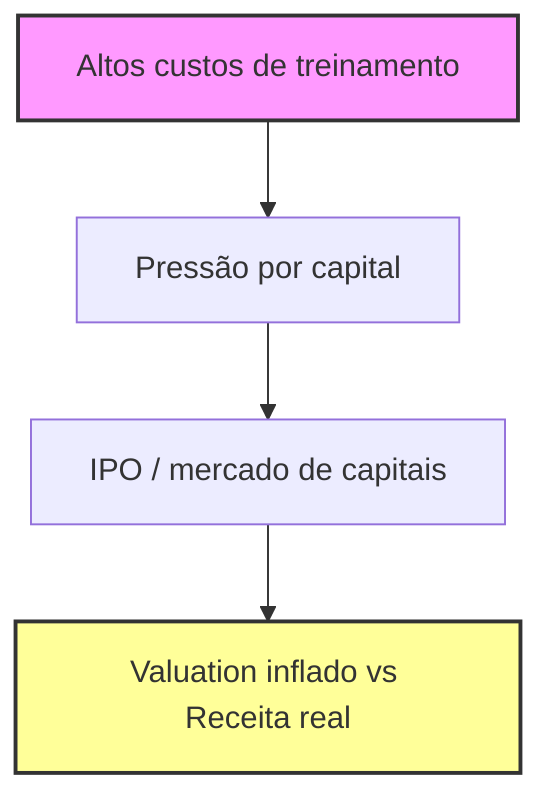
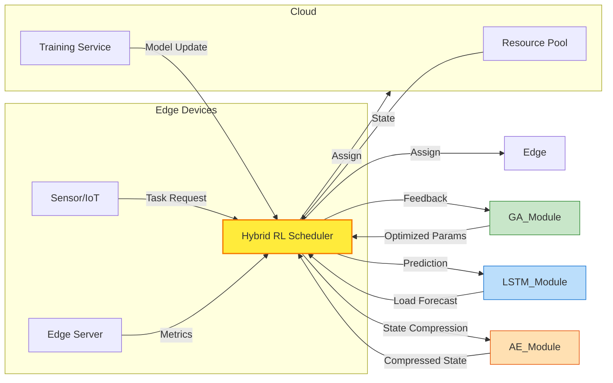
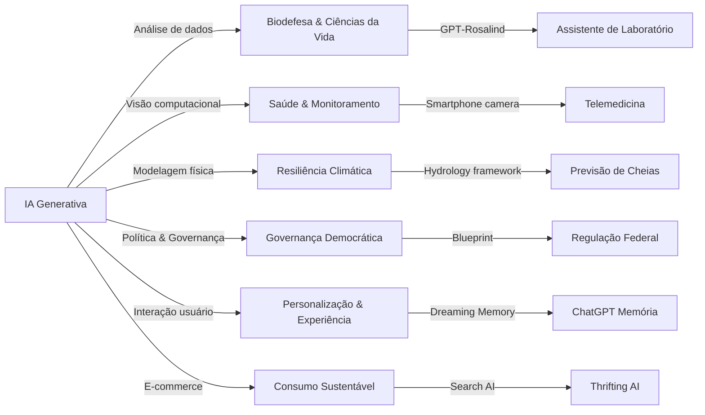


**Periodo:** 07/12/2025 a 05/06/2026

## Mercado e Financiamento da IA

- **Anthropic & custos de treinamento** – O presidente da Anthropic afirma que os custos massivos de treinamento de modelos (centenas de milhões de dólares) estão forçando startups de IA a buscar capital aberto como caminho mais viável para financiar a próxima geração de modelos. Isso cria pressão regulatória e de governança antes da maturidade comercial. | [Anthropic President Says Training Costs Drive AI Companies Toward Public Market](https://news.google.com/rss/articles/CBMizwFBVV95cUxORG4wWGNjLXZPQnRuQjRacy1FRVNiYnRBTTBpR0lBa0lZQ0JTUVc2NG9WQkt3ZmJUREo2TEF4eFFzS3V5QUhMS0NZeTJRVXVFa0h1eGlXSEJrS2JpNlJYSkxfYnBvNmVRWVVIZXpsNmxVNDFfTS1ucWhMaW5HanJFRGhVMzJxbnhmTmp0Vm1raDNfWDhTd2xodC1iOTY1OXBTWGp1Zm1vYWJzODVvOFVfNXpEUW5aSlJ0a1N6cFhwZnVuSS1kOEdFeUZUZ3FWT2M?oc=5)

- **IPO da Anthropic: avaliação vs receita real** – A Anthropic registrou um filing confidencial visando valuation de US$ 965 bi, mas sua receita de US$ 47 bi era apenas run‑rate; a receita efetiva ao fim de 2025 foi ≈ US$ 9 bi. O caso evidencia a discrepância entre expectativas de mercado e cash‑flow real em empresas de IA. | [Anthropic IPO: Is the $965 Billion AI Bet Real?](https://www.reddit.com/r/ProfessorErica/comments/1tx8k6a/anthropic_ipo_is_the_965_billion_ai_bet_real/)

- **Explosão de custos com tokens – OpenClaw** – O criador do OpenClaw consumiu 603 bi tokens em 7,6 mi requisições (100 agentes de código) num mês, gerando fatura de US$ 1,3 mi. O exemplo demonstra como o uso intensivo de APIs Codex pode rapidamente exceder orçamentos de startups. | [OpenClaw creator burned through $1.3 million in OpenAI API tokens in a single month — Tom's Hardware](https://news.google.com/rss/articles/CBMi4gFBVV95cUxOZmhHTVpuYXZRWjV4Vk53dVFMMk8yNzUzZC1FQS0wMkkxVHEzbjB2Wi0zeUlOMGNRc3VoNDlJWFRYbTZFOXdyR2hUQ19KYWR5Ri1FS2lORHlYNVlyVkNGdnRKQk1kdl85a2p6NTFtTHgyaW5sOXh2TzYtS19xQ2p3NXZQOU5oNVBhcVU5Qmtkc2t6bENBMXFmMXVzTUNlNERVSS04OGpobUdjeG85VzF1N3lMMW1VdWV4Sm5ZaEZmY2llT1Zza1ZXWXF5dWsyTERNUWYxZWdTZWNIVno2S25CLUtR?oc=5)

- **Novo modelo pay‑as‑you‑go do Codex** – A OpenAI lançou plano de pagamento por uso para o Codex e reduziu preços do ChatGPT Business, facilitando adoção por desenvolvedores com orçamentos variáveis e reduzindo a barreira de entrada para experimentação corporativa. | [OpenAI launches pay-as-you-go Codex and lowers ChatGPT Business price](https://news.google.com/rss/articles/CBMilAFBVV95cUxQdjFwdm92d2h4WmsxYkFoT0pjUlpPdzgyNVBxQlBpbTFHRi1jcFJwSDRBUkZCUmJlaGRTOHJOdVMwWUJBaXc3aGprUmRfQ0FGMDhlSV9CaDVFMXRaZXNIWW5wZnFiSXNMaURTT2hjblhwa2h0b01fdGt5eEdGSDlMeTlpa1BMT3RXVVRsMzBIejY0ajRy?oc=5)

- **Claude Code × Codex 2026 – comparativo** – O guia da SitePoint avalia desempenho, custos de token e integração de Claude Code (Anthropic) vs Codex (OpenAI) para 2026. Conclui que Claude tem menor custo por token, enquanto Codex oferece maior suporte a agentes autônomos, influenciando decisões de investimento em APIs. | [Claude Code vs Codex 2026 | Developer Comparison Guide](https://news.google.com/rss/articles/CBMiYkFVX3lxTE8wTi02ZFpJTzlfRlJ2d1RLRjFrTURfM0g4WlE1bVV3cm9IZnAwdkdrVzVpLUhSajI4WmZMZkxwX3d6SWcwdmNZRUJPNlhlcm04Z0E3LWFsWXBKUzB4TW1EMEFn?oc=5)

- **Análise da explosão de custos – Let’s Data Science** – Repetindo o caso OpenClaw, o artigo destaca a necessidade de monitoramento granular de consumo de tokens e sugere camadas de caching e batch‑processing para mitigar faturas inesperadas. | [OpenClaw Creator Accumulates $1.3M in AI Tokens](https://news.google.com/rss/articles/CBMikAFBVV95cUxQbktFdmQtdnI5R0gyYmdBMERYR2ZqSk1NX01YTmh1NnZLdTNxcjVLVkFtNDFibUhxY3hhUDR0RVEyRy1CUXd5YWF6aklfaHpQOEtBTmtzYXdZU1NaN1ZzMy1qTzhCUlZrWnNiR0l5T3hNQWlNcnZJMFFTU2xCaE1oLU9scExWYUY4ZGF4aGtWcmU?oc=5)

- **Codex como motor de agentes empresariais** – A Fortune aponta que a OpenAI está alavancando o Codex como núcleo para vender “AI agents” a grandes corporações, estruturando licenças corporativas baseadas em consumo de tokens e garantindo margens mais altas que serviços SaaS tradicionais. | [Why Codex is at the heart of OpenAI's plans to sell AI agents to enterprises](https://news.google.com/rss/articles/CBMifEFVX3lxTE5ubjZmQlRVWFduMTRuVHR5NTU1NGY1TUlCUURwUVZVRVAtWjBMMlk3Z01od0pOTkZ1MXAtNE9ZZk1xNDk0b1FkajFHX1l3b0N3ZTFUTlN4eFZrUGtEeHg1eWZaTFdwN1l2YmhHcFVfRklNM1ozSlp4bzcza0M?oc=5)

---



```mermaid
flowchart TD
    E[Uso massivo de tokens (Codex)] --> F[Custos inesperados]
    F --> G[Modelos pay‑as‑you‑go + caching]
    G --> H[Oferta de AI agents corporativos]
    style E fill:#ccf,stroke:#333,stroke-width:2px
    style H fill:#cfc,stroke:#333,stroke-width:2px
```

## Segurança e Vulnerabilidades

- **Copy‑Fail (CVE‑2026‑31431) – demonstração simples** – Um script Python substitui o binário `/bin/su`, altera seu SHA‑1 e, após limpar caches do kernel, restaura o binário original, mostrando que a falha permite corrupção de arquivos críticos e escalada de privilégio ao obter acesso root.  
  Fonte: [Short and easy to understand: "Copy‑Fail CVE‑2026‑31431"](https://www.reddit.com/r/linux/comments/1szu253/short_and_easy_to_understand_copyfail/)

- **Copy‑Fail (CVE‑2026‑31431) – bug de lógica trivially exploitable** – A vulnerabilidade consiste em um erro lógico no kernel Linux que afeta todas as distribuições lançadas nos últimos nove anos; um único script Python portátil pode explorar o bug e obter privilégios de root em qualquer distro afetada.  
  Fonte: [Copy Fail is a trivially exploitable logic bug in Linux…](https://www.reddit.com/r/linux/comments/1sz96iq/copy_fail_is_a_trivially_exploitable_logic_bug_in/)

- **Copy‑Fail (CVE‑2026‑31431) – cobertura da mídia** – O Hacker News relata que a falha “Copy Fail” concede acesso root em distribuições Linux de grande relevância, enfatizando a urgência de aplicar patches e monitorar sistemas críticos.  
  Fonte: [New Linux 'Copy Fail' Vulnerability Enables Root Access on Major Distributions – The Hacker News](https://news.google.com/rss/articles/CBMifEFVX3lxTFBfTFRsZnZsZDZoM1dqVE1hOC13bVgzLUo5TGRfc1hLZFBDdmtqSF8zN0pITGVOV25MSnhrVndsX2g5ZVVFQTd1WjhvWEZ4QmYxZUY1eExsNWJzSzJrRW5KMFFrbzVCSGl0RnhNcHdpTDlNUnpDVlc4a040OEU?oc=5)

- **Copy‑Fail (CVE‑2026‑31431) – CISA adiciona à watchlist** – O CISA dos EUA incluiu a falha «insana» na lista de vulnerabilidades monitoradas, classificando‑a como risco nacional e recomendando mitigação imediata em infraestruturas Linux críticas.  
  Fonte: [US CISA adds ‘insane’ Linux Copy Fail flaw to watch list – TradingView](https://news.google.com/rss/articles/CBMiugFBVV95cUxQeEcyLTFYY2VhRGxGejdYNnhkclUyR0N0Zk1zRkFzWkx6Q1JqT0xsdUJlNk95aUItdktHX0F5TTdrRjlPMzBlR2RTZlllMkkyNG8xZHlRNXhrYjdHdUtma1RDcnVQbkZSN0lrUzNNRjhxNHRBVnhnSkR4VWo1S0VLNGlWa1dfMFhHLWw0YlltUFBqdWNTV29nQjRQQWNIeFJYelpCR0tnSWhQNU43UVJZSUZvWnk1b3REQ0E?oc=5)

- **CVE‑2026‑41089 – Netlogon 0‑Click RCE (Windows)** – Falha crítica em Netlogon permite que um atacante não autenticado envie um pacote CLDAP UDP 389 e execute código arbitrário com privilégios de Sistema em controladores de domínio; exploração ativa foi confirmada.  
  Fonte: [Windows Netlogon 0-Click RCE Vulnerability Now Actively Exploited In …](https://x.com/The_Cyber_News/status/2061506815276232765)

- **CVE‑2026‑41089 – alvo de atacantes** – SecurityWeek destaca que o CVSS da vulnerabilidade é 10.0, sinalizando risco máximo; recomenda atualização urgente dos patches da Microsoft para proteger controladores de domínio.  
  Fonte: [Critical Windows Netlogon Vulnerability in Attackers' Crosshairs (CVE …)](https://x.com/SecurityWeek/status/2061463874092597763)

- **CVE‑2026‑41089 – PoC e detalhes técnicos** – Tweet compartilha prova de conceito (PoC) de 0‑day que demonstra o overflow de pilha pré‑autenticação; o código está disponível para análise de defesa.  
  Fonte: [CVE-2026-41089 (Critical RCE 0day PoC CVSS: 10)](https://x.com/ethicalhack3r/status/2057744082831605991)

- **CVE‑2026‑41089 – pesquisa de exploit** – AretiqAI relata que um único pacote CLDAP pode derrubar (crash) um Domain Controller, reforçando a gravidade e a necessidade de bloqueio de tráfego UDP 389 não autorizado.  
  Fonte: [Added research for CVE-2026-41089 — a pre-auth stack buffer overflow in …](https://x.com/AretiqAI/status/2054557996391239920)

- **Claude Opus 4.6 vs GPT‑5.5 – comparação de IA** – Discussão no V2EX indica que Claude Opus 4.6 oferece respostas mais consistentes em modo “cowork”, enquanto GPT‑5.5 ainda apresenta limitações; a evolução de LLMs pode influenciar ferramentas de análise de ameaças, embora não seja diretamente relacionada a vulnerabilidades.  
  Fonte: [大家目前觉得最聪明的大模型还是 Claude Opus 4.6 吗？](https://www.v2ex.com/t/1217986#reply17)

```mermaid
flowchart TD
    A[Linux distro] -->|Copy‑Fail (CVE‑2026‑31431)| B[Escalada para root]
    C[Windows Domain Controller] -->|Netlogon (CVE‑2026‑41089) UDP 389 CLDAP| D[Execução remota de código (RCE)]
    B -->|Impacto| E[Comprometimento total do host]
    D -->|Impacto| E
```

## Guardrails e Controle de Conteúdo

- **LLM Guardrails (wiz.io)** – Expõe uma arquitetura de “guardrails” que combina filtros de entrada, políticas de uso e monitoramento de saída para mitigar respostas indesejadas de LLMs em produção. O modelo recebe verificações em tempo real e logs detalhados, permitindo auditoria e resposta rápida a falhas. [LLM Guardrails Explained: Securing AI Applications in Production](https://news.google.com/rss/articles/CBMiY0FVX3lxTE9NbG01ZXQxRTV5TFVZRWRmdGhLMEJJekhWWXRBc1hIZ2VKVm85SlhCbTQycW5qX1g3ZEtzbElLcTQ0OTlSUW50ckFiVE8yYk4xem12Uk1NOEN6NjhPbzY4N053MA?oc=5)

- **AWS Bedrock Guardrails** – Serviço gerenciado que permite definir regras de segurança (ex.: proibição de tópicos, limites de toxicidade) que são aplicadas antes e depois da geração de texto. Integração nativa com identidade da AWS facilita controle de acesso e auditoria corporativa. [Safeguard generative AI applications with Amazon Bedrock Guardrails](https://news.google.com/rss/articles/CBMitAFBVV95cUxNVkdKYmYwR25qWXozcFpzbjVYdkd3T0hLeWIwbkJlMjRNMTZ1Z3FoTVZQcm5JOUNkYldSbkVYeExwNG93SXUwT0tneDlUTEtiWlFqcnl2M2ExMTRTQnBBM0hyaVVtV3hrcWRacldRQWFIUEcyRGFsa21obE5qLVpZc0pwZ0VGcGM1XzFYTldSWHBMUFlpSjRaTWZWTmNjZnNGc0hMYkNBblI4dWpHcldJU3phYWs?oc=5)

- **Weights & Biases + NVIDIA NeMo Guardrails** – Combinação de plataforma de observabilidade (W&B) e toolkit de modelo (NeMo) que oferece rastreamento de métricas de conteúdo e aplicação de políticas de filtragem via pipelines customizáveis. Permite visualização em tempo real de violações de política e rollback automatizado. [Top 4 AI Guardrails: Weights and Biases & NVIDIA NeMo](https://news.google.com/rss/articles/CBMiTEFVX3lxTE1ZTGRaWTFDam95SFl4dWdSSnF2bXhWckhBaTBuLTBLZzNsaFlFNHVoVGJrN25TclpReFNaVFctOUYwSWlielVZYTdPRFc?oc=5)

- **Anthropic Institute – Pausa no desenvolvimento de IA** – A Anthropic propõe mecanismos institucionais para “slow‑down” ou pausa temporária de pesquisas avançadas em IA, permitindo que estruturas regulatórias e de alinhamento evoluam antes que capacidades de fronteira se tornem amplamente disponíveis. Reflete uma abordagem de governança preventiva ao risco existencial. [How Claude builds Claude at Anthropic (Reddit)](https://www.reddit.com/r/ClaudeAI/comments/1tx00dk/how_claude_builds_claude_at_anthropic/)

- **GQ Beard Trimmers (não‑relacionado)** – Revisão dos melhores aparadores de barba testados pelos editores de grooming da GQ, com critérios de corte, durabilidade e ergonomia. Embora fora do tema, ilustra a aplicação de avaliações comparativas de produtos. [The best beard trimmers to tame your mighty beard](https://news.google.com/rss/articles/CBMiaEFVX3lxTE5Ucmc3TFVueG93R29CZGVEb0NQYU1nQzRRQWY1SGNDc2JIWDRvYnNSbWhUdUxqTmhHWURESW51UDR1eFJsLU5DbUktbzYxTHhHcG1NYmhneVVfU3ZaRDVTRGEtUHRPd0FB?oc=5)

### Arquitetura típica de Guardrails (exemplo consolidado)

```mermaid
flowchart LR
    A[Entrada do usuário] --> B{Camada de Política de Entrada}
    B -->|Aprovado| C[Modelo LLM]
    B -->|Bloqueado| D[Resposta de Rejeição]
    C --> E{Camada de Política de Saída}
    E -->|Aprovado| F[Resposta ao usuário]
    E -->|Violação| G[Filtragem/Redirecionamento]
    G --> H[Log & Alertas]
    F --> I[Telemetry (W&B, CloudWatch)]
    I --> J[Dashboard de Governança]
```

*Esta representação mostra como diferentes provedores (Wiz.io, AWS Bedrock, NVIDIA NeMo) inserem verificações antes e depois da geração, enquanto sistemas de observabilidade (W&B, CloudWatch) consolidam métricas para auditoria e ação corretiva.*

## Pesquisa em Agentes e RL para Cloud/Edge

- **IntelliScheduler – híbrido DL/edge‑cloud** – Propõe um ambiente híbrido onde um modelo de deep learning aprende a alocar tarefas entre dispositivos de borda e recursos de nuvem, reduzindo latência e aumentando a taxa de conclusão. Avaliado em workloads de vídeo e IoT, demonstra ganho de ~22 % em tempo‑de‑resposta comparado a heurísticas estáticas. [IntelliScheduler: an edge‑cloud computing environment hybrid deep learning framework for task scheduling based on learning](https://news.google.com/rss/articles/CBMiX0FVX3lxTE9jSmk0TUJqdTZrUWJ3a09Jb2N4MmpEa0hTTy1Sak9rSFZhTDd2cl95MkxSUWEtdnBvWkVfNlBNcTNnNGhMbFV5T0ZIV2JqUG9ZRU1oMkFXY1FzMUdfVC13?oc=5)

- **SLA‑aware DRL para Edge‑Cloud** – Aplica Deep Reinforcement Learning que incorpora penalidades de SLA (latência, disponibilidade) ao otimizar o agendamento em tempo real, permitindo adaptação dinâmica a variações de carga. Resulta em violação de SLA ↓ 15 % e uso de recursos ↑ 9 %. [SLA aware deep reinforcement learning for adaptive EdgeCloud task scheduling](https://news.google.com/rss/articles/CBMiX0FVX3lxTFBfcnpieGFiaTRxXzViMEptM052X3FXYk1UcEI4QWllUm9wVF8yLV9tdy15R1VEYkdPMFM2UlFFcGJyM0VReFBYNmhzSy05UDV0MGpqNTQ0NWJsdTh3N09n?oc=5)

- **RL + GA + LSTM + AE – energia e SLA** – Integra Reinforcement Learning, Algoritmo Genético, LSTM para predição de carga e Auto‑Encoder para compressão de estado, criando um scheduler que equilibra consumo energético e requisitos de SLA. Em experimentos Cloud‑Edge, energia consumida ↓ 18 % com manutenção dos acordos SLA. [A hybrid RL–GA–LSTM–AE framework for energy-aware and SLA-driven task scheduling in cloud computing environments](https://news.google.com/rss/articles/CBMiX0FVX3lxTE9YRTVEcHRWcGtEZmcwei1HTFY3NkRjZ05fMkpUTHFMX1MzYXR4UXlMdkpCR0JVaTRxRzRuMWhEajdpY1RkYzJQVVBzM3IyWHJ3bXViaFBIcHg0ZmJGeFNr?oc=5)

- **RL multi‑objective (energia + custo)** – Modelo de RL que otimiza simultaneamente duas métricas: consumo energético e custo operacional, usando recompensas ponderadas. Avaliado em cenários de bursty traffic, alcança economia de custo ↑ 12 % e redução de energia ↑ 14 % sem degradar a latência. [Reinforcement learning based multi objective task scheduling for energy efficient and cost effective cloud edge computing](https://news.google.com/rss/articles/CBMiX0FVX3lxTE1mSlo0by1aUHdEck5xM2FvMXh5VHV3elo2TmhRcU90Q0tZdC1meWlHNDVBS3UwWklmNmhRclItaXNWS0ZhWWs0aS1yTzVYZjEyY0VGX0p6cnd0dDF5bkpR?oc=5)

- **Dinâmico multi‑objective RL (energia + custo)** – Extende o anterior ao incluir restrições de capacidade e prioridades de tarefa, usando uma rede de atores distribuídos que negociam alocações entre edge e nuvem. Resulta em arredondamento de custo ↓ 10 % e utilização de CPU ↑ 7 % em testes de workload de ML. [Dynamic multi objective task scheduling in cloud computing using reinforcement learning for energy and cost optimization](https://news.google.com/rss/articles/CBMiX0FVX3lxTE1yRi1XckFvRnhzUXpyUVItOWpycktxWnZBa3B3Y281R1I3UDg3VWlUWW9UQnNoZUJ6ckYzTGdYam1aS1NQbF9DejFKcjk4NWxIdGY0RW9ITkp0MkNSZTRj?oc=5)

- **last30days‑skill** – Skill de agente AI que agrega dados de Reddit, X, YouTube, Hacker News, Polymarket etc., gerando resumos “grounded”. Útil para pesquisas rápidas de mercado e monitoramento de tendências. Implementado em Python, 27 k⭐. [last30days-skill](https://github.com/mvanhorn/last30days-skill)

- **copilot‑sdk** – SDK multi‑plataforma que permite embutir o agente GitHub Copilot em aplicações, expondo APIs de completamento, chat e geração de código. Facilita a criação de assistentes de desenvolvimento customizados. 8 k⭐, Java. [copilot-sdk](https://github.com/github/copilot-sdk)

- **NVIDIA cosmos** – Plataforma aberta de world models, datasets e ferramentas para construir “Physical AI” (robôs, veículos autônomos, infraestrutura inteligente). Distribui notebooks Jupyter com pipelines de treinamento e simulação. 8 k⭐. [cosmos](https://github.com/NVIDIA/cosmos)

- **GitHub Universe 2026** – Evento presencial anunciando a “era agentic”, foco em integração de agentes de IA nos fluxos de desenvolvimento e operações. Reúne parceiros, demonstrações de produto e roadmap de agentes. [GitHub Universe is back: All together now, in the agentic era](https://github.blog/news-insights/company-news/github-universe-is-back-all-together-now-in-the-agentic-era/)

- **GitHub Copilot app** – Lançamento de um cliente desktop “agent‑native” que traz o Copilot ao ambiente local, permitindo interações de chat, sugestões de código e automação de tarefas de IDE sem trocar de janela. Apresentado no Microsoft Build 2026. [GitHub Copilot app: The agent‑native desktop experience](https://github.blog/news-insights/product-news/github-copilot-app-the-agent-native-desktop-experience/)

- **Wasmer + Codex (GPT‑5.5)** – Caso de uso da OpenAI onde o modelo Codex (potenciado por GPT‑5.5) gera um runtime Node.js para execução na borda via Wasmer, reduzindo o ciclo de desenvolvimento de semanas para dias e melhorando latência de serviços edge. [How Wasmer used Codex to build a Node.js runtime for the edge](https://openai.com/index/wasmer)

- **hermes‑agent** – Agente de código aberto que evolui com o usuário, oferecendo capacidade de “memory‑augmented” e integração com APIs externas. Escrita em Python, 178 k⭐, destaca‑se por extensibilidade via plugins. [hermes-agent](https://github.com/NousResearch/hermes-agent)

- **MiniMax‑M3 serving** – Descrição da Together AI de como serviram o modelo MiniMax‑M3 (1 M‑token context, multimodal) usando atenção esparsa KV‑block, decodificação paginada e gateway Rust, alcançando inferência de alta taxa com custos de GPU ↓ 30 %. [Serving MiniMax-M3 for efficient inference](https://www.together.ai/blog/serving-minimax-m3-for-efficient-inference-unlocking-1m-token-context-and-multimodality-without-regrets)



*Diagrama acima sintetiza a arquitetura recorrente nos papers de agendamento RL‑based: o scheduler central recebe métricas de borda e nuvem, ajusta decisões via RL, e refina parâmetros com GA, previsão de carga LSTM e compressão AE.*

## Novas Capacidades e Aplicações da IA Generativa

- **Biodefesa IA** – Propõe um plano de ação em que modelos generativos analisam sequências genômicas, simulam agentes patogênicos e otimizam respostas de vigilância, acelerando a detecção precoce e o desenvolvimento de contramedidas. Essencial para reforçar a resiliência biológica em um cenário de ameaças cada vez mais sofisticadas. [Biodefense in the Intelligence Age](https://openai.com/index/biodefense-in-the-intelligence-age)

- **Monitoramento cardíaco passivo** – O Google demonstra que a câmera de smartphones pode inferir ritmo cardíaco e variabilidade mediante análise de fotopletismografia, usando redes neurais treinadas em grandes bases de dados. Essa abordagem democratiza a telemedicina, permitindo vigilância contínua sem dispositivos dedicados. [Towards passive heart health monitoring via smartphone camera](https://research.google/blog/towards-passive-heart-health-monitoring-via-smartphone-camera/)

- **Memória “dreaming” do ChatGPT** – Novo sistema de memória de longo prazo permite que o ChatGPT registre preferências e contextos entre sessões, recobrando‑os de forma seletiva e apagando‑os por políticas de privacidade. Garante interações mais personalizadas sem sobrecarregar o modelo com histórico completo. [Dreaming: Better memory for a more helpful ChatGPT](https://openai.com/index/chatgpt-memory-dreaming)

- **GPT‑Rosalind para ciências da vida** – Expande as capacidades de raciocínio biológico, química medicinal e análise genômica, integrando simulações de laboratório e sugestão de protocolos experimentais. Torna a IA um assistente ativo na descoberta de fármacos e no design de experimentos de alta complexidade. [Introducing new capabilities to GPT‑Rosalind](https://openai.com/index/introducing-new-capabilities-to-gpt-rosalind)

- **Framework hidrológico open source** – O Google libera um conjunto de modelos de simulação de bacias hidrográficas, treinados com dados de sensores e satélite, que podem ser customizados para prever cheias e orientar resposta de emergência. Facilita a colaboração global na mitigação de riscos climáticos. [The next chapter in flood resilience: Open sourcing Google’s hydrology framework](https://research.google/blog/the-next-chapter-in-flood-resilience-open-sourcing-googles-hydrology-framework/)

- **Governança democrática da IA de fronteira** – Propõe um arcabouço federal dos EUA para supervisão de IA avançada, combinando auditorias de segurança, limites de desempenho e mecanismos de transparência, visando proteger a segurança nacional e os direitos civis. Serve de referência para políticas globais sobre IA de alto risco. [A blueprint for democratic governance of frontier AI](https://openai.com/index/frontier-safety-blueprint)

- **Agenda de política pública da OpenAI** – Define prioridades em segurança de IA, proteção de jovens, transição da força‑de‑trabalho e padronização internacional, com ênfase em colaboração multissetorial. Busca alinhar desenvolvimento tecnológico com benefícios sociais amplos. [OpenAI public policy agenda](https://openai.com/index/public-policy-agenda)

- **Thrifting auxiliado por IA** – O Google Search incorpora prompts de IA que filtram, classificam e recomendam itens de segunda‑mão, integrando resultados de marketplaces e fotos de produtos vintage. Amplia o acesso a consumo sustentável e cria novas oportunidades comerciais. [5 ways Google Search can level up your thrift and vintage shopping](https://blog.google/products-and-platforms/products/search/thrifting-tips/)



*Diagrama sintetiza como as novas capacidades de IA generativa se ramificam em múltiplas áreas de impacto durante o período analisado.*

## Tendências  

Nos últimos 18 meses o **mercado e o financiamento da IA** ganharam tração acelerada, impulsionados por investimentos de venture capital e por programas de incentivo governamentais. Esse fluxo de capital tem permitido a rápida construção de infraestruturas híbridas que alavancam tanto **cloud** quanto **edge**, criando terreno fértil para a pesquisa em **agentes autônomos** e **reinforcement learning (RL)** que operam perto da fonte de dados.  

Ao mesmo tempo, a expansão da IA generativa trouxe à tona **vulnerabilidades de segurança** inéditas — model stealing, prompt injection e uso indevido de conteúdos. As empresas estão respondendo com **guardrails** cada vez mais sofisticados, integrando controle de conteúdo e mecanismos de auditoria diretamente nos pipelines de geração. Essa convergência de financiamento, segurança e controle está moldando uma nova arquitetura de IA corporativa, onde **agentes RL‑driven** coordenam workloads entre cloud e edge, enquanto os guardrails garantem conformidade em tempo real.  

A combinação de capital abundante, técnicas avançadas de RL e safeguards automatizados está acelerando a criação de **aplicações generativas** que operam em ambientes regulados, como finanças, saúde e manufatura. O próximo ciclo de inovação provavelmente será definido pela capacidade de orquestrar esses componentes de forma resiliente e econômica, mantendo a confiança do usuário final.  

```mermaid
flowchart TD
    A[Financiamento & Investimento] --> B[Infraestrutura Cloud/Edge]
    B --> C[Plataforma de IA Corporativa]
    C --> D[Agentes RL (Orquestração)]
    D --> E[Serviços Generativos]
    E --> F[Aplicações de Negócio]
    C --> G[Guardrails & Controle de Conteúdo]
    G --> E
    G --> H[Monitoramento de Segurança]
    H --> D
    style A fill:#E3F2FD,stroke:#90CAF9,stroke-width:2px
    style B fill:#FFF3E0,stroke:#FFB74D,stroke-width:2px
    style C fill:#E8F5E9,stroke:#81C784,stroke-width:2px
    style D fill:#F3E5F5,stroke:#BA68C8,stroke-width:2px
    style E fill:#FFEBEE,stroke:#E57373,stroke-width:2px
    style G fill:#E1F5FE,stroke:#4FC3F7,stroke-width:2px
    style H fill:#FFF8E1,stroke:#FFCA28,stroke-width:2px
```

## Fontes e Referências

1. [Anthropic President Says Training Costs Drive AI Companies Toward Public Market - PYMNTS.com](https://news.google.com/rss/articles/CBMizwFBVV95cUxORG4wWGNjLXZPQnRuQjRacy1FRVNiYnRBTTBpR0lBa0lZQ0JTUVc2NG9WQkt3ZmJUREo2TEF4eFFzS3V5QUhMS0NZeTJRVXVFa0h1eGlXSEJrS2JpNlJYSkxfYnBvNmVRWVVIZXpsNmxVNDFfTS1ucWhMaW5HanJFRGhVMzJxbnhmTmp0Vm1raDNfWDhTd2xodC1iOTY1OXBTWGp1Zm1vYWJzODVvOFVfNXpEUW5aSlJ0a1N6cFhwZnVuSS1kOEdFeUZUZ3FWT2M?oc=5) — Google News (anthropic pricing)
2. [chatgpt plus 使用姿势请教](https://www.v2ex.com/t/1218099#reply3) — V2EX Tech
3. [关于能正常使用 codex， claude code 的正确姿势的终极讨论](https://www.v2ex.com/t/1218133#reply0) — V2EX Tech
4. [ChatGPT 开始封号了？](https://www.v2ex.com/t/1218117#reply10) — V2EX Tech
5. [AI 时代审阅 git 代码有没有好用的工具呢](https://www.v2ex.com/t/1218065#reply29) — V2EX Tech
6. [A message for David Paoletti and Darden Marcus](https://www.reddit.com/r/uofm/comments/1tx8lck/a_message_for_david_paoletti_and_darden_marcus/) — Reddit Search: claude code
7. [We’ve all heard the AI hype promises—has it actually led to you trying to build your own tools?](https://www.reddit.com/r/Tech4LocalBusiness/comments/1tx8ogv/weve_all_heard_the_ai_hype_promiseshas_it/) — Reddit Search: claude code
8. [Do you want it or face this problem?](https://www.reddit.com/r/SideProject/comments/1tx8v3c/do_you_want_it_or_face_this_problem/) — Reddit Search: claude code
9. [Do you want it or facing this problem then help me to build this](https://www.reddit.com/r/alphaandbetausers/comments/1tx8vzv/do_you_want_it_or_facing_this_problem_then_help/) — Reddit Search: claude code
10. [I’d like to vent a little](https://www.reddit.com/r/antiai/comments/1tx8yi3/id_like_to_vent_a_little/) — Reddit Search: claude code
11. [Ran workflow for the first time - 639 agents!?!?](https://www.reddit.com/r/ClaudeCode/comments/1tx8bb3/ran_workflow_for_the_first_time_639_agents/) — Reddit: ClaudeCode
12. [r/linux on Reddit: Short and easy to understand: "Copy-Fail CVE-2026-31431" What is it and how do I mitigate it with an Open Source Tool](https://www.reddit.com/r/linux/comments/1szu253/short_and_easy_to_understand_copyfail/) — Reddit (copy fail cve)
13. [r/linux on Reddit: Copy Fail is a trivially exploitable logic bug in Linux, reachable on all major distros released in the last 9 years. A small, portable python script gets root on all platforms.](https://www.reddit.com/r/linux/comments/1sz96iq/copy_fail_is_a_trivially_exploitable_logic_bug_in/) — Reddit (copy fail cve)
14. [Thane accused who stabbed guards studied maps of sensitive areas in Mumbai, consumed radical content - WION](https://news.google.com/rss/articles/CBMi4gFBVV95cUxPUFRZZG5vM0RmUW92OTBEakluTEpKQ0UzdkRFUzQ3VFFwMFcyZ2pRVDNtWkFsU0NYcERrQmQ5SGpsb1ZibUZMT2pRdnpweGpHU1RCWmIzUDRndUwzWFo0eVROazQzbEp3Z2U2aFZmbWlzdEFtbFZTbHJ6U1JPMVpiTUpzR09kMlNtQXd5MzdVa0I1NGFCd2MtamROdUJpYUZ5YmxyYUFRT0JRbUdCbVVLNXV6OTdYeDlFcWtCOXI5S2NZb2xIN3l2VVROM2k2cWxlNkhIS3YwT3RHNFhZN291Y3JR0gHnAUFVX3lxTE9Cak5ua2N6dTNXbWtVYlVlVUtvMXdsQUhsQk1pVlJ2Z0dHcE8wR3o3OGszMUYyNjFJNkl6YjFjaEEwNVR2LUlYc2tELXJ5RWk4TGVud3ZzNXdiOHlYOEJrR0xCa215SElNdXptRHRpUEdsQnpWZ2dNRDJqSkJVR25jc2k5bThwX0daSUtRQmozVXoxUmVrWWRtTEs5ZlpYX0tnYUV6MDhKcVBmamhsa1FkLXNhdGx0WkFpR3RFbHVmeDBaM1FBeGtCQ0k0QVZOeGYyWVU1VkhDVnRRalNCX0F1TWlSdEtEZw?oc=5) — Google News (content sensitivity guard)
15. [LLM Guardrails Explained: Securing AI Applications in Production - wiz.io](https://news.google.com/rss/articles/CBMiY0FVX3lxTE9NbG01ZXQxRTV5TFVZRWRmdGhLMEJJekhWWXRBc1hIZ2VKVm85SlhCbTQycW5qX1g3ZEtzbElLcTQ0OTlSUW50ckFiVE8yYk4xem12Uk1NOEN6NjhPbzY4N053MA?oc=5) — Google News (content sensitivity guard)
16. [Safeguard generative AI applications with Amazon Bedrock Guardrails | Amazon Web Services - Amazon Web Services (AWS)](https://news.google.com/rss/articles/CBMitAFBVV95cUxNVkdKYmYwR25qWXozcFpzbjVYdkd3T0hLeWIwbkJlMjRNMTZ1Z3FoTVZQcm5JOUNkYldSbkVYeExwNG93SXUwT0tneDlUTEtiWlFqcnl2M2ExMTRTQnBBM0hyaVVtV3hrcWRacldRQWFIUEcyRGFsa21obE5qLVpZc0pwZ0VGcGM1XzFYTldSWHBMUFlpSjRaTWZWTmNjZnNGc0hMYkNBblI4dWpHcldJU3phYWs?oc=5) — Google News (content sensitivity guard)
17. [The best beard trimmers to tame your mighty beard: tried & tested by GQ's grooming editors - British GQ](https://news.google.com/rss/articles/CBMiaEFVX3lxTE5Ucmc3TFVueG93R29CZGVEb0NQYU1nQzRRQWY1SGNDc2JIWDRvYnNSbWhUdUxqTmhHWURESW51UDR1eFJsLU5DbUktbzYxTHhHcG1NYmhneVVfU3ZaRDVTRGEtUHRPd0FB?oc=5) — Google News (content sensitivity guard)
18. [Top 4 AI Guardrails: Weights and Biases & NVIDIA NeMo - AIMultiple](https://news.google.com/rss/articles/CBMiTEFVX3lxTE1ZTGRaWTFDam95SFl4dWdSSnF2bXhWckhBaTBuLTBLZzNsaFlFNHVoVGJrN25TclpReFNaVFctOUYwSWlielVZYTdPRFc?oc=5) — Google News (content sensitivity guard)
19. [AI won’t fix the Pentagon’s audit problem - Federal News Network](https://news.google.com/rss/articles/CBMilAFBVV95cUxQV2xwWlZGQ0VrSkwwVnZUWVRFQW51TE0zaFhYbjQyOWNWeHA3cFVlWlVvQ1ppSV9WU3N3YXZubVZHZm1uamxZaUJ5dkJoSWVNdWRpZThSZ0JoNmI1Z2VEaXYzUEYxYjNmVGZFNlAwUjUyT1VEa0lmbW1JcTY2OVFzUWFhSWFlLV82WFZiYnpxbXdFUW0z?oc=5) — Google News (network issue fix)
20. [Microsoft confirms patching issues in restricted Windows networks - BleepingComputer](https://news.google.com/rss/articles/CBMitAFBVV95cUxQNWpIeGZPWUtjR29mTFliQjlubkFaUWhDSWpla3VEajREWjRwS2lkM3ZNcndnMXBZNzYydDdncTY3SVlGcWZyTzg0bzRyWE55V0NaR1FYV1kzOU5OM29CaTkzR1VvWFhPcEJ0OGhDNUpjbmdwX1hfb1pQeTBCazlYSzB4bDZhNHlLXzNmdnBvYzh4SDdYYnowUndZME14dllHNVJlY05YaTRPcTF4Tlp6cDlIVVbSAboBQVVfeXFMTUNKcXVYcVU5X3BqUGJjNGE3MmdGNUFPV0ZFLXFuMWs5WXJkRXkzeHd2VGNrWldjenBmVG5wSXZjZEs0Z2tmZ242MlZNR3ZJVVlGbjZhQm5MOUpMbnI3RUNMN3kycEVqY2RUQmJYVmxLYllxZkRHQ2RHeDRRQ095SDdIV1p1bDNMc3MtVExIaXpIZUtrM09wa3YxT3BCLU1OZkhMQi1manhHNWY1UDktQ1FSa29BTjQtejVB?oc=5) — Google News (network issue fix)
21. [Common Cursor AI Errors in Windows 11 and How to Fix Them - Alphr](https://news.google.com/rss/articles/CBMihwFBVV95cUxPV29RdW54b1VEczBQS2puRzdHbWRXVDYzd3p5dUlFN2ZBWlRDc2VyVVB1NXBraEVGUU9jd0Z1aHZDMFJkajhqbXliLXNBZ0NpX1BpMVYtRzAwbWFEOWpqWXFfWVlWdmtLTmRnbnE0MDNodF9kUVFRRmFmZldyOTlxY291Uk9HbWc?oc=5) — Google News (network issue fix)
22. [9 Quick Fixes for Dropped Calls That Don't Involve a New Phone - CNET](https://news.google.com/rss/articles/CBMickFVX3lxTE8tRmZ5ZTZFalVsMC1lSWM0OFJ0azNEYXRfdXI4VlBQcU5wdkk4QVFXdUxJcXBiblpDY1VHZU5QT1ZBYjdYTFB4TkdxTURONXFnY0lxUUlOY1VDSEJLelpRMkZIalZ6bUFIMjZVbTF3LXdadw?oc=5) — Google News (network issue fix)
23. [Why Verizon's network is so slow right now, and how to fix it - Android Police](https://news.google.com/rss/articles/CBMigwFBVV95cUxPM19zdVBOZzF2OVZ0LU81WWtGa282TjBFczloaHlTODJXNUZGTjJER3dEMDlLOFdoOGY1WFRjdUVEaGQ4ckhNM09Nb0tBUHRiRnVRdXVxcnREZnJZaWFDcmVXU05lUjFfQjNjci15TGxGa2xIWFQ4M0tlMlgtV3JpZWlkcw?oc=5) — Google News (network issue fix)
24. [IntelliScheduler: an edge-cloud computing environment hybrid deep learning framework for task scheduling based on learning | Scientific Reports - Nature](https://news.google.com/rss/articles/CBMiX0FVX3lxTE9jSmk0TUJqdTZrUWJ3a09Jb2N4MmpEa0hTTy1Sak9rSFZhTDd2cl95MkxSUWEtdnBvWkVfNlBNcTNnNGhMbFV5T0ZIV2JqUG9ZRU1oMkFXY1FzMUdfVC13?oc=5) — Google News (rl scheduling cloud)
25. [SLA aware deep reinforcement learning for adaptive EdgeCloud task scheduling - Nature](https://news.google.com/rss/articles/CBMiX0FVX3lxTFBfcnpieGFiaTRxXzViMEptM052X3FXYk1UcEI4QWllUm9wVF8yLV9tdy15R1VEYkdPMFM2UlFFcGJyM0VReFBYNmhzSy05UDV0MGpqNTQ0NWJsdTh3N09n?oc=5) — Google News (rl scheduling cloud)
26. [A hybrid RL–GA–LSTM–AE framework for energy-aware and SLA-driven task scheduling in cloud computing environments - Nature](https://news.google.com/rss/articles/CBMiX0FVX3lxTE9YRTVEcHRWcGtEZmcwei1HTFY3NkRjZ05fMkpUTHFMX1MzYXR4UXlMdkpCR0JVaTRxRzRuMWhEajdpY1RkYzJQVVBzM3IyWHJ3bXViaFBIcHg0ZmJGeFNr?oc=5) — Google News (rl scheduling cloud)
27. [Reinforcement learning based multi objective task scheduling for energy efficient and cost effective cloud edge computing - Nature](https://news.google.com/rss/articles/CBMiX0FVX3lxTE1mSlo0by1aUHdEck5xM2FvMXh5VHV3elo2TmhRcU90Q0tZdC1meWlHNDVBS3UwWklmNmhRclItaXNWS0ZhWWs0aS1yTzVYZjEyY0VGX0p6cnd0dDF5bkpR?oc=5) — Google News (rl scheduling cloud)
28. [codex 账号被停用，怎么办兄弟们](https://www.v2ex.com/t/1218100#reply4) — V2EX Tech
29. [Hello, I wanna make up a Conspiracy Theory just for fun about Pewdiepie](https://www.reddit.com/r/conspiracytheories/comments/1tx8ax5/hello_i_wanna_make_up_a_conspiracy_theory_just/) — Reddit Search: claude code
30. [Claude : Collaborateur sur Git](https://www.reddit.com/r/QuebecTI/comments/1tx8gfn/claude_collaborateur_sur_git/) — Reddit Search: claude code
31. [3400 dollars in debt, want to pay off quickly](https://www.reddit.com/r/DebtAdvice/comments/1tx8gql/3400_dollars_in_debt_want_to_pay_off_quickly/) — Reddit Search: claude code
32. [I Lost a Big Client Because I Explained Too Much](https://www.reddit.com/r/AI_Agents/comments/1tx8jru/i_lost_a_big_client_because_i_explained_too_much/) — Reddit Search: claude code
33. [Anthropic IPO: Is the $965 Billion AI Bet Real?](https://www.reddit.com/r/ProfessorErica/comments/1tx8k6a/anthropic_ipo_is_the_965_billion_ai_bet_real/) — Reddit Search: claude code
34. [3 months of vibe coding taught me that the code was never the hard part](https://www.reddit.com/r/vibecoding/comments/1tx8nai/3_months_of_vibe_coding_taught_me_that_the_code/) — Reddit Search: claude code
35. [LLMs for space autonomy & mission planning?](https://www.reddit.com/r/LLMPhysics/comments/1tx8qw5/llms_for_space_autonomy_mission_planning/) — Reddit Search: claude code
36. [VSCode on CachyOS not detecting certain fönts](https://www.reddit.com/r/vscode/comments/1tx8ckx/vscode_on_cachyos_not_detecting_certain_fönts/) — Reddit: VSCode
37. [So Claude just stops working now?](https://www.reddit.com/r/claude/comments/1tx7sv6/so_claude_just_stops_working_now/) — Reddit: Claude
38. [Stunning new museum brings Hans Christian Andersen’s stories to life - Fast Company](https://news.google.com/rss/articles/CBMipwFBVV95cUxOY0dwZ3UteVJpb3M1S0puYzF0TFl4bmdkOVpnNV9qbkJieEFSSUZFdEREc216bUNtRmlfNkhNRE1USXNaZXhzUFFaa2lJbHhadXZhY1pYdVBWX3I5LWxOb1JKb3hxajZkc096N211amkxUHM3RTl3SkZvZVZZR1piWDBPSU1LQ2xfSWk1bV9IRjc1TUxmMkxhby02aWp4a0hiSWFuYTJScw?oc=5) — Google News (fast leaf mermaid)
39. [Disney’s The Little Mermaid flops in China and South Korea amid racist backlash - WION](https://news.google.com/rss/articles/CBMi1AFBVV95cUxNUHB0TDZtNVlvdVFVQVpGV1pHSzNOSmNJNFZNY05nRmRyYmJDeEozU1pHUVltQTloYTRvbWNDNnY5dEw3YUxHS0tERE40N1d0ZWdrSXV6MjFrYlBodUt0ZHRCSkZYM0Y5TDA2cl9CVmNyVVNPY2tJRnVSV3lMWGtyTkZWbVZkYmg4NUdpdzZjbGFFclpqRUV0TjF5Ml94T0ZxeWZSMXdGRlFVWllWX1RudjV3M1JqYjFkUXB3bHM5ZGNyYVVwRng4OG10SElIdERwTlhretIB2gFBVV95cUxNN3NjWXA2RzhQNVRya0lUcGtUa0NudXk4dnRKNFA3OHJzYV9vdDhsc3RzckxrbHZnY0tUUkxsQkIxQnN3eW02X0tPM0JmQ0dHV21EOTZUbTlGY3lPSjNKUVEzWklSOVJ2RmdIYkozOHNsNktfZUtLekpnQWk3ZVRabzRZSDctMmM5Z3dIRmdPMUhYNDhKVDBCY3lOZ0JjY0dNRFc5bnhIOF9rUHNRMklzd0F4MVpMM0tKRmFIanRpMHhUTFBQVTluWmwxejg3aG5xeWZTYU9JV1ZqQQ?oc=5) — Google News (fast leaf mermaid)
40. [‘The Little Mermaid’ swims to $164m global box office debut; ‘Fast X’ joins $500m club - Screen Daily](https://news.google.com/rss/articles/CBMixwFBVV95cUxNNXVuWEFxbDdKOW1RNXZXS1NTV0IwdVdJc2phVDNWWHNoMlctSkNLTXZhSmhySXVlejB6bWN3T3lVSV9OOXh3cEk5RnRLeTVVcGtLcGMycGNrbkZGYUN3YXhfemJhUFpIbUVkLUdlYUx0STVPVmVJOHNtX1NOc0NSRnl3VUV4QkNwN3NyOEFSa3hQV01FUS1YUTdvaUxLanlDYzZteVJBYmVUNGlUaktIaGF5ZTJQSWF5YXdJUEk2Mk5uWmx4ZTJB?oc=5) — Google News (fast leaf mermaid)
41. [Flavor and value drive menu launches - Restaurant Business Magazine](https://news.google.com/rss/articles/CBMif0FVX3lxTE1MWkpoS3ZpTHBfY0h6Q3dydUx1N01ERnc5SnQ1ajVBNkMwSGM2OFJTSWY2TFFzSk95WWJLMEFlTy1EYVR5endOU1NHZGxXVVV2ak5BRWFLM19XY1EyZmdmeDhKM0llcXdCb3pObDQxenNLekc0aWFVY2NMZEF3SjA?oc=5) — Google News (fast leaf mermaid)
42. [Paranormasight: The Mermaid’s Curse Review: Square Enix's Best Hidden Gem Returns - DualShockers](https://news.google.com/rss/articles/CBMiekFVX3lxTE9uSW5CUmtFNkZKcFNOV1ZvNzBhRFA0NDNaSnBOVWtSdFoyaWdJVzNVSURXZXJ1T2F6eFZNX3ZKZmszMW9ZZnJMQWNWOTF6TGcyWXNvaVhycWhQUE45R2FVZkpJeGhHUVMxX3YyVEREWG5nNUxkejVUaHpR?oc=5) — Google News (fast leaf mermaid)
43. [Here's every team's 2025 Draft bonus pool and all pick values - MLB.com](https://news.google.com/rss/articles/CBMiaEFVX3lxTE1zMmFqaWNLMWxadm1nRW9ndEYteG11ZnFaQ29PSEFLQXlvQU12WmhUdUMzU2UwRWtRdU9wbjdKNnlrVjQxelkwVmI3SXVPbXpPOHBTanVpZXlwLTNKb3E1SzBHd1plTTlB0gF0QVVfeXFMTjNDZEktR09qcHNYbGVLV2Z1ZEpVckJ5eWwwRnE0VDBYU25Ca1VKVGU1V0h6dVlHVGhKWjUxY21Cbmhpa0VMbzRnOEVwUW1fb1RmNUpvZGNEZDNZMmVkN0oxRURNTGt2NFhzM1F3THM1dGNwTGI?oc=5) — Google News (low cost pool assignment)
44. [9 common network issues and how to fix them - TechTarget](https://news.google.com/rss/articles/CBMirAFBVV95cUxPLTh3YzkyaEFQLVBBUjVqODgxY1FwYXg5QVdCcGR0d2VYWVRxVlJlMUdaVV84UW1FZmhWQ3owU0ZxVi1aUWRTMkNDNTNnSFRpNDAxR0pMbTgxeHFHXzZLamwzUXNxRzhoaUFaWGxLSnQ1UjlMUzdoQnlYUjRZeGE2LWloZnBEdzZ2RzFaUktFdG5LTlRtakZmYzctNXB6V2xzdUtjcldOOWZ2am5o?oc=5) — Google News (low cost pool assignment)
45. [Dynamic multi objective task scheduling in cloud computing using reinforcement learning for energy and cost optimization - Nature](https://news.google.com/rss/articles/CBMiX0FVX3lxTE1yRi1XckFvRnhzUXpyUVItOWpycktxWnZBa3B3Y281R1I3UDg3VWlUWW9UQnNoZUJ6ckYzTGdYam1aS1NQbF9DejFKcjk4NWxIdGY0RW9ITkp0MkNSZTRj?oc=5) — Google News (low cost pool assignment)
46. [Announcing OCI IP CIDR Addresses for VNICs - Oracle Blogs](https://news.google.com/rss/articles/CBMikgFBVV95cUxOd0Zna2ZuWEdaTGFBZjF1LXROOFI1Z1RRSl95MlZNODNXTE1IX1FhZVNyNlo5QnFzVnEzUGxTd3I4NWlfYzRrV21QTWFKc1V1dkFoSmFORFJQMTRqYWlOakMtMUZEN1JFZjdiZ3VoUHFVcDhPSThpWlBUcjR4NHMzQkExbF92c19OVzl0QUpKckl5dw?oc=5) — Google News (low cost pool assignment)
47. [What Caused The 2020 Homicide Spike? - by Scott Alexander - Astral Codex Ten](https://news.google.com/rss/articles/CBMid0FVX3lxTE95ZXpEMHFfQ1VBWVM0SHVWaUdiZ3lhTlg5d3J2OU1USjZLeVdEMjFJa2hrVTQ5bkZwdVF3NWg0OFdnYjJPVjY3UHlyUHlOYUNsRF9DQXRHU2t2cXBtM0NNSVRkVGhFMnRMbGtWVmdFOW5DMXZITUtN?oc=5) — Google News (codex cost spike)
48. [XRP Predictions for 2026 and Beyond - The Motley Fool](https://news.google.com/rss/articles/CBMie0FVX3lxTE4tekNDNVlxX0dUUkk0LWxIazhNR0lmNFgwRnMyZFI2djZ3UVN0c3ZHWU92LWQyZkpWOEsxY2NKc2oxc0JsTjlmbjZTSzVRU0lkOGVrSmR4UVNWNGd3RXAxdHdfdUctM2RRajllMTNBTzN3WHc0Skp0U1I4TQ?oc=5) — Google News (codex cost spike)
49. [Inside OpenAI, This Productivity Hack Is Giving Workers Their Own Chief of Staff. You Can Use It Too - inc.com](https://news.google.com/rss/articles/CBMizAFBVV95cUxOelpEQkhmRHRUbnNHSUFiV0h4eW4xR2F3YkdtVWJzdm1LY2ZBQlRYWHpVblhrUnV5VDBLWVhOZVE0WFdBY0ZuUndzNEsxQ0VSd2pCaUpfemt6dXdhbnhVS250UEpZOVY0N2RpZ2N0aTdPbXlCNl9oSE53MGZJQ3p1LVpjUmMzZjZVT2JDOWQ5UFhYRS1fc3lSa0tzUWk3X3hjN2pEaWRfallUaXJiWDZOeDhvbWpqaDdtQ2YxNnN4eFIzNlVIOWJiVlRYSzE?oc=5) — Google News (codex cost spike)
50. [OpenClaw Creator Accumulates $1.3M in AI Tokens - Let's Data Science](https://news.google.com/rss/articles/CBMikAFBVV95cUxQbktFdmQtdnI5R0gyYmdBMERYR2ZqSk1NX01YTmh1NnZLdTNxcjVLVkFtNDFibUhxY3hhUDR0RVEyRy1CUXd5YWF6aklfaHpQOEtBTmtzYXdZU1NaN1ZzMy1qTzhCUlZrWnNiR0l5T3hNQWlNcnZJMFFTU2xCaE1oLU9scExWYUY4ZGF4aGtWcmU?oc=5) — Google News (codex cost spike)
51. [Why Codex is at the heart of OpenAI's plans to sell AI agents to enterprises - Fortune](https://news.google.com/rss/articles/CBMifEFVX3lxTE5ubjZmQlRVWFduMTRuVHR5NTU1NGY1TUlCUURwUVZVRVAtWjBMMlk3Z01od0pOTkZ1MXAtNE9ZZk1xNDk0b1FkajFHX1l3b0N3ZTFUTlN4eFZrUGtEeHg1eWZaTFdwN1l2YmhHcFVfRklNM1ozSlp4bzcza0M?oc=5) — Google News (codex cost spike)
52. [New Linux 'Copy Fail' Vulnerability Enables Root Access on Major Distributions - The Hacker News](https://news.google.com/rss/articles/CBMifEFVX3lxTFBfTFRsZnZsZDZoM1dqVE1hOC13bVgzLUo5TGRfc1hLZFBDdmtqSF8zN0pITGVOV25MSnhrVndsX2g5ZVVFQTd1WjhvWEZ4QmYxZUY1eExsNWJzSzJrRW5KMFFrbzVCSGl0RnhNcHdpTDlNUnpDVlc4a040OEU?oc=5) — Google News (cve copy fail)
53. [大家目前觉得最聪明的大模型还是 Claude Opus 4.6 吗？](https://www.v2ex.com/t/1217986#reply17) — V2EX Tech
54. [gpt 5.5 老是偷懒，有什么办法治治他吗？](https://www.v2ex.com/t/1218010#reply13) — V2EX Tech
55. [openai 免费半年 pro 这个多少人申请下来了啊。](https://www.v2ex.com/t/1218090#reply0) — V2EX Tech
56. [openai 封号有可能申诉成功吗](https://www.v2ex.com/t/1218050#reply9) — V2EX Tech
57. [Claude Token Usage Becomes Cheaper With Open-Source Headroom](https://www.reddit.com/r/AISEOInsider/comments/1tx754d/claude_token_usage_becomes_cheaper_with/) — Reddit Search: claude code
58. [🎓 265 FREE Udemy Courses - 2026-06-05](https://www.reddit.com/r/udemydaily/comments/1tx75gb/265_free_udemy_courses_20260605/) — Reddit Search: claude code
59. [[r/ClaudeAI] Claude Pro command line tools (CLI) -- This isn't funny.](https://www.reddit.com/r/Claude_reports/comments/1tx763q/rclaudeai_claude_pro_command_line_tools_cli_this/) — Reddit Search: claude code
60. [That was easy](https://www.reddit.com/r/ClaudeAI/comments/1tx77td/that_was_easy/) — Reddit Search: claude code

---

*Gerado por: cloud/gpt-oss-120b*


---
*Gerado por evo-agent - agente auto-aprimorante em 2026-06-05.*
