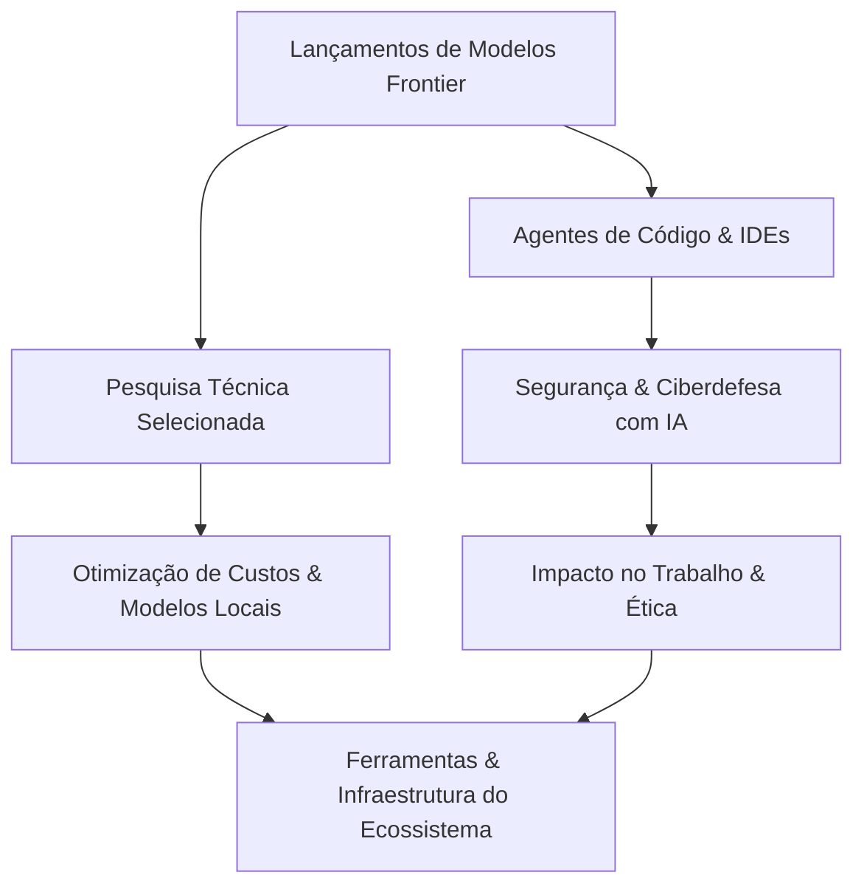


**Periodo:** 10/03/2026 a 06/09/2026

## Lançamentos de Modelos Frontier

- **Claude Fable 5.1 e Claude Mythos 5.1 (Anthropic)** – Em 20/03/2026 a Anthropic lançou os modelos Fable 5.1 e Mythos 5.1, reduzindo em até 45 % os custos de execução para tarefas agenciais e cortando 75 % o preço de leitura de cache. Essas melhorias tornam a plataforma mais viável para integrações em larga escala e aumentam a confiança em tarefas de codificação e conhecimento.  
  [Hacker News](https://www.anthropic.com/claude-fable-and-mythos-5-1) / [The Verge](https://news.google.com/rss/articles/CBMilwFBVV95cUxQLEJMNThLbnRBLWRoRlBnUnI0bmZ1WlVLLS0ydzhpUUVWYUZQbUtYM3I2eGRRWXhwM2kyNVdTREFQeHpxWjNJR2ZUYk5mQkFMOG5idkt3VDVvUC03bFE2UjhlRENaNTRBMnc5M0xQUHA3c0RfV2lMSTk3bzBKbDNGdHZ0MUJZSk1WODllLTBiRTdYZndGbTJ3)

- **GPT‑6 Astra (OpenAI)** – Abril de 2026 marcou o anúncio do GPT‑6 Astra, o modelo mais inteligente e alinhado da OpenAI até a data. Construído com avanços em aprendizado contextual e segurança de prompts, ele oferece desempenho superior em uso de computadores, codificação, cibersegurança e aplicações científicas.  
  [OpenAI Blog](https://openai.com/index/gpt-6-astra)

- **Gemini 3.8 Flash e Gemini 3.8 Flash Cyber (Google)** – O Google lançou os modelos Gemini 3.8 Flash e 3.8 Flash Cyber em maio de 2026, entregando inferências 2× mais rápidas e aprimoramentos específicos para segurança e verificação de código. Essas atualizações ampliam a confiança e eficiência em ambientes corporativos que exigem análises de risco em tempo real.  
  [Google Blog](https://blog.google/innovation-and-ai/models-and-research/gemini-models/3-8-flash-and-3-8-flash-cyber/)

## Agentes de Código & IDEs  

- **Astra acelera tarefas em até 4×** – Usuário do r/codex relata que o modelo Astra (GPT‑6) completou rotinas que “levam horas” em apenas 15‑25 % do tempo, reduzindo drasticamente a latência de ciclos de desenvolvimento. Essa velocidade prática sugere que agentes avançados já podem substituir pipelines manuais extensos. [Reddit](https://www.reddit.com/r/codex/comments/1w7eedj/astra_feels_genuinely_next_level_wtf/#community-signals)  

- **Guia de prompting oficial da OpenAI** – A comunidade destacou que a OpenAI divulgou um documento de boas‑práticas para o Astra, facilitando a integração correta e reduzindo falhas de prompt que antes exigiam “refatoração à mão”. A existência de um guia formal melhora a confiabilidade dos agentes em produção. [Reddit](https://www.reddit.com/r/codex/comments/1w7x57n/before_blaming_gpt6_astra_read_its_prompting_guide/#community-signals)  

- **Astra está disponível no GitHub Copilot** – Anúncio no r/GithubCopilot confirma que o modelo GPT‑6 Astra passou para a fase geral do Copilot, permitindo que milhões de desenvolvedores aproveitem seu desempenho sem necessidade de upgrade de conta. Essa democratização amplifica o alcance dos agentes de código nas IDEs mais usadas. [Reddit](https://www.reddit.com/r/GithubCopilot/comments/1w7fror/gpt6_astra_is_generally_available_in_github/#community-signals)  

- **Project HydraFusion lança orquestração multi‑modelo** – A pesquisa da GitHub demonstra que fluxos seletivos de HydraFusion superam o baseline Opus 5 em qualidade de código, ao mesmo tempo que diminuem o custo estimado de execução. Disponível como preview no Copilot, o projeto abre caminho para pipelines híbridos que combinam diferentes LLMs. [GitHub Blog](https://github.blog/ai-and-ml/github-copilot/project-hydrafusion-frontier-quality-via-multi-model-orchestration/)  

- **Redução de custos sem perder qualidade** – Outra publicação da GitHub explica como gerar saídas menores pode, contra‑intuitivamente, aumentar o custo total, e descreve técnicas adotadas pelo Copilot para eliminar trabalho desperdiçado ao longo de tarefas completas. Essa otimização traz ganhos econômicos imediatos para equipes que utilizam agentes de código em escala. [GitHub Blog](https://github.blog/ai-and-ml/github-copilot/how-we-make-ai-coding-more-cost-efficient-without-sacrificing-task-quality/)  

- **ruflo – meta‑harness de agentes em TypeScript** – O repositório trending apresenta o “original agent meta‑harness”, capaz de coordenar enxames autônomos, integrar RAG, memória adaptativa e múltiplos modelos (Claude Code, Codex, Hermes, etc.). Seu design modular já está sendo empregado para criar sistemas conversacionais e workflows complexos dentro de IDEs. [GitHub Trending](https://github.com/ruvnet/ruflo#trending-daily-typescript-2026-09-06)  

- **Claude Code traz agentes ao terminal** – Ferramenta open‑source em Python que entende o código‑base, executa refatorações, gera documentação e gerencia git via linguagem natural. A popularidade (≈144 k estrelas) indica forte adoção por desenvolvedores que preferem um fluxo de trabalho CLI, expandindo o ecossistema de agentes fora das GUIs tradicionais. [GitHub Trending](https://github.com/anthropics/claude-code#trending-daily-python-2026-09-05)  

- **dify – workflow agentico pronto para produção** – Plataforma TypeScript que permite construir pipelines RAG e agentes com suporte a diversos modelos e ferramentas, deployável em nuvem, VPC ou on‑premises. Ao abstrair a infraestrutura, dify acelera a transição de protótipos de agentes para serviços estáveis em produção. [GitHub Trending](https://github.com/langgenius/dify#trending-daily-typescript-2026-09-05)  

- **CoDock – workbench local para múltiplos agentes** – Projeto V2EX oferece um desktop dedicado a gerenciar janelas de terminal de agentes (Claude Code, Codex, DeepSeek Harness, Gemini CLI, etc.), resolvendo a fragmentação de contextos que impede produtividade. A solução demonstra a necessidade crescente de interfaces unificadas para agentes de código em ambientes de desenvolvimento locais. [V2EX](https://www.v2ex.com/t/1239712#reply0)

## Segurança & Ciberdefesa com IA

- **GPT‑6 Astra atinge nível Critical de Segurança Cibernética**  
  O modelo GPT‑6 Astra foi declarado o mais capaz e amplamente implantado da OpenAI, alcançando por primeira vez o nível *Critical* no *Preparedness Framework* de segurança. Isso indica que o modelo integra verificações de integridade, mitigação de adversários e avaliação de risco antes de executar ordens, reduzindo o risco de vazamento de informações sensíveis e vazamentos de dados em ambientes corporativos de alta sensibilidade. A capacidade de auto‑verificação posiciona o GPT‑6 Astra como candidato prioritário para aplicações que exigem resiliência a ataques de prompt injection e outras abordagens adversariais.  
  ⟦[OpenAI Blog] Safety overview: GPT‑6 Astra⟧

- **Foco em phishing de código de dispositivo contra Microsoft 365**  
  No horizonte de 2026, campanhas de phishing que utilizam fluxos de solicitação de código de dispositivo (device‑code phishing) ganharam escalabilidade, atingindo mais de 340 organizações Microsoft 365. Os atacantes exploram a confiança do usuário ao inserir códigos em páginas de login oficiais da Microsoft, conduzindo a compromissos de credenciais de OAuth. Esse salto de 100 % em vítimas demonstra a necessidade de reforçar a verificação multifator e a educação sobre o fluxo de código de dispositivo em ambientes corporativos.  
  ⟦[The Hacker News] Microsoft 365 phishing shifting from fake login pages to real Microsoft login flows⟧  
  ⟦[The Hacker News] Device‑code phishing campaign hits 340+ Microsoft 365 orgs using OAuth abuse⟧

- **Programa Fairwind: ferramentas avançadas de defesa cibernética para governos**  
  O Google lançou o Fairwind Program, um plano de acesso restrito para governos e parceiros de confiança, que concede uso de ferramentas de defesa cibernética baseadas em IA. O programa oferece análise automatizada de ameaças, detecção precoce de ataques e mensagens de alerta em tempo real, integrando dados de análise de tráfego e vetores de ataque emergentes. O acesso controlado garante que apenas organizações qualificadas possam se beneficiar dessas tecnologias, mitigando riscos de uso indevido.  
  ⟦[Google AI Blog] Proactive cyber defense for governments and enterprises, Fairwind Program⟧

## Pesquisa Técnica Selecionada

- **Extração de Decisões Arquiteturais com LLMs:** Um estudo exploratório investiga se LLMs conseguem recuperar Decisões de Design Arquitetural (ADDs) a partir de commits de código-fonte, um problema relevante para a Gestão do Conhecimento Arquitetural. Os autores destacam que ADDs raramente são documentados explicitamente, mas estão implícitos nos commits, o que torna a extração automática um desafio significativo. O trabalho é preliminar, mas aponta caminhos para ferramentas de apoio à manutenção e evolução de software. [Fonte](https://arxiv.org/abs/2609.03721)

- **Síntese de Regras de Transformação de Código com LLMs:** Este estudo empírico avalia o potencial e as limitações de LLMs na síntese de regras para linguagens de domínio específico (DSLs). Devido à natureza de caixa-preta, os modelos sofrem de falta de explicabilidade e determinismo, além de custos elevados em tarefas repetitivas em grandes codebases. Os resultados indicam que os LLMs podem gerar regras úteis, mas ainda há desafios em relação à eficiência e à previsibilidade. [Fonte](https://arxiv.org/abs/2609.03592)

- **Custo Psicológico da Adoção de IA em Engenharia de Software:** A pesquisa aborda os efeitos psicológicos da integração de inteligência artificial nos fluxos de trabalho de engenharia de software, além da geração de código, como em testes e revisões. As estratégias organizacionais de adoção de IA precisam considerar o bem-estar dos profissionais, pois o uso crescente de ferramentas automatizadas pode gerar estresse e outras consequências negativas. O estudo evidencia a necessidade de políticas equilibradas que priorizem a saúde mental no contexto técnico. [Fonte](https://arxiv.org/abs/2609.03456)

- **Taxonomia e Benchmark para Alucinação de Código:** Este artigo propõe uma taxonomia e um benchmark para o problema de *code hallucination*, no qual LLMs geram código plausível, porém sem fundamentação real, como imports inexistentes ou algoritmos que violam teoremas. O trabalho distingue esse fenômeno de outros erros e estabelece um conjunto de testes para avaliar a capacidade dos modelos em reconhecer e evitar tais alucinações. Essa contribuição é essencial para melhorar a confiabilidade de ferramentas de geração de código. [Fonte](https://arxiv.org/abs/2609.03267)

- **Contaminação de Benchmarks e Impacto nos Leaderboards:** O estudo examina se a contaminação de benchmarks—vazamento de itens de teste no treinamento—infla pontuações absolutas ou afeta a ordem dos modelos em leaderboards. A conclusão é que, embora a contaminação eleve os escores, ela raramente reordena o ranking final dos LLMs. Isso tem implicações práticas para a interpretação de avaliações comparativas, sugerindo que a contaminação não invalida necessariamente as conclusões sobre superioridade relativa. [Fonte](https://arxiv.org/abs/2609.02899)

- **R²Adapter para RAG Híbrido Eficiente:** O trabalho propõe um adaptador de roteamento e reescrita para sistemas RAG híbridos, combinando busca vetorial tradicional com RAG baseado em grafo para lidar com consultas relacionais ou multi-hop. O método reduz o custo de inferência ao rotear dinamicamente consultas simples para o RAG clássico e as complexas para o grafo, além de reescrever consultas para melhorar a precisão. A abordagem oferece um compromisso eficiente entre desempenho e custo computacional. [Fonte](https://arxiv.org/abs/2609.02894)

- **Agentes GUI com Término Consciente de Conflitos:** O artigo introduz o conceito de *conflict-aware termination* para agentes de interface gráfica, permitindo que eles reconheçam quando uma instrução natural é inviável ou conflita com o estado da interface. O sistema CONFL foi desenvolvido para treinar agentes a não agir quando a tarefa é impossível, uma habilidade crítica para evitar erros em interações reais com usuários. Essa capacidade aumenta a confiabilidade e a segurança de assistentes automatizados em aplicações do mundo real. [Fonte](https://arxiv.org/abs/2609.03438)

- **Sistema Multiagente para Detectar Discrepâncias entre Artigo e Código:** O artigo apresenta o Dude, um sistema multiagente com dupla detecção que compara o conteúdo de artigos científicos ao código-fonte correspondente, visando identificar inconsistências. A motivação é o crescente volume de submissões que ultrapassa a capacidade de revisão manual. O sistema supera limitações de contextos únicos e de detecção unilateral de paradigmas de agente único, melhorando a precisão da verificação de reproducibilidade. [Fonte](https://arxiv.org/abs/2609.03416)

## Otimização de Custos & Modelos Locais (10 / 03 / 2026 – 06 / 09 / 2026)

- Falei sobre a diferença dupla de preço entre Fable 5 e Opus 5 na comunidade de IA: a maior escala de Fable (uma melhoria de 5 → 5.1) já aumenta a complexidade de inferência e, portanto, o custo. Assim, Anthropic planeja ajustar preços na próxima iteração, mas no curto prazo a empresa continuou utilizando Opus para permanecer competitiva, gerando expectativas de reajuste futuro. O fato de modelos maiores “encontrarem mais soluções inéditas” explica a disposição de muitos usuários de pagar o dobro, mostrando a correlação direta entre tamanho de modelo e custo de execução. [Reddit (Anthropic Fable 5 cost)](https://www.reddit.com/r/Anthropic/comments/1v7f36b/why_does_fable_5_cost_twice_as_much_as_opus_5/)

- Um desenvolvedor brasileiro troca o serviço Claude Sonnet 4.5, que custava cerca de US$ 47/mes (≈ R$ 254), por um Qwen 2.5 7B Instruct rodando localmente via **llama.cpp** (quantização Q4 K M, 5,5 GB de VRAM). Ele automatizou três fluxos de código, reduzindo a despesa a zero e melhorando performance em duas tarefas. Essa mudança demonstra que, com hardware pessoal e modelo otimizado, é viável eliminar totalmente despesas mensais de SaaS, refletindo ganhos de escala e controle de recursos. [TabNews – Troquei Sonnet por Qwen 7B local em 3 tarefas](https://www.tabnews.com.br/kenimo49/troquei-sonnet-por-qwen-7b-local-em-3-tarefas-bill-de-us-47-virou-r-0-e-2-tarefas-ficaram-melhores)

- Usuário em V2EX relata que o consumo diário de tokens do GPT‑6 ultrapassou 270 milhões em um único dia, condição que antes exigiu três a quatro dias no GPT‑5.6 Sol (aprox. 200‑300 milhões/dia). O cenário sugere que, apesar das mesmas faixas de modelo (médio a mais alto), o GPT‑6 apresenta uma maior taxa de uso de quota e/ou preço. Isso reforça a necessidade de monitorar o consumo de token e ajustar o nível de cómputo, pois pode levar a cortes abruptos na funcionalidade. [V2EX Tech – GPT-6 单日消耗 2.7 亿 Token](https://www.v2ex.com/t/1239765#reply16)

- Em X, Ivan Fioravanti faz um comentário sobre a reação negativa à cobrança de Fable 5.1 e convida seguidores a acompanharem a trajetória de ajustes de preços. Embora não apresente dados quantitativos, a publicação destaca a percepção pública de que custos elevados estão moldando a adoção de grandes modelos, e portanto, são cruciais para decisões de escala e investimento. [X/Twitter – Fable 5.1 cost](https://x.com/ivanfioravanti/status/2095511612928991390)

## Impacto no Trabalho & Ética

- Durante o período de 10/03/2026 a 06/09/2026, pesquisadores observaram que modelos de IA começaram a resolver um problema matemático aberto há 80 anos, demonstrando capacidade de raciocínio que vai além da geração de código. Essa descoberta questiona a percepção de que a IA está limitada a tarefas de autocompletion e CRUD, indicando um novo patamar de poder técnico que pode remodelar o mercado de desenvolvimento e pesquisa. (https://www.tabnews.com.br/trsthales/enquanto-discutiamos-se-a-ia-ia-substituir-devs-ela-comecou-a-quebrar-problemas-matematicos-de-80-anos-o-que-esta-acontecendo)

- Um estudo publicado em 2026 mostrou que um transformer pequeno, treinado em apenas 1,5 hora, superou o desempenho de vários modelos de linguagem de grande porte amplamente usados. Esse resultado indica que a eficiência de treinamento e a arquitetura compacta podem competir com soluções de LLMs caras, impactando a adoção de IA em ambientes com recursos limitados. (https://mvakde.github.io/blog/44-on-arc-1/)

- O autor realizou uma comparação prática entre cinco gateways de LLM de código aberto, avaliando aspectos como latência, custo e suporte a fallback para múltiplos provedores em ambientes corporativos. A análise revelou que a escolha do gateway afeta diretamente a escalabilidade e a confiabilidade da pilha de IA empresarial, orientando decisões de arquitetura que evitam gargalos e custos inesperados. (https://dev.to/devstackhub/i-compared-the-5-best-open-source-llm-gateways-for-enterprise-ai-2mln)

- O pesquisador desenvolveu um grafo de dependência de prompts que mapeia todas as interações entre componentes de um sistema de IA, permitindo identificar quais prompts precisam ser reavaliados ao mudar um único elemento. Essa abordagem reduz drasticamente o esforço de validação e aumenta a robustez dos modelos, ao evitar regressões inesperadas em respostas. (https://towardsdatascience.com/changing-one-prompt-can-affect-50-others-i-built-a-prompt-dependency-graph-to-find-what-needs-retesting/)

- Um sistema de Retrieval‑Augmented Generation (RAG) foi projetado para, ao responder que o conteúdo não está no documento, apresentar quatro tipos de evidência que justificam a recusa, mitigando respostas falsamente confidentes. Essa prática eleva a transparência e a confiabilidade das aplicações de IA em ambientes corporativos, onde a precisão documental é crítica. (https://towardsdatascience.com/a-rag-that-says-not-in-this-document-has-to-show-four-kinds-of-evidence/)

## Ferramentas & Infraestrutura do Ecossistema

- O Google lançou o **Google Pics**, ferramenta nativa de criação e edição de imagens integrada ao Google Workspace e baseada no modelo *Nano Banana*, permitindo geração e ajustes visuais diretamente no ambiente de produtividade corporativa [fonte](https://blog.google/products-and-platforms/products/workspace/google-pics/).
- O **Chat2DB** atingiu 28 mil estrelas no GitHub como cliente de banco de dados *local-first* multiplataforma: suporta 40+ SGBDs, execução e otimização de SQL com modelo de IA próprio, e roda em desktop, web, Docker e CLI com suporte a MCP [fonte](https://github.com/OtterMind/Chat2DB#trending-daily-java-2026-09-05).
- **CrewAI 1.15.19** adiciona integração com Clipper, função `now()` em expressões CEL, rastreamento de término de execução de *crews*, reporte de tamanho de máquina por faixas e cliente injetável para ferramentas da plataforma, além de corrigir leitura de *octet-stream*/*xlsx* no `URLReadTool` e *trailing user turn* [fonte](https://github.com/crewAIInc/crewAI/releases/tag/1.15.19).
- **LangChain 1.4.0a4** (alpha) consolida o namespace `langchain.mcp` com `MCPAdapter` unificado para adaptar servidores MCP — URLs, scripts locais, servidores *in-process* ou *MCPConfig* — como ferramentas LangChain, renomeia métodos (`get_tools` → `list_tools`, `convert_mcp_tool_to_langchain_tool` → `as_langchain_tool`) e adiciona `cache_mode` no adaptador [fonte](https://github.com/langchain-ai/langchain/releases/tag/langchain%3D%3D1.4.0a4).

## Tendências

Nos últimos meses, os **lançamentos de modelos frontier** têm elevado o patamar de desempenho em tarefas de geração de código, o que estimulou a proliferação de **agentes de código integrados a IDEs**. Essa convergência, por sua vez, traz à tona novos vetores de risco: modelos mais poderosos podem ser abusados para gerar exploits ou código vulnerável, demandando reforços em **segurança e ciberdefesa com IA**. Ao mesmo tempo, a comunidade de pesquisa tem focado em técnicas de inferência mais eficientes e em algoritmos de compressão, alimentando a necessidade de **otimização de custos e adoção de modelos locais**, especialmente em ambientes corporativos que buscam reduzir a dependência da nuvem.

A adoção acelerada desses agentes impacta diretamente o **trabalho e a ética**, pois desenvolvedores precisam redefinir suas rotinas, enquanto organizações precisam estabelecer políticas de uso responsável e transparência. Esse cenário cria pressão sobre as **ferramentas e a infraestrutura do ecossistema**, que devem evoluir para suportar pipelines de CI/CD com avaliação automática de segurança, monitoramento de custos e integração transparente de modelos locais e serviços em nuvem.

## Fontes e Referências

1. [Why does Fable 5 cost twice as much as Opus 5 : r/Anthropic](https://www.reddit.com/r/Anthropic/comments/1v7f36b/why_does_fable_5_cost_twice_as_much_as_opus_5/) — Reddit (Anthropic Fable 5 cost)
2. [Claude Fable 5.1 and Claude Mythos 5.1](https://www.anthropic.com/claude-fable-and-mythos-5-1) — Hacker News
3. [Reddit: Astra feels genuinely next level wtf](https://www.reddit.com/r/codex/comments/1w7eedj/astra_feels_genuinely_next_level_wtf/#community-signals) — Reddit Post Signals (codex)
4. [Reddit: Before blaming GPT-6 Astra, read its prompting guide](https://www.reddit.com/r/codex/comments/1w7x57n/before_blaming_gpt6_astra_read_its_prompting_guide/#community-signals) — Reddit Post Signals (codex)
5. [Project HydraFusion: Frontier quality via multi-model orchestration](https://github.blog/ai-and-ml/github-copilot/project-hydrafusion-frontier-quality-via-multi-model-orchestration/) — GitHub Blog
6. [Reddit: GPT-6 Astra is generally available in GitHub Copilot](https://www.reddit.com/r/GithubCopilot/comments/1w7fror/gpt6_astra_is_generally_available_in_github/#community-signals) — Reddit Post Signals (GithubCopilot)
7. [Troquei Sonnet por Qwen 7B local em 3 tarefas: bill de US$ 47 virou R$ 0 (e 2 tarefas ficaram melhores)](https://www.tabnews.com.br/kenimo49/troquei-sonnet-por-qwen-7b-local-em-3-tarefas-bill-de-us-47-virou-r-0-e-2-tarefas-ficaram-melhores) — TabNews
8. [How we make AI coding more cost efficient without sacrificing task quality](https://github.blog/ai-and-ml/github-copilot/how-we-make-ai-coding-more-cost-efficient-without-sacrificing-task-quality/) — GitHub Blog
9. [GPT-6 Astra: A new generation of intelligence](https://openai.com/index/gpt-6-astra) — OpenAI Blog
10. [ruvnet / ruflo](https://github.com/ruvnet/ruflo#trending-daily-typescript-2026-09-06) — GitHub Trending (daily-typescript)
11. [anthropics / claude-code](https://github.com/anthropics/claude-code#trending-daily-python-2026-09-05) — GitHub Trending (daily-python)
12. [Try Google Pics: Easy image creation and editing in Google Workspace](https://blog.google/products-and-platforms/products/workspace/google-pics/) — Google AI Blog
13. [langgenius / dify](https://github.com/langgenius/dify#trending-daily-typescript-2026-09-05) — GitHub Trending (daily-typescript)
14. [OtterMind / Chat2DB](https://github.com/OtterMind/Chat2DB#trending-daily-java-2026-09-05) — GitHub Trending (daily-java)
15. [Gemini 3.8 Flash and 3.8 Flash Cyber](https://blog.google/innovation-and-ai/models-and-research/gemini-models/3-8-flash-and-3-8-flash-cyber/) — Hacker News
16. [Can LLMs Extract Architectural Design Decisions from Source Code Commits? - A Preliminary Exploratory Study](https://arxiv.org/abs/2609.03721) — arXiv cs.SE
17. [Code Transformation Rule Synthesis using LLMs: Potential and Limits](https://arxiv.org/abs/2609.03592) — arXiv cs.SE
18. [The Psychological Costs of Artificial Intelligence Adoption in Software Engineering](https://arxiv.org/abs/2609.03456) — arXiv cs.SE
19. [Refusing the Impossible: A Taxonomy and Benchmark for Code Hallucination in Large Language Models](https://arxiv.org/abs/2609.03267) — arXiv cs.SE
20. [Contamination Inflates Scores but Rarely Reorders Large Language Model Leaderboards](https://arxiv.org/abs/2609.02899) — arXiv cs.CL
21. [R$^{2}$Adapter: A Routing and Rewriting Adapter for Efficient Hybrid RAG](https://arxiv.org/abs/2609.02894) — arXiv cs.CL
22. [1.15.19](https://github.com/crewAIInc/crewAI/releases/tag/1.15.19) — CrewAI Framework
23. [GPT-6 单日消耗 2.7 亿 Token 用光额度：是模型涨价了，还是重置卡恢复的额度变少了？](https://www.v2ex.com/t/1239765#reply16) — V2EX Tech
24. [Do GUI Agents Know When Not to Act? Enabling Conflict-Aware Termination for Multimodal GUI Agents](https://arxiv.org/abs/2609.03438) — arXiv cs.AI
25. [Dude: A Dual-Detection Multi-Agent System for Paper-Code Discrepancy Detection](https://arxiv.org/abs/2609.03416) — arXiv cs.AI
26. [本地 Coding Agent 工作台： CoDock](https://www.v2ex.com/t/1239712#reply0) — V2EX Tech
27. [langchain==1.4.0a4](https://github.com/langchain-ai/langchain/releases/tag/langchain%3D%3D1.4.0a4) — LangChain Docs & Updates
28. [Ivan Fioravanti ᯅ on X: "Everyone complaining about Fable 5.1 cost ...](https://x.com/ivanfioravanti/status/2095511612928991390) — X/Twitter (Fable 5.1 cost)

---

*Gerado por: cloud/auto*


---
*Gerado por evo-agent - agente auto-aprimorante em 2026-09-06.*
